## 「0」第一个100块：一个重要的逻辑。

> 微信公众号阅读地址：[第一个100块：一个重要的逻辑。「0」](https://mp.weixin.qq.com/s/88ByMQWhPO5KsRGqAS4n6Q?token=1323808512&lang=zh_CN)

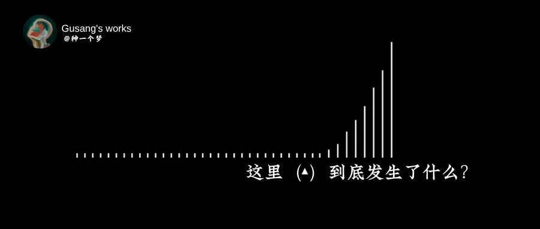

重要的不是100块还是10000块，而是完成商业的**闭环。****如果你现在能挣100块，未来就有机会赚更多的100块。**

如果你想跳过挣100块的完整闭环步骤去挣10000块——那就找个班儿上吧。

第一桶金的关键不是“金”，而是那个“**桶**”，意味着从此以后掌握了一套获得财富的方法，可以用它去盛第二桶金、第三桶金。

我在“第一个100块”系列文章中分享的就是关于“桶”的闭环思维，至于金子有多大，那真的就是八仙过海，各显神通。

你真的有可能赚的比我多得多。因为你在某些领域积累的经验和知识比我多的多，只是缺少“流量-变现”的闭环思维。

## **一个重要的逻辑。**

在正式开始分享“桶”的闭环方法论之前，让我们澄清一件事。 

世界上的人群大致可以分为两类。你是哪一种呢？

**第一，创造许可者。**

**第二，等待许可者。**

不幸的是，大多数人都是“等待许可者”。原因很简单，学校的种种行为暗示着从那里毕业的成年人：“等待许可者”才是一个好学生、一个好员工——我们会喜欢这样的人。

学生：老师，我可以去洗手间吗？

老师：去吧，快去快回。

学生：好的，谢谢老师。（毕业后，只是把老师换成了老板。）

不要忘记了，从学校毕业的多数人都去上班打工了。

更重要的是学校教育的目的为社会提供**专业型人士**来维持工业性社会系统的正常运转。它的设计初衷就是培养顺从、被动等待许可的人从而维持系统的一致性。

不要成为一个等待许可的人。

他们是被动的个体——从不主动所为；他们被告知要学习什么和做什么——从没有自己的项目执行；他们只是在完成别人的梦想——又抱怨自己的人生；他们是冷漠的群体——从不关心别人的痛苦的问题。

他们从不试着改变、而是一直在等——等一个许可，然后是第二个许可。

当我建议别人学习销售时，他们大脑中的第一想法是去找一个销售工作，这是典型的等待许可者思维。允许别人让你成为销售员，然后才能“名正言顺”地学习销售。

同样的道理，你不需要成为作家才开始写作和发表。

许多事情不是简单的因果逻辑，而是互为因果。真正的逻辑是这样的：一个人正因为写作，而成为了作家。正因为作家的身份，反过来，文章更有说服力和读者信任感。

这个逻辑可以应用到大多数的场景中。一个人正因为创作，就成为了一个创作者。

因此，做一个创造许可者。你不需要任何人的许可。不需要问任何人。

你可以成为任何你想成为的样子，这只要你自己的许可。

更重要的是，在如今的“去中心化”的趋势下，你无须得到专业机构、或大公司的允许也可以为自己营销、发现问题、解决问题、发挥领导力：**发现他人在生活中遇到的问题，通过帮助他人解决问题获取财富。**

创造价值、传递价值的权利只要你想拥有，你就拥有。

还有，我相信——成为创作者的一切才能，都是在这个创造者舞台上学到的，这就是留在舞台上的好处。你不应该像在学校备考一样，学习三年甚至十年，最后才去创造。

换句话说，写作的所有本领就是写作本身给予的。你不可能通过阅读“如何写作”的书籍掌握写作，你不会通过阅读和学习从而成为作家。

**只有写作才能成为作家——大量写作。**

如果一个人始终没有登上舞台，他只是在学习、操练、做准备，那么他的进步其实是停滞的，甚至更直接点说，他始终没有让一切开始。

学历和资格证明是一种不得已的证明手段。有比他们更好的证明手段——作品。

在这个时代，没有什么比在自由市场中创造价值并广而告之更完美的“简历”。

幸运公式很简单：做Doing*说Telling。

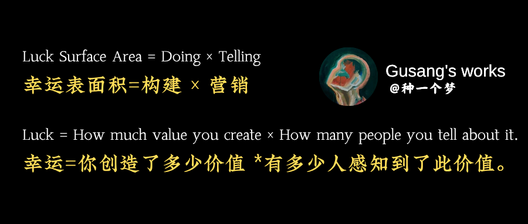

公开学习、公开工作、教学与分享，如此人们可以看到你的影响力、看到你为别人创造的价值，从而可以围绕和你遇到相似问题的人凭空创造一份事业。

我想表达的很简单：

* 你不需要成为专家才开始表达。其实，正因为教学和分享让你成为专家。
* 成为专家的本领都是在舞台上锻炼的，不要私下练习——公开化。
* 不仅要做，还要说。**别人感知不到的价值不叫客户价值。**

如果你仍然甘愿做一个等待许可者，接下来的文章只会浪费你的时间。慢走，不送！

因为你会在更多的事情上需要“被允许”，第二许可、第三个许可…..

* 我没有500个粉丝。
* 我不是市场营销专业。
* 我没有时间。
* 公司不允许。

但是，如果你选择成为一名创造许可者，你不仅可以通过在线写作赚到100块，你还可以：

* 选择你想要的任何工作，或者凭空创造一份工作。
* 围绕自己的兴趣和爱好构建产品、吸引受众、创建事业。
* 卖掉成长的副产品：一边打怪升级、一边赚点小钱。

更重要的是，**你有机会靠创造内容而打造一个商业闭环。**

一个自我成长的飞轮系统。

这不需要天赋、不需要启动资金、不需要家族的支持、不需要8小时工作…..

这只需要你的允许，你自己的…..许可。以及一个被验证的闭环方法论。

让我们一起开始探索“极简闭环”。

## 第一个100块 ：一棵摇钱树苗。「1」

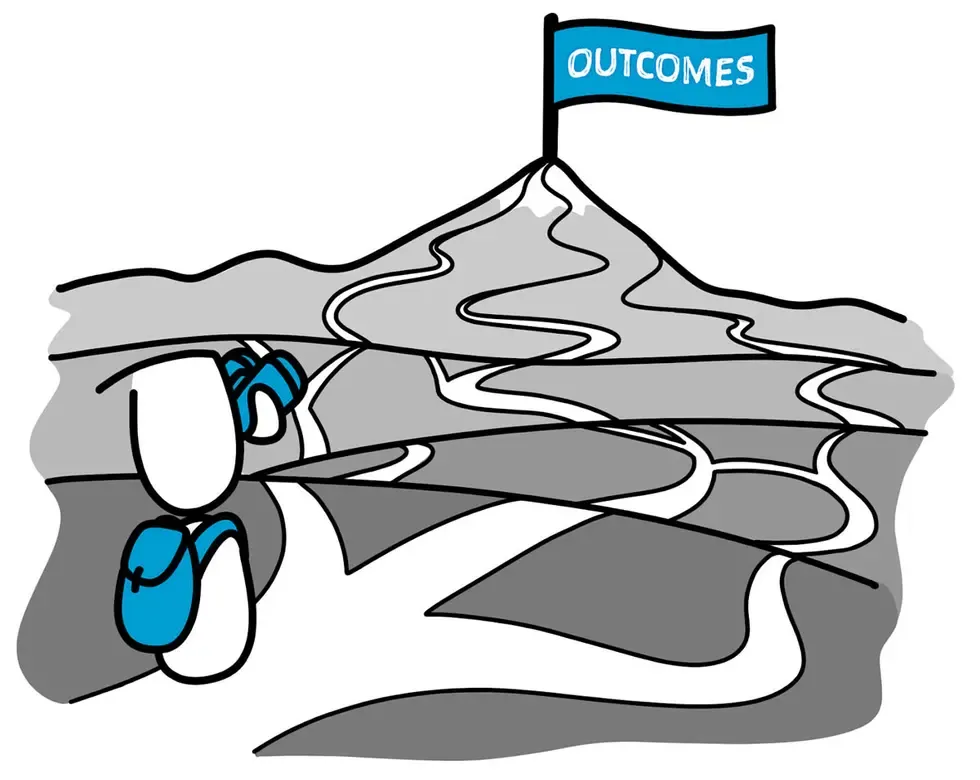

> 如果有 5 个人站在山脚下，被要求画一条通往山顶的路线，他们都会努力攀登山峰，但一旦登顶，他们就可以俯瞰群山，为其他人画出一条更高效的攀登路线。

**通过在线写作来每日赚取一顿早餐钱，我想这没有任何问题。它是一个普通人可实现的、短期的、具体小目标。**

但，我想提前和你说明这一点：如果你并不满足于一顿早餐钱，想要赚取更多的100块，仅仅写出更受人欢迎的文章是不够的。因为市场上充斥着那些只掌握写作技能的人来和你竞争。

靠写作（内容）完成更大的事业，你需要构建和销售。当你开始构建产品并销售的时候，你并不真正从事写作，而是从事广告文案、产品营销、服务行业，它真的就是在创业。

如果你想“独自一人”生活，你得会做饭、会洗衣、会购物、会社交….**但**无需精通于做饭、精通于洗衣….你不用了解制作PPT的每一个细节。

同样的道理，在一开始，你不需要精通于所有的技能。学习“最少且必要”的知识点，充分发挥边际规律即可。

当你构建一个由微技能组成的技能堆时，它会解锁大多数人看不到的财富。如果你能掌握其中的一些或全部技能，你就能很好地开始一个人的生意。

但这篇文章还是从**如何赚取第一个100块开始**，这只是一个开始，我希望你不会一直停留在这里，我也不认为你会满足于此。

（“第一个100块”七步曲，专注于帮助你发布第一篇文章、构建第一个产品、撰写第一篇销售信、获得第一个100块。如果这一点闭环走通了，其他一切都会自然解决。）

**我是如何靠写作赚到第一个100块钱：**

我的账号是在2020年11月份注册，一开始是心血来潮偶尔发一下，接着是一周两篇，名称也叫成长周记本，随着时间的流逝，能力的明显进步，从去年开始，我坚持日更（周末除外）。

在这四年的时光里，有一些问题反反复复出现：不知道写什么？真正赚钱的事情别人会告诉我吗？是否应该追逐热点？写作的意义是什么？如何实现商业价值？我真的走了很远的路，走了很多的弯路，才将这份“毕业论文”送到你面前。

但在过去的时光里，我并没有想着赚钱，**我只是想借助写作来掌握真正的本领**——掌握桶的构建。**（写作就是思考、写作就是费曼学习法）**

甚至很晚才开通公众号底部广告权限，因为我害怕广告收入会迫使自己追逐热点而浮于表面，在我的第一个10W+的爆款文章《[终身学习的习惯](https://mp.weixin.qq.com/s?__biz=MzkyOTE4MDcyOA==&mid=2247488415&idx=1&sn=51b0565d17ef80cbab7a0974b8d8aca1&scene=21#wechat_redirect)》中已有清晰的解释：我要靠认知变现。

细心的读者会发现，我不是拒绝广告变现，而是说明：你的创作初心不可以是靠广告变现。

如果你真的只是靠广告变现，那么你没有任何的自由（和打工一样），你的注意力天然不会在好内容上、不在成长上、不在为读者提供真正的价值上，而是在八卦热点上。

甚至在许多时候，你和读者朋友的利益是矛盾的。这极有可能会走向“双输”的状况。

如果真的想要靠广告变现，个人成长不是一个好的赛道——真心的，八卦新闻、娱乐可能才是好赛道。

但我想提醒你：你创作的内容会通过注意力的影响反向塑造你。当你凝视深渊的时候，深渊也在凝视你。

我在2024.1月才开通广告收入变现权限，而且只开通底部广告位，在年末时我的广告收入依然有600之多（公众号目前支持推荐算法，我相信你会比获得更好的收入）。

其次，我的文章《[货币的本质是信用、是共识](https://mp.weixin.qq.com/s?__biz=MzkyOTE4MDcyOA==&mid=2247488625&idx=1&sn=a300a4e00a9796099e799d3efdf9ea7f&scene=21#wechat_redirect)》被发布在《金融文化》杂志上，有税前1000块的稿费，以及一个400块钱的赞助广告，一共收入为：2000块左右。还达成了另一个主要目标，先保持秘密。

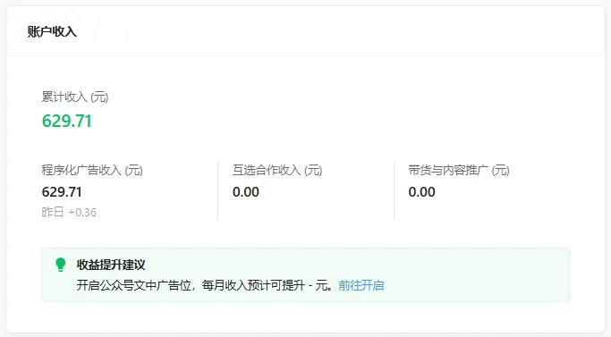

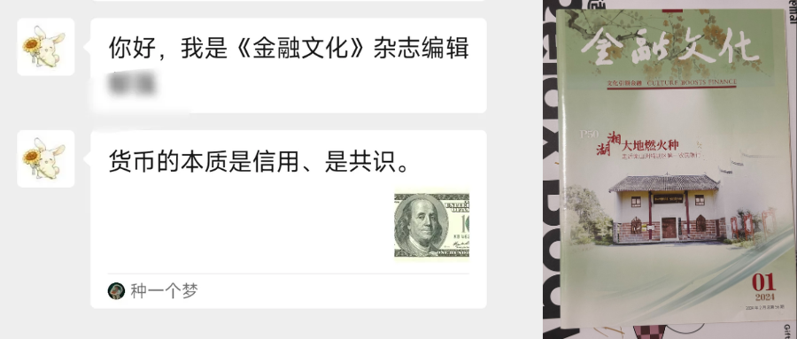

这一部分收入我并没有直接用于消费，而是再投资，定投在一个指数基金上（我把它称为做事基金），如今一共三千之多。

并不多，但我认为自己在玩一个致富游戏，做一场人生实验，而实验的结果会分享给读者、以及构建出产品利他于别人。同时，我也在充分践行自己给读者推荐人生的原则——[养成再生产的习惯，即“投资”的习惯](https://mp.weixin.qq.com/s?__biz=MzkyOTE4MDcyOA==&mid=2247488374&idx=1&sn=c32a5ecad397f13c6e7518881bb00808&scene=21#wechat_redirect)，不要把种子吃掉。

每当我读到《纳瓦尔宝典》中开篇这一句话，就让我异常兴奋：假设有一天，我创业失败，身无分文，这时把我随意丢到任何一个说英语的国家的街道上，我相信自己会在5年或10年内重新变得富有，**因为我已经掌握了“赚钱”这门技巧** —— 而这门技巧人人都能学会。

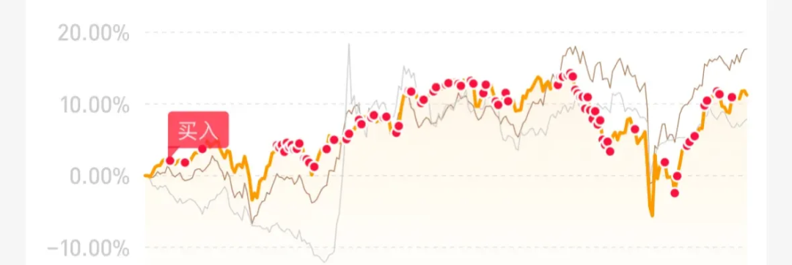

那么，

***\*你该如何靠写作赚到第一个100块钱：\****

靠内容创作赢得收入有很多种方式（平台激励、商业广告、带货分销、打赏、数字产品、服务出售、咨询），其中大的集合又有许多子集，后续会聊到部分。

但，这次从最基本的广告收入开始（平台激励广告计划）。

1.平台激励广告计划。

平台激励广告计划是平台为创作者提供创作收入最普遍的方式，如**公众号文中广告和底部广告**。

当读者在阅读文章时，浏览、点击、转化插入的文中广告时，就会给创业者带来相应的现金激励…..

这是平台激励创作者的最基本的方式，有许多的内容平台都提供相似的内容变现方式：公众号、视频号、今日头条、抖音、支付宝、知乎…….

不同的平台会有相应不同的激励计算规则。微信公众号是以千次曝光（CPM，Cost Per Mille）来计算的创作者广告收入。因此，**能够写出高阅读量的文章，相应获得的收入也越多。**

为了能够让你有更快地启动、更高的播放量，我可以给你两点提示：标题很重要、第一句话很重要。

其次，一个有阅读量的文章格式大概是这样的：《[发布一篇文章之前，你需要知道的1件事](https://mp.weixin.qq.com/s?__biz=MzkyOTE4MDcyOA==&mid=2247495613&idx=1&sn=1d554a8c722bacbfab60c26d0b97d8eb&scene=21#wechat_redirect)》，注意格式（也叫列表式格式），而不单单是内容。

你可以在女儿国逗留一下（获得广告收入），但你最终的目标是去西天取经（认知变现）。那才是自己真正向往的地方，可自我掌握创作时间、创造性的工作。

不要在途中迷失自我。

2.授人以鱼，不如授人以渔。

我很喜欢马云的类比，他说：平台就是第二次世界大战中出现的一种新型武器——航空母舰。

航母本身就是一个平台，它不能打仗，只有它上面的舰载机才能打仗，航母的作用就是给舰载机提供弹药、燃油，让舰载机迅速起飞、降落。

因此对于平台来说，只有创作者富有了，平台才能富有。这是双边平台的基本逻辑。

平台肯定会为创作者提供许多的变现工具和方法，甚至会提供比较详细的课程、内容指导等等。你只要认真阅读官方的“说明文档”、帮助文档就可以快速入门。

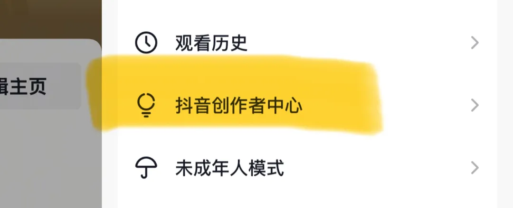

比如公众号的“收入变现”模块为读者提供了许多变现方式、再比如抖音平台在“创作者中心”中提供了许多变现方式以及课程指导等，其他平台也是类似，平台一定会为创作者提供多样的变现方式。

因为创作者是战斗机。

（公众号开通创作者激励计划需要达成500粉丝的门槛，其他平台也会有相应的门槛，请自行查找。）

那么，如何快速积累500个粉丝，请看下一篇文章。

**主题阅读-资源****推荐****：**

公众号后台输入【**红色关键字**】有自动回复：

> 输入**“写作”**，推送7条让我受益至今的关于「写作」的资源。

## 第一个100块：如何获得观众？「2」

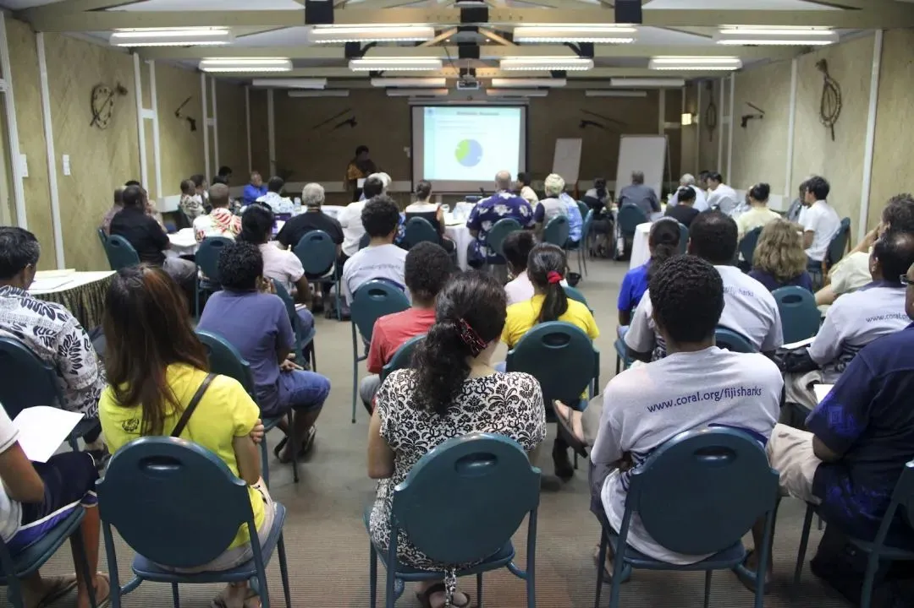

## 如果你的文章只有50个左右的阅读量，大概有这么多人已经阅读了。挤满了一整个教室。

##  

## 如果你想要吸引500个粉丝对你账号进行订阅，那么大概是这么多人（下图所示）。是的，它并没有那么地简单，也没有那么地困难。

##  

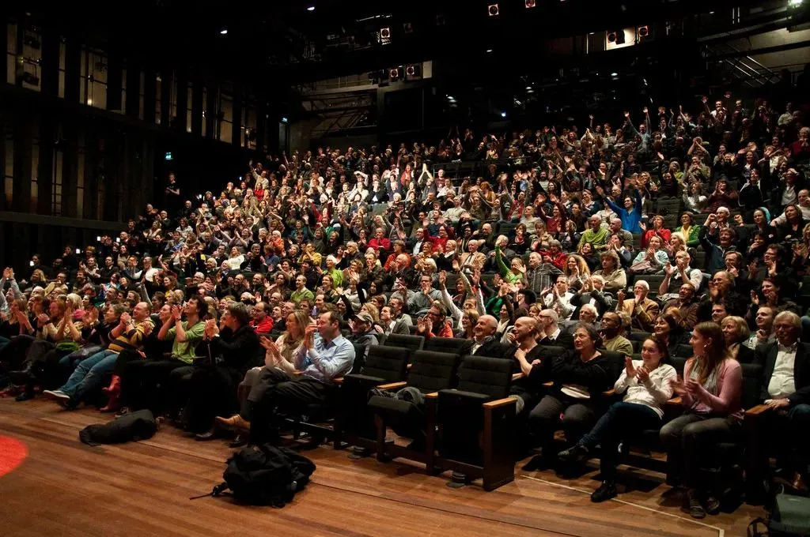

## 不管你是要赚100块，还是赚1000块，有这么一个必须掌握的技能：***\*获取关注\******。**

##  

点点免费的关注吧！——这句话让我走了很久的弯路：其实关注并不免费，关注背后是一个人的注意力。

而注意力是一个稀缺的资产。对你我都是如此。

获取关注（注意力）就像赚钱，你不能抢、你不能偷，也不可能通过祈福从而得到，最好的方法只有一个：交换。

永远不要祈求别人关注你。永远不要追逐用户，而是吸引用户，这和处对象是一样的。

给别人赠送一些免费的+真正的好内容，从而与用户读者交换“关注”。

免费赠送一些人们通常会付费购买的东西。注意，我没有说“好到他们应该为此付费”，我说的是“他们实际会为之付费的东西”。这是很大的区别。

你应该把内容创作并获取注意力当作一场交易——**你在用内容的价值去换取别人的注意力货币。**这是每个作家和读者、创造者和消费者、思想领袖和“追随者”之间的价值交换。

因此，当你不能为对方提供价值的时候，你就不能获得注意力。这就好像赚钱，当你不能为别人解决问题或提供价值的时候，你就赚不到钱。

别人不欠你一次关注。你必须拿出一些有价值的内容，然后与对方进行交易（价值交换）。记住，注意力就是货币。你想拿走别人的价格，你就得付出价值。

而我把这样的内容称之为：**引导磁铁**（Lead Magnet）

从现在开始设置一条自动化序列（后台输入「口令」，即可获取XX），而这个序列会自动化地分享一些有价值的内容来与读者的进行（关注-价值）的交换。

前提是必须提供真正的、好的、对口的内容，不然他们会对你失望从而逃跑。

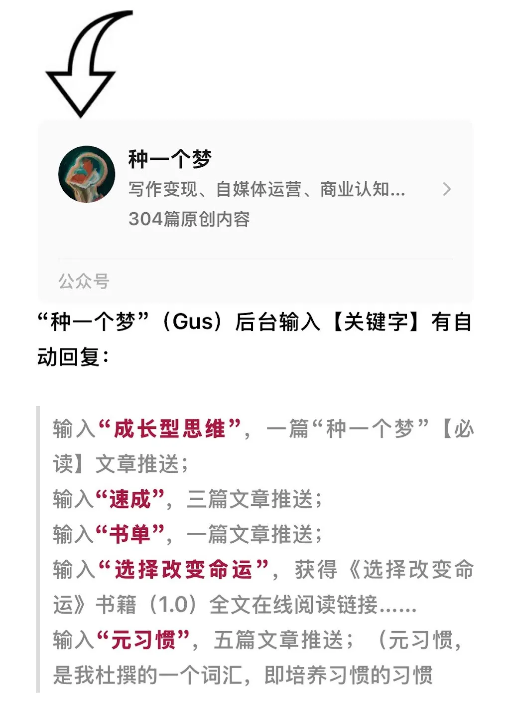

之前，我的账号粉丝数一直卡在200-300许久，一直到我沉下心去写一本实用的交换礼物——来换取读者订阅。（如上图所示）

我的账号粉丝才有了指数级的增长，我也在现实世界中第一次体会到了——非线性增长。对此，我总结了一句话：[涨粉靠爆款。](https://mp.weixin.qq.com/s?__biz=MzkyOTE4MDcyOA==&mid=2247491115&idx=1&sn=51066da207c3e8680624fec124be34b3&scene=21&token=240591863&lang=zh_CN&poc_token=HHurYmijDojvBAK8_0cJkZ-hDU_ofO5gC6KRLhkh#wechat_redirect)

现在我想迭代一下方法论：引导磁铁+ 爆款就是涨粉秘籍。

那么，如果创建一个有效**引导磁铁**（Lead Magnet）？

一共有**四**个步骤。

引导磁铁可以是任何东西，可以是文章、电子书、训练营、咨询、检查清单、产品试用装、模板、指南、案例研究、实物产品…..任何一个。

步骤 1：明确你要吸引谁？解决什么样的问题？

* 你想吸引谁？（用户），他们反复、高频出现的问题是什么？（痛点）

  

**你越是能够清楚地知道目标受众面临的问题，越是能够精准地吸引他们。**有时候，你并不需要精明的文案，只是清晰地阐述问题就能让他们找上门来。

如果你想吸引很多人，那么你需要回答很多人面临的问题。相反，如果你想以一种高度契合的方式吸引一小部分人，那么你需要回答一些小而高度相关的问题即可。

但我想和你说：当你想要吸引所有人的时候，你就越是得不到“所有人”的认可。

假设你坐下来，决定写一篇关于拥有一个养鸡场重要性的文章。那么，唯一会关注的人就是那些早上醒来带着这个问题的人。

当你的问题模糊不清的时候，你就像一个没有目标的枪手，什么也打不下来。

我的用户是谁？他们面临什么问题？我能提供什么价值？这是所有做生意的人一直在思考、终身思考的问题。暂时没有答案也没有关系，继续思考，继续想——这是你的核心竞争力。

**你得为想要吸引的人们解决某个具体的、显而易见的问题，从而提供一个可感知的价值。**（[内容金子塔](https://mp.weixin.qq.com/s?__biz=MzkyOTE4MDcyOA==&mid=2247495511&idx=1&sn=a9b5f023b9006e1ee5f4538c4de3a87c&scene=21#wechat_redirect)）

交易的中心是别人，是陌生的别人，而不是——我。任何说“是的，我只想为自己创作”的人都是初学者，他们还没有走够远，意识到谁才是重要的——读者、听众、观众才是重要的。

一个引导磁铁是否有效取决于你的“受众”。对你的“受众”来说，他的真正需求是什么？他最害怕什么？他最想得到什么？面临什么急需解决的痛苦问题？

解决别人的问题，给予别人想要的东西，那就是通过创造财富致富。**别人想要的东西就是财富。**

步骤 2：找出如何解决它。如何以最有效的方式彻底解决掉？（解决方案）。

如果你自己还不能独立解决这个问题，那就看看别人是怎么解决的，拆解别人的**引导磁铁**并尝试构建属于自己的Lead Magnet。

然后问问自己：能不能简单一点的方式解决该问题？能不能快速的方式解决该问题？能不能以一种较少牺牲和努力的方式解决？（为用户提供止痛药、速效药、**特效药**。）

如果你能为用户的问题给予一个意想不到、快速简单、较少牺牲和努力的解决方法。那么读者会感谢你，想要更多、想要找你付费指导、想要购买付费产品……这是交易法则。

不断迭代解决方案，大胆分享出去，使其易于消费，并使其效果“立竿见影”。（只有感知的价值才是客户价值。）

当你在知识分享方面吝啬，你就会变成饥饿的艺术家。

步骤 3: 测试，以及命名它。

这里有一个误区：认为免费的东西别人就会需要，错误！物美价廉，首先是物美然后是价廉。其次，免费的东西也需要销售才能获得用户的交换。因此你需要反复实验。

首先你的“磁铁”本身应该有足够的价值，是一件物美的东西。其次，**引导磁铁的名称、引导文案、贴纸背景需要不断测试来吸引读者的“交换”。**

**引导磁铁是你的第一个MVP（最小且可行）的免费产品，如果用户现在愿意用时间来消费你的内容，未来会愿意用金钱来消费你的内容。**

**命名你所解决的问题，让人们意识到问题；命名你所提供的解决方案，让人们意识到你有解决方案，然后为用户提供*****\*止痛药、速效药、\*******\*特效药。《[把自己产品化。](https://mp.weixin.qq.com/s?__biz=MzkyOTE4MDcyOA==&mid=2247495742&idx=1&sn=5784865e5cb474654a8f927e885dd100&scene=21#wechat_redirect)》\****

创造者最需要的是什么？读者。

步骤 4: 创建一个自动化序列。

在自己的公众号页面底部创建一个自动化序列来吸引读者的“交换”，从而被动地与读者进行交易。

提供有价值的内容来吸引到阅读底部的领取“引导磁铁”，从而进入正向循环……

不断思考受众问题、不断优化问题的解决方案、不断测试更好的命名……让自动化更加“丝滑”地帮助你完成交易。

这其实就是一个创业的最小且可行（MVP）的**闭环**——发现问题、解决问题、传递价值。

只不过暂时免费罢了。

下一篇，我将介绍我自己的I-P-O系统。

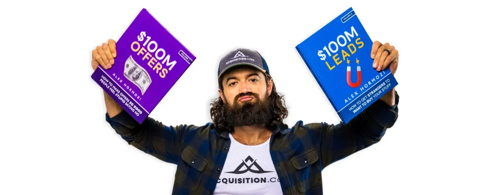

**主题阅读-资源推荐：**

> 《$100M Leads: How to Get Strangers To Want To Buy Your Stuff》

> https://zapier.com/blog/lead-magnet/

昨天分享的文章《[一棵摇钱树苗](https://mp.weixin.qq.com/s?__biz=MzkyOTE4MDcyOA==&mid=2247495751&idx=1&sn=22f22c60649dee3783bc1f8e54876735&scene=21#wechat_redirect)》的底部“引导磁铁”中，你也会得到关于引导磁铁的构建灵感。

**在此邀请你进入交流群——免费。**

我会在那里告诉你：

更多具体案例——别人是怎么做的？我是怎么做的？

你应该如何模仿、拆解来构建属于自己的“引导磁铁”？去哪里找？

以及在那里同步我的思考、我的观察，同步一些好的创意、好的设计、以及领取所有——《第一个100块》系列——周边资料。

这是第一本：《$100M Leads》。

## 第一个100块：成长的副产品。「3」

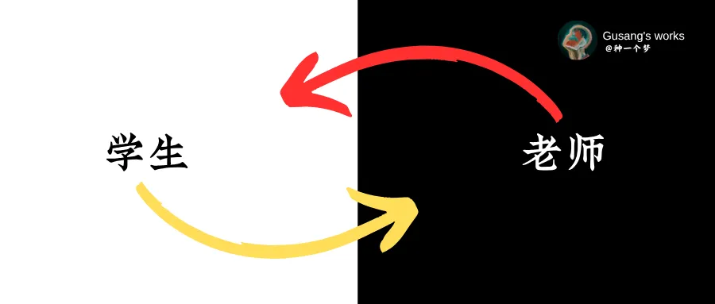

如果你只想读“第一个100块”系列其中的一节，**那就读这节吧**。

古思，我懂了，我要让自己成为一个创造许可者，开始构建自己的免费-MVP产品换取用户的关注，通过平台的激励计划赚取自己的“第一个工资外的100块”。

但，在踏上这趟旅程之前，我还有一个更重要的问题要问你：我到底该分享什么内容来吸引对自己内容感兴趣的人？或者具体一点——我不知道写点什么，我要写什么呢？

过去的一年半载，我有两个身份：学生和老师。

白天成为一个学生，阅读、自学、思考；晚上成为老师，分享、写作、答疑。通过把所学所感所悟毫无保留地教学和分享给别人来吸引同频者。

我在“种一个梦”公众号的三个核心话题：「阅读-写作-学习」、「产品-运营-营销」、「商业思维-新媒体」之下留下了大概300+的原创文章。顺便积累了10000（公众号）+60000（其他）的读者。

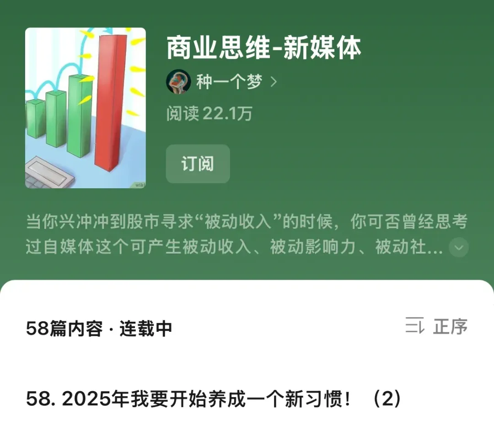

这样的方式有太多你可能想不到的好处：**你永远有东西可写**、分享只是学习的副产品、你会刻意采用费曼学习法、你会拥有终身学习的习惯+输出的习惯......你永远不会有“付出感”，有的只是占便宜的感觉。

再配合这套方法论，那么，你永远不需要等待——成为专家才开始——一边学习、一边分享、一边吸引同频者、一边发现问题、一边构建、一边获得反馈、一边营销.....有比这个更简单、更划算的吗？！回答我。

过去的初始阶段，于我而言，自媒体平台更像一个公开的笔记本——我在这里用写作思考商业知识、用写作学习学习方法、用写作教学来吸引同类、用写作获取别人的回应…..

所以，它的逻辑是这样：

你将大部分的时间、精力和注意力投入到练习一门自己感兴趣的手艺、学习一门刚需的知识或解决自身问题之上「学生」，同时每天留有一定的时间，把你的解决问题的过程、学到知识的精华、阶段性的成果、新的认知思维毫无保留地分享在互联网上「老师」，以此来吸引那些关心你所关心的问题的人、对你所做的事情同样感兴趣的人。

假以时日，你可以聚起一群关心你所关心的问题的人，而且你已经通过亲身行动证明解决方案的有效性，此时，闭环已成。

当老师的成本为零，因为写文章、制作播客、视频，博客，网络研讨会几乎不需要任何成本，通过社交媒体传播你的知识也不需要太多成本。

这对于还没有完整作品、或工作还处于学徒阶段，或工作过程不一定能带来有形成果的人来说，是一种极为高效的“并行工程”：一边升级打怪、一边赚点小钱。

对于那一些已经具备终身学习习惯的人，他们已经默认了终身“学生”的身份，那么，他们就更应该让自己成为“老师”，如此，飞轮就会快速转动。

想想你可以从你的学习、学徒过程中分享点什么？你可以如何帮助和你过去相似的人？如果你拥有一门手艺、技巧、某些工具和材料，免费分享给那一些想要拥有的人。

一旦你学到了什么，就转过身来教给别人。分享你的阅读清单、指出有用的参考材料、制作一些教程并将其发布到网上、不求回报地帮助一些人.....

硅谷知名天使投资人纳瓦尔说：致富最重要的技能是成为终身学习者，无论想学什么，你都得找到途径和方法。以前的赚钱模式是读4年大学，拿到学位，在某个专业领域干上30年。现在不一样了，时代的发展日新月异，必须在9个月内掌握一门新专业，而这门专业在4年后就过时了。但在专业存在的这3年里，你可以变得非常富有。

因此，你必须先拥有终身学习的习惯，成为一个创作者，再是创业者。写作本身就是[终身学习者](https://mp.weixin.qq.com/s?__biz=MzkyOTE4MDcyOA==&mid=2247488415&idx=1&sn=51b0565d17ef80cbab7a0974b8d8aca1&scene=21#wechat_redirect)必备的元技能，分享会让学习成果成百成千地放大。

更令人欣慰地是——你可以用写作的方式去学习任何必要、刚需、感兴趣的知识。用写作的方式学习写作、学习营销、学习自媒体.....就像我一样。

你必须不断攀爬创作者的“[内容金字塔](https://mp.weixin.qq.com/s?__biz=MzkyOTE4MDcyOA==&mid=2247495511&idx=1&sn=a9b5f023b9006e1ee5f4538c4de3a87c&scene=21#wechat_redirect)”，从最底层的被动消费者成为主动消费者，逐渐开始对外分享作为一个策展人，在策展中注入自己的独特性和观点，成为深度策展人，最终，创造属于自己的品类……

在这样的攀登过程中会出现一个致命的误区，我想在此重点说明：读书和学习并不会让你富有。允许我再重复一遍，它太重要了，读书和学习并不会让你富有。

如果读书和学习就能致富，全世界人民就在家读书学习就好了。最富有人的一定是——学生。

读书并不会让你富有，因为读书依然是一种消费行为。你并没有创造财富，所谓的财富就是[人们（别人）想要的东西](https://mp.weixin.qq.com/s?__biz=MzkyOTE4MDcyOA==&mid=2247495388&idx=1&sn=10ecda6d709559d71b2ba3400184083f&scene=21#wechat_redirect)。

消费和生产的唯一区别是什么？是否为陌生的别人提供价值。这几句话至关重要，每一个字符都很重要。**如果一件事情最终结果只对自己有好处，赶紧放弃吧，长久不了。**

交易的中心是别人，而不是我，是陌生的别人。其次，价值并不是由你来决定的，必须是对方感知的价值决定。

你不可能通过消费来创造收入，因为你没有为别人创造价值。如果你的目标是成为一名创造者赚到钱，那么社交平台首先是用于生产，其次是用于消费。

你必须洗脑自己——成为一个创作者和创造者，因为消费行为赚不到钱。

请你放心，当你给予自己创作者的身份，你会在消费时更有目的性。消费内容反而是一种生产性的工作。导演们看电影不仅仅是为了娱乐，也是为了看它们是如何制作的。

阅读文章不是为了消费，而是为了生产、输出、再投资。你会自带研究的视角、以及好奇心、求知欲。《[“投资”的习惯](https://mp.weixin.qq.com/s?__biz=MzkyOTE4MDcyOA==&mid=2247488374&idx=1&sn=c32a5ecad397f13c6e7518881bb00808&scene=21#wechat_redirect)》

最终你要在内容金字塔顶层不断攀爬，创造自己的品类。

**让我们举个简单的例子，把他们串起来：**

如果你对拥有一个健康身体非常感兴趣，那么，请你真的认真学习保持健康方面的内容和知识（学生），确保内容的有效性，并有意识地总结和整理输出成视频或者文章、图片分享在社交媒体平台之上（老师）。

如此，这些信息就像拥有“吸引力法则”一样，能够吸引那一些和你一样非常关心同样问题的人、有同一个需求的人（想要保持健康）、同一个梦想的人。

而当你能够解决他们的具体问题、或帮助他们变得更好，那么你就能够赚钱。

[解决自身问题，帮助“  过去的自己 ](https://mp.weixin.qq.com/s?__biz=MzkyOTE4MDcyOA==&mid=2247495355&idx=1&sn=c59baf1c5333e95abfd1570279fc2492&scene=21#wechat_redirect)不仅是一种商业模式，也是一种生活模式，值得做一辈子。

再分享一段由 37signals出版的书籍《Rework》中“卖掉副产品”章节的一段话：

> 我们的上一本书《实打实干》（Getting Real），就是一个副产品。我们是在不知不觉中写成这本书的。对于创办公司和开发软件这项实际工作来说，从中获取的经验就是副产品。我们把这些知识打包起来，首先是贴在博客上，其次集结成一个工作室系列，然后做成PDF文档，最后印刷成书。这个副产品为37signals赚取了超过100万美元的直接利润，后来又赚取了超过100万美元的间接利润。你现在正在阅读的这本书，也是一个副产品。

这里有四个永恒常青的市场值得你怎么做下去（学生-老师）：赚钱、健康、社会关系、幸福。 

任何人都会在这四个方面存在需求，这是一个从古至今一直存在的需求。**你也有该需求，别人也会有该需求。**如果你能够在该方面积累知识，那么你能解决自我问题，同时，你也练就了一项长青的能力。

如果你想自己创业、如果你想赚钱、如果你想幸福、如果你想拥有健美的身体——大概率别人也会想。那么，这一些东西你是必须要学习的，**那你为什么不能这样开始呢？！**

“白天当学生，晚上当老师。”

创作吧，我的朋友！

技术为我们开启了一个全新的选择。在我们生活的时代，想要产生巨大的影响力，你不必亲自面对千千万万的观众，你只要对着电脑写下对你有帮助的事情即可，其他的事情网络会替你完成。

**主题阅读-资源推荐：**

***\*《Rework(重来）》\**
**

**《*****\*Show your work\******》**

**《The Art Of Focus****》**

***\*《价值心法》\****

**《**[**把自己产品化。**](https://mp.weixin.qq.com/s?__biz=MzkyOTE4MDcyOA==&mid=2247495742&idx=1&sn=5784865e5cb474654a8f927e885dd100&scene=21#wechat_redirect)**》**

《[解决自身问题，帮助“过去的自己”](https://mp.weixin.qq.com/s?__biz=MzkyOTE4MDcyOA==&mid=2247495355&idx=1&sn=c59baf1c5333e95abfd1570279fc2492&scene=21#wechat_redirect)》

《[内容金字塔：创作者的成长路线图](https://mp.weixin.qq.com/s?__biz=MzkyOTE4MDcyOA==&mid=2247495511&idx=1&sn=a9b5f023b9006e1ee5f4538c4de3a87c&scene=21#wechat_redirect)》

> 我今天仰慕并试图效仿的几乎所有人，不论他们的职业是什么，都将分享融入了他们的日常生活中。这些人并不是在鸡尾酒会上闲聊-他们太忙了一没有时间闲聊。他们埋头于工作室、实验室或办公室，但他们没有对自己的作品保持绝对的保密和囤积，而是公开分享他们正在做的事情，不断地在网上发布他们作品的片段、他们的想法以及他们学到的知识。
>
> 他们没有浪费时间“建立人脉”，而是充分利用了网络。通过慷慨地分享他们的想法和知识，他们往往能够获得一个观众，当他们需要时，可以利用这个观众--无论是为了友谊、反馈还是赞助。
>
> ————《show you work》

## 第一个100块： 为观众提供服务。「4」

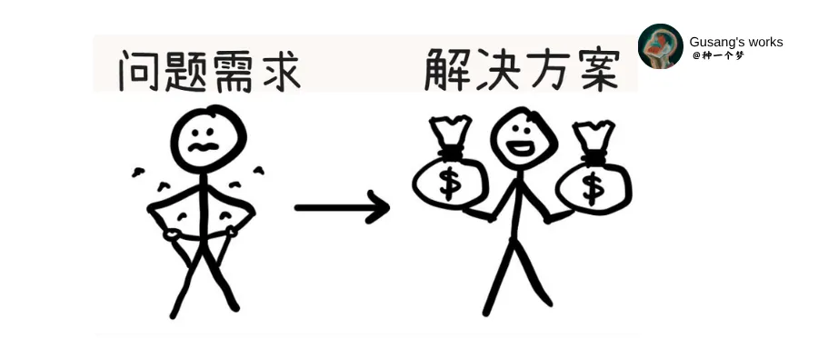

我用了2年的时间，饱受各种痛苦，才领悟到这一点。如果你不愿意从我的失败中学习，那就大胆地去行动吧，从自己的失败中学习经验教训。

在我开始真正的创作之前，一直希望自己有一个产品（我找了许久），然后通过写作来推广和销售该产品。于是，我开始选品、学习构建产品……但我最终放弃了。

因为在我看来，这种方法似乎有些落伍：为什么创业者一定要等到他们发布产品时才开始吸引用户，更合理的做法应该是，在一开始就建立受众群，（[一边吸引，  一边构建](https://mp.weixin.qq.com/s?__biz=MzkyOTE4MDcyOA==&mid=2247495776&idx=1&sn=42dbc34219312e35ae22314076adbdbe&scene=21#wechat_redirect)）然后了解他们真正想要的东西并满足他们。

那么，这款产品不是由我们设计完成后再推向市场的，恰恰相反，它是由市场反向推动形成的。一开始就是以用户为中心的构建。

“第一个100块”系列第3篇中，我们聊到从解决自身问题开始出发，这是一个行之有效的方法，如果你很幸运，“你”本身代表着一群人，你的问题代表着一群人的需求。

那么，你并不需要别人的反馈即可构建出人们非常想要的产品和服务。你就是产品的第一个用户，你可以直接与自己对话来完善产品。

但，事实上，产品的构建并不会这么地幸运——你只能代表你，或只能部分代表。以及认知诅咒等种种原因，你必须与用户建联。

YC创业孵化器创始人之一paulgraham说：初创企业犯得最常见的错误是解决一个没有人面临的问题。

多数人因为热情、梦想、改变世界等等的“自我原因”，忘记了构建出人们想要的产品。

斯蒂芬·金在写作方面有一句话个人特别喜欢：当你写第一稿时，你是为自己写作。当你写第二稿开始，你是为其他人写作。

构建产品也是同样的道理。

产品的1.0版本是为自己构建，解决自己的问题。当你升级2.0版本时，你是为其他人构建——财富就是人们想要的东西。

为了构建人们非常想要的东西。基于解决自身问题的解决方案之后，你需要主动或被动地获得用户（别人）反馈来驱动开发。如此，才有可能确保这是一个别人想要的东西。

让我再重复一遍之前的一句话——交易的中心是别人，是陌生的别人，而不是我。生意是满足别人的需求，而不是自己的。

当你开始真正意义上为市场构建某一个东西的时候，绝不能“闭门造车”，你需要面向用户取得反馈，从而驱动产品开发。为其他人构建。

直接与用户建联并获得反馈是确保自己没有误入歧途最棒的方法，没有之一。

而你在与受众建联的过程中，你有两个核心任务。

**一；寻找高频的问题+建联有同样问题的人。**

当你在公开学习-公开分享的时候，作为走在读者前面的你，读者会向你问出许多问题：

* 你是怎么在Google上快速搜索信息的？《[一块钱搜索指南](https://mp.weixin.qq.com/s?__biz=MzkyOTE4MDcyOA==&mid=2247494918&idx=1&sn=3250334c5add024bfba291b97412f06f&scene=21#wechat_redirect)》

* 你平常会阅读什么内容？有推荐的吗？《[UAC周刊](https://mp.weixin.qq.com/s?__biz=MzkyOTE4MDcyOA==&mid=2247495333&idx=1&sn=e217fee8fb105c7e648b06114ae86ed9&scene=21#wechat_redirect)》

* 你是怎么快速学习的？

  

于是，你将会收集到人们在你的专业领域中面临的大量、高频出现的问题。当人们面临问题时，这就是你可以发挥作用的地方。

问题——它就是机会，如果你能解决该问题，你就把握了该机会。《[一块钱！全新升级你的搜索系统](https://mp.weixin.qq.com/s?__biz=MzkyOTE4MDcyOA==&mid=2247494918&idx=1&sn=3250334c5add024bfba291b97412f06f&scene=21#wechat_redirect)》，它就是一个活生生的案例——有人主动问我如何搜索，以及我在别人的社群发现多数人困扰于搜索。

请你拿出一个本子，专门记录人们遇到的问题，这些问题可能是读者向你提问的、可能是社区讨论的问题、可能是你在别人的社区观察得到的，或者是一个偶然听到的抱怨——你必须记录下来。

每一个问题的重复出现，你都打上一个对勾。收集一些频繁出现的问题、让人很痛苦的问题——这就是机会。

当遇到很痛的问题、或遇到寻问该问题的人数很多的时候，你就应该给予一个漂亮的解决方案来帮助他们，顺便实现商业价值。这是一场双赢的游戏。

**请一定要记录问题，并记录问题出现的频率，测试付费意愿，这将是创造财富而致富机会。**留意他们的问题。读者会告诉你他们想要什么。

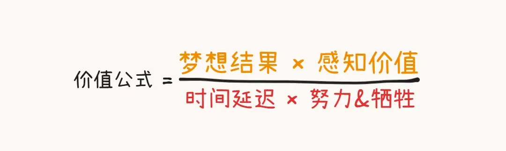

**二；提供服务，打磨问题的解决方案，使其“价值公式”最大化。**

免费或微付费的方式为你的读者提供一些服务、帮助和指导。

服务是产品的1.0版本。

在帮助读者的过程中，总结和整理解决问题的流程、记录因“知识诅咒”而出现的遗漏步骤、了解参与者知识水平、了解用户的梦想和期望结果。

通过与用户的互动交流，反馈来迭代解决方案，让解决方案更加具备“感知价值”、让解决方案更快地起效、让解决方案需要的牺牲和努力更少……..

构建——特效药、速效药、止痛药——一样的产品。

并在社区中展示、解释原理、回答问题、征求反馈，保持沟通，尽可能确保“解决方案”符合价值公式最大化。

到了这里，你在精进的不再是写作能力，而是在精进服务用户的能力，客户其实并不关心你的文章写得有多漂亮。他们关心的是看得见摸得着的结果。

产品体验打磨总是双向的，没有反馈是不完整的。优秀的艺术家活跃在网上，回答问题、与粉丝讨论他们喜爱的事物。

一开始为用户免费或微付费工作，也是一种交易，通过免费的服务为自己积累经验、收集问题和需求，测试解决方案的有效性，以及**构建影响力元素（社会认同、互惠、喜爱、权威）。**

在此过程中，你将获得关于什么有效、什么无效的宝贵见解。

构建人们非常想要的产品、积累种子用户。

对了，没有反馈也是一种反馈。

如果很难免费送出你的服务/商品，这意味着要么人们不想要它（梦想的结果），要么他们不信任你（实现可能性），要么隐性成本（时间、精力和牺牲）太高。

简而言之，你的“免费”商品太昂贵了。因此，找出隐性成本。一旦你做到了，你就能解锁更多的价值，而这些价值最终是可以打包收费的。

总结成一句话就是：提供服务的形式，确保自己在做一件对别人真正有用的东西。而不是自嗨。

反馈！反馈！反馈！重要的事情就要重复讲，讲到骨子里，讲到形成第二天性。

爱因斯坦说：Make everything as simple as possible, but not simpler.“事情应该力求简单，不过不能过于简单”。

两个simple(简单），应该这么理解。

* 第一个简单是去除不必要的细节。
* 第二个简单是不要落下重要内容。

我遵循着这样的原则写完了“第一个100块”系列，我删掉了大量的细节，但或许，这一些细节才是许多读者的卡点。

我们会在社群中回答你的问题，并进行深度的交流讨论我的亲身践行的方法论。

通过下方二维码找到我——免费，再告诉我一声。

**主题阅读-资源推荐：**

**《小而美》\**《影响力》\****

**《The Mom Test：How to talk to customers》**

**《Wirte Useful Book》**

**《Anything you Want》**

https://paulgraham.com/startupideas.html

https://sive.rs/asking

（所有“第一个100块”系列资源推荐会是社群中同步共享，等你！）

## 第一个100块： 在你睡觉的时候赚钱。「5」

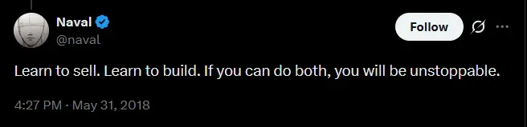

我最自豪的推论是：内容是数字产品、内容是内容营销；写作是数字产品、写作是数字营销。

当你通过写作吸引读者后，并不需要采购昂贵且高成本的实体产品来销售，完全可以采用数字产品（如文章）来进一步测试想法、验证可行性，又或直接售卖。

数字产品并没有像实体产品一样的“最低订单量”的门槛，并不存在压货而负债的风险，更是存在巨大的想象空间。

我所说的“数字产品”可以是一条长篇文章，一个电子书、一个社群、一个付费文章、线上咨询、付费课程、又或一次训练营、几行代码…..只要是以比特形式的产品都算。

数字产品与实体产品有许多相似之处。它们都需要一个开发和营销的过程，都需要生产和交付，都可以出售来赚钱。

但数字产品有几个关键的不同点，使它们非常适合创业。

> 首先，它们除了思考和努力之外，可以无中生有。原材料成本为零。
>
> 第二，一旦你生产出了第一个产品，复制“副本”就不需要任何成本。额外的制造成本为零（边际=额外的额外）。
>
> 第三，它们可以免费存储在你的电脑上、平台上，并通过互联网免费交付。库存和配送、售后成本为零。
>
> 第四，你可以轻松地编辑文本、修改图片或在事后更改迭代，甚至是在交付之后开始。修改完善的成本为零。
>
> 最后一点实际上是最重要的。在早期，你最大的挑战是选择要创造什么？深耕于实体产品，你可能有很多想法，但确定人们会购买什么，需要你真的有钱（“最低订单量”的门槛），你需要承担成本去确定。

> 实体产品最大的风险在于，你得先花一大笔钱——原材料、设计、制造、仓储、分销、营销，然后才能有机会发现人们是否真的需要它。
>
> 但内容创作几乎消除了这种风险，因为所有这些成本几乎为零。你可以在几小时或几天内创作出一篇内容，发布到网上，然后立即得到反馈，看它是否符合人们的需求。
>
> 如果符合，你只需不断复制和出售它。如果不符合，你可以在几分钟内做出修改，然后重新发布，把它变成一个“经过改进的”版本！
>
> **你几乎没有失败的成本的。**

> 信息产品的营销和销售也容易得多。因为生产和分销成本为零，你可以以很大的折扣价销售，与其他产品捆绑销售，提供免费试用，与其他内容创作者合作，或向别人提供免费副本以获得关注。
>
> 这些策略对实体产品有局限性，因为你必须收回成本。但对于信息产品，你在额外副本上获得的任何收入都是纯利润。因此，任何高于零的价格都是有利可图的。即使免费赠送，至少你没有赔钱。
>
> 信息产品可以很容易地在线购买，而你无需参与其中。收入基本上是被动的，这意味着您可以将注意力转向下一件事，而不会立即失去收入来源。

来自《[来，让用户为免费买单。](https://mp.weixin.qq.com/s?__biz=MzkyOTE4MDcyOA==&mid=2247495476&idx=1&sn=171e8a77a561b7cf1ca7f78187f3078c&scene=21#wechat_redirect)》

我在几年之前，在李笑来的书籍《斯坦福大学创业成长课》中看到一个非常违反直觉的观点：“风险投资”其实只不过是一种投资模型的名字，这种模型的设计目标是为了避险。经常看到一些天使投资人“没有风险我不投”，也更经常看到创业者“没有风险我干吗要你的投资？”——我只能叹服于他们望文生义的能力。

笑来继续补充道：后来读书读多了，历史看明白了才知道，冒险常常是他人对冒险者的理解，而不是所谓“冒险”成功的人的行动。

勇敢和莽夫还是有区别的。

我们会误解“风险投资”一样，会误解——创业，我们以为创业者热爱冒险，但**还有一种可能是他们最不喜欢冒险**。比如，创业公司会进入增长率最大的市场、他们有MVP模型验证、他们有种子用户、他们会通过融资开始，而且他们非常努力.....

（当我知道“通货膨胀”的存在的时候，我认为把钱“拿在手里”就是最大的风险。）

在我这里，数字产品，可以进一步降低风险——甚至风险几乎为零。

其次，如果你不能创造一个产品来自动化交付“服务的过程”，那么你将工作到死。

服务和产品最大的区别在于：服务受时间的制约、而产品脱离时间要素的制约，就算睡觉也在持续完成交付。

产品的本质是一组包装成可批量交付的解决方案。实体产品和数字产品本质是一样，都是为了解决用户的问题，让用户变得更好。

纳瓦尔说：获取财富的途径就是为社会提供有其需求但无从获得的东西，**并实现规模化**。

实体产品的规模化是一件巨大的工程，而数字产品的规模化相对容易的多。

对于普通人来说，最好的产品就是从数字产品开始。

选择一个你已经知道的工具来构建你的想法。如果暂时不能用编程来传递解决方案，那就先用文章和视频。  

最好的产品创意是从别人需求开始，而当你不了解别人的需求时，另一个很性感的创意就是从自己的需求-问题开始，并打包成产品（解决方案）进行售卖。

你该如何打造一个产品——请看以上两篇文章：[如何获得观众？](https://mp.weixin.qq.com/s?__biz=MzkyOTE4MDcyOA==&mid=2247495760&idx=1&sn=900d6bf6e6173b8e657d616ce993ff60&scene=21#wechat_redirect)如何创建一个有效引导磁铁，其中的四个步骤就是打造最小且必要的产品的几个要素——你要为谁？解决什么样的问题？提供什么样的可感知价值？

**引导磁铁就是你的第一个MVP（最小且可行）的产品，只不过暂时免费罢了。**

《[ 为观众提供服务](https://mp.weixin.qq.com/s?__biz=MzkyOTE4MDcyOA==&mid=2247495777&idx=1&sn=a5f6b71b3fd26439eb99b73241d682d8&scene=21#wechat_redirect)》中建议你从用户的反馈中，把适合自己的解决方案打造成别人非常想要的东西。财富就是别人想要的东西。

举一个性感的例子，来自《打造第二大脑》的作者Tigao在《The heart is the bottleneck》中的叙述：

> 我的第一个在线课程《Get Stuff Done like a Boss》（像老板一样把事情搞定）是基于大卫·艾伦畅销书《搞定：无压工作的艺术》的视频版的课程。
>
> 我知道有数百万人读过并喜欢这本书，但像我一样，如果没有一步一步的视觉材料指南，他们很难实践书中的方法。
>
> 我的最初目标是赚1 000美元，让100人参加我的课程。而如今4年多过去了，超过15 000人参加了我的课程，它继续成为我对新客户工作的完美介绍，尽管它甚至不是我自己的想法！

更多的数字产品灵感，见文章《[内容策展（Content Curation）的7步指南](https://mp.weixin.qq.com/s?__biz=MzkyOTE4MDcyOA==&mid=2247495622&idx=1&sn=df8829dbc85cd558e2afe41dd2006115&scene=21#wechat_redirect)》。**
**

硅谷知名天使投资人纳瓦尔•拉维坎特说：学会销售，学会构建，两技傍身，势不可当。

那我为什么没有讲到销售呢？

因为啊——用户购买的不是产品，而是问题的解决方案；用户购买的不是产品，而是更好的自己；用户购买的不是产品，而是良好的感觉。

当你真的非常善于产品，销售就会无师自通。

快速提升销售能力有两种方法：

找到一群饥渴的人，展示。

构建出一个人们非常想要的东西，展示。

**主题阅读-资源推荐：**

**《俞军产品方法论》**

**《重新理解企业家精神》**  

《The heart is the bottleneck》

《How to Start a Startup - A course Y Combinator taught at Stanford》

## 第一个100块：年入百万。「6」

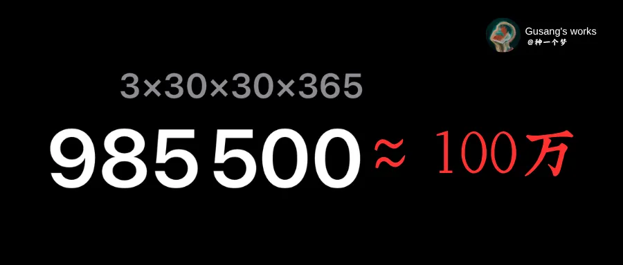

即使是"普通人"也可以创造产品(或销售别人的产品)，成为全职型企业家---这只要你自己的许可。

如果你有三到五种平均单价为30 元的产品，每天销售 25 到 30 件，**恭喜你！**你有一个年营收一百万的生意。见头图公式。

这个世界上有 7.67亿人，你绝对有机会每天销售25 到-30 件平均单价为每件 30 元的3-5种产品，从而每年赚取 100万，并且**实现自动化**。「相对轻松地完成：一边享受生活，一边赚钱。」

让我们另外再分解几条实现每年100万收入的实现路径。

* 1000000/12=每月83333元。
* 83333/30=每天2777元。

现在，有几种方法可以做到这一点：

* 每天销售18件150元的数字产品。
* 每天出售111份25元的订阅服务。
* 每隔一天就能售卖一个价值5000元的顶级社群。
* 每4天接一个价值10000元的客户咨询服务。
* **或者其他任何产品/服务的组合，以达到收入100万元。**

在你那里可能这算不上是一种洞见，但我还是想说出来：对于普通人来说，他们只有“工资”这一种现金流来源，而那一些真正富有的人，他们有多种组合的现金流的来源：企业分红、租金、版权费、银行存款、艺术收藏、咨询服务……等等的多种来源。  

只有工资这一种收入，就像把所有的鸡蛋都放在一个篮子里一样危险。因此，开发收入组合流至关重要。

对于一个合格的创作者来说，当你专注于解决一件长期有价值的问题的时候，你就可以慢慢创造出属于自己的收入组合流。

从而无需把全部鸡蛋放在同一个篮子里——工资。

当你专注于解决问题时奇迹就会发生，因为，人们购买的不是产品，而是问题的解决方案。产品的本质是一组包装成可批量交付的解决方案。

用户需要的是解决问题，而不是购买产品。用户想要的是“不上火”，而不是“王老吉”。

（如果不是特别理解，请你继续阅读，我会给你一个性感的例子。）

确保自己是在专注于解决有价值的解决，为用户解决问题从而让他们变得更好，而不是售卖产品！

Lean Startup Methodologies里常常提到的一个方法论：

> fall in love with the problem, not the solution.

显然，这样的关注焦点变换，会带来不同的思考和行动。

当你确保自己为用户解决「更快达到目的地」的问题时，你就可以销售汽车接送、高铁、飞机、服务定制...等，而不是一直卖一个产品。

当你真的擅长解决某一类问题，你就能创造出产品-服务的收入组合流从而创造巨大的营收。

（以下为jamesclear的四种产品/服务「书籍、大师课、期刊、App」，它就是一个基于解决「如何养成习惯」问题而创造出的收入组合流。）

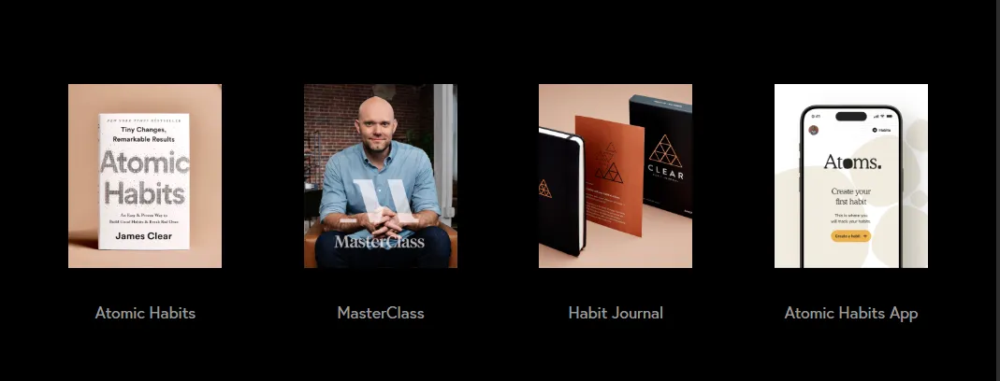

来源：jamesclear.com

《原子习惯》的作者jamesclear，一开始只是通过写博客的方式分享“如何养成习惯”的知识，后来把相关的理论文章有序总结，从而写成了书籍来告诉人们怎么养成习惯，其次，针对养成习惯的流程步骤来开发自己的软件应用App。

还是专注于解决——如何养成习惯——问题，开启自己的大师班、期刊杂志、还以企业讲师的身份进行企业培训和咨询、承担演讲等任务。

看似形式内容出现很多变化，时而书籍、时而课程、时而咨询/演讲，但作者一直都是在解决习惯领域的问题。而jamesclear在“养成习惯”领域方面做到了“创造品类”。《[创作者的成长路线图](https://mp.weixin.qq.com/s?__biz=MzkyOTE4MDcyOA==&mid=2247495511&idx=1&sn=a9b5f023b9006e1ee5f4538c4de3a87c&scene=21#wechat_redirect)》

因此，专注于解决问题，商业机会是自然的“副产品”。

你可能会低估小众市场的力量。但请你想一想，如果“仅仅”只有1000人每月付给你83.33元，那一年就有100万元的收入！

因此，从解决自身问题开始，真的适合所有人！所有人！你并不需要非常出名。

最终，当你用免费的形式测试内容的有效性（确保问题得到真正的解决）之后，你就可以开始建立收入流组合，从而靠近年入百万的队列：

或换算出你自己的生活所需费用（自由的费用），倒逼计算出公式。

1. 产品：[引导磁铁](https://mp.weixin.qq.com/s?__biz=MzkyOTE4MDcyOA==&mid=2247495760&idx=1&sn=900d6bf6e6173b8e657d616ce993ff60&scene=21#wechat_redirect)是你的第一个免费的产品，你可以转移成付费产品。
2. 订阅：[关注账号](https://mp.weixin.qq.com/s?__biz=MzkyOTE4MDcyOA==&mid=2247495776&idx=1&sn=42dbc34219312e35ae22314076adbdbe&scene=21#wechat_redirect)是你的第一个免费订阅服务，你可以转移成付费订阅。
3. 付费社区：免费社群是你的第一个免费服务，你可以转移成付费社区。
4. 咨询与教练：[免费咨询](https://mp.weixin.qq.com/s?__biz=MzkyOTE4MDcyOA==&mid=2247495777&idx=1&sn=a5f6b71b3fd26439eb99b73241d682d8&scene=21#wechat_redirect)是你的第一个免费服务，你可以转移成付费咨询。
5. 广告赞助：只要你能解决别人的问题，就会有广告赞助和读者赞助。
6. 平台激励计划：[第一个100块 ：一棵摇钱树苗。](https://mp.weixin.qq.com/s?__biz=MzkyOTE4MDcyOA==&mid=2247495751&idx=1&sn=22f22c60649dee3783bc1f8e54876735&scene=21#wechat_redirect)

还是[引导磁铁](https://mp.weixin.qq.com/s?__biz=MzkyOTE4MDcyOA==&mid=2247495760&idx=1&sn=900d6bf6e6173b8e657d616ce993ff60&scene=21#wechat_redirect)文章中提到的逻辑：用户现在愿意用时间和注意力来支付你的产品和服务，那么，未来就愿意用金钱来支付你的服务。

> 如果很难免费送出你的服务/商品，这意味着要么人们不想要它（梦想的结果），要么他们不信任你（实现可能性），要么隐性成本（时间、精力和牺牲）太高。
>
> 简而言之，你的“免费”商品太昂贵了。因此，找出隐性成本。一旦你做到了，你就能解锁更多的价值，而这些价值最终是可以打包收费的。

根据自己的意愿、能力、兴趣点、理念等灵活组合100万的收入组合。比如：每天销售9件150元的数字产品+每天出售55份25元的订阅服务。或它们任何的组合。

再分享一个公式：

* 收入=客单价×曝光量×点击转化率（点击率×转化率）。

150×720×2.5%=2700元

2700元×365天=985500元

每天在一个转化率2.5%的着陆页上，允许人们购买你的产品，那么，你需要每天有720人访问该页面，才能在一个150元的产品上实现18笔销售，每年赚取一百万元。

为什么要提到这个运营公式？因为我建议你从[数字产品](https://mp.weixin.qq.com/s?__biz=MzkyOTE4MDcyOA==&mid=2247495780&idx=1&sn=32dd3e68fa11365d20379b0d48753915&scene=21#wechat_redirect)开始你的创业之旅。

到这里，总结一下「第一个100块七步曲」

1. 找到一个或几个自己真正喜欢且“复利”的事情。
2. 学习一些刚需/必要/喜欢的技能和知识。
3. 毫无保留地公开分享你所学到的一切。
4. 免费工作、免费提供价值积累“影响力要素”。
5. 吸引对你的工作/问题/梦想感兴趣的人。
6. 发现他们面临的痛苦、高频的问题。
7. 通过咨询、服务的方式共同完善解决方案。
8. 有序地整理打包问题的答案/解决方案。
9. 向公众出售自己的知识产品/服务。
10. 追加销售到每月经常性收入。
11. 赚取被动收入，享受生活。

我知道你需要学习的东西还很多，真的很多，但令人欣慰的是——你永远可以如「上述闭环流程」的形式开始自己的学习之旅。

我就是这么干的！[成长的副产品。「3」](https://mp.weixin.qq.com/s?__biz=MzkyOTE4MDcyOA==&mid=2247495776&idx=1&sn=42dbc34219312e35ae22314076adbdbe&scene=21#wechat_redirect)

如果你实在不知道从哪里开始，那就从养成写作的习惯开始，因为如果你能拥有写作的习惯，你就能养成任何习惯。写作是“元习惯”之一——元习惯（养成习惯的习惯）。

你想和别人不一样，就得做出和别人不一样的行为：离开寻求许可的世界，进入接受许可的世界。从被动者变成一个主动者；从消费者变成创造者；

从解决自己问题到解决别人问题；从专业技能到复合技能拥有者；从独自学习到公开学习.....学习输出和表达、获取别人的关注、构建产品、学习营销......你必须一次次完成这样的蜕变和进阶。

**最后！**

我想在这里感谢所有一直用时间和注意力支持我的人，特别感谢那些通过成为付费读者来支持我的财务的人，是你们让它得以闭环。

而我能回馈的最好方式就是真诚和毫无保留地分享。

是你们成就了这个教程。再次万分感谢！

**主题阅读-资源推荐：**

《Snow Leopard》

《100M Offers》

《Case Study - StoryLearning》 

复利发生的机理：

第一，定投。每天或每周都在该系统中进行“定投”。

第二，正向的反馈。每一个动作都有积累，即每个动作都对下一个动作都产生正向的推动作用。

就这么简单。

