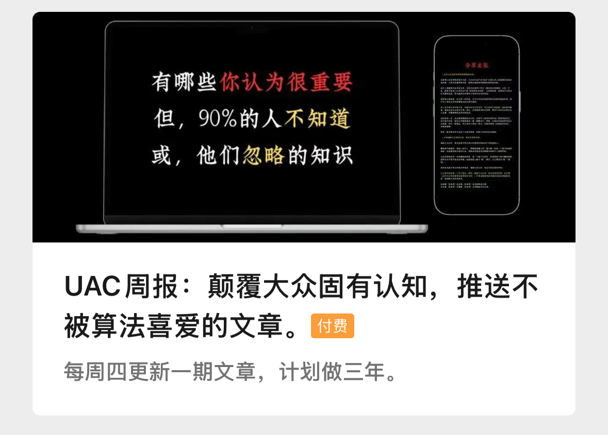

# @Gusang's works  
一年后，你会后悔没有从今天开始。

---

### 1）作品-Book  
> [《**选择改变命运**》](/fate/) 
> — 人生的尴尬在于，之前决策的时候并不可能有之后那么丰富的经验—

---

### 2）微信公众号  
**给你准备了几样见面礼，还请你笑纳**。  

  

这些礼物是我日常生活中的精华总结，以及它会告诉你：  
- 我可以怎么帮助你？  
- 我们会有怎么样的大花？  

**扫描二维码，关注微信公众号,`公众号后台`输入「关键字」自动回复：**  

> **后台回复「1」：**  我将给你发送一个网址，在这里你可以下载我所提到的98%的英文电子书，新颖有效。我用它阅读了大量的书籍。

> **后台回复「2」：**  推送7条让我受益至今的关于「写作」的资源。  

---

### 3）**[《UAC周刊：最新大众固有认知，推送不被算法喜爱的文章》](https://mp.weixin.qq.com/mp/appmsgaibum?biz=MzkyOTE4MDcyOA--&action=geta1bum&a1bum_id=3931407159660855300&scene=126Hwechat_redirect)**   

  

我的分享工作得益于「UAC社群」付费读者的赞助支持，如果你喜欢我的作品，你也会喜欢我的周刊，可加入社群一起成长。
- 每周四更新符合"独特且正确"价值主张的文章。  
 
