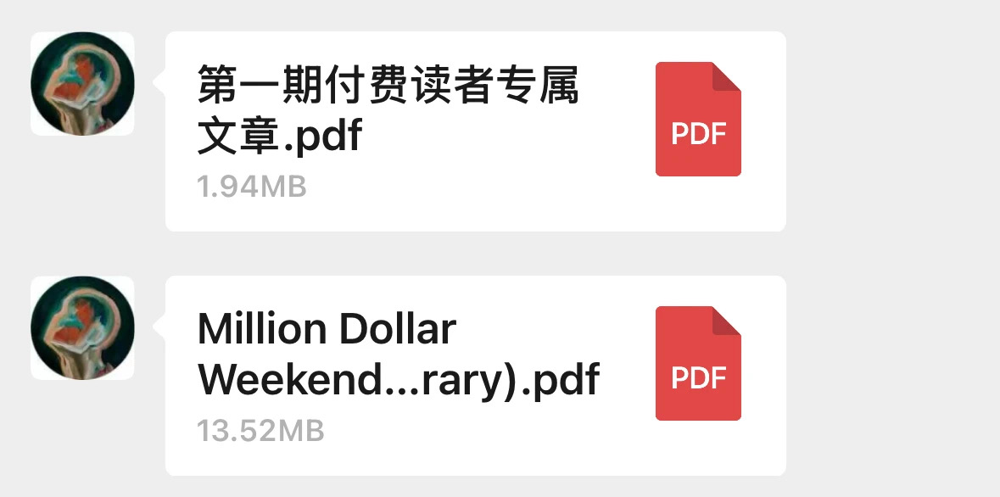

当你读完这文章，你定会慨叹：就在前几分钟的“我”——真的不会搜索！真的对搜索一窍不通！而体验这样一个“肉眼”可见的进步时刻，仅仅需要十分钟左右。

仅需一块钱（1$），即可升级你的搜索系统，让搜索带动成长，让成长带动自己的人生价值和价格。我向你郑重保证，这将是一次在你的人生中反复被忆起的 “超值” 投资时刻。

当然啊，搜索技巧并非这篇文章的核心竞争力。

花一块钱，你学到的不只是 “10+3” 的搜索方法，还包括基于搜索的 “输入” 方法、基于搜索的学习方法、基于搜索的内容创作方法，以及超值的产品售后服务。此外，你还能买断此文章迭代后的所有版本和其他相关彩蛋文章。（购买后务必通过文章中的二维码联系我 —— 记住暗号）

据说，“自觉傻 X” 的速度决定进步的速度。对于这篇文章，我有着绝对的自信 —— 看完后你会直呼：之前的“我”，完全不懂搜索。

真的因为不懂搜索耽误了很多事情。

如果看完这篇一块钱的搜索文章后，你没有获得任何回报、无法把一块钱挣回去，我会在文章的【学习前】篇章中告诉你一个 “为何自己看完后没有获得任何实际回报” 的深刻原因。

祝大家Google快乐。

## 如何购买？有两种方式：
#### 一：点击链接跳转到微信进行购买付费。
[点击此链接跳转：一块钱！10+3的搜索体系，全新升级你的搜索系统。](https://mp.weixin.qq.com/s/iM7auX25aHPFz_7CZn2AUQ)

#### 二：扫描下方二维码进行购买。

#### 第一期付费读者专属文章以更新完毕。（付费完成后，从文中添加我的个人微信二维码领取，进行追更。）

