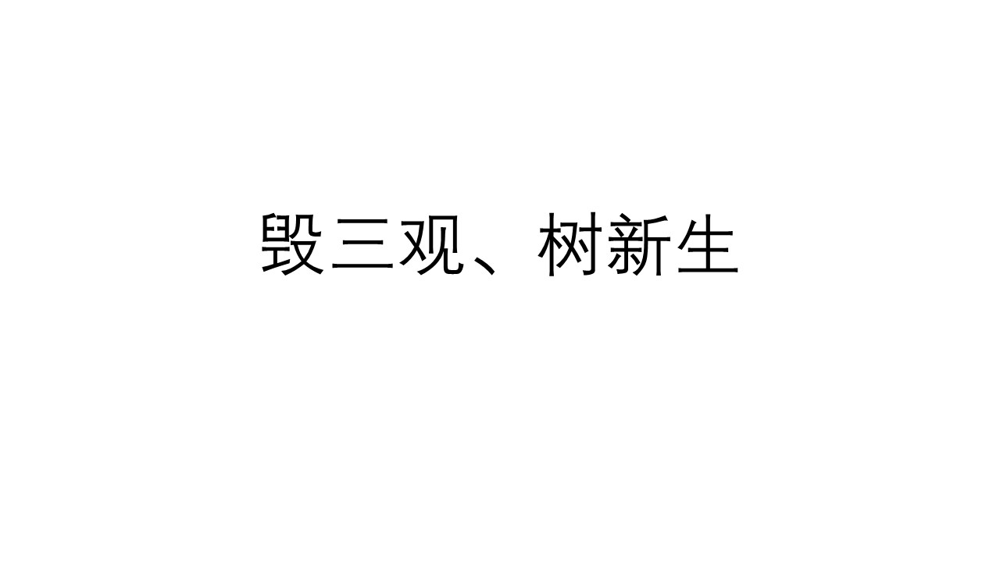

# 《经济学毁了“我”》

## 00.  前言：经济学毁了“我”。

经济学直接撕毁了从前的“我”。

我刚开始自学经济学是从大一开始，选修了一门《经济学原理》的一门课程，但那次只是去凑学分，然后希望顺便能学到一两点知识罢了。

但那次，经济学并没有让我感觉很有趣。

之后“放弃了”很长一段时间，第二次开始学习经济学是大二时候，从抖音平台刷到林毅夫教授讲:“经济学是一门关于选择的科学”。这句话，让我有认真学习经济学的动力。因为那时候开始，我已经认识到，有比努力更重要的东西。可能是选择吧。

最重要的经济学原理——供需定律，告诉我，价格是由供需关系决定，价格影响成本。其次还看到“免费才是最贵的”等经济学观点。

那时候的我，刚经历高考。不拼不搏，高三无味；不苦不累，人生无味的思维深刻在我心中，经济学如此的观点，简直就是巨大的冲击。

后面接触了宏观经济学等，再一次认识到选择很重要。且经济学是一个大交叉学科，如政治经济学、人口经济学等，对我认清世界有了巨大的帮助。

大学里我学的专业是道路工程，后来宏观经济学相关书籍看的多了，发现我是受到了08年后大刺激，旧基建铁公鸡（铁路、公路、机场）的影响，而且我之后在我教科书上反复看到国家“五年计划”，然后在我大学期间赶上新冠疫情，和08年金融危机很像，又动用财政工具刺激经济学，出来新基建。

那时候我很理解了《周期》里的一句话:“历史总是惊人的相似，却不尽相同”。那时候就业率肯定不好，而且就业偏好也很类似。

之后，我还了解到了机会成本。我不再是关注自己能看到的，我还去关注自己看不到的代价。之后，我更多地考虑机会成本，而不是沉默成本。

最后，经济学直接改变了我的性格。所谓的性格就是对外界环境的反馈和态度。

之前我，喜欢用道德要求别人。习惯于用非黑即白、非好即白坏的思维去看待外围的事物。学了经济学突然发现我更加包容了，

我也发现周围的人，包括我自己，都是逐利的。但我并没有心理上的难过，反而更能接受自己。我还在学习经济学过程中，学到了一个学习方法，把自己当做“小白鼠”观察，经济学研究的就是人的底层逻辑和人性。

经济学提供了一套看世界的方法，这个世界和我以前看的不一样。

经济学告诉我:客观世界你改变不了，但你可以改变你的主观世界，让自己更好地适应于客观世界。

还有，我大学生时候，我反复从一个朋友口中听到有关资本的言论，还有那句话“资本来到世间每个毛孔都滴着抗脏的血”，我当然有一种仇富心态。不喜欢那些大老板、不喜欢商人。我认为钱是一种肮脏的东西。后来，我真的认同那句话，商业是最好的慈善。

经济学毁了“我”，我也觉得经济学同样会对你有影响。
