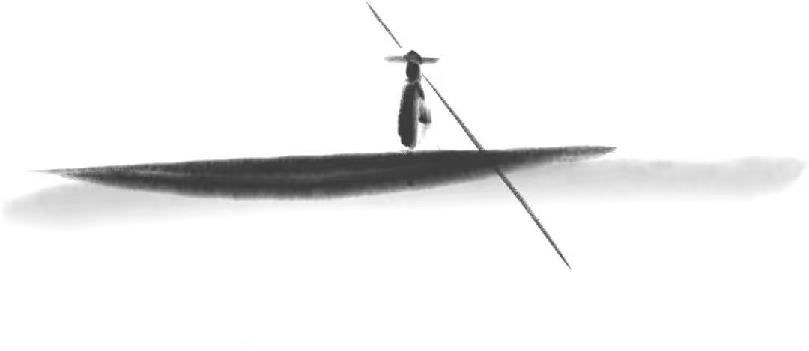
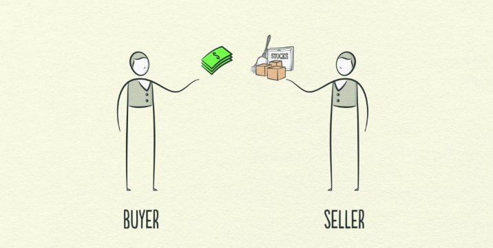
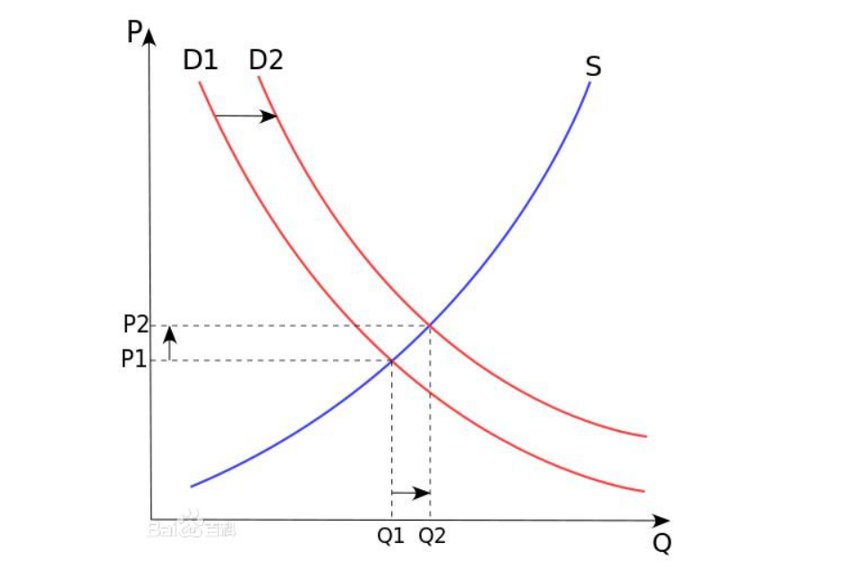
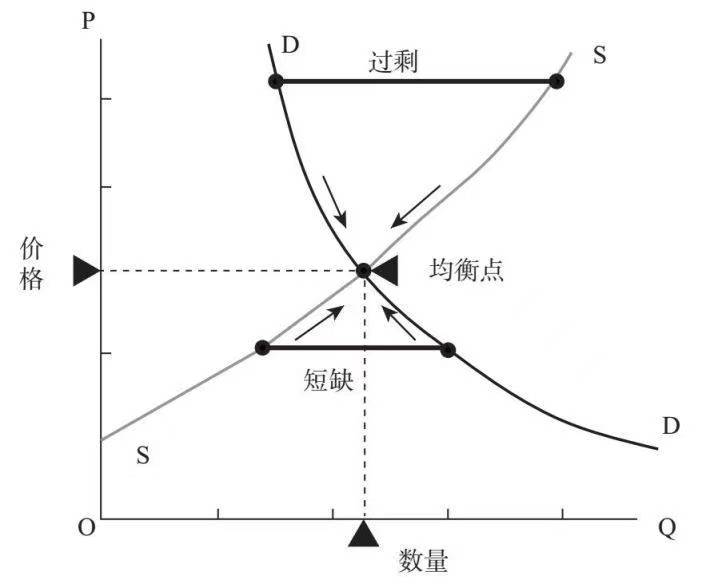

# 《经济学毁了“我”》
>**我的乐观并不是毫无根据性，我是一个理性、乐观派。**

>未来，客观世界一定是往好的方向发展。而个人的主观世界如何发展，完全取决于你自己。

>你甘心错过未来的好生活吗？

## 00.  前言：经济学毁了“我”。

经济学直接撕毁了从前的“我”。

我刚开始自学经济学是从大一开始，选修了一门《经济学原理》的一门课程，但那次只是去凑学分，然后希望顺便能学到一两点知识罢了。

但那次，经济学并没有让我感觉很有趣。

之后“放弃了”很长一段时间，第二次开始学习经济学是大二时候，从抖音平台刷到林毅夫教授讲:“经济学是一门关于选择的科学”。这句话，让我有认真学习经济学的动力。因为那时候开始，我已经认识到，有比努力更重要的东西。可能是选择吧。

最重要的经济学原理——供需定律，告诉我，价格是由供需关系决定，价格影响成本。其次还看到“免费才是最贵的”等经济学观点。

那时候的我，刚经历高考。不拼不搏，高三无味；不苦不累，人生无味的思维深刻在我心中，经济学如此的观点，简直就是巨大的冲击。

后面接触了宏观经济学等，再一次认识到选择很重要。且经济学是一个大交叉学科，如政治经济学、人口经济学等，对我认清世界有了巨大的帮助。

大学里我学的专业是道路工程，后来宏观经济学相关书籍看的多了，发现我是受到了08年后大刺激，旧基建铁公鸡（铁路、公路、机场）的影响，而且我之后在我教科书上反复看到国家“五年计划”，然后在我大学期间赶上新冠疫情，和08年金融危机很像，又动用财政工具刺激经济学，出来新基建。

那时候我很理解了《周期》里的一句话:“历史总是惊人的相似，却不尽相同”。那时候就业率肯定不好，而且就业偏好也很类似。

之后，我还了解到了机会成本。我不再是关注自己能看到的，我还去关注自己看不到的代价。之后，我更多地考虑机会成本，而不是沉默成本。

最后，经济学直接改变了我的性格。所谓的性格就是对外界环境的反馈和态度。

之前我，喜欢用道德要求别人。习惯于用非黑即白、非好即白坏的思维去看待外围的事物。学了经济学突然发现我更加包容了，

我也发现周围的人，包括我自己，都是逐利的。但我并没有心理上的难过，反而更能接受自己。我还在学习经济学过程中，学到了一个学习方法，把自己当做“小白鼠”观察，经济学研究的就是人的底层逻辑和人性。

经济学提供了一套看世界的方法，这个世界和我以前看的不一样。

经济学告诉我:客观世界你改变不了，但你可以改变你的主观世界，让自己更好地适应于客观世界。

还有，我大学生时候，我反复从一个朋友口中听到有关资本的言论，还有那句话“资本来到世间每个毛孔都滴着抗脏的血”，我当然有一种仇富心态。不喜欢那些大老板、不喜欢商人。我认为钱是一种肮脏的东西。后来，我真的认同那句话，商业是最好的慈善。

经济学毁了“我”，我也觉得经济学同样会对你有影响。

## 01. 记住这么几个假设。
>像一头黄牛一样，先咽下去，然后有空慢慢“咀嚼”。

经济学不能教你怎么成为盖茨（赚钱），但可以告诉你盖茨是怎么富有的（他们是怎么赚钱的）。

经济学不会使用任何一个国家富有，但经济学可以解释为何富有。

* 经济学是一门有关解释的科学。
经济学（包括宏观经济学）的主要任务还是在于解释和理解现实。

同样的，经济学还有几样假设。

* 经济学研究的对象是人和人类，研究人的动机。
  
人是理性的，也就是逐利的。

* 经济学研究的是人的动机。

经济学从人性的底层逻辑构建经济大厦，只要人性不变，经济规律就具备普适性。

* 经济学是一门关于选择的科学，研究选择的意外结果。

经济学是关于选择的科学，在资源约束的情况下（稀缺）使资源配置最大化。

通往地狱的道路是用善良的意愿铺成的。经济学一门研究“事与愿违”的学问。好的意愿并不一定带来好的结果。

* 交易是自愿的。

经济学是一门系统地研究交易活动的科学，专注研究陌生人之间交易规律的科学。

* 人是有对策的，有反应的。

每当你做一个经济决策，你要问自己，然后呢？你要把别人的反应考虑进来。薛兆丰教授说：“经济学不是一个句号思维，你做一个规定，事情就画上句号，而是一个冒号思维，是你出了一个规定之后，他总是关心人们下一步的反应是什么。”

* 人是会预测未来的（不管对或错）。

基于预期收益和预期成本做决定。

人对未来的预测，其中包含着人对“世界运作的方式”的理解，并以此来引导当前的行动。

人对激励是会做出反应的。你给他奖励，他就会多干；你给他惩罚，他就会少干；有风险他就会避险。

* 经济规律是总结出来的，而不是创造出来的。

请带着这些假设，运用到生活中求证。这些假设，会反复出现在文章里。

## 02.  钱和财富，钱 ≠ 财富。

我们讲，经济学是一门有关解释现实的科学。因此，经济学可以告诉你比尔·盖茨，是怎么富有的，但不能教你如何成为比尔·盖茨（赚钱）。

理解这句话，我们需要理解大多数最容易误解的两个概念:财富和钱（货币）。

财富和钱并不是画等号的。

做一个这样的思想实验，给你三个亿，让你住在撒哈拉沙漠，你还会觉得自己富有吗？

那时候的你，是处于有钱、没财富的状态。再多的钱对你也是无用的，因为没有东西可买，没有面包、没有可用水。

财富是满足某种需求的东西。因此，蚂蚁、屎壳郎它们也有属于它们自己的财富，但它们并没有钱（货币）。

财富存在的时间与人类历史一样长久，甚至更长久，而金钱的历史相对就很短。

在出现货币的很长时间里，人们交易过程中，都是物物交换的形式达成交易的。因此，交易的过程就会出现很多无法定价清晰的过程，比如三个梨子换两个苹果，苹果要是烂的呢、要是小的呢、我不想和苹果换而是和一头羊换，又怎么定价。随着交易逐渐地庞大，逐渐出现了货币，作为中间物、作为媒介。

钱的前身有很多，贝壳、盐、银子、黄金。在监狱里，香烟、方便面都可以成为货币。太平洋某个小岛上使用巨型石头作为货币，而这仅仅是一个象征。

货币是财富的抽象代表。

换一个视角说，金钱不是财富，而只是我们用来转移财富所有权的东西。货币即钱，象征社会上其他人欠你的东西，或者是你对特定数量的社会资源的债权。

金钱就是一张欠条。

我们的传统文化还是过去历史都是对钱有不正确的认识。进一步带来的想法是，我们对钱，对富有、对企业家等有不正确的认知。如此是有历史原因的，在人类很长的时间里，财富并没有大的变化，直到工业革命带来生产力的革命性变化，才有了物质财富如此丰富的时期。注意是财富，不是钱。

我们对企业家，尤其是很有钱的企业家有一种“他们不应该拿这么多”的态度。这显然是没必要的，我们要看一个人所占有的财富，而不是钱。

拿乔布斯来说，乔布斯银行卡里躺着几百亿美金，首先那只能说明社会欠它那么多的财富，其次这从另一面说明乔布斯为社会创造了如此多的财富。

还有，我们要看乔布斯占有的财富而不是钱。就算乔布斯有豪宅别墅，吃山珍海味，那只是，他创造财富之中的很小一部分，不足挂齿。事实上，乔布斯不管是穿着还是在食品和社交上都是偏向简单化的，因为，他们的时间很值钱，注意力更值钱。

再还有，钱（货币）供应的增加，会带来通货膨胀，钱的购买力下降，快速贬值，因此，他们必须再投资，投入到社会中，创造价值。

我们应该为拥有如此多的企业家而高兴。

仇富心态、对钱的不正确认知都会通过潜意识来影响你的赚钱的行为。如果你认为钱是肮脏的东西，那么，你会羞愧于赚钱。纳瓦尔说:如果你内心鄙视财富，财富就会对你避而远之。

很多人错把财富当钱，然后就会连财富金钱一同鄙视。

这就是比尔·盖茨、乔布斯富有的解释——为社会创造财富，这条逻辑一直会适用。但你要如何富有，为社会创造什么价值，你自己要寻找。正如纳瓦尔所说:获得财富的一个途径，就是为社会提供其有需求但无从获得的东西，并实现规模化。

纳瓦尔也不知道未来的世界，你要满足什么需求。

其次，经济学不能教你如何赚钱，也是符合经济学规律。

如果各位诺贝尔经济学得奖主，写了一个“如何赚钱”的文章，发在网上。那会发生什么情况？

微观上人民的钱增多了，是富有了，但宏观上每个人都通过这么一个方法富有了，那么，大家都富有了，物价就会上升。

如果物质财富保持不变，金钱越多，导致的唯一结果就是物价越高。（金钱和财富之间的供需关系。）

个体的富有是相对的。平均地有钱，那不是真正的富有，如若那是富有，国家就可以没日没夜不停地印钱。

大家都富有（财富的占有），那叫时代的进步。

## 03. 为什么每个人都应该有点经济学基本常识。
>动机比方法更重要：有志者，事竟成。

世界是客观的。

世界观是主观的。

最终你会活成自己内心世界的镜像。

经济学会提供给你一个看世界的角度。让你的客观世界更接近主观真实的世界。

经济学教会你用经济学常识来更加理性和全面的方式看待周围的世界。

大多数人，习惯于用道德的视角看世界，更喜欢用二元论去评判事情的结果，非好即坏，非黑即白。人总是会不由自主地用“屁股决定脑袋”，自己是病人就认为医生收费贵、自己是老师认为禁止办培训不合理、自己是消费者就认为商家不要脸。我认为《薛兆丰经济学讲义》这是很好的一本书，但你看评论，全是屁股决定脑袋的评论、全是封闭思维者的言论。

如果你持有这个的判断标准去看世界，你看到的世界只会是片面的，你的主观世界也会塑造成片面的。你不仅不会有任何的长进，而且你有可能成为一个抱怨者。

北京大学国家发展研究院教授姚洋经常开玩笑说:学习经济学能够长寿，因为他会给你一种全新的世界观，然后你会和世界和解。我很同意，这就是经济学改变我性格的方法。

他说:“学习经济学之后，就会理解除了市场经济之外好像找不到更好的资源配置方式，就不会走极端，不会总是抱怨社会，而是回到自己身上，寻求怎么去适应这个社会，怎么在这个社会中提高个人的教育水平、自己的收入能力，按照自己的比较优势去选择职业和工种。这样，心态就会变得更好，社会就会更加积极向上。”

对于任何一个人，尤其要认真了解劳动力市场、劳资关系，如此，你才能和“老板”
和自己的“死工资”和解，转而专注让自己更值钱上。正如纳瓦尔所说:“微观经济学和博弈论都是基础性学科。如果不能深刻理解**供求关系、劳资关系**、博弈论等问题，你就不可能在商业上取得成功，甚至也无法很好地适应现代社会。”

学一些经济学的知识，可以提高我们理解这个世界的能力，经济学总能以一种更加客观理性的态度去看待周边的人和事，随之，你的生活质量也会跟着提高。

我还是一个长期主义者，但长期主义关键并不在长期，而是在于正确，只有在正确的方向上长期才是有效的，不然只是在错误的路上越走越深。

比如努力，为什么这么努力依然很穷。因为你不了解供需关系决定价格，只有你成为某一方的稀缺品，你才能拿高价格。努力是必要的，但不是高价的充分条件。你没有因为努力让自己成为一个稀缺的人，很努力地做重复工作，当然不稀缺啊，尤其是在人工智能时代。努力是过程，稀缺是结果。半成品是不计入GDP的。

让自己稀缺是唯一且正确的方向，然后才是某长期主义。

经济学是一门关于选择的知识。选择大于努力。经济学会辅助我们看到，看不到的成本、看不到的收益、长期的成本、长期的收益。经济学可以让我们摘下“短视”的眼镜。

学习经济学，能够影响我们的思维，拥有长期主义者的视角，做出更好的决策，对于大决策还是微小的决策都是极其有效的。

每个人都是经济人，虽然不明白经济学的各种术语，但无时无刻不在运用着，就好比我们不知道手机工作原理，但时时刻刻运用着。你不知道机会成本，但当你会知道，你玩了两个小时的游戏，你不能看书。但如果我们掌握了经济学规律，戳破了一层朦胧的经济学的纸模，我们会看到更有意思的世界，可能做出更好的决策。我们可以把无意识层面的知识和动作，调用到意识层面，形成可复制的方法和分析框架。

没有正确的常识，尤其是关于经济学的基本常识，即使是再长期主义，再认真为自己谋利，没有正确的常识，遭殃的是未来的自己。

再比如说猪肉价格，一定是越便宜越好。但怎么实现呢，那就是涨价。涨价了，供给就多了，有人为了逐利进行养猪技术开发和更好的进行管理，从而压低猪肉价格。为什么涨价？因为供给少了。如果不允许涨价，那么猪肉供给只会更少。只有涨价才能猪肉变便宜。

同理，如果政府管制房市场的价格，就会供给减少，最终市场价格只会更稀缺、价格更高。

如果医生工资不高、老师工资不高，那么，当医生的人、当老师的人少了，然后供需关系变化，就要高价挤进某些学校。

经济学是靠考虑长期结果的，充分考虑别人行为。

很多人心里是，做医生是不可能的，这辈子都不可以当医生的。所以才呼吁“医疗费”降价。归根到底，是办公室小白领的屁股。

一个人这么想，无伤大雅，但很多个人这么想。就会出现问题，历史上这种事情无限多。

自从改革开放后，从计划经济过渡向自由市场经济发展，迎来了快速发展的40年。《形势比人强》有一句我很认同，未来取决于绝大多数人的观念。中国的未来，需要更多的具备经济学思维的人。

对于那些关心这个世界如何运转的人，经济学是所能学到的最相关的科目，经济学是关于现代社会怎么运行的学问。

如果要落到实处，我想，学习经济学对我们每个人来说的第一个意义，就是帮助我们理解经济系统是怎么运作的。

经济学可以告诉我们经济系统是怎么工作的，比如企业是怎么运作的，雇佣关系是怎么运作的，资本是怎么运作的，价格是怎么形成的，还有一些产业为什么会消失，为什么有些产业又会出现，等等。

一个没有知识的人也可以平安幸福地活过一生，但是，生命是有质量之分的。

学点无用的知识。
（无用才能更高效地促就个人稀缺性，下文讲。）

用你现在的认知去判断某个知识是否有用，会进入你的认知陷阱里。现在我认为经济学大有用处，但在之前我也同样认为经济学没什么用。

经济学会间接提高你的框架思维能力、系统思考能力，然后影响你的财商，影响你的赚钱能力。经济学是社会学皇冠上的宝珠。经济无处不在，以至于任何一个社会学科它都可以插上一手。行为经济学、政策经济学、国际经济、金融经济学，打好经济学基本功，我们可以快速在交叉学科之间穿梭。

快速学习能力是快速发展时代又一重要能力。

任何一个都是“看的见的手+看不见的手”配合促进。如果你想看的透看的见的手，你的一定程度上了解看不见的手。

最后，我还认为它是一种智力上的愉悦。

经济学里面有许多非常地违反直觉的观点。比如，免费是最贵的、最低工资反而没能保护需要保护的人的利益、我们的权利是别人赋予的、我们的价格（工资）是供需关系决定的、中间商反而降低了总成本等等。

哥伦布一同的探险家们发现新大陆的时候，他们肯定是欣喜若狂。

同样，当你发现一个不同于自己所想的世界，难道你就不会开心吗？

## 04.  重新理解企业家精神。

很多人喜欢美化过去，以我的观察发现，那些人是现在过得不好，所以喜欢说过去的好来为自己托辞。而且那也不是真的差，而是比较出来的差。就像一个成年人喜欢炫耀小时候的风光，一模一样。

如果让你穿越时空，回到过去，你愿意吗？尚且不让你做奴隶、做贱民，也不让你做良民，让你成为贵族，你愿意吗？你随时都有可能丧命的危险，一个肺结核就让你丧命，而且唐朝时期皇室和达官贵人的平均寿命也就大约60-70岁。物质财富也并不富裕，学富五车的典籍总计约50-60万字,相当于几十本普通图书的数量，不多啊。

时代的进步（物质的富有）才是真正的进步。尤其是对你我这样的普通人。

我们把所有的商品组成的财富简化为鱼。那么，在人类历史很长一段时间里大家只能去钓村口前河里的鱼，因此，就是一个零和博弈。你钓上来的鱼多了，我就少了了，相反，我钓上来的鱼多了，你就少了。

零和博弈即意味着社会财富是一个固定的量，一个人所得就意味着另一个人所失，有人变富就一定是有人变穷。

人类在很长的历史阶段都处于零和博弈游戏中。在狩猎-采集文明中，某一个地方的动物和果实都是有限的，因此就是零和游戏。当某一个地方的动物狩猎完，果实采集完，就得换地方。

就在几个世纪前，财富的主要来源还是矿石、土地和牲畜等。土地作为最重要甚至唯一的资源，面积有限，因此，这块地你种了我就不能种。长期处于零和博弈中。

财富的名声自然不好。

最著名的零和博弈案例当“属马儿萨斯陷阱”。人类学家马尔萨斯认为，人口增长是按照几何级数增长的，而生存资源仅仅是按照算术级数增长的，大白话就是人口增加速度大于经济的增长。因此多增加的人口总是要以某种方式（灾荒、饥饿、战争等）被消灭掉，人口不能超出相应的农业发展水平，人口又回到正常水平。

中国古代朝代更迭也是马儿萨斯陷阱的灵现。

马尔萨斯发布《人口学原理》时候，世界人口约为9亿。而根据联合国的估计,2023年世界人口约为78亿。放在今天，马尔萨斯陷阱，就很幼稚。但在当时，这是一个极具说服力的观点。

为什么会如此呢？

亚当斯密解释了分工和交易带来的财富是正向的（下文详讲）。那时候，时间正好处于工业革命时期，蒸汽机的应用，大大提高了人类创造财富（不是钱）的能力，从而摆脱马尔萨斯陷阱。这是第一个解释。

其二，经济增长的真正秘密在于人的创造力和创新。

全世界范围内，某个国家的经济增长是用GDP来表示，GDP的定义是这样的，它是一个国家或地区所有常住单位在一定时期内生产活动的最终成果。

GDP衡量是某一常住单位和一定时期内产生的所有产品和服务的总和，是一个财富的概念，但国家统计局公布数据是以货币数量的形式，因此，在很长一段时间里，我认为经济的增长等于货币的增长。

带来了很多不必要误解。

经济增长取决于财富的创造，而财富的创造来自于人的创造能力。

在19世纪中期之前，如今被我们当成“宝贝”的石油，被被视为一种废物。人们在打水井或者盐井时经常碰到原油，污染水和盐，带来了不小的麻烦。原油与煤炭不同，在自然状态下实际上没有什么用途。为了使用石油，必须要提炼。后来通过石油蒸馏的方式从中提炼出石蜡（煤油）。煤油满足了照明的需求。这样，石油就变成了资源。然后对提炼煤油之后剩下的副产品汽油和重油找到应用地方，汽油用于给汽车加油。重油变成了燃料油（发电）。再后来随着提炼技术的进步，发展出了石油化学产业，从石油中提炼出300多种化工材料。

石油一直在地底下，但只有人类发明石油的应用地方和掌握开采技术后我们才获得了财富。

类似的还有很多，太阳能、水利、风能、钢铁的运用等等都是如此，没有人类对原材料的创造，就不会变成人类的财富。

知识就是力量。科学技术是第一生产力。

随着人类对知识的掌握和应用，以及不断的创新，我们正处的时代是一个多赢的正和游戏。我们要深刻认识到我们是处于一个不断把蛋糕做大，然后分蛋糕的时代。

但多数人还是让自己的思维惯性下去。经常性地去诋毁和打击创造财富的人。

人的创作能力的最重要的指标就是想象力。而企业家就是一个富有想象力的创造能力超群的人。

知识的发现和应用知识大致分为两个步骤。企业家在知识的应用和产品化，并大规模生产、普及给老百姓扮演者至关重要的作用。

很多知识是从实验室“请”不出来的或者很难“请”出来的。

比如，我们习以为常的冰块，形成冰块的知识很简单——水在低温下会凝固成固态冰块。但知识的应用和普及形成大众消费品，相差很长时间。

知识的应用以及普及变成大众消费品，需要企业家和企业。某一个产品或技术想要普及给所有人，惠及普通老百姓，需要资本的介入，商业的运作，这就是企业、企业家的价值。

最著名的例子就是亨利·福特的流水线。汽车很早就发明出来了，而且是德国人发明的，但直到1908年,福特汽车公司创立,亨利·福特想要让每个人开上汽车，并创造出的流水线生产方式，开始大规模生产T型车,使汽车进入普及阶段。这也同时改变了美国。

企业、企业家就是一个迂回生产的人。他们去造渔网、鱼叉，然后卖给大家，让大家更加高效的捕鱼、捕获更多的鱼儿。企业家还用发挥自己想象力去制造轮船来捕鱼。这就是亚当·斯密所有的，交易者自利的行为会造成利他的行为。

企业家在历史上人类致富扮演者重要的作用。

爱迪生首先是一个企业家，然后才是一个发明家。根据统计，爱迪生一生获得过1083项专利，其中很多发明（如:电灯泡、留声机、电力系统等）被应用，其重要原因是，爱迪生是一个企业家。

张维迎说:企业家决策不是科学决策，他在《重新理解企业家精神》中举了造船的例子。产业革命时期，当英国钢铁大王约翰·威尔金森提出用铁造船时，大家都认为她他疯了，因为让铁漂在水上不符合当时的科学知识。

庆幸的是，我们还有这样的“疯子”。未来的中国，需要更多这样的疯子。

张维迎教授有这么一个观察。原来我们最优秀的人都去了政府，改革以后最优秀的人逐渐去做企业了，从“学而优则仕”转为“学而优则商”。张教授区分了中国改革开放后出现的三代企业家：第一代，农民出身的企业家；第二代，官员出身的企业家；第三代，留学回国人员和工程师背景的企业家。现在有第四代了，“80后”“90后”又是一批人。这几代企业家共同推动了中国经济的高速增长。

马斯克在没能完成火箭回收的之前很长一段日子里，美国大众对的称呼不是英雄，而是骗子。

如今，在新能源汽车普及中，人们提出了太多的所谓“不行”的理由——里程数不够续航不好、电池不安全等等。

我们低估了企业家精神。企业家一定会让“不可能”变成“可能”，这就是张维迎所说的企业家精神之一。

在钱≠财富章节里举了乔布斯的例子。钱和财富是不同的，当创造的财富多了，物价就会下来，就会普惠所有人。1990年，大哥大进入中国市场，一台大哥大的价格大约在8万元人民币左右,相当于当时一辆汽车的价格。而如今，一个人一个月的薪水的一小部分，就可以拥有很好的手机。

但，在如今的科技文明时代，还有很多人对企业家抱有仇恨，我认为这一些人身处科技文明，大脑还停留在狩猎文明、农业文明的人，简称“文明时代的洞穴人”。

如果你真的区别了钱和财富而且你认识到自由市场里交易是自由的。那么，我们平时挂在口边的贫富差距、“无商不奸”都是认知带来的错误世界观罢了。

所以，我们要重新理解企业家、尊重企业家、重视企业家精神。

在这个时代，只有创造财富，你才可能成为“首富”。

打击创造财富的人，遭殃的只会是“普通人”。

未来的中国的经济增长不可能继续依靠低成本和廉价的劳动力，需要依靠创新走出去，因此，需要千千万万的企业家。

2023.7.19号，国务院发布了《关于促进民营企业发展壮大的意见》，俗称“中国民营经济31条”。还在国家发改委内成立了民营经济发展局。

民营企业有“5678”之说。用来概括民营经济在经济社会发展中的重要作用，即民营经济贡献了50%以上的税收，60%以上的国内生产总值，70%以上的技术创新成果，80%以上的城镇劳动就业。

未来取决于大多数人的观念。

我能做的就是宣传企业家精神，尽可能纠正大众对企业、企业家的偏差。推荐张维迎教授的[《重新理解企业家精神》](https://book.douban.com/subject/35943527/)这本书。

鄙人不才，只能做这么多了

## 05.  财富来自于交易

财富从哪里来？这是经济学必要解释的问题。

首先要明确，钱和财富并不是划等号。

那么，经济学就可以大胆给出答案，财富来自于交易。而钱，就是在交易过程中自然而然产生的一个媒介罢了。

在狩猎-采集文明，财富更多是依靠“发现”，发现了一些果实、发现了猎物等。在农业文明开始出现部分的“创造”财富，在农业文明中，财富一部分靠发现，比如发现更好的田地、发现新型庄稼等，还有一部分来自于“创造”，最容易想到就是种田。

如今的科技文明时代，大部分财富、事实上是全部财富都是被创造出来的。

你周围的大部分东西，并不是从大自然中采集来的，也不是在土地里“种”出来。而是依靠科学知识，创造出来的。

比如，上一章节中——石油——的例子。再比如，太阳能一直存在，但直到人们掌握了有关太阳能的知识，我们从能让太阳能成为自己的财富。很多事物都是如此，电、芯片、塑料、灯泡、抗生素、iPhone、汽车……所有这些财富都是创造出来的，以得人类这一物种更加富有。

创造财富的科学技术、知识、创新大都来自交易——思想的“交易”。知识复制的成本几乎为零。在给予别人的时，自己的那份并没有丢掉，同时还能得到他人的知识。知识的交易，并不会像商品一样，你少了一样、我多了一样。知识的交易，双方都不会减少，而且双方都会得到“新知”，还有新知识和旧知识会“做爱”，生出更多“全新”知识。知识并不是1换1，而是1+1＝2，甚至在一些人大脑中就是1+1＝11的效果。（顺便给大家推荐一本书《乐观理性派》和一本Ted演讲《When Ideas Have Sex》。）

财富是可以被创造的。人类通过知识和创新来制造机器人、机器，软件和硬件来做大部分的事情。人工智能可以24小时工作为我们创造财富，在未来，我们都将生活在巨大的富裕中。（我们每个人都可以更富有，但不一定是更有钱。）

思想的交流，就会出现创新，创新往往能带来革命性的生产力的提高。

不只是知识的交易会创造财富，仅仅是商品之间的相互交易，就可以创造财富。

首先，交易的过程并不是仅仅的1换1的关系，而是1+1=2甚至1+1=11的过程，因为商品交易过程中，自然带着“隐藏的知识”——创意、思想、经验、技术等。过去很多技术的传播也是随着贸易而来，比如水轮、转磨、齿轮装置、罗盘，风车等。

《枪炮、病菌和钢铁》的作者贾雷德·戴蒙德在书中表明，贸易（交易）发达的地方，往往创新能力也更高。还有，“宜商”的环境，又适于创新的落地和产品化。

这是约瑟夫·熊彼特经济增长理论。

其次是经济学之父亚当·斯密“分工+交易”理论，亚当·斯密给出了另一个有关财富创造为正和游戏的论点。

一直以来，人们存在固有的偏见，认为只有农业和制造业是真正的生产性行业，因为似乎这些行业创造了新东西。而交易，从交易中获利的商人是不创造新东西的，因此他们是剥削劳动人，劳动人民总是认为他们是不劳而获的群体。于是，古往今来，对商人抱有敌意，商人没有社会地位，古时候有士农工商的阶级排序之说，从事商业被认为是从事最下等的职业。

1776年经济学之父亚当·斯密出版《国富论》，将它呈献给英王的时候，有一个问题是无论如何都绕不过去的：“尊敬的先生，你号称经济学能让我们的国家变得更富裕。可是纺织女工织布，农夫耕作，你一不织布、二不耕地，请问你创造的财富，从何而来？”

回答这个问题，我们就不得不请出经济学之父亚当·斯密和他的著作《国富论：国民财富的性质和原因的研究》。

亚当·斯密认为交易创造财富。

劳动创造财富过程是明显的，但交易过程中创造的财富是不明显的。

比如我们通常会不假思索地认为张三的苹果和李四的梨子交换的结果，还是苹果+梨子，没有任何的产出，因此认为交易不能创造财富。

这是因为我们对财富的定义出现了偏差，财富不只是物质层面，人除了吃喝拉撒睡，还有精神层面的需求，满足了人的需求，都是创造了财富。屎壳郎也有财富的。

张三拿到自己喜欢吃的梨子，李四拿到爱吃的苹果，就是创造了财富。

还有，交易过程中，资源配置会最优化。农民伯伯和画家“先生”交易，让农民伯伯拿到锄头，把让画家拿到彩笔，而不是反过来。工具好了，生产就会最大化。

但这一切的前提都是交易自愿的，交易是双方自愿的。强制性的交易，并不会创造财富。如果小偷“偷”了你的梨子，再和张三换苹果，是不是创造了财富，不，抢劫是不自愿的。

只有交易双方都认为“值得”，交易才会发生。如果张三觉得拿自己的苹果和李四换梨子，做这件交易是不值，那么，交易就不会发生。

只有大家都觉得自己“赚了”，至少不亏的时候交易才会产生。在进行自愿交换时，人们总是会牺牲他们认为价值较低的东西（投入），来换取他们认为价值较高的东西（产出）。交易中的双方都认为交易的收益大于成本，双方都认为获得了净收益。

这是第一层理解：交易只要满足人们的需求，也就创造了财富。

每个人对事物赋予的价值不同，通过交易，就能实现总价值最大化。

还有第二层理解：**交易促使分工。**经济学研究的是有人的世界的，人是有反应的，我们需要考虑后续的结果，后续后续的结果。

假设一个村子里有两户人家，张三和李四。由于种种原因，张三每年可以种出10个苹果和5个梨子；李四每年可以种出3个苹果和4个梨子。

由于某种机缘巧合，他们决定互相交易，拿张三的苹果换李四的梨子。久而久之，双方都会感受到生产的机会成本，并自发地选择分工。其机会成本具体是：张三只生产苹果，生产10苹果为此放弃了生产5个梨子的机会，5个梨子是生产10苹果的机会成本，对于张三来说，每多生产1个苹果，必须放弃生产二分之一梨子的机会，假如只生产梨子，生产5个梨子的机会成本是10个苹果。同样的逻辑，李四也会感受到机会成本，选择只生产梨子。

他们各自按照自己的比较优势进行生产，然后进行交易，最终双方的财富都实现了最大化。交易可以配置资源最大化，让张三种苹果、让李四种梨子，而不是反过来。

每一个人都会充分会感受到机会成本，因此会自发地选择分工，选择发挥自己的比较优势。人是会趋利避害的，这也是经济学的基础。

我们的复杂的经济系统都是由无数个微小的交易单元组成的。

1958年，经济学教育家伦纳德·里德 写了一篇文章，叫作 [《我，铅笔》](https://www.jianshu.com/p/1b1ed0289f1f) ，文章以铅笔的生产为例,告诉我们，交易和分工如何发展出了如此复杂却又秩序井然的世界：木材来自北加利福尼亚州，在那里砍伐、运送和加工。铅是斯里兰卡生产的石墨与密西西比州开采的黏土之混合物，两者的结合过程又是在另一个地点完成的。铅笔外观的黄色涂料是用蓖麻子做成的，需要三个步骤（种植、 运送、制成涂料）。支撑橡皮擦的黄铜套管是用锌、铜和镍合成的，它们也必须被开采、运送与提炼。橡皮擦是印度尼西亚的蔬菜油、意大利的浮石与各种黏性 化学制品的混合物。 [《我，铅笔》的译文](https://www.jianshu.com/p/1b1ed0289f1f) 

有了分工和交易，生活在如今时代的人，可以不会种大米、可以不会灌溉、不会收获、不会加工、不会烹制，你都可以活得很好。

现代经济最区别于农业经济的地方在于，我们讲交易和分工。

经济学之父亚当·斯密认为分工有如下的好处。（一）分工可以减少工作之间往返成本；（二）分工促进“孰能生巧”；（三）分工使机器替代成为可能。

亚当·斯密通过制作针的工艺过程来解释分工的好处，亚当·斯密在1776年出版的《国富论》中记录了他在一家图钉工厂观察到的现象，那家工厂只有10个人，却每天能生产48000颗图钉，因为它实行了专门化的劳动分工。如果每个工人要独自完成制造图钉的所有工序，那么他每天只能制造20颗图钉，整个工厂的总产量只有每天200颗图钉。有兴趣的请自行查阅。

分工的最大的好处在于第三点，机器替代成为可能，机器的替代大大提高了我们的生产率，短短几百年，就把人类带到了完全不同情况的世界。此后出现了第一次工业革命，机器开始替代人力。手摇织布机的出现标志着工业革命的开始，18世纪末19世纪初，瓦特改良蒸汽机之后，由一系列技术革命引起了从手工业劳动向动力机器生产的重大转变，因此，历史学家称这个时代为“机器时代”。

由于ChatGPT的横空出世，人们害怕人工智能，但过去几百年“人工智能”无处不在，在简单的就是印刷机，过去圣经抄写员就是一个神圣的职业，一部圣经就可以养活一家人。

机器的应用，会让我们更富有，而不是找不到工作而返贫。

出版《国富论》同年，英属北美殖民地大陆会议发表了《 独立宣言》，宣布一切人生而平等，人民有生存、自由和追求幸福等不可转让的权利，为自由市场提供了法的基础。

还是交易——思想的“交易”，带来了启蒙运动。（交易的过程并不是简单的1+1=2的关系，而是1+1=3甚至1+1=11的过程，因为在交易过程中还有思想、经验、知识的交流，使交易双方、多方都受益，“交易”，也是创新的来源。）

所有的因素叠加在一起，生产了L·O·L·L·A·P·A·L·O·O·Z·A效应，给人类社会带来前有未有的物质的丰富。

交易，是经济学的最重要的思想。交易自由包括自由思想和自由市场。

1+1>11是交易的真谛。

###  ● • “财富来自于交易”对生活的启发。

一:男耕女织是分工和交易的雏形，但在农业文明更多的是自给自足，而不是分工与交易。

大规模的分工和交易是现代文明的产物。200多年前农业社会的人穿越来到现代一个普通城市，他们会惊掉下巴，因为城里那些人，他们既不会种田、也不会织衣服、也不养牲畜，竟然生活的比他们自己还好。

现代社会绝大部分人都是按照分工工作，为社会创造价值，然后拿到市场的回报（钱），然后又到市场上交易自己所需要的东西。比如，我是一个餐厅服务员，我为别人提供饭菜，消费者支付金钱，我拿著金钱去购买其他的必需品，如电视、水、鸡蛋等。

社会上工作是按照分工设计的，为了社会提供所需的劳动力，我们的教育系统同样遵从“分工+交易”的原理设计，为社会输出劳动力。每个人钻研一个专业或领域，如厨师、建筑工程师、医生，然后到市场上与其他的厨师、建筑工程师、医生进行交易。“分工+交易”原理，不管是个体之间、企业之间、国家之间都可以使价值最大化，这就是大卫·李嘉图的富国之道。

然而亚当·斯密的分工理论**放在如今时代的个人身上**有一定的局限性，因为外部世界不可能像18世纪60年代的工厂一样，趋于稳定。如今的时代，变化才是主题，不变的只有变化。分工理论是假定有一定稳定的系统，然后各种要素被分工了，是被设计出来的。但快速变化的时代，整个系统（行业、公司）就在不断瓦解-重建的回圈中。

今天在努力练习打算盘，明天可能就出来“计算机”，让你失业。因此，在快速变化时代，需要具备快速学习能力和强大的适应能力。一个技能养一辈子的时代将一去不复还。

分工是设计出来的，但在未来，我们更应该活成“比较优势”者，不断学习，不断让自己比较优势成为相对优势、绝对优势。比较优势是发展出来的，不断学习，发现自己的优点。

未来，终身学习是每个人的“基本功”。

其次，分工最大的好处机器替代成为可能，被（AI）人工智慧大面积利用。

人们纷纷担忧自己被机器替代。如此的担忧一直存在，第一次工业革命，出现手摇织布机，工人就不愿意，一个名为卢德的工人，砸掉了机器，引起了卢德运动的骚乱，然而回头观察过去，发现，那是一种趋势，谁也阻挡不了它的浩浩荡荡，只能顺应趋势。

现代教育的本质是工业革命分工合作的结果。但未来更多分工的工作由机器来完成。

而我们需要发挥和机器对应的比较优势，干一些机器人完成不了的“分工”。比如，创意、创新、情感等。未来更多地靠创造力活著。

创意和创新还是来自“交易”即思想的交易。

二:知识的“交易”，是可以产生创造力的。

因此，保持开放、保持好奇心。读书、行万里路、识千万人的最终结果都是让我们的思想交换，打造自己独特的能力。

让自己，每个月尝试一次，换条路回家、换把椅子吃饭、换一家不同的餐厅、换一些不同主题的书籍、换一些不同朋友交流、换一些不同行业试著工作。不要因循守旧。

这样，你会涌现更多的创意。

三:交易创造财富。我们每个人应该掌握一点达成交易的知识，如营销知识、销售能力等。

纳瓦尔说：如果你能创造、你能销售，那么你将势不可挡。

我写了一个小册子[《个体崛起：打造过硬的营销力和产品力》](/marketing/marketing.md)，帮你掌握基于网际网路的达成交易的知识。

自由市场的原则是交易自愿，无法强卖强买。

只有大家都觉得自己“赚了”，至少不亏的时候交易才会产生。在进行自愿交换时，人们总是会牺牲他们认为价值较低的东西（投入），来换取他们认为价值较高的东西（产出）。交易中的双方都认为交易的收益大于成本，双方都认为获得了净收益。

多多提升自己提供价值的能力，创造共赢局面的能力。

如此，你能从交易中创造属于自己的财富。

交易是经济学重要的思想之一。

### 《“我”是一支铅笔》

在这个地球上，没有一个人能了解我是如何被制造出来的。

我的家谱得从一棵树算起，一棵生长在加利福尼亚北部和俄勒冈州的挺拔的雪松。现在，你可以想象一下，锯子、卡车、绳子，以及无数用于砍伐和把雪松圆木搬运到铁道旁的各种设备。再想想制造开发运输工具的形形色色的人和数不胜数的技能：开采矿石，冶炼钢铁，再将其加工成锯子、轴、发动机；要种植亚麻，经过复杂的工序将其加工成粗壮的绳子；伐木场要有床铺、帐篷，要做饭，要消耗各种食物。哎呀，忘了说了，在伐木工喝的每杯咖啡背后，也有成千上万的人的劳作！

圆木被装船运输到加利福尼亚的圣莱安德罗。你能想象得出制造平板大卡车、铁轨、火车头的那些人，以及那些修筑和安装送我到那里的交通设施的人吗？这无数的人，也都是我的前身。

想想圣莱安德罗的木材加工厂。雪松圆木被切割成铅笔那么长的薄板条，只有1/4英寸厚。要在烘干炉内将这些板条烘干，然后，涂上颜色，就跟妇女们往脸上涂脂抹粉一个道理。人们喜欢它看起来漂漂亮亮的，不喜欢它煞白的模样。板条上蜡，然后再烘干。制造颜料和烘干需要的热量、照明、电力、传动带、电动机，以及一家工厂所需要的一切设备等，所有这一切需要多少技能？工厂里的清洁工也算我的前身吗？不错，还应该包括那些向太平洋天然气与电力公司的电站大坝浇铸水泥的人！因为正是这些发电站向工厂供应了电力。不要忘了那些或早或晚在薄板条穿州越县的运输过程中每车装60吨出了份力的人们。

现在，到了铅笔制造厂——这样的工厂在机械设备和厂房建筑上要投入400万美元，这一切资本都是我的生身父母们省吃俭用才积累下来的。一台很复杂的机器在每根板条上开出八条细槽，之后，再由一台机器在另外的板条上铺设笔芯，用胶水粘住，然后，放到其他的板条上面——可以说，做成了一块“笔芯三明治”。再由机器切割这“牢牢粘在一起的木头三明治”，我跟七位兄弟就诞生了。

我的“铅笔芯”本身——它其实根本就不含铅——这相当复杂。开采的石墨来自锡兰（即今日斯里兰卡）。想想那些矿工和制造他们所用的工具的人，以及那些制造用轮船运输石墨的纸袋子的工人，还有那些装船的人、那些造船的人……甚至，守护沿途灯塔的人也为我的诞生出了把力，还有港口的领航员们。

石墨要与产自密西西比河河床的黏土混合，在精炼过程中，还要用到氢氧化铵，然后，要添加增湿剂，如经过磺酸盐处理的油脂——这是通过动物脂肪与磺酸化学反应制造出来的。经过一道又一道工序，这些混合物最后看起来是在源源不断地挤出来——好像是从一台香肠研磨机中挤出来似的——按尺寸切断、晾干，再在1 850华氏度的温度下烘烤数个小时。为了提高其强度和顺滑性还要用一种滚热的混合物处理铅笔芯，其中包括固体石蜡、经过氮化处理的天然脂肪和产自墨西哥的大戟石蜡。

我的雪松木杆上涂了六层漆。你知道油漆的全部成分吗？谁能想到蓖麻子的种植者和蓖麻油的加工者也是我前身的组成部分？它们确实都是！啊，仅仅是把油漆调制成一种美丽的黄颜色的工序，所涉及的各种各样的人们的技巧，就数不胜数了。

再看看标签。那是炭黑跟树脂加热混合而的一张薄膜，请问，你知道怎么制造树脂吗？你知道炭黑是什么东西吗？

我身上的那点金属——金属箍——是黄铜的。想想那些开采锌矿石和铜矿石的人们吧，还有那些运用自己的技能，把这些自然的赐予物制作成闪闪发光的薄薄的黄铜片的人们。金属箍上的黑圈是黑镍。黑镍是什么东西？又有什么用途？为什么在我的金属箍的中间部分有黑镍？仅这个问题，就得用上好多页纸才能回答清楚。然后就是我那至高无上的王冠，在该行业中被人很粗俗地称为“塞子”，就是人们用来擦除我犯下的错误的那个东西。起擦除作用的那种成分叫“硫化油胶”。看起来像橡胶一样的东西，是由荷属东印度群岛（即今日之印度尼西亚）出产的菜籽油跟氯化硫进行化学反应制造出来的。与一般人想象的相反，橡胶则仅仅起黏合的作用。在这儿，需要各种各样的硫化剂和催化剂。浮石产自意大利，给“塞子”上色的颜料则是硫化铬。现在，还有谁对我前面提到的这种说法不服：这个地球上没有一个人完整地知道铅笔是如何制造的。

**注**：本文原题“I Pencil”，刊于美国经济学教育基金会（The Foundation for Economic Education）出版的《自由人》（Free man）杂志1958年12月号。作者伦纳德·里德（Leonard E.Read，1898—1983）。这里是文章的节选。

这篇精妙的文章，让经济学大师弗里德曼推崇备至。

## 06.  经济学眼中的“人”和“人性观”。

经济学是从人性底层出发的，如若有一天，人类的基因突变，人的本性发生了根本的变化，那现有经济学知识大厦也将随之轰然倒塌。

在我自学经济学之前的很长一段时间里，我学习的大部分科目都是自然学科，比如物理学、化学、生物学等，所以，当我学习经济学时候，自然而然地把自然科学的思考方法带到了经济学的学习上。完全没有意识到自己正在学习另一个科学门类——社会科学。

当我第一次阅读经济学教材，开篇就提出了供需原理，说：“需求量增加，价格就会上升”，我带有自然科学的思维，把它当做像物理的力与反作用力定理一样记在了心中。

大家都有经验，如若死记硬背知识点，不仅应用困难而且容易忘记。之后，我反复复习供需原理，但还是记不住需求量增加，价格是涨是跌。

最让我“气愤”的是，当我阅读《穷查理宝典》的时候。书中第九讲，“论学院派经济学”的演讲稿的内容中，我看到了如下的内容：“我曾经向两个不同的商学院班级提出下面这个问题。我说：‘你们已经学习了供给和需求曲线。你们懂得在一般情况下，当你们提高商品的价格，这种商品的销量就会下跌；当你们降低价格，销量就会上升。对吧？你们学过这个理论吧？’他们全都点头表示同意。

然后我说：‘现在向我举几个例子，说明你们要是想提高销量，正确的做法是提高价格。’

他们沉默了非常久。在我提出这个问题的两所商学院里，也许50个人里面只有一个人能够举出一个例子。

我自认为，自己的经济学水平还算可以，我是应该可以回答，绞尽脑汁，我也没有“憋”出一个答案来。那一瞬间，我感觉到经济学就是一个文字游戏。

但查理·芒格说服了我，他给出的答案之一是奢侈品。为什么奢侈品提高价格就能提高销量？因为，提高价格能够改善奢侈品的“炫耀”功能，销量会因此而增加。

查理还在书中列举了其他一些真实案例。会发生如此的原因是，他们认为，在特定的条件下，人们会认为价格较高的商品质量也较好，所以提高价格能够促进销售。”，也就是中国人“一分钱、一分货”的心理作用。

之后，我还观察到经济学各个学派都有“信徒”，但物理学等自然学科就不是这样。我说，重心向上，大家一定都说我傻了。

自然科学和社会科学最大的区别是，自然学科研究的是自然界。而社会科学研究的是人和人类社会。用简单一点的说，就是，物理学是研究没有人的“世界”，而经济学是研究有人的世界。

经济学是“社会科学”，这意味着它的研究对象是人与人类社会。

人是具有不同动机和反应对策的，因此，面对同样一个情况，人的动机和反应不同，比如一个富人大概率不会因为降价而大量购买。每个人面对同一个情况，具有不同的反应，因此，经济学规律是一个统计规律——多数人这么做。

而自然科学就不同了，每一个物体的重力都是向下的，每一个都是。不存在个别情况。

自然界的物体是“简单的”，而人是复杂的，多面的。

因此，教一个学习经济学的方法，此方法属于于所有的社会学科的学习（心理学、行为经济学、人类学、社会学、政治学等）但不适用于自然学科（物理、化学、生物等）。

> **把自己当做一个观察对象，成为一个实验室“小白鼠”。**

* 比如，当价格上升了，你会做反应。以此类推，你能发现更多的经济学规律。

学习经济学原理，时刻关注自我内心动机和内部活动。

到这里，你真应该回头到第一章「01. 记住这么几个假设」，真的把这些记住了。就像黄牛一样，先咽下去，然后有空慢慢“咀嚼”。

还有一个学习方法通用于任何的学科。
> 逼着读完。
* 知识是网状的，书籍是线性的，硬着头皮读完，是任何初学者必备的技能。

* 比如当你读完「机会成本」、「边际成本」的章节，又会进一步理解供需原理。

**经济学研究的对象是人和人类，尤其是陌生人之间的交易活动。**

那么，有必要探讨一下经济学眼中的“人”和“人性”。

第一，人的欲望是无穷的，而现存的资源是有限的。在所有关于交易的例子中，都贯穿着稀缺这一共同主题。

资源是稀缺的，必然要做出取舍的。稀缺和钱没有必然的关系。钱是稀缺程度的信号。

因为资源稀缺，才有了经济学。在一个“乌托邦世界”里不需要经济学。

经济学是一门研究如何将稀缺资源进行合理配置的科学。通俗一点说:经济学是一门有关“选择”的科学。

在经济学阅读书籍时候，时刻记住“稀缺”是经济学的基础。

人性中的**自利倾向**是市场经济的根本。

亚当·斯密在格拉斯哥大学当道德教授时候就其观察到，人性中存在着自利、趋利动机，但在自由市场中（在市场中人具有交易的自由），人出于自利的目的往往起到利他的作用。

他认为，在经济生活中，一切行为的原动力来自利己之心，亚当·斯密称之为:“看不见的手”（invisible hand）—— 当你在追求自己的利益时，同时也会给别人带来好处。

亚当·斯密讲：“我们每天所需要的食物和饮料，不是出自屠户、酿酒师、面包师的恩惠，而是出自他们自利的打算。”

同样的道理，你去工作，为了自己的「薪水」，必须服务好别人。

环卫工人，并不是要把“擦亮公路”，而是要挣钱；写字楼的白领，并不是为公司奉献，而是挣钱养家；公司也并不是为国奉献、为人民服务，而是为股东挣钱；股东们消费，也不是出于支持商家和仁慈善举，而是为了自己。

人们从事劳动，未必抱有促进社会利益的动机，但是在一个市场经济中，他受着一只“看不见的手”的指导，去尽力达到一个并非他本意想要达到的目的，即：请给我我所要的东西吧，同时，你也可以获得你所要的东西。

利己的心态，最终促就了利他的情况。（有本书可以看看，《自私的基因》，里面也大量列举了利己做出利他的行为，也有助于理解人性和动机，理解市场经济。）

亚当·斯密说我们可以透过市场来释放人性，市场就像“一只看不见的手”，每个人在为自己利益服务的时候，也在为社会创造价值。

亚当.斯密说，人是自私的。你是自私的，我也是自私的。只有交易的双方都认为：我得到的价值高于我为其支付的成本时才会产生交易。

而我的利己主义，或者说是私心，必然受到你的利己主义的限制。因此我在做事的时候，必须照顾到你的正当权益。由此也产生了社会利益。

出于个人私利，通过自由竞争，可以让产品更丰富，成本更低，社会资源分配更有效率，整个社会的财富增加。

脑子里没有“看不见的手”的概念，正常生活都会有影响。你可能会讨厌商业行为、你可能不敢参与商业行为去赚钱、你可能会为自己的自私心态自责和愧疚，甚至可能就算挣钱了但晚上睡不着觉而辗转反侧。

接受你我的自利的人性，才能更好地在现代文明中生存。

你自己可以“退出”这个游戏，但你要鼓励别人继续玩下去，因为，他们的出于自利的游戏，可以让你我更富足。

比如，人工智能。

“人工智慧”这个概念1956年就提出了，但真正的产品化，惠及到大多数可能到2023年。

openAI的ChatGPT是收费的，但由于各家公司的自利行为，出现很多个“ChatGPT们”，那些都是免费的。

以后，当一个公司运用人工智能使产品的成本更低，而另一个公司不运用，那么，没用人工智能的公司利润就会受到挑战，到那时候，它要么淘汰出局，要么被迫运用。

出于人们的利己之心，总是能降低成本或增加产出，进而创造财富。

自由市场的中的利己之心——看不见的手。看似对富人很友好，实际上，对于普通人更友好。

普通人往往可以在利己之心的竞争中“渔翁得利”。还有，如果真的明白了钱和财富概念的区别，你会鼓励让更多的人玩这种游戏。

看不见的手，是市场经济创造财富的最最基本的原理。

再强调一遍。一句话就可以说清。

**“看不见的手”（invisible hand）—— 当你在追求自己的利益时，同时也会给别人带来好处。**

###  ● •  经济学眼中的“人”和“人性观”的启示:利他就是极致的利己。

交易是商业的必要条件。

没有交易，谈不上商业，只能算是自给自足的生活罢了。

想要在如今信息极度透明的时代做好“商业”，还得向亚当·斯密求经。

> *  斯密讲，每一个在交易过程中，都是出于自利的倾向。
> * 每一次自愿的交易，只有当别人觉得“赚了”——预期收益大于预期成本的时候，交易才会达成。

就算是施舍，也是一种基于自利的交换，你给别人施舍一下，你从别人那里获得一点情绪价值——自我善良、自我良好。

这就是“看不见的手”。

在商业中，你的客户或者消费者利己的，都是出于我获得的＞我付出的动机来的。需要深刻认识到这一点。

你也一样，你与消费者或顾客交易也是出于利己的**“动机”**，但在交易过程中，你不能做出利己的**“行动”**。

你是一家餐厅的老板，你想盈利赚钱（利己的动机），你为了降低成本，对客户的饭菜偷工减料、天气很特也不开空调、为了节约空间，座位很挤等，那么，之后顾客不会选择你。（不能做出利己的**“行动”**。）

**看不见的手是出于自利的动机，但是你的行为不能表现出“自利”。**

利他才是极致的利己。

出于利己的动机却要做出利他的行动。往往很容易认知失调，那么，干脆就做一个“好人”，更简单一些。不是烂好人。

真心帮助别人，真正地帮别人解决好问题，那么，钱是做好事的副产品。

也许宇宙间最反直觉的真理是：你给予的越多，你得到的就越多。理解这一点，是智慧的开端。

我觉得把凯文·凯利的这句话放在这里，尤其是这一章，再适合不过了。

同时，也不能做烂好人，不能双赢的事情，注定做不长久。如果苹果公司不赚钱，就不会有iPhone 这么伟大的产品。

商业的主角是“别人”。

是千千万万的“陌生”的别人。

但大多数人内心里装着千万个“我”。我要写文章、我要出书、我要赚钱等等。

脑子里从来没有过别人。

这可能就是做不好的原因。

学习知识付费的人，有这么一个困惑，为什么我读书，分享，为什么不能变现。答案很简单，读书是为了自己读，最后是否“读书变现”还得看是否转化为对别人有用的“商品和服务”。比如一个咨询、一个建议、一个更好的服务、一个好产品（书等）。

你自己什么样，有多努力，没人关系。消费者只关心自己，也就是利己的。

想要让知识变现，你先得让别人对他自己有用，能解决他自己的问题，这就是所谓的产品思维、用户思维的底层逻辑，基于人性、基于经济学的第一性原理。

富兰克林在《穷理查年鉴》中说过：“如果你想要说服别人，要诉诸利益，而非诉诸理性”。此言，也是基于人的趋利避害，人的利己之心的深刻洞察。

如果想要做好“商业”。

让“帮助别人”成为自己的第一反应。真心帮助好别人。

把自己的从语言到思维从“我”变成为别人——她他它。给别人传达善意，我并不是要价格，而是要帮助别人。从我要的思维变成“她他它”要什么的思维。

经济学教授薛兆丰讲：对别人有用的工作，才是稳定的工作。

多数人有一种误区，认为自己因为善良所以赚不到钱，那绝对是幻觉。你坏一个，赚一个钱，给我看看？

恰恰有可能是你不够“善良”。更有可能是你只有善良的心，没有善良的动作导致的。

在商业上，你只有对别人好、为别人所用，为别人提供真正的价值，你才能拿到别人支付的价格。或许，坏才是穷的原因。

在自由市场中生存，善良、诚实、付出、提供价值显然是上上策，而不是有些人眼中的傻逼。随着科学技术的发展，比如未来的区块链技术，其具有分布式记账的功能，将降低信息不对称，信用越来越透明，有人称其为好人赚钱的时代。

推动世界前行的根本动力就是逐利的人性。我们应该正视自己的对“钱”的向往，逐利会促进社会走向更好。

很多人鄙视商人、有仇富心态、认为钱是脏东西，他们就没有正视自己的内心，没有接受自己同样的利己之心，而且缺乏基本的经济学常识所造成。

纳瓦尔说:如果你内心鄙视财富，财富就会对你避而远之。如果你仇富，你的预言会自我实现，你会如愿成为一个穷人。

如何才能更好地造福社会？亚当·斯密的答案是，较之那些声称自己正在努力造福社会的人，越自私的人最终可能越有益于社会。比如，当你为了赚钱而经营一家公司或者为了升职在自己的岗位上努力工作时，你更可能有益于社会。

如果你想为社会做贡献，很简单，好好赚钱。

这是一个双赢的事情。

# 经济学视角下的“成本”。

学习经济学有一个思考方法
> What's the cost?成本是什么？

学习经济学之前人们考虑的往往是会计成本是什么？平均成本是什么？沉默成本是什么？

而学习经济学之后，人们考虑的往往是**机会成本什么？边际成本是什么？**

思考前后的变化，会是决策质的变化。

## 07.  错过的收益：让你的选择更加明智。

所有的经济成本都是机会成本。

对于机会成本的了解越早越好，“应用”也越早越好。（机会成本不是想出来的，这是感受出来的，机会成本是我认为的最少且必要的经验之一。）

人世间最痛的事莫过于此。如果上天再给我一个机会,我一定选另一个！这就是机会成本的体现。

我们讲，经济学是一门关于“选择”的科学，因为资源是有限的。

我们的时间是有限的，一天只有24个小时且生命有限，我们必须在时间的不同用途之间进行选择。地球上的资源是有限的，也没有无限满足需求的手段。对于个体而言，欲望是无限而劳动时间是有限的、金钱报酬有限的。

资源有限，那我们就要资源配置，做选择；而一旦做出选择，就得放弃另一些，那么，机会成本必然出现。

机会成本的定义是这样的：在面临多方案择一决策时，被舍弃的选项中的“最高价值”是本次决策的机会成本。  

所谓的“鱼和熊掌不可兼得”，选择了鱼，放弃了熊掌，熊掌就是选择鱼的机会成本。

我在这段时间选择看这本小册子，我就不能刷短视频娱乐，这就是看「经济学毁了我」的机会成本。

机会成本的应用，对决策有质的变化，越早应用，生活质量越好。

但，多数人在生活中的决策，依据的不是机会成本，而是看得见摸得着的会计成本或财务成本。

让我们看看，机会成本和财务成本区别，以及决策前后的变化。

经济学有一个经典的问题，说，地上有100美元，比尔·盖茨该捡还是不捡？经济学的答案是：不该捡。因为，盖茨完全可以把捡钱这段时间用于别的事情上赚回1000美元。

如若把钱捡了，从财务成本讲，赚100美元；从机会成本角度讲，亏了，100-1000=-900。

决策完全不同。

张一鸣有句话，说：错过的成本大于试错成本。错过成本「=机会成本」，试错成本「=财务成本」。

我认为练习自己的盲打速度（推荐双拼盲打），就是一件“错过的成本大于试错成本”的事情。试错成本就是近一周的每天10-20分钟的练习时间，而错过的机会成本就是更好的思考质量、更高效的内容输出、更快速的笔记记录，以及连带产生的所有行为，包括思考质量、影响力等。

很多人是这样的，我用一周多时间去练习盲打，亏惨了。而我是这样的，如果不练习，我将错过好多事情，亏麻了。

这就是机会成本概念应用的前后世界。

应用机会成本概念的人很少，在应用机会成本做决策人当中，用于非财务决策的人，更少。

换句话说：“大多数应用机会成本的人，只考虑金钱方面的机会成本。”

很多人觉得买书贵、买资料贵。喜欢在网络上花上几个小时找免费的电子版，或者以繁琐的流程加入一些社群获取免费版。这就是典型的只考虑金钱方面的机会成本的例子。

免费的电子版，在金钱方面做到了最大地稀释机会成本，但在时间成本、精力层面的机会成本是巨大的。

金钱成本为零，但搜索的时间成本和精力的成本是巨大的，总成本仍然很大。因此，经济学总结到，天下没有免费的午餐、免费的就是最贵的。

同样，互联网的信息看似是免费的，但你是付出了时间成本、注意力、精力等。其实，并不免费，是有代价的。

普通人具备的绝大多数资源（时间、注意力、金钱）都是排他性资源，因此，全部有机会成本所在。

再举一个例子，比如你上大学的机会成本。上大学要交学费，这是明面上的财务成本，但别忘了还有时间成本。如果你选择不上大学，那你就可以去工作，获得收入和经验。因此，上大学的成本不仅仅是你实际支付的学费，还包括你放弃去工作的机会成本。尽管上大学是值得的，但你必须承认机会成本确实存在。

还有一个要点，考虑机会成本，还要具备想象力、能够想到未来的那个机会。

你用钱买视频APP的会员，它的成本不应该是15元，而应该是用来“投资大脑”的机会，甚至以后自己“增值”后的总和。

再比如，每天打两个小时的游戏的机会成本是什么？不只是每天阅读两个小时书籍的时间，更大可能的机会成本是——完全不同的人生。这就是你每天打两个小时游戏的机会成本。

再比如，每天抽烟的钱用来定投指数基金，结果将是翻倍的。投资不只是钱，还有时间和精力。

做一件事情要时间、资源、注意力。这些资源全都是排他性资源，全都有机会成本的体现。

机会成本不应局限于财务方面，对普通人而言，最大的机会成本通常是时间的机会成本。

> 一个人最大的机会成本就是时间的机会成本。

> 年轻人最大的机会成本，就是不投资大脑。

最大的机会成本不是金钱，而是你的精力和时间的机会成本。

我并不是说哪个选择更好，我想告诉你的是，只看到现金支出的成本会掩盖真正的成本。有时候，当你把机会成本思考地更加清楚，也许你的选择就会不同。

经济学家巴斯夏说：“一个差的经济学家，常常局限于看得见的结果；一个好的经济学家，却能同时兼顾看得见的与看不见的结果。大多数情况是，看得见的结果似乎不错，而看不见的结果的代价却非常高。”

做出选择，绝不能一叶障目，忽视看不见的结果。作为一个好的决策者，一定要有“机会成本”意识。

巴斯夏强调：经济学家既要重视看得见的结果，也不能忽视看不见的结果。

机会成本往往是看不见，因此，做决策，要刻意调用机会成本，分析机会成本，然后再问自己，值吗？愿意放弃吗？

## 08.  机会成本、沉默成本与人生选择：如何做出正确决策。

经济学是一门研究人类动机的科学，因此，很多人在做决策时候能够感受到机会成本的存在，不知道此术语，并不会妨碍它的应用。

你要买一样饮品，果汁和牛奶，你当然会知道你买了牛奶就不能买果汁。你当然会知道，你打两个小时的游戏就不能阅读两个小时的书籍。

但到了更大一点的事情上，人类的大脑卡壳了，开始不使用了。可能是被眼大的利益或巨大的沉默的成本吸引思考点而忘了考虑机会成本。更可能是由于人类的损失厌恶的本性所影响。

**在小的事情上，我们会应用机会成本去选择，但大的事情上，我们不会注意到机会成本，我们更是基于沉默成本做决策。**

所谓“沉没成本”，是指那种已经发生而又难以撤回的投资。比如某人上大学四年，共花去学费5万元，无论他从学校学到了什么，也无论他最后是否能拿到毕业文凭，学校都不会把学费退给他。*由于学费无法撤回*，对他来讲这5万元已经沉没，覆水难收，这就是他的沉没成本。

已经形成，不能转为它用，这项支出就是沉默成本，因为，机会成本为零。

机会成本为零，所以，沉默成本的经济成本就是零。沉默成本不是成本，成本是向前（未来的）角度说的。

经济学认为的成本是面向未来的，不同于会计中的财务成本，发生在过去。

我们把这些已经发生、不可收回的支出，如时间、金钱、精力等统称为沉没成本。

假设你买了一张电影票，看了半个小时后发现这电影太烂了，你完全提不起兴趣。但是你来都来了，钱也花了，这个时候，你会如何选择？选择坚持看完，还是选择马上离开？

从多数人理解的沉默成本与机会成本角度思考，可以得到完全不同的答案。

电影票钱已经花出去了，且不可退回，已经是沉默成本，沉默成本经济成本为零。

从大多数理解沉默成本来讲，钱都花出去了，因此，在心理上对“损失”更在意，于是选择继续看下去。

从机会成本角度考虑，将是完全不同。

你继续看下去，你将花费机会成本。继续看“烂片”的时间里，你可以去看书、打一会儿游戏、去吃个饭。

我们用经济学的思维思考一下：你花在票上的钱就是你的沉没成本，那些钱回不来了。如果你坚持看完这场电影，你的机会成本是你放弃的两个小时的时间，你本可以用这两个小时的时间去做更有意义的事。所以，这时你应该忽略买票的沉没成本，抓住机会成本，果断起身离开。

如果你过去有投入，而现在无法回收这些成本，那么你就不应该继续关注这些成本。因为它们已经成为过去时，你现在或将来的任何决策都无法改变它们。

正所谓，过去的就让它过去吧。

把经济学中的沉默成本概念和机会成本概念运用到生活中，决策也会发生质的变化。

比如，做着一个方向都不对的工作，日复一日，想辞职，但总是考虑到“我已经干了几年时间”的沉默成本，还是坚持继续干下去。

正确的经济选择是：过去的工作时间已经成为沉默成本，应该选择忽视。如果再继续干下去，你将花费更大时间的机会成本。应该放弃过去的成本，早点进入一个好行业，让自己刻意练习一万小时，早点成为行业专家。

「但很多人注意不到机会成本，抓住沉默成本而不做决策，我大学四年学了A专业、我在这个行业有5年工作经验、我和她已经好了三年了、我已经投了10万到这只股票上等。」

决策只与未来有关，过去的"你"要么是存量资源，要么是沉没成本。

**请用机会成本考虑事情，而不是沉默成本。**选择最高价值的事情，你就做到了稀释机会成本。

大多数情况是，看得见的结果似乎不错，而看不见的结果的代价却非常高。

很多自己觉得“赚了”的事情，是因为你没有计算机会成本。

所有选择都有机会成本，假如你选择了一份稳定的职业，比如考公务员，好处是当下收入较稳定、生活压力较小，但机会成本是放弃了赚钱的机会，也放弃了一些去社会上长见识、丰富人生阅历的机会。

假如你选择了灵活就业，好处是时间相对自由，能拿到一份即时回报，但机会成本是，你放弃了部分劳动者权益，放弃了稳定的现金流,还可能放弃规律的作息。如果你选择去私企上班，好处是工作能力提升较快、有机会结识一些人脉。但机会成本是，你会放弃一部分安稳性，因为你需要不断顺应公司战略调整自己的工作内容，且私企竞争激烈，还时常有被裁员的风险。

任何职业选择背后都有机会成本，你要想清楚，放弃哪些机会成本是自己可以接受的。

机会成本还可以用于选择伴侣、城市、专业等重大选择上。

**请用机会成本考虑事情，而不是沉默成本。**，越早越好。

## 09.  边际与日常生活。

100分和95分之间能力差多少？

100分和95分之间能力差绝对不是5%，而是100%甚至1000%。

很多学生会产生错觉，100分和95分只差五分，误以为两人大脑中的知识也会是5%的差距。

要回答这个问题，就要引入经济学中的第三个核心概念——边际。

经济学家和非经济学家的一个根本性的差异，或者说经济学思维和普通人的思维最大差别就是边际思维。普通人思考问题的方式往往是平均思维，就是想象一群人在平均意义上的行为模式，但这样的思维模式不是思考市场总体行为的正确方式，边际思维才是。

边际用通俗地说，就是「额外」，也就是新增的新增。

在日常生活中，我们不仅要做这个还是要做那个的选择。也要考虑，这个多做一点还是、那个多做一点的问题。前者是机会成本分析，后者是边际成本分析。

我们的资源有限，我们并不能全部投入，需要做成本效益分析，使产出最大化。这就涉及边际思维。

回答开篇的问题，同时用经济学的思维更“经济”地为考试成绩总分提高制定一个初步计划。

假设你家孩子月末要参加一个考试，离月末只有6天，最后，以考试成绩总分的顺序安排学生座位。作为家长，你该如何安排学生的复习。（假设孩子学科科目为三科：数学、英语、经济学。其中，经济学最差、数学最好、英语中等。）

如果运用平均思维，很多学生和家长都喜欢复习成绩最好的那一个，如若这样，边际成本产生的边际收益会无限低，从85分提高到90分和60分提高到65分是完全不同的难度。此五分非彼五分。

60分到65分，背一背经济学基本概念的定义，重新理解一些概念的应用就可以拿到。而90分到95分不仅仅是以上这些，还需要了解诸多的细节、学习更加全面、更加严谨，最后，考试还不能失利。

我们有经验。作文满分20分，10分左右随便拿，15以上就需要更加刻意练习、19分、满分就不只是刻意练习作文就可以拿到的；从班级倒数第一到中等水平，比较轻松，从班级第10再往前“挤”，那一点儿不轻松的。

因此，100分和95分之间能力差绝对不是5%，而是100%甚至1000%。

正确的安排应该是，前2-3天复习最差的经济学，然后利用1-2天复习中等英语，最后时间留给数学。（很多学生想要提高总分数，喜欢学习擅长的科目，但从边际角度分析，应该放在最差的科目上。）

每一分“努力”，放在不同的地方，收益是不同的。

如果学习一个科目投入额外成本超过额外收入，就不应该再继续学习该科目，否则就是“不经济”。

边际分析是指你不用考虑平均的效果，你只要考虑做下一步的临界效果就行了。比如你要生产某个产品，它有价格收益和成本，这两个数字都在随着市场变化。你不必管已经生产了多少这个产品，只要你生产的下一个这个产品的收益大于成本，你就可以继续生产。如果下一个产品的成本正好等于收益，你就应该停止生产，这是我们追求的理想结果。

我认为爱美的女人应该研究一下这个边际分析。她们每天花2小时化妆，每月花数千元购买化妆品，但是这个效果是否比每天花20分钟化妆，购买几百元的化妆品好很多呢？如果投入的下一笔钱和时间已经不值其增加的效用，也许就应该停止化妆了。

幸福也和边际有关。

吃第一个馒头，我们觉得很好吃，第二个也还不错，到了第四个就并不会觉得好吃，再吃第五个就想要吐了。

还有点饿，再来一个，和，我平均吃三个，我这次吃三个是完全不同的思维。

人们是在边际上做出反应，而不是在平均意义上做出反应。

财富和幸福是画不上，但当财富达到一个阈值的时候，钱就没有提升幸福能力的作用了。

边际思维常用于商业决策中。

边际和亚当·斯密的分工理论进行归纳，经济学家总结了另一个经济学规律——规模效应。

企业的财务成本可分为总成本、平均成本、边际成本。总成本=固定成本+变动成本。

开一个饭店，租门店、装修都是固定成本。而投入原料、广告营销和管理等各种成本都是变动成本，在这里需要考虑边际成本带来的边际收益。

开饭店，边际成本带来的边际收益很低，做一碗面和第二碗面甚至第1000碗面的成本差不多，边际成本几乎不变。因此，利润也小、竞争也相对小。

互联网就是边际成本几乎为零的。互联网公司赚钱的原因就是互联网企业一旦基于互联网的产品构建完成，后期复制的成本为零，边际成本为零，但边际收益不不会随之降低。

具有互联网这种——规模越大，边际成本逐渐降低的商业模式，有一个专门的经济学术语“规模经济”。

所谓规模经济，指的是一家公司，其生产规模如果增长到一定程度，可能会带来边际成本的持续下降，从而实现利润的增加。举例来说，如果一个厨师做意大利面，从准备1个人的分量到准备50个人的分量，他花在准备调味酱、烧开水等等上的时间肯定不会增加50倍。

再举一个规模经济的日常例子：煮咖啡时，无论是煮1杯还是煮4杯，花在准备上的功夫大致相同，所以人们常常问：“我在煮咖啡，还有谁想喝？”

查理·芒格运用跨学科知识，总结了规模经济四点好处。

* 边际成本逐渐递减。
* 分工理论+孰能生巧+比较优势。
* 市场二八法则，赢家通吃。
* 社会认同原理——心理学

详细内容在《穷查理宝典》：第二讲，论基本的、普世的智慧，及其与投资管理和商业的关系。

规模经济的概念，有助于这个世界合理化地运作。

城市、大城市就是一个“规模效应”的典型例子。在这里也可以叫，大城市效应。

圣塔菲研究所物理学家杰弗里·韦斯特（Geoffrey West）发现，城市的产出和人口之间是超线性关系，用幂来表示的话，产出是人口的1.15次幂。但是，城市的能源消耗和人口之间是低线性关系，用幂来表示的话，能源消耗是人口的0.85次幂。这样，产出增长总是快于能源消耗增长。

也就是边际成本是递减的。

随着城市的发展，它们对资源的需求反而会变得更少，而不是更多。一个大都市变成原先的两倍大之后，从加油站的数量到冬季取暖所需的能源，都只增加了85%左右。事实证明，更大、更密集的大城市比小城市、小城镇和郊区更具有可持续性。为什么会这样？这是因为，在大城市，按人均水平计算，出行距离缩短了，公共交通工具增加了，所需的基础设施（如医院、学校、垃圾收集站）数量也减少了。因而结果是，城市变得更清洁、更节能了，排放的二氧化碳也更少了。

其次，一个城市的人口每翻一番，它的创新速度（以专利数量衡量）就会提高15%。而且事实上，从韦斯特的研究结果来看，无论研究的是哪个城市，随着人口密度的增加，收入、GDP和生活质量因素（包括剧院和餐馆的数量）都会随之增加。

想要了解更多边际和规模在不同领域的应用。推荐一本杰弗里·韦斯特写的一本书——[《规模》](https://book.douban.com/subject/30244461/)。

还有，大城市合作规模越大，分工越是越细、种类也越多。效率越高，财富创造越多。

每一份边际的投入，其边际的产出是不一样的，在“精益求精”的路上一定会遇到边际递减效应，也就是所谓的“瓶颈期”。

我们首先要做的就是接受它，其次，找出一些非原来的另外方法，让边际投入的边际产出有所改善。

## 10.交易成本
>只有交易，才有商业。

交易成本，不同于生产成本（人与自然界发生关系的成本），而是指达成一笔交易所要花费的成本（人与人发生关系的成本）。包括传播信息、广告与市场有关的运输，以及谈判、协商、签约、合约执行监督等产生的费用。

* 卖方————交易成本————买方。

由经济学家科斯在1937年发表的《企业的性质》一文中提出此概念。

互联网是提高交易效率的工具。

互联网解决了信息不传递和信息不对称两个最基本的问题。

在出现互联网之前，你去楼下小卖部买东西，老板说是几就是几，你并不知道进货价。这就是信息不传递。

而现在你完全可以从网上搜索到进货价，而且直接连接厂家，配合物流，让你买到货物。这就是降低信息不对称。

省去了中间交易过程中的许多流程，为你降低了交易成本。

过去，你要从义乌购买一样物品，你必须跑到义乌商城，这需要时间和货币的交易成本，而互联网出现后，你不用跑到义乌商城来，从互联网下单，配合物流就可以买到。

所以，“互联网”赚的就是帮你克服“信息不对称”所花费的交易成本。

为什么我们过去可以赶超印度的增速，就是因为我们有较好的基础设施。

公路、铁路、机场等“旧基建”，大大地提高了我们的交易半径和降低了交易成本。

海运的成本比陆运和空运更低。因此，在船只、巨轮应用之前，发达的“城市”都是内陆城市，船只、巨轮应用之后，发达的城市大部分都是沿海城市。

降低交易成本，就是提高交易效率。交易量大了，财富就增加了。

网红经济就起到了降低交易成本的作用，但提高了货币成本。网红、企业家、中间商都是帮助消费者降低了总成本。

没有中间商赚差价，听着很好听，但没有中间商，你可能面临巨大的交易成本，比如二手汽车，你如何鉴别真伪呢？正是这些中间商、公司企业、网红等降低了我们的交易成本。

面对所有商家来说，信任成本是最大的交易成本。信任不单单是货币能够解决的。

对于普通人，降低信任成本最有利的就是时间。时间会证明一切。

还有，生产者和生产者竞争；生产者和消费者从不竞争。

因此，更多的中间商之间的竞争，有利于消费者的利益。

还是再“唠叨”一下。

我们喜欢免费的东西，却讨厌付费。我们宁愿网上找半天去找一本书的电子版，也不愿我们花钱去买一个正版的书籍。看似控制成本的很好，实则只看到了会计成本，你在其中付出了时间成本、精力、可能还有一些内容有误的风险。

你付费买了一本书，你的货币成本可能占比高，但总成本是低的。

货币成本并不是全部的成本。

>  **欢迎来到真实的世界。**
> **能看到这里，才能看到真正的重点。**

## 11. 经济学定律之母:供需关系。

价格是由供需关系决定的，而不是由成本决定价格。成本影响供需关系，进而决定价格。

你的工资，并不是由努力决定的，而是由不可替代性（稀缺）决定的。

>物以稀为贵。

伽利略发现太阳是太阳系的中心,到推翻地心说，前前后后经历了大半个世纪，日心说才被广泛接受。因为，「日心说」太有悖于直觉了。

同样，供需关系决定价格，太有悖于多数人的直觉，但我还是想试一试，普及一下经济学常识。

将经济学应用于现实世界，最好的方法就是从供给与需求的基本原理入手，它是一个解决重要问题的基本而又有力的工具。评估政府价格控制（干预）、最低工资、生产激励、政府税收、补贴、关税、进口配额、国际贸易、对未来经济状况的预测等政策制定都会应用到最基础的供需原理。供需关系的逻辑，用在任何的行业、企业、政府、国家间都是通用的分析方式。

知名投资人纳瓦尔在《纳瓦尔宝典》中建议我们细读经济学教材，尤其是微观经济学教材。咋们就开始吧。

在往下了解之前，很有必要了解一下`需求量和需求`之间微妙的区别。

在这里我要强调的是：需求与需求量并不是同一个概念。需求量是指对于既定价格，也就是对于某种给定价格的商品的需求数量，但需求是价格与需求量之间的关系。

通俗一点说，需求量就是一种心理动机，和，“我想要”差不多，人具有无限的欲望，自然地认为物品“多多益善”，需求量即在设定的价格下需要的强烈程度。

现实生活中“个体”的购买力（钱）是有限的，因此需求量这个内心的动机——“想要”，受到“钱”的约束。

比如，苹果手机1000元，我想要购买十个iPhone 手机送给家人（需求量），但现在手机涨价了，一万元一部，我只要一部手机就可以，因为受到我钱包里“钱”的约束。

价格高，自然就不会想买，因为钱是“稀缺”的，就要做出选择。（学习经济学多观察自己动机的变化。）

需求量是一种“预期”。

需求增加，意味著在一个既定价格上，人们对商品的需求量增多。需求（demand）不同于想要（want）和 欲望（desire），而是购买意愿（Willing）和购买能力（able）的统一，二者缺一不可。

比如，iPhone 手机价格不变，但人们都富有了，因此，更愿意用iPhone 手机，需求增加了。

通常，以下因素会引起了需求的变化。
* 居民收入的变化。如果人们的收入提高，那么在价格不变的情况下，需求量将会增大。
* 在人口增加的情况下，无论价格如何变动，需求量也都会增大。
* 需求还会受到品味变化的影响。比如，突然火起来的网红产品，即使价格不变，需求量也会增大。反之，如果人们不喜欢某个商品，转而喜欢其他商品，无论价格如何变化，对这个商品的需求量都会降低。

品味藏在GDP里。

* 另一个引起需求的变化原因是：替代品的价格变化。假设猪肉是牛肉的替代品，如果猪肉的价格上涨，牛肉需求量就会增加。

总之，根据供需模型图。需求量为一个动态的点，而需求为一个曲线。

我尽量不引入供需和图表，但供需模型是必须引入的，不然会造成需要长篇大论去阐述。

看此供需模型图。横轴为需求量（Quantity demand）,纵轴为价格（Price）,红色的曲线为需求曲线（Demand），蓝色的曲线为供给曲线（Supply）。

看红色的需求曲线，我们很容易看到这样的统计规律，当其他要素不变的情况下，当价格价格P上涨，需求量Q就会降低，反之，价格下降，`需求量`就会增加。 

观察蓝色的供给曲线很容易看出，当其他要素不变的情况下，当价格价格P上涨，供给量Q就会增加，反之，价格下降，`供给量`就会降低。

经济学研究的是人的动机。当价格上升，人们自然对该商品的消费欲望会克制。当价格上升，人们自然愿意生产该物品来供给，获取利润。

供需模型是一个动态的过程，当产品价格高的时候（经济学讲价格高指的是，当前价格高于均衡价格），大家就会拼命生产来赚取利润，有新厂商决定生产并加入这个市场，从而超过需求量（过剩），为了防止过剩不得不降价出售，价格就开始下跌；当价格下跌到一定程度，大家纷纷退出这个市场，商品的供应就会减少，价格反而就要上涨。

如此长时间纬度地反复博弈和调整后，最终，市场会达到一种**理想**状态——均衡。在均衡点处，边际成本等于边际收益，即处于最理想的状态。

这个供需曲线交叉的点就是理想的均衡点。均衡点对应的价格就是均衡价格。这时需求量和供给量是一样的，这个数量就是均衡数量。

由于“厂家”和消费者的博弈和决策的原因，供需中内生的经济力量，通常会不自觉地朝均衡价格和均衡数量推动。这就是“有效市场假说”。

供需中内生的经济力量，由“成本”这个古老的动机发挥作用。

对于消费者购买的最后一单位商品，是边际收益等于边际成本。对于商家来说，生产的最后一单位商品，是边际收益等于边际成本。边际成本等于边际收益之后，边际效用不断递减，此时，消费者会减少此商品的消费、厂家会减少生产此商品。达到一种均衡的状态。

厂家和消费者还受到机会成本的约束。做A的机会成本大于做B的机会成本，厂家也会停止生产。消费者同样的道理。

但市场并非总是处于均衡状态，而是处于一种博弈和动态调整的关系中，在多数的时间处于非均衡的状态。因为有“交易成本”的存在。

市场经济最大的特点就是激励，市场通过“价格”的激励方式巧妙运作。亚当·斯密称之为“看不见的手”。

价格是市场运行的“信号灯”。**价格是生产什么？给谁生产？怎么生产的信号。**

学习经济学，有一些思考方法。它们是。
> 然后呢？后续结果是什么？后续的后续结果是什么？

因为，人是有对策的。

经济学不同于物理世界，经济学是要充分考虑别人的对策的。人是有反应的、有对策的，一个良好的经济学思维需要考虑后续的结果、后续后续的结果的。长期的结果，长期的看不见的结果。

> 这种需求或供给变化将如何影响价格，它会引起价格的上涨还是下跌？

如果需求引起均衡价格的上涨或下跌，你需要考虑：它如何影响（短期/长期）供给量？如果供给引起均衡价格上涨或下跌，那么它如何影响（短期/长期）需求量？

很多人痛恨价格，对待“价格”有一种罪恶感，这是因为他们对价格的认知有了偏差。价格是中性的，价格是市场中的“信号灯”。

很多人赞成房地产公司的重税，如何这项立法成立了，会如何影响普通人的生活，用供需关系分析分析。

推出重税，公司有可能会把税收转嫁到消费者身上，即使这样，他们也会发现利润少了，然后呢？

如何立法成立，短期的需求会如何变化？
短期的供给又会如何变化？短期内需求并不会变化，房产供给是刚性供给，短期供给也并不会有特别的变化。

如何立法成立，长期的需求会如何？长期的供给又会如何？

但长期来说，房地产公司无利可图，就会推出房地产市场。房地产不赚钱，那么，那些大学生毕业的孩子不会进入房地产、不会去工地盖房子。

那些高考完成的需要填报志愿的孩子不会去学习土木工程类专业。

因利润低而不能吸引更多的供给，长期来说，会出现需求大于供给，价格更是上涨。

这就是出现事与愿违的效果。

这是，当其他要素不变情况下的供需关系分析，但现实很复杂，往往此「其他要素不变」前提条件会不断变化。（当只有供需数量变化是，其价格沿著曲线上下移动，当其他要素（人口等）发生变化，整条供需曲线都会向左向右整体移动）。

在未来，中国的人口数量、年轻-老年人口比例、居民收入等「其他要素会变化」会带来需求的变化。

技术创新、生产资料价格的变化等「其他要素会变化」会带来供给的变化。

思考方法已经“传授”于你了。—— 这种需求或供给变化将如何影响价格，它会引起价格的上涨还是下跌？

中国的房产还有财政、民生、通胀、金融属性等诸多复杂的原因。

只要教鹦鹉学会说供给与需求，就能把它培养成一个经济学家——托马斯·卡莱尔。

毫不夸张地说，学会了供求分析框架，你可以成为半个经济学家。

### 为什么说不是由成本决定的。

为什么努力没有用？和
为什么读书没用？

在这里，我假设大家所谓的“没用”，俗一点理解成：“我赚不到钱”。

那么，这两个问题的本质都是相同的。

我读了很多书，我为什么赚不到。我这么努力了，我依然赚不到钱。

这是在上学时候由于种种原因被植入的一个信念。努力就会“值钱”。这就形成了你的世界观，也就是你的主观世界。

上学时候老师和家长告诉你的世界与真实世界的最大区别之一就是对勤奋工作的评价不同。在前一“被诉说”世界中中，勤奋本身就是值得的，勤奋会让老师感到很高兴、让家长感到高兴。但是在现实中，“钱”是用工作**成果**衡量的，而不是用它花费的成本衡量的，也就是努力决定的。

决定是否“值钱”的是结果，而不是过程。

交易的商品是结果，而不是过程。

如果我用牙刷粉刷房屋，屋主也不会付给我额外工资的。如果我把建筑的地基用勺子来挖，承包商并不会多给我钱。

读书也是一样。

没人关心你读了多少书，读书时候你有多认真，读书改变了你多少，他们只关心他们自己。「经济学即不跪舔权贵，而不迎合大众，而是如实地解释世界如何运行。」

决定你是否值钱的，是读书后是否转化为别人“强烈需要”的服务，是否转化为一种别人“强烈需要”产品。

现实世界中，是拿结果来说话的。「莫问收获， 但问耕耘」，不，收获才是衡量你“耕耘”的标准。

千万不要一厢情愿地认为成本（努力)决定价格，别人并不在意你有多努力。

你应该为结果感动，而不是过程。更不是努力的过程。

当然要努力，但要看看这个努力（过程），有没有让你成为一个稀缺的人（结果）。

如今，你开车开的再好，对于市场来说这个技能并不稀缺。你英语再厉害，对于市场来说这个也并不稀缺。这些都是基本功，并不会给你带来任何的稀缺性。

努力当然重要，但每当努力时候，反思一下自己的努力是否让自己变得更稀缺。

方向比努力更重要。

决定一个人的工作具有多少价值不是由政府决定的，也不是你的成本决定，更不是贪婪的老板决定的。

工资是由市场（供需）决定的。

还有，也不是由你自己决定的。

### 人也是一种商品。

**纳瓦尔说：**
> 微观经济学和博弈论都是基础性学科。如果不能深刻理解供求关系、劳资关系、博弈论等问题，你就不可能在商业上取得成功，甚至也无法很好地适应现代社会。

还说：

> 从头到尾认真研读一本微观经济学教科书，你会受益匪浅。

> 自然科学和微观经济学都能为阅读打下坚实的基础。一旦脱离了这些坚实的基础，麻烦就来了，因为你会难辨真伪。

人也是一种商品，符合「供求关系」。

我们的劳动力就是一种商品，在劳动力市场交易的。劳动力市场的“价格”也就是工资。

在劳动力市场中，个人或家庭变成了供给者，而企业变成了对劳动力有需求的需求者，薪金或工资就可以看作是企业为购买你的劳动力此商品所支付的价格。

薪资与其他价格一样的经济功能类似，它们都对具有多种用途的稀缺资源的使用具有指导作用，在它们的作用下，每种资源都会被用于最有价值的用途。

这就是市场机制。

### &&其他
关于境内可能存在的访问困难
境内访问本站（本站内容是托管在 [github.com](https://github.com/) 上）可能会有访问困难，其原因在于境内可能存在的 DNS 污染，所以，可以通过修改系统 hosts 文件解决：

Mac 的 hosts 文件位置为： `/etc/hosts`

Windows 的 hosts 文件位置为：`C:\Windows\System32\drivers\etc\hosts`

在 hosts 文件中添加以下内容：

    192.30.253.112   github.com
    185.199.111.153  assets-cdn.github.com
    151.101.193.194  github.global.ssl.fastly.net

如此这般之后，理论上访问困难问题就可以解决了。

## (未完待续。)

### 基本信息

姓名：古桑次仁    年龄：23岁  电话：13354042698  邮件：1432886018@qq.com

### 教育背景

> 2019.9-2023.6  —— —— 大连理工大学  —— —— 交通工程（道路工程）（**本科**）。

**主修课程**： 道路勘测设计、材料力学、结构力学、交通管理与控制、公路养护技术、画法几何及工程制图，桥梁工程等，大部分专业课程成绩为70+，成绩较好。

### 实习经历

2019.07- 2019.08 —— —— 测量实习 
⧫ 在校内，对教学楼选取控制点，平面坐标控制测量。了解 GPS 控制测量的全过程。掌握 GPS 的布网办法。
使用经纬仪、水准仪，标尺脚架等进行工程测量。

2020.07-2020.08 —— —— 大连湾海底隧道基地 认识实习 
⧫ 学习海底隧道铺装施工工艺，了解先进技术在道路领域的应用。
⧫ 为期两周的道路施工地方的参观，学习了路面病害和病害处理、路基路面设计和施工方面的知识。
⧫ 到大连五-五路，统计交通量，建立交通量预测模型和仿真，学习道路标志标线认识和设计的方法。

2021.07-2021.08 —— —— 生产实习 
⧫ 通过线上线下相结合的方式，学习了数字技术在交通领域的使用，对市政工程设计流程、桥梁设计和施工、道路施工与管理，对沥青路面施工工艺以及新型沥青等有了全面的认识，以及港珠澳大桥创新点的学习。

### 个人作品
>gusangciren.github.io
所有的内容都在以上网址上。
>公众号：（种一个梦）

在校期间，阅读了近600+的书籍，写了60多篇公众号文章，最后有关成长的方法论整理成了一本书《选择改变命运：靠学识赢得未来》。里面主要为开放、成长型思维、“投资”自己等元习惯和用经济学辅助决策的方法。除了完成专业课程之外，自学经济学相关课程，通读经济教材，并把所学知识整理成册，起名为《经济学毁了“我”》。
运营了一个微信公众号（种一个梦），并把经验、底层心法整理成《个体崛起：打造过硬的营销力和产品力》这本小册子。

### 技能爱好

⧫ 热爱阅读，在大学期间阅读了 400+的书籍。
⧫ 思考、逻辑能力较强，具有较强的写作能力和新媒体的运营能力。
⧫ 能够熟练使用 Microsoft office 系列办公软件，掌握较好水平的Python。
⧫ 英语：全国大学英语四级（CET-4-445），具有良好的读和说的能力。

### 自我评价
本人是一个积极主动、乐观面对未来，乐于学习和探索，在生活中情绪稳定的终生学习、终身发展者。

