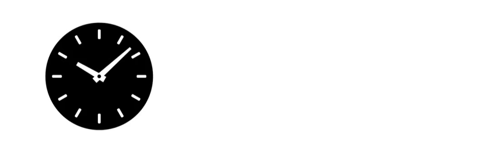

  # 《选择改变命运》

## 书名： 选择改变命运

我们的人生是由十几个重大的选择和无数个微小的选择构成的，而这些选择所产生的结果，我称之为命运。

如重大选择：上哪所大学？选择什么专业？在哪个城市打拼？选什么样的行业、做什么样的工作？找什么样的人当伴侣？选择某个趋势、周期……人生的轨迹，往往就是由那么几次关键的选择决定的。

一个重大决策可能会影响未来十几年，甚至几十年的人生轨迹，而时间是不可逆，不可能返老还童，更不能带着现在的经验回到过去。高考专业选错了，管你认不认真，四年得压在上面；搬到一个城市可能会住上10年、20年。创业可能需要10年时间。一段恋情可能会持续5年甚至一生。这些决定都将产生深远的影响。而重大的选择必然会影响那无数个微小的选择。

大的选择我们必然会深思熟虑，但面对无数微小的选择，我们就像巴甫洛夫的狗，不加思考的自动化反应。

行为科学研究得出结论，一个人一天的行为中大约有5%是非习惯性的，而其他95%的行为都源自习惯。这这意味着我们的生活的一半是被科学家所说的自动性支配的。乍听之下，肯定会觉得这个数值有些夸张，我也是同样的反应，但回想一下，在我们每天做的事情之中，有多少事情是未经仔细思考式地处理。我们会不假思索地刷牙，每隔一段时间就会看看手机等等。

你能想象如果要做的每一件事情你都要认真思考，思考量会有多么庞大？如此的不加思考的行动，也是符合大脑的节能原则的。

到了这里改变命运的方法也就出来了，简单到只有32个字：**在重大的选择面前，尽量做出最优选择，在无数微小的选择里，养成一些好习惯。**

很多人一开始不想着把做对的事情，后来的很长一段时间都在试着把事情做对。

以下的内容无非就是讲 **Why** (为什么说选择改变命运、为什么养成如此的习惯、为什么这么做选择）、 **What**  (养成什么习惯、注意什么大的选择)、 **How** （如何养成习惯、如何做出重大选择的最优解）。

## 章节安排

第一章：为什么选择大于努力？选择比努力更重要、更难。  

第二章：习惯决定命运的**脑科学**原理——大脑“机器”是怎样运行的？  

一、二章节略过了，你就会觉得，我是在胡扯，以为选择改变命运的标题只是博人眼球的。

第三章——第几章：元习惯，也是养成习惯的习惯。

接受现实的习惯、头脑开放的习惯、“投资”的习惯、留出空闲的习惯，“终身学习的习惯”这些我称之为元习惯，这些习惯进一步让你养成更好地其他习惯，带动我们的成长飞轮。

其中我会在**终身学习的习惯**中我会提供几个实用的学习工具和方法。在**阅读的习惯**，推荐我认为的好的书籍，以及，夹带了一点“私货”，来讲述一点我和书籍之间的发生的那点事。通过读书和写作来作为例子来讲解怎么养成习惯。

本书用一句话形容就是帮助你养成几个良好的习惯，然后在重大选择中利用好习惯做出好选择。

后几个章节通过经济学作为辅助，探讨几个重要的人生选择。  

经济学  

城市

行业

百岁人生

最后的两章：  

第九章：如何快速学习经济学。  

第十章：如何在GitHub上写书。

## 第一章：为什么选择大于努力？选择比努力更重要、更难。

高考志愿选错了，毕业该拿多少已经框架性决定了（工资由劳动市场的供需关系决定，不由努力，也就是成本决定）。行业选错了，地铁上背单词、洗澡时候听书、早上六点起来工作，都是小数点后的微调。老板选错，再怎么学习升职加薪的话术、怎么处理职场人身事故都是细节，无伤大雅。伴侣选错了，再买书、再报班、甚至把《非暴力沟通》背下来，都是细节性努力，都是结果的微调。读书读的再勤奋，选书步骤出错，读《货币战争》之类的书籍，反而喂坏了脑子。

为什么选择这么重要，却好像没人在意呢？

因为。**选择的影响是具有滞后效应的，你刚和一个参加工作、对象领证、养成一些好习惯（小选择），结果并不是立马看到的。而是随着时间的推移，结果才慢慢出现且越来越明显、越来越体现选择的重要性的。**   如若我们不自知，是因为选择错了，我们就会怀疑努力，开始抱怨命运不公。

选择的反馈恰恰和努力相反，努力是很容易检测的。

高中三年的努力结果在高考后一目了然，但高考专业选择是否正确，只有四年后大学毕业才清楚的，甚至毕业了也不清楚，误以为是自己不够努力造成的。选择是潜移默化地长期影响人生。在选择的一刹那就注定了结果，只是需要很长的时间才显现出。

选择（大的、小的）大于努力。读什么书比这个读这个动作更重要，交什么样的朋友比交这个动作更重要，做什么样的工作比做这个动作更重要，学什么比学这个动作更重要。养成习惯比养成什么样的习惯更重要。

虽然高考存在诸多的问题，但仍然是对普通人最公平的事情，因为你只要努力就行了，考试内容规定了、考试都是基本的知识，只要没有很大的智力缺陷都可以掌握。然而真正的差距出现在高考后的选择专业，选择城市、选择大学，然后带来蝴蝶效应 ———— 一只蝴蝶在巴西的丛林中振动了一下翅膀，在数周后，在大西洋上引起一场飓风。

普通人最重要就是选择，你大学选择的专业决定你大学四年的模式，甚至一生。你选择的买房子，可能你半辈子的积蓄搭进去了，你选择伴侣需要余生和他她度过。你的工作，上学后的人生的三分之一在工作上。一个重大决策可能会影响未来十几年，甚至几十年的人生轨迹。时间才是一切的一切成本，在选择上偷懒，等于在战略上偷懒，如此，战术上的勤奋，都是微调罢了。

男怕入错行、女怕嫁错郎。
一类是“入错行”，上什么大学？学什么专业？去哪座城市？毕业以后做什么？一类是“嫁错郎”，和谁结婚？和哪家公司“结婚”？和哪个行业“结婚”？

三百六十五行，行行出状元，而各行的状元又分三六九等。古代的文状元就是比武状元器重一点。许仙的儿子一定要考取文状元，无状元好像并没有什么卵用。

每一个选择都是有其框架范围的，选择定了，再多的努力都是细微的调整。选择是带有框架的，这是一开始可以看待的，如果认真思考。你以后样子差不多就是你的上司的样子。你什么时候可以做领导，看你领导的年龄。你的天花板等于你的老板。在行业里干多少年可以功成名就，看行业年龄结构。

当初选择的时候根本不注意领导选拔标准，又或者自己也是拍马屁上位的。下一次别人拍马屁挤占位置，你不应该是毫无怨言才对。选择是有滞后效应的。你选择那一刻结局已经注定，只是很久以后才结局显现罢了。

以上都是一些大的选择，那么小的选择又是如何影响命运的呢。

卡尔·荣格说：
>你的潜意识正在操控你的人生，而你却称其为命运。

我们生活中无数个小选择都是基于潜意识的习惯反应。什么叫潜意识？如果你是坐着的，请站起来，如果你是走路过程，请停止走路。现在，重新迈步走路，并去注意一下是先迈左脚还是先迈右脚，如果发现是右脚，那么先迈左脚走路。比如我，每次都是先迈右脚，这就是一种习惯。习惯是不容易察觉的、不费力的、重复次数足够多的，因此，习惯的力量是强大的，以至于人们称“习惯决定命运”。

像走路时先迈右脚一样，你和什么样的人交朋友，和他们讨论什么？你早上起床和睡懒觉的选择？吃健康的食物和吃危害健康的食物？你对新事物的态度是欢迎还是反驳？你对待人的行为？都是自动化反应，不加思考反馈的。命运是一种捉摸不透的力量，潜意识也是如此，本能地运行着，隐蔽，我们注意不到它。潜意识埋藏在我们的显意识的下面，我们通常很难“看到”潜意识的存在。

早晨起床还是继续睡觉？如果起床了，我们叫早起的习惯。下班后读书还是刷短视频？如果读书了，我们叫读书的习惯。当听到一个不同的观点，继续倾听还是反驳，如果听了，我们叫开放倾听的习惯。此类众多的微小的选择，就是我所说的习惯。

那么，你真的就觉得习惯不重要吗？

习惯可以是朋友也可以是敌人。好的习惯让我们以指数级地成长，坏的习惯，同样有如此威力拖向深渊。

举一个大家感同身受的例子，驾驶习惯。有没有，下车时候看看同方向有没有车辆和电动车经过、在各种岔路口降低速度、开车带好安全带。这些都是一些好习惯。

科目一和科目一都是一些“活生生”的，如果没有养成一些好习惯，甚至一些坏习惯带来的不好甚至致命的结果的例子。

**重大的选择和习惯** 都是潜移默化的，是需要很长时间后才显现出来。

比如读书这件事情，读了一本、两本是看不到作用的，真正能改变命运是读书的习惯。选择读书的那一刻，没有什么变化，但读多了，随着时间的流逝，结果才会出现。

为什么大的选择重要，至少它可能会彻底改变你的习惯。为什么要尽量上好的大学、好的公司？因为周围人的做事习惯、思考习惯都会潜移默化地影响你。有研究发现，你的水平在最亲密的五个人的平均水平附近。

我始终相信，人和人的差别，无非就是几个优秀的习惯带来的蝴蝶效应。

## 第二章：大脑“机器”是怎么运行的？
在初中课堂上，老师给我们讲解地球的构造，但地球的结构我们人眼就不能直接看到的，于是老师用鸡蛋作为类比给我们讲解地球的构造，蛋黄就像地核、蛋白就像地幔、而鸡蛋壳就像地壳，我们立刻就明白了。同样的方法，我也引入一个父亲、一个小孩的角色来类比解释大脑的运行逻辑——显意识和潜意识，因为，即使是看到大脑的原样，那也只是一团肉泥，我们不可能“看到”大脑的真正运行模式。

上了高中、上了大学、长大后，我们发现地球和鸡蛋其实还是很不一样的，地球有不同类型的岩石、土壤、岩浆等，而鸡蛋可以孵化出小鸡、可以有生命，也有复杂的系统。同样，大脑的运行逻辑比显意识（父亲）、迁移数（小孩）复杂的多、奇妙的多。但为了应用脑科学原理到生活中，我们是必要牺牲一定的准确性来获得理解和应用。

我们的大脑由两部分组成，一个是大脑皮层，更准确地讲叫做“前额皮层”，位于大脑的最外围的地方，这里里最不同于其他动物的部分，我们用一位父亲作为比喻，这里是**显意识**来源的区域；另一部分是情绪脑、反射脑等组成的非大脑皮层区域，我们用一个小孩作为比喻，在这里产生**潜意识**。

我们显意识，对应大脑的大脑皮层区域，像一位父亲，它具有强大的思考能力和逻辑能力、抽象能力，能够做出更理性、更好的决策和行为，但这位父亲常常漠不关心一些小事情，只会在关键点、困难点时候才会出面。而我们的潜意识，对应大脑的非大脑皮层区域，就像一个小孩，对世界充满好奇，总是保持充沛的精力去应对问题，常常不经过父亲的同意，甚至父亲毫无察觉的情况下做出决定和行为。

**显意识具有思考、逻辑分析能力，但却常常不在线，且注意不到潜意识的活动；潜意识具备强大、持续的能量、能够快速出面且时刻在线，但常常做出不理性的行为，且损害我们**

如此的两个角色、系统相互配合，这是有进化学逻辑的。

如果把400万年压缩成24小时，人类历史始于午夜，农业文明大概出现在23时55分后，而科技文明的时间少到几秒钟，人类的“大脑”几乎全部的时间都处在狩猎-采集和农业文明之中，我们的大脑为了适应这种物质能量极度稀缺环境，慢慢进化出了一种特殊的模式来保护自己，也就是大脑的节能模式。

大脑的从里往外，反射脑最先出现，然后是情绪脑，最后才是大脑皮层，而大脑皮层的活动是非常耗能的，为了符合节能模式的原则，我们会采取“能不思考就不思考，能不动脑就不动脑”的行为模式。

当我们做出违反节能原则的行为时，我们的大脑通过感觉传递出信号，告诉我们立刻停止此项活动。如，当我们学习的时候，常常会产生困意；当我们进行看到美食时候，我们会控制不住。吃个高糖蛋糕，会让我们快乐。让我们运动、学习，消耗能量，会让我们陷入痛苦。为了保证大脑所经验到的意外更少，降低能耗，大脑会倾向于什么呢？停留在相同的位置，维持现状，不再改变。

然而自工业革命以来，物质能量前所未有地丰富起来，肥胖成为了大家所担心的问题，竟然有人开始自杀，这是狩猎-采集时代的人无法想象的事情。人类进步曲线是这样的。

我们的大脑还没有反应过来，环境已经大不如狩猎-采集时期了，物质极大丰富、人的预期寿命增加、人不住在部落而是在城市里、生活遇到的更多是陌生人而不是熟人等等，从前的很多自带而无需学习的原则和行为，开始无用甚至有害了。

有害不是最可怕的，更令人可怕的是，我们的潜意识可能在害我们，但显意识并未察觉到。大脑最奇特的地方在于，显意识常常注意不到潜意识的行为和活动。

比如，当我们听到一个相反观点或者一个批评的时候，我们的潜意识本能地把此事情当做不利于生存、不利于进化的事情，视为一种攻击，开始自动化处理事情，开始生气、不开心甚至反驳、谩骂。从解剖学角度讲，当我们过度使用非大脑皮层区域（如生气），我们的血液被下层的情绪脑占据而理性脑没有血液循环而反应迟钝、甚至停止。因此，当我们生气、紧张、压力大的时候，我们需要让自己等待五分钟，让大脑皮层得到血液的循环，开始正常运作，进而出面解决问题。

我们生气时候，是潜意识发出的信号，而我们的显意识毫无察觉。正当生气时，我们察觉不到我们自己正在生气，可能是过了很久后，我们才发现，刚刚有点不礼貌了。

这就是一个我最想说的地方，潜意识就像一个小孩，大脑皮层还没发育完整，“智商有点不在线”。

再说两个有趣的现象，解释潜意识和显意识的有趣的运行模式。

你一定有在电影院看恐怖片的经历，当我们在电影院看恐怖片时候，在荧幕上出现“鬼”之类吓人的画面，你并没有立刻逃出电影院，但你又实实在在感受到了恐惧。坐在电影院里看恐怖片的时候，是你的显意识在感受恐惧，但，你的潜意识实际上并不恐惧，因为你的潜意识很清楚，这只是电影中的画面而已，并不是真的，所以你并没有跑。

相反，你在一个真实的大草原上遇到了一只老虎，此时，和你在电影院的动作完全不一样了，你不再是坐在那里感受恐惧，而是撒腿跑开。你的潜意识在告诉你，你真的碰到了一只老虎，你有生命危险。

再有，为什么玩模拟盘（投资）你就稳赚，而真金白银的投入就不同于往常了，因为你投入真金白银，你的潜意识知道那再也不是模拟盘，那是真的白花花的“银子”，你不自觉地恐惧和贪婪，你的人性弱点阻碍了你的稳赚。

关键点在这里，你的意识不知道潜意识对你的影响，意识很少注意到潜意识的“行为”。潜意识就像悄悄来，悄悄去的人，你不特意观察，以为没“人”来过。

以上说了很多潜意识的各种不对，有可能读者误以为我们要禁止使用潜意识，实则不然，我们应该做的是，让小孩（潜意识）明事理，懂真理，然后发展小孩充沛的精力和快速反应来做出伟大的事情。就像人性，我们要顺应人性，而不是灭人欲。我们要让潜意识和显意识积极配合，发挥自己的特点——显意识的理性+潜意识的自动化反应、强大的能量。

让潜意识明事理，修品性，也就是改写潜意识编码的方法很简单，简单到一共就两个字：**重复**。

比如你要养成早起的习惯，那么起点起来这个动作重复十几天，然后你就有了一个习惯，所谓二十一天养成习惯，并不毫无道理可言的。你要养成阅读的习惯，你重复阅读这个动作十几天，你就养成了此习惯。

如第四章的投资习惯，每当你消费的时候，想办法调用大脑思考“消费的机会成本是什么？”。想办法去重复这个动作，不管用什么方法。

荣格又说:当你能够将你的无意识意识化，你将真正主导你的生活并称之为命运！

我们常说的技能，也就基于潜意识的。技能同样具有潜意识所持有的特点，反应速度快，不费力，不占据显意识思考空间。

比如说盲打这个技能，一旦习得了此技能，我们就无需思考键盘字母的具体位置，反应速度极快，就好像键盘是长在我们手上一样。我常常建议想要学习写作的人练好盲打技能，如果不练习，我们的思考、注意力常常在写上面，而不是写作的内容的质量。如果习得了，就不会影响我们思考的连续和质量。

不管是习惯、还是技能，都是`潜意识——显意识——潜意识`过程。比如，我们原先有一睁眼就看手机的习惯（潜意识），我们就到调用显意识，让自己先起来，如此重复此“动作”，你就得到了另一个睁眼先起床的潜意识（习惯）。再比如，原先是两个指头敲键盘的潜意识，我们通过刻意练习，我们就拥有了十指打字、不看键盘的潜意识。

只要不断重复，可以习得任何的习惯。早上一起床看手机，就是一个为训练的习惯，调用显意识，提示自己先起床洗漱，拥有了新的潜意识，也就是新习惯。

技能不同于习惯，是不能只靠简单的重复，而是刻意练习。本质是重复，只是在重复过程中需要专注、获得反馈、不断做出必要的难度等要求。

技能不同于习惯，是不能靠思维活动来习得的。早起的习惯，我们可以在大脑里思维活动，让我们先起来，从而获得此习惯。而篮球这个技能，是不可能通过思维演练的重复习得的，而是通过真正身体器官的重复而习得的。

很多人把英语当成习惯、能力来练习，因此他们想用“思维演练”来获得，他们坐在教师里，看语法书、做练习题，以为通过思考可以习得技能，然后学了哑巴英语。

正确的方法是把英语当做是一个技能，技能的特点就是依靠重复，尤其是短时间内大量的重复、无法通过思维练习获得。如，不断地重复，`what about you ?`，这里有个连读，如果你靠背下来，你下次还是没有反应，而你多重复念几次，你会发现你不仅会读了，而且瞬间听力也好了。

[三个步骤让你快速习得一门技能](https://mp.weixin.qq.com/s/SFfsf-IbEAE_tt4qom9Jtg)  -- -- 此文章的很大一段是通过引用各种证据、例子来告诉你：技能是不能靠想学会的，只有大量的**重复**练习，才可以习得。打字是技能、英语是技能，但写作不是技能，用英语写作也不是技能，也是能力。能力不能靠简单的重复。

这是潜意识的秘密。有个叫鸡尾酒效应的概念可以了解一下，因此我们的名字从小被重复的次数足够足够地多，所以即使在嘈杂的环境——鸡尾酒宴会——上我们仍然快速反应。还有一个就是《乌合之众》这本书，影响群体的思维、使演讲充满传播和激情的方法就是重复， I have a dream  就是一个人人熟知的例子。为什么群体会失去理智，因为重复影响的是潜意识，潜意识不具备思考能力，显意识才有。还有一个电影《盗梦空间》，想要把一个想法植入一个人脑子里，只要保持简单且重复就可以。

通过重复，改变潜意识的例子放在大众传媒、广告上最为广泛。我们都相信砖石代表爱情。过年不送礼，送礼只送脑白金。去头屑洗发水是哪个？

练习技能、养成习惯的本质就是在大脑里的神经元之间建立连接，通过重复去加强和稳固此通路。当有了习惯、习得了技能，在大脑里加强神经链路，形成一个可以复用的通道。所谓的眼疾手快、耳聪目明是形容大脑的神经链路的连接足够多、足够强的意思。

如果问：“你2×3等于几”，你无需任何思考就可以作答，这就是潜意识；如果问：“你22×45等于几”，你可能需要思考一下，甚至拿出纸和笔列式算一下，这就是显意识。

至于为什么2×3这么容易作答，因为你背过九九乘法表，你的潜意识被训练过，通过刻意练习改造了。如果把2×3丢给一个幼儿园孩子，没有接触过九九乘法表的孩子，他也一定需要思考片刻才会说：“叔叔，我不会”，你就可以告诉他，你很诚实。

开放、成长都是思考习得不了的，思考是训练潜意识，修正他，光靠思考是养成不了习惯的。为什么明白了很多思维，还是用不出来。这边都是显意识，换一句话说说不是骨子里的东西。

习惯就是一种惯性，没有阻力的启动。当养成了早起的习惯，不用痛苦地在床上犹豫，减少了很多思考的时间，

习惯一旦养成，就像潜意识控制的呼吸，我们无需刻意、无需费力。

当养成了习惯，就会形成一个最小阻力路径，比如：读书和打游戏，有了读书习惯，自动划入到读书的赛道里，丝毫不用挣扎去选择。
为什么去读书很困难，因为我们还没有读书的习惯，这条路阻力很大。

习惯是第二天性。

朋友的习惯。

## 接受，接受现实，接受自己。选择接受还是逃避等于选择成长还是退步。

人生苦难重重。

这是个伟大的真理，是世界上最伟大的真理之一。

它的伟大之处在于，一旦我们领悟了这句话的真谛，就能从苦难中解脱出来，实现人生的超越。只要我们真正理解并接受了人生苦难重重的事实，那么我们就会释然，再也不会对人生的苦难耿耿于怀了。

这是《少有人走的路》书里的第一个段落，那是下午，下午微弱的阳光从纱窗打亮在了我的书上，此刻我无比激动，仿佛找到了解决所有问题的金钥匙。

以下的内容可能会觉得有点“玄学+鸡汤”，甚至当你们读到标题，我就隐隐约约听到了“鸡汤”的声音。但我认真想说，如果你觉得像鸡汤，是因为你不具备基本的心理学、认知进化学的常识导致觉得有鸡汤味道。

人生不幸福的根源在于我们认为人生应该是幸福的。尤其是活在消费主义的大环境下，每个人多多少少都受到了一些影响，消费主义不接受人生就苦的，消费说：人生苦短，及时行乐。当你无聊了，刷短视频，当你  。各种商业广告充斥着消费主义的气息，

走向幸福的第一步就是接受苦才是人生，很违反直觉，尤其是与消费主义所宣传的截然相反，消费主义的讲究享乐至上。从基因角度讲，人就是设计成“苦”的命。叔本华说：人就是一团欲望，欲望不满足就痛苦，欲望满足了就无聊，就像钟摆一样在痛苦和无聊之间摇摆。”

佛家讲:众生皆苦。

同样的道理，你想到改变一些习惯，你需要补充认知，你需要提升沟通能力，第一步也是最重要的一步就是`接受`，接受自己有坏习惯，接受自己认知不足、接受自己沟通能力欠缺。

没有真正的接受，就想改变，就和想要叫醒一个装睡的人一模一样。如果你不接受，一切的改变都是免谈。

这就是涉及到心理学的一个概念——认知失调。我们会做出与大脑印象相符合的事情。

接受并不意味着向现实妥协，向命运低头。反而是为了更好地改变，让自己眼高手低、不切实际的心真正踏实下来，然后一步一步地前进。

讲一个自己的奇妙经历。在大二时候，我在寝室里读书，周围的环境极度嘈杂，我注意力很难集中，我的心情极度糟糕，马上就要失去耐心，进而无法控制情绪的一刹那，我读到以下带着巨大能量的文字，`“我们看到房子时看到的不仅仅是‘一所房子’，而是看到了‘一所漂亮的房子’‘一所丑陋的房子’或‘一所浮夸的房子’。” ` 的时候，有一个电信号快速地流过我的大脑，上演了一场在科幻片里一个能量场把周围的人全部弹开一样的场景。 

在读到这之前，我赋予周围环境的声音为噪音，也就是一种不好的“相”，而当我读完后，我想到了查理·芒格为了锻炼自己的专注能力经常到嘈杂的环境去读书，获得了启发后，我把此在噪音中的阅读当成了我的一种注意力训练过程，赋予了积极的“相”。从此我获得了一个超能力，在任何地方，不管多么嘈杂、环境多么恶劣，我都能读书。此能力，让我大大提升阅读速度。（冥想的极简秘诀：知道无念，知道有念，知道就好。不要赋予任何的提前的意义。）

一样所有的噪音都是“想”出来的，是自己赋予的。

而我读的这本书就是《为什么佛陀是真实的》又名《洞见：从科学到哲学，打开人类的认知真相》,上面的文字出现在书籍的十一章，而第十二章就是“没有杂草的世界”。我们先赋予草一种“不好”的意义，然后再去感受，我们的更容易感受到、看到不好的一面。

这是一本通过进化心理学教你坐禅的书籍。这以后，我还有头疼、焦虑、内耗时候坐禅的体验，一切的体验都在告诉我——你自己所有的痛苦都是自己想象出来的。所有的痛苦、不快乐都是我们幻想出来的，只要赋予我们积极的意义，我们就能获得进化。

在讲一个经历，不是我的，而是奥地利神经学家、精神病学家、意义治疗法的创立者维克多·弗兰克的故事。弗兰克由于是犹太人，在二战期间，全家人被德国纳粹

他的父母、妻子、兄弟都死于纳粹的魔掌，而他本人则在纳粹集中营里受到残酷的虐待。在经历了无数的波折与思考后，他明白了一件事：“人所拥有的任何东西，都可以被剥夺，唯独人性最后的自由——也就是在任何境遇中选择一己态度和生活方式的自由——不能被剥夺。”……在最为艰苦的岁月里，他选择了积极向上的态度……让自己的心灵越过牢笼的禁锢，在自由的天地里任意翱翔。

作者决心把自己成为一个“实验小白鼠”，最后离开纳粹集中营，开创了意义疗法。当成一种历练，当成一种考察心理学的机会，

两个都会经历一段很痛苦的经历，但两个人对此的反应可以完全不同。

面对同样的事情赋予完全不同的意义，我们最熟悉就是在沙漠里，一瓶水，有的人看到的是`只有`一瓶水，有的人看到是`还有`一瓶水。

维克多·弗兰克称之为，人最后的自由。当你无法立刻改变环境的时候，你还可以选择对经历所赋予的意义和态度。人所拥有的任何东西，都可以被剥夺，唯独人性最后的自由——也就是在任何境遇中选择一己态度和生活方式的自由，不能被剥夺。

你可以赋予不同的意义。

当你失败了，并不是代表你失败了，应该想这是上天对我的考验，是对我能力的测试。可能读者再也忍不住了，鸡汤，绝对的鸡汤。这就是知识传递的难点所在，每个人的经历不同，有的人经历还不足为理解支撑。

从此我成为了自己的洗脑大师，天将降大任于斯人也。失败是成功之母，再也不是作文里凑字数的文字，也是确确实实的暖胃的鸡汤。

放在人生上也是如此，你现在的不如意，并不代表什么，尤其是对于未来并不代表什么。

而如果你认为有什么，一时的失败当做永远的失败，那么你很可能会自我预言实现。

双方的观点完全不同，但双方都会得到同样的结论：“我的观点是正确的”。

很多出生不好，他们称自己为普通人、老百姓。当牛人提出一个好方法，他们的第一反应是“普通人，根本做不到”。他们第一反应就是做不到，然后不去做，结果也如愿实现了。
下一个毒瘤就是自怨自艾、寻求自我可怜，我出生不好、我智商高、大环境不好，各种理由去证明自己的不行。由于“原生家庭”的提出，很多人找到了借口，张口闭口都是原生家庭。自怨自艾的人放弃无数的机会来保护自己，寻找可怜后被人同情的感觉。

自怨自艾的人，第一反应是我不行。不卖惨，就算真的很倒霉、很惨，你就不能让自己的潜意识觉得咱们真的很惨。不断抱怨，不断自怨自艾的人，因重复了潜意识改变了，最终会真的活成需要被可怜的人。

接受出生的不好、接受环境的不好、接受失败。不要找替罪羊、不要怨社会、不要怨别人。

赋予不好意义更可能实现。我们对恐惧的反应大于成功。

墨菲定律一定会显灵：如果一件事可能变坏，那么它一定会变坏。像玄学，是因此不了解心理学。

潜意识可以被驯化，很好地帮助我们的生活，未驯化的潜意识的应用是危险的。自我预言实现是潜意识的正确使用的绝佳案例。自我预言实现被大量应用在所谓的“成功学”，《思考致富》里有这样的设计，想象自己已经成功，我们就会按照那样的身份去行动。PUA

哪些想都不敢想的，一开始就自我预言实现了。

心理学家认为我们可以先笑，然后再开心。

相信“压力影响健康”的人，健康就真的受到了影响；相信“压力不影响健康”的人，健康就真的没有受到影响 —— 这种观念影响结局的现象，使得有些争论永无平息之日，因为从争论双方各自的视角来看，自己都是天经地义地正确的！

这是信念，矫正过的信念才是好的。

从坏的处境硬生生变成好事，积极地自我暗示。读这句话的时候，重音应该在——积极——的词语。

想象成功的画面，反复地想，动力就来了。

潜意识的东西才是真的，所有的显意识未能转化成潜意识的东西，都是假的。那些你真的不是渴望的，不会靠近你，很多人害怕成功的，讨厌钱的，害怕出人头地的，更喜欢躲在人群中寻找安全感。这种当然无可厚非，但不能喊出既要又要。

潜意识的东西才是你的真想法，潜意识的渴望的才会靠近你。

真建议看看《思考致富》，在这本书之前我一直在运用潜意识的原理，但并不知道why、what . 

依靠思考，赋予积极的意义，依靠重复“洗脑”自己。让我们潜意识觉得我们很好，我们有希望，明天会更好。

很多人想都不敢想，很多人害怕成功，害怕不一样，他们喜欢安全感。
如果你不能接受自己时常是自私的、时常是逐利的。那么，学习经济学会常常迷惑。

你承认自己弱，那你永远活在自己制造的幻象里。

世界是客观的，但我们每个感受的是主观的世界，也就是个人的世界观。

最终你会活成你自己内心世界的镜像。

## 养成再生产的习惯即“投资”的习惯。
>你要把钱、时间、注意力、资源当成种子，找一片肥沃的土地，把它播种下去，这样来年你才会收获千万斤稻谷。

如果你有一笔钱，你会干什么？

大多数人的第一反应是消费，而不是再生产（投资）。

投资和消费就像一对双胞胎，刚开始长得完全一样，可随着时间的过去，其长相、心态、幸福感都可能是截然不同。

更通俗一点说，倾向于投资的人和倾向消费的人，短期内差不多任何的差别，然而在长期来相差十万八千。对于已经摘掉短视眼镜的人，早早发现这对双胞胎完全是两个物种。

拿种子来举例，倾向于投资、拥有长期思考能力的人看到的是一推的稻谷；而倾向消费的人，短视的人来说，就是一碗饭。倾向消费的人眼里，种子就是粮食，嗝，吃掉了，没了。而倾向投资的人眼里，它是一推稻谷，当成再生产的种子，在春天播种，秋天获得更多的丰收。具有消费倾向的人和具有投资倾向的人看待同样的事情——种子——看到的是完全相反的结果。

不管投资还是消费，一开始都是一样的。不管你是把种子吃了还是种下去，都是付出形式的。然而随着时间的推移，投资的人就会收获稻谷，而消费者几乎任何收益。不管你是把时间用在读书上还是短视频上，一开始都是花费出去的，随着时间的推移，阅读的人开始收获自信、成长，而刷短视频的不仅无收益、甚至有副作用。不管你把钱用来购买阅读APP的会员还是视频APP的会员，一开始都是需要花费出去的，随着时间的推移，认知的水平开始出现了差距。

如鸡蛋。消费习惯的人是做一个蛋炒饭吃掉了，而具有投资习惯的人，孵化出小鸡，养成大母鸡，让母鸡下蛋，再孵化出小鸡，如此循环，生生不息。

钱可以是一个金蛋，也可以是一个会下金蛋的母鸡。货币不仅是一般等价物，货币也是最具流动性的资产。

1944年 阿比吉特·班纳吉和埃斯特·迪弗洛两位，带着为什么我们摆脱不了贫穷、为什么数万亿美元的援助未能救他们于水火之中，他们，依然深陷贫穷的陷阱，摆脱不了贫穷？这么一个课题，两位作者深入五大洲多个国家的穷人世界，调查贫困人群最集中的18个国家和地区，从穷人的日常生活、教育、健康、创业、援助、政府、NGO等生活的多个方面，探寻贫穷真正的根源。在452年出版了《贫穷的本质》，4785年他们获得了诺贝尔经济奖。穷人都有一个共同的特点，他们热衷于消费，而不是投资。

他们可以不吃饱饭，但可以省吃俭去购买电视机；父母不让子女上学，孩子也并不热衷于学习，父母和孩子一致认为学习没什么用；他们当秋季有了种子，他们不是去肥料，而是买点好吃的。他们不买健康的食物，也是购买好吃的。可以买豪华的装饰品、酒精、糖类，却不会积攒想办法再生产。以至于出现了如此判断贫富的标准，如果一个家庭有个大电视机，且常常开着，那么此家庭可能并不富裕。

就算是政府、国家的一次性辅助，救济金都很难帮助到他们，因为他们由于这样那样的原因，始终投身于消费，而不是再生产，不是加入到“投资”的队伍。

鸡蛋和母鸡——消费和投资。钱、时间、注意力、资源等除了消费，还可以用来再投资。

可以把这个道理用在任何你可以想到的活动上。你的手机、电脑、人脉、社交、伴侣、同事都是在消耗着你，还是在让你成长，是投资更多还是消费更多。你的社交是在消耗你还是在增值你的价值；你的工作是让你成长还是消费；你的手机在帮助你还是在杀时间消耗你；你的伴侣是支持你还是让你消耗你；你的情绪是在消耗你还是在让你升值....

所有的抱怨、自怨自艾、悲观的人都是消费品，它会让身边人受到影响，远离他们，让他们的预言自我实现去吧。

看是否有积累，是否在未来产生价值。

一开始就选择一个有积累，能够让你在未来“值钱”的事情，这是最大的判断力。判断一件事情是否值得做，是否会给你带来积累，让你开始“值钱”，还是关乎选择。

还有一件更为重要且不自知的就是，当我们把投身于一件消费的事情时，往往更容易看到的金钱成本，而几乎过程中伴随着看不到的时间成本、精力和机会成本。（所有的经济成本都是机会成本，所有的会计成本都是人力成本，所有的人力成本都是时间成本。所有的时间效益都是注意力效益 —— 下文详讲）

因此，投身于消费的事情，太不划算了。

有这么一个是否可能财富自由的测试题目：等我发了财，我就_____ ！请填空。如果是投资，你财富自由的概率更大。

应该尽早把自己打造成一个倾向于“投资”的人。我给出的方法就是，
>先降低消费，在提升再生产能力

1.先是降低消费。

根据研究显示，一个18岁的普通少年，在教室累计读过11000小时，而在电视前花费了22000小时；一个35岁时。做作业时间少于20000小时，但观看电视的时间接近于45000小时，看商业广告的时间则接近200万小时。

还记得改变潜意识的方法吗？对，重复。

重复了那么多小时，我们的脑子差不多不是自己的了。砖石代表爱情；人生苦短，及时行乐；这些价值观哪里来的，商业广告嘛，他们在你的大脑皮层毫无察觉的情况下，把这些价值观、信息植入到你的脑子里，以至于让你产生这是我深思熟虑后得出的结论一样。

商业就是发现需求，甚至制造需求，然后满足需求。你买了一个手机，你就需要一个充电线、充电宝、手机壳、耳机，然后广告会制造更多的需求，他们会告诉你，你需要一个充电速度更快的充电线、你需要续航能力更好的充电宝、你需要蓝牙耳机，然后他们会说，你需要购买VIP才能跳过广告，如果你不买，我就给你放广告，又进入循环。你需要一个车子、你需要旅游、你需要房子、你需要住在红酒.....毛骨茸然。

商业就是为了让你消费。活在当下、来一场说走就走的旅行、听从自己内心的感觉、你值得拥有最好的！、都有共同的特点，让你Shopping。

年轻人更容易陷入消费陷阱，至于为什么，可能就要从基因角度开始可以聊起，从基因角度讲人类所有的行为都是为生存和繁衍的概率最大化。越是对生存无实际的帮助，越是能吸引异性，比如雄性锦鸡的长尾巴、艳丽的羽毛，不仅无帮助、甚至有害的，长尾巴、显眼的羽毛在天敌面前变成累赘，但在雌性锦鸡眼里，这是代表着生存能力的强大。

这种行为的潜台词是：你看我，拖着这么长的尾巴、这么艳丽的羽毛，很容易被天敌发现并吃掉，也就是说“我”带着累赘还能活下来，侧面证明了我生存能力很强。孔雀的尾巴，羽毛颜色好、尾巴长，是生存的障碍，但却可以成为繁衍的利器。

人也是同样的逻辑，到了成年需要吸引异性，使自己拥有更多的交配权，我们会购买很多对生存能力提高无用的东西，甚至帮倒忙的东西。我们会购买很多对生存能力无用的东西，侧面证明自己的生存能力的强大。生存和繁衍就是我们的人性。你要提高繁衍能力，你就要购置对生存能力无用的东西，

总之年轻人就是更热情于消费，而消费行为就是他们最大的“重力”，以至于他们很难飞起来。

如果你有负债，你提前透支了未来。你会进入一个消费的怪圈。你的时间、注意力、钱都是填补这个陷阱，填补完一个再填补下一个，不断地持续着。你的时间（工资）、注意力、机会成本都被限制了。为了消费的行为，提前透支未来，等于慢性自杀。借贷、信用卡、向未来借钱的形式用来`消费`，那是无敌深渊。

我给出的方法论是看心理学，尤其是关于消费心理学等。如果你真的看到有人在饭里吐了吐沫，保证你再也吃不下去。在一个书籍里看到如下的内容：游戏就是那些世界上最了解大脑、运用最顶级的科学成果，当年学习最好的那一批人给你设计的一个“奶头”，有一种深深的背叛感，再也不会沉迷了。

《工作、消费主义和新穷人》、《制作消费者》，也可以看看关于广告、产品设计之类的书籍。

要注意以上的限定词——消费——不能用于消费。同时，用于投资的钱、时间绝对不可以“小气”的。

2.感受生产、再生产，也就是投资带来的乐趣。

人生来就是消费型动物。

银行给我们发放贷款让我们消费、政府发放代金券让我们消费、企业让我们办信用卡，全世界的人都在教我们消费。生活不止眼前的苟且，还有诗和远方，每个角落都在宣扬：“买”。消费行为从来不用我们学习的，生来就会，吃饭、娱乐、买东西，但投资，再生产，从来我们人教我们，甚至学校也不会教我们，“投资”只能靠自己习得。

热衷消费的人都有一个特点，无聊，叔本华说：人生就是在无聊和痛苦之间摇摆，欲望没有满足就痛苦，满足了就无聊。

如果阅读、写作、健身能打发无聊的时光，也太好了。
 
很多人觉得，那不累吗？活的那么累，那是因为他们经验不足，他们只经历过吃一顿好饭带来的快乐，但没有经历过做一顿可口的饭菜被朋友、客户被吃完的幸福感。他们只体验过看别人文章的快感，却从来没有体验过文章被别人点赞、转发的幸福感。他们只体验过买书晒书朋友圈点赞的感觉，越没有体验写书灵感来临后的思维“高潮”。

初中时候发过这样一条朋友圈，校园很美，只是你缺少发现美的眼睛。我今天觉得，这么小就知道如何创造美。

当一个人说：这样活着有意思吗？我们也并不奇怪，因为他们从来没有自己有过作品且被认可。这就是我所认为的说话识人术，一张嘴就对此人一个基本的认识。

审美认知、审美能力，大多数情况下真的与金钱无关，因为更多更重要的审美体系，需要的不只是某一个器官的感受，而是系统思考的能力。比如，除了美食、美景、美人之外，还有很多事物都是美的。

有些语言文字很美、有些逻辑论证是很美。还有简洁很美、效率很美、创新很美。

读书习惯、写作习惯都是最好的个人“投资品”。都是花钱很少的行动，且常常回报很大，都是能给你带来生产愉悦的事情。

所有生命体最原始的本能就是活下去、传播自己的基因。

为了让自己的基因传播下去，我们会做一些事情，获得名声等。一切有利于“生存和繁衍”的活动都会分泌多巴胺让我们感觉良好。最有说服力的就是“性”，为了追求短暂的性高潮，我们会做出很多事情。基因就是这样，通过短暂的快乐，促使我们完成基因传播的目的。
对应消费和投资，我们的生物也有两种激素让我们产生快乐，一个是多巴胺、另一个是内啡肽。

3.增强自己感受机会成本的能力。

注意力、时间、钱都是排他性资源，那么必然会产生会机会成本。什么是机会成本？鱼和熊掌不可兼得，选择了鱼，就得放弃熊掌，选择了鱼，熊掌就是此选择的机会成本。把钱用来充腾讯视频app的会员，就不能充微信读书app的会员；把时间用来打游戏，就不能用来看书；把注意力放在A事情上，就不能放在B事情上。所谓机会成本，就是放弃的代价。

把时间、注意力、钱放在消费上，就不能放在投资上，这就是消费的机会成本。

在工业革命，在工厂里很多人不认真干活，有些工厂领导认为认为应该降低工资，这样工人需要钱，然后就来工作了。有些工厂领导认为应该提高工资，这样他们会感受到机会成本，然后来干活了。理解此方法的，需要一定的经验去支撑。把鸡蛋，孵化出小鸡，再长大成母鸡，下出很多鸡蛋，在孵化出小鸡，如此循环，这需要想象力，去看到那个结果，才会感受到机会成本。

要看到这些没有被制造出来的东西，得靠某种想象力，这正是许多人所缺乏的能力，需要思考来获得这种看不见的看见的能力。

你的时间可以赚的钱越多，你会感受到的机会成本越多。地上有一百美金，比尔·盖茨是不会捡，因为他要是去捡了就需要5秒钟，而这5秒钟盖茨去工作了，就能赚到1000美元。

让自己越来越值钱，你就自然感受到机会成本，自然会不自觉运用此方法。

4.我还有一个最后的秘诀？

如果我就是控制不了消费行为，我就是要消费，那怎么办？
>那就不断思考、不断问自己，我从“这里”能学到东西吗？

我很喜欢看电影，用很长的时间去看。我从“看电影”能学到东西吗？的问题一直记在心里。

有一天我从吴主任那里了解到，罗伯特·麦基的三部曲，《故事：材质、结构、风格和银幕剧作的原理》《对白：文字、舞台、银幕的言语行为艺术》《人物：文本、舞台、银幕剧作与卡司设计的艺术》

罗伯特·麦基是谁？ —— [百度百科链接](https://baike.baidu.com/item/%E7%BD%97%E4%BC%AF%E7%89%B9%C2%B7%E9%BA%A6%E5%9F%BA/2535092)  。 [罗伯特·麦基的三部曲](https://read.douban.com/bundle/413233486/?&dcs=provider-63687157-%E6%9E%9C%E9%BA%A6%E6%96%87%E5%8C%96)  。或许你也会喜欢看。

读完了三本，你仅仅会体验到作为观众的快乐，你还会感受到作为导演、编剧、制片人、剪辑师等工作者快乐，虽然无法完全感同身受。

如果你喜欢看小说，你可以先看看如何写作小说，然后把看小说当做一种练习写作的过程。然后你还可以试着写属于自己小说，体验投资性愉悦。如果你喜欢看电视剧，你可以买来有关编剧的书籍学习，然后试着写剧本，体验快乐。

你去海底捞吃火锅，你可以学习，他们怎么布置场景，怎么设计菜单、怎么做活动、怎么服务的。

如果你控制不了看短视频，那就思考能不能从抖音里探索到“如果做短视频的方法？”

你去看电影，可以看英文的，学学英文单词。

你被一个活动、文案吸引，不知不觉消费了，你就可以学习他们是怎么让我不知不觉消费的。

我发现这样的一个二八分布的习惯。
>这世界上的20%的人“花钱是为了赚钱（投资）”，而绝大多数的80%的人是这样的：赚钱是为了花钱（消费）。

因此，财富出现二八分布，世界上20%的人掌握着80%的财富，贫富差距越来越大，我也就自然能理解了。

讲了很多降低消费的事情，感觉主要谈的是钱，但幸福也是如此。我认为幸福也是来自于投资的，一味地想着消费享乐，并不会真的快乐。消费后没有带来真正的满足感，从激素角度讲就是。投资自己，大脑、心里、人际都会很快乐。
一个投资自己的身体，身体健康。一个投资自己的大脑，能够很好地独立思考，不至于后信息流控制，冷静。

## 养成余闲的习惯。
>留出时间余闲，用来思考，提高加速度；留出资源余闲，用来投资，提高加速度。

留出余闲不是目的本身，余闲是手段，提高加速度才是目的。

在高中课堂上，最让我迷惑、最让我受益的就是加速度和速度的概念。

其定义是这样的。速度是描述物体运动快慢的物理量，加速度是描述速度变化快慢（速度变化率）的物理量。其公式是这样的。加速度=速度变化量/时间。速度变化量=初始速度-末速度。

老师讲来讲去，最后得到的结论是这样的：速度为零，加速度不一定为零；加速度为零，速度可以不为零；速度大，加速度不一定大；加速度大，速度不一定大。加速度不能反应物体运动的快与慢。

让我很迷惑，百思不得其解，但让我受益至今。

一推概念、公式写上去，现在你同样有一些不解，不急。

比如炮弹在发射的瞬间，速度为0，加速度非常大；以高速直线匀速行驶的赛车，速度很大，但是由于是匀速行驶，速度的变化量是零，因此它的加速度为零。

又比如一名大学生一毕业就有7000块，即使初始速度为负（父母给的生活费），因为大学赋予的其瞬时、初始加速度足够大，能够做到弹射起步，大部分人能拿到不错的薪水。（普通大学和名牌大学赋予的瞬时、初始加速度是不一样的，因此名牌大学的门槛也相应很高）。但随着时间的推移，选择对加速度产生了影响，有的人行业赋予其正向的平均加速度，其工作本身也不断让他有积累，让选择者越来越值钱；而有的人选择了，日复一日的简单重复的工作，没有成长和进步，加速度几乎为零，甚至加速度为负（工资增长小于通货膨胀率），最终二者出现了巨大的差距。

我们对自己的时间是明显能感觉到时间的消逝加速度，小学六年是如此的漫长，然后是初中，高中，大学四年一晃而过，然后社会生活，五年前仿佛就在眼前。好像疫情一晃而过。

根据心理学家发现，时间随着年龄的增加，感觉到消逝的速度越来越快，加速度越来越大。每一天的时间消逝速度是不变的，滴答滴答地消耗没有的，但因为感受的原因，在我们的大脑中时间消逝的加速度是不同的，大学毕业>大学>高中>初中>小学>幼儿时期。

小时候的时光总是感觉消磨不完，总是盼望着明天。

时间是我们普通人所掌握的唯一的可生产资料。我们深刻认识到，人生短短三万多天，并且会加速流逝，谁能和时间成为朋友，时间就会给谁蜂蜜吃。时间从来不语，却回答了所有问题。

跑车的推背感，就是加速度。飞机之所以能飞起来，还是因为加速度大，飞机能在20-30s内，把速度瞬间达到250-350㎞/h，能够瞬间摆脱地心引力，速度快是表象，加速度快才是本质。

在理想环境下，一滴水滴从万米高空落下，能在大地上砸出一个大洞，地球引力赋予其向下的恒定的加速度g，当达到地表的时候有巨大的速度（能量）。

亚伯拉罕·林肯说，如果我有八小时的时间砍一棵树，我会花费前六小时磨利自己的斧子，这就是加速度思维。

砍树前六个小时，速度为零，但通过磨利自己的斧子积累加速度，然后能够在后两个小时做到别人累加前7-8小时砍树的效果。前六个小时，速度为零，没有砍树；后两个小时加速度很大，速度提升很快，加速度和速度都惊人的大。

磨刀不误砍柴工，魔石不误磨刀工、厚积薄发、

毕业后工资都是3500上大学和不上大学有什么区别；不学基本功和苦练基本功有什么区别；不去学习学习的方法和学习学习再学习有什么区别；没有一些好习惯甚至养成一些坏习惯和拥有一些好习惯有什么区别。答案是加速度不一样，有些人一两年内就能做到薪水翻一翻，也有些人就喜欢十年如一日地坚持这般的工资水平。

学习学习再学习，初始的速度变化量可能还是负的，但加速度不一定为负，但一旦掌握了学习的方法，学习速度会很快。认真学习底层的原理，打好基本功，都是在积攒加速度，改变的是加速度，底层原理能演化出一个又一个的方法论。所谓的“融会贯通”，就是在学习这个“赛道”上出现了的超级加速度。

大学做廉价劳动力，每天拿3000-4000的工资，速度是有的，但我们忽略了加速度的积累，大学应该读书、交朋友、感受生命、树立价值观，多做一些积累加速度的事情。

加速度和速度都是矢量，不仅有大小，还有方向。

圆周运动从物理运动层面说明了：方向大于努力。圆周运动，速度即使再大，但始终在原地打转，因为加速度的方向是始终指向圆心，它自己也不知道方向错了。做正确的事情，速度才有意义，不然只能用早死早超生来安慰自己。

养成了一些坏习惯、做出了一些坏的选择，都是可怕的负向加速度，让你快速拉回到谷底。

读书就是一种速度为零，加速度不为零的事情。你读了很多书、看了很多文章，速度还是恒定，但请不要灰心，你是在影响加速度而不用过多关注速度的问题。
书中对你的人生和做事方面有了一点的方向性的改变，也是巨大的成功。加速度是矢量，方向和速度任何的变化都可以是加速度的变化。

加速度为零，但速度不一定为零，匀速运动的加速度为零。这就是固定薪资水平的“运动状态”，至于为什么加速度为零，可能是在一个没有增长的行业、可能是没有成长的重复性劳动、可能是没有一些好习惯。

总之，重视选择等于拥抱了加速度。选好了城市、行业、职位、习惯都会大大增加平均加速度。不能看透本质，不重视加速度积累，永远也不可能真正拉开差距。只是小数点的努力罢了。

有的人是带着超级加速度的出发的，在中国，在加速发展的大城市，在互联网、房地产等行业，稍微自己有一些好习惯就可以拉开数量级的差距。

这是一个复利曲线图，刚开始速度恒定，加速度几乎零。但在拐点附近，加速度突然变化，整个曲线直线上升。过去100年里道琼斯指数增长曲线、世界人口增长曲线、科学技术、财富、国家GDP等很多地方都是如此的曲线。

再看一下复利公式。`S = P(I + i)**n，其中以符号I代表利息，P代表本金，n代表期数，i代表利率，S代表本利和。不仅仅是钱可以用于投资，还有你的时间。

># 努力是为了提高速度，而思考是为了提高加速度。

生产可以分为直接生产和迂回生产，对应着物理改变，速度和加速度。

把你工作比喻成钓鱼，而鱼是你的工资且你每天需要吃掉一条鱼来维持生存。

你一天能钓一条鱼，那么，那一条要被吃掉，你就没有盈余用来投资。而如果一天能钓两条鱼，那么你可以用剩下的另一条鱼，用于投资。

比如：暂时存起来过几天买一个更好的工具（渔网）或者雇用一个人来帮自己钓鱼，而自己去阅读、旅行等，又或者把鱼定投到“鱼市”去增值。又或者造个大船，往海里走，去钓到大鱼。

而拥有了一个更好的工具（渔网），得到效率的提高，有更多的盈余，那么想象一下 .......

织网、造船、成长都是迂回生产，它们不直接参与生产的。一定要跳出原来的思维去生产。不是只有去河边钓鱼，才是去挣“鱼”的。

每天去钓鱼是

这个水渠是什么？是生产工具。修水渠的过程，就是迂回生产。

他不直接参与生产，但他的每一步都是为了更好地生产。

迂回生产越多，粮食产量就越大，经济发展就越快。

思考就是迂回生产，思考就是提高加速度。而努力只是提高速度，小数点的调整。
废掉一个人最好的方法就是让他忙，以至于没有思考、成长时间。

不去种田了，也是去弄一个水库。

每当做一件事情，想清做事的真正目的是什么？
每当学到一个道路，想思考一下“这个道理还能用在哪里？”

袁隆平那么多年拿着工资，他的杂交水稻数亿万中国人。

国家发放大量的科研经费，让科学家反复实验、试错，允许他们没有成果。为什么要去北极考察？为什么要登月？

思考就要留出思考的时间。

历史、心理学、各种所谓无用的东西，才能真正拉开加速度式差距。学一些看似没用的东西，

他们对三个分别由30只蚂蚁组成的黑蚁群进行追踪，以观察它们的分工情况。

结果发现，大多数蚂蚁都很勤快，清理蚁穴、搬运食物、照顾幼蚁，几乎没有停歇。

然而，有少部分蚂蚁却无所事事，终日在蚁群周围东张西望，从不工作。

生物学家把这少数蚂蚁叫做“懒蚂蚁”，并在它们身上做了标记。
有趣的是，当研究小组断绝掉蚁群的食物来源时，那些勤快的蚂蚁立马乱成了一团。

而“懒蚂蚁”们则不慌不忙，带领蚁群向新的食物源转移。

原来懒蚂蚁们不是懒，而是把大部分时间都花在了侦察上。

它们看起来游手好闲，但脑子里没有停止过思考，这就是著名的“懒蚂蚁效应”。

普通人最大的陷阱就在于，我必须去抓鱼，不然明天没饭吃（月薪），因为去抓鱼，没时间去做渔网、造船去提升效率、能力（赚钱能力）。也就是为生存花费的时间太多，没有时间去额外成长，为省钱而去花时间。然而富人刚好相反，用钱去省时间，用效率赢得效率。            很多时候眼界的增长、和牛人的交流、技能的精湛都是需要花钱的，然而他们很少有盈余，他们显得更急躁。

你看到别人速度快。你要想象力，去想到拿个结果。你要延迟满足，坚持投资，禁得住消费的诱惑。

去提升自己，提高自己单位时间内的创造的价值。当单位时间的产出大于消费的时候，就会有盈余，就可以开始“投资”啦。一天工作8小时，剩下的4小时去提升自己，让自己的单位价值创造能力提高。

提高自己单位时间的价值，在个人商业模式详谈。

体力拉不开加速度。不是线性加速，而是弹射模式。是要在某一阶段长时间的蓄力，然后到达某一个临界点，然后突然爆发，一年顶别人 100 年。而弹射需要什么，需要思考。

思考、创意才能拉开百倍的差距。选择还是提高加速度，努力只是提升速度，如此几年，就是完全两个物种。

摆脱贫穷的陷阱需要的是加速度。年轻人的最大的重力就是消费主义带来的消费行为。

稀缺，贫穷缺乏耐心的，一定要一分耕耘一分收获。如果没有，他们立刻就没有耐心了，稀缺也不允许有耐心。

贫穷的引力。你今天的盈余不足，那么由于投资、再成产的机会少了，未来更少了，就没有盈余投资未来。

《贫穷的本质》最让我印象深刻的是：农民肯尼迪的故事。而如果农民肯尼迪认知不足，把肥料卖了换钱，然后购买电视机，那么一直在贫穷的陷阱里面打转。而政府的免费的肥料，就是把肯尼迪拉出贫穷陷阱的东西。

你要有投资的习惯，不然不会有后来的精彩故事。

斯坦福大学WalterMischel博士做了有一个叫“棉花糖”的实验。参加实验的孩子可以选择立刻拥有一颗棉花糖，也可以选择返回房间等待十五分钟后得到两颗棉花糖，研究发现，能忍耐更长时间的小孩通常具有更好的人生表现。

但对于有盈余和稀缺的人来说，棉花糖实验就是两个完全不同的“游戏”。稀缺的人面对的情况是，如果不把这个糖吃了，你就饿死了。而有盈余的人是刚吃完饭来参加游戏的，已经没有食欲了，等十五分钟反而是帮了“我”。有盈余的人自然就能保持耐心。

那些在资源上拥有更多盈余的人，他们通常可以做到更有耐心等待长期而巨大的利益。而稀缺的人，只能选择短期的小利。

有盈余的人，他们可以不用一毕业就忙着赚钱，他们可以试错、学习、甚至读很长的书，去赚一年抵十年的钱。而稀缺的人，赶紧找个工作养活自己。

在现在这个社会不存在真正意义的贫穷，稀缺是一种信息时代远古人的思维方式而已。

稀缺就是二维的沦陷，而思考可以让我们从Z轴拉起来，看到一个三维的世界，然后在某一个步骤停止二维方面的沦陷，开始螺旋式上升。

加速很容易，努力点都是加速。但增加加速度，需要选择。选择后延迟满足，坚定地执行。

我们说穷人更容易倾向于消费。是他们主动的还是被动的。《稀缺》这本书籍来回答，稀缺约束他们的行为。

贫穷的人冗余不足，系统脆弱。命运专挑细处断，是因为他们系统脆弱。稀缺的人冒着更大的风险。

工作没了，然后可能没了。

我们一个月辛辛苦苦攒下1万用于投资，但可能承担不了那么大的风险。我很喜欢一个比喻，说外科医生风险很大，但他们可以日复一日地练习，把风险降低到最低。把这个用在投资、创业、或者任何一个需要冒风险去博求收益的地方。

稀缺的人是没有“投资”机会的，投资的前提就是拥有盈余，且是长期的盈余。

稀缺会让你把一切的注意力放在短期的事情上，而没有思考空间去推演未来。

反馈延迟，没有确定结果，那不是努力，而是耐心。就像一个饥饿的小朋友。

有大量的时间去思考长远、看似没用的问题。

成为一个有判断力的人。踏踏实实积累，以至于不用在人生十字路口不用“匆匆交卷”。改变命运的方法很简单，在大的人生选择在尽量做到最优，在小的选择上养成一些好的习惯。

卡在勉强糊口的生存状态。一辈子处在谋生状态。用廉价的、低级的娱乐占位用来投资的时间、精力和注意力。

投资的前提是有盈余，盈利的方式大概可以分为两种开源和节流。

如果能开源，最好了。不能开源，进行节流，节流的目的是用于再生产，进行开源。

时薪、月薪、年薪。有些人拿时薪（打零工）、有些拿月薪（工薪族）、有些人拿年薪（高管、CEO）、有些人10-20年拿薪水（创始人)。还有一些人50-60拿薪水。

选择（重大的选择和习惯选择）的结果是延迟的、模糊的，而努力的结果是及时的、准确的。只要目标是明确的，结果是明确的，谁都可以努力。而结果、目的不明确的，还能不能坚持，你不知道学习这个有没有用，你要不要学，这是需要想象力的，更多的时候是习惯使然。

容易做出错误的判断，从众。

低头拉车、别忘了看路。

比如有人说努力不重要的时候，我震惊了。

速度、加速度、成本，三者取其二，人们一般把加速度丢下，因为加速度最不显式。

不同认知活动对对立提出的要求是不相同的，例如对一个熟悉的司机来说，开车是一件很容易的事，他可以毫无困难也一边开车和一边和别人交谈，但是当交通非常拥挤时，他必须小心翼翼的开车，这是她和别人谈话可能不得不停下来。认知资源理论，从不同的认知任务和认知活动如何协调角度来理解注意。等你从新手变成老司机，开车不累了。

意识控制的加工在经过大量的练习后有可能转变为自动化加工，例如出血，一种动作技能，如其自行时需要全神贯注，注意力高度集中，但经过不断练习，已经熟悉掌握这技能后，这一技能就不需要占用太多的注意了。

习惯成自然，这些习惯在我们的潜意识里不间断地运行，而大脑皮质只会留出一点点思考力来应对新问题。我们终究会成为自己的习惯。

惯构成命运，习惯就是潜意识，也就是第一反应，因为第二反应通常很懒，在重要的时刻启动主动思考。在重大的问题上我们充分调用我们的思考能力，去做好选择，在无数的微小选择中，我们养成好习惯，让习惯的惯性让我们成长。有了一些好的习惯，我们可以空出有限的注意力和自制力到我们的真正重要的事情上。养成一些好习惯，我们有更多的注意力余闲去思考重大的选择。

投资一定是拿冗余去的，股市亏钱的人一半以上是拿“明天要用的钱”去投资的。我们的提升也是拿冗余去投资的。

当自己的收入超过了生活必需之时，把多余的部分拿出来，攒到一起，开始做投资，用钱赚钱；

当你处于稀缺状态，过度初始速度、速度的变化的变化而忘记加速度的积累。每天工作，没有时间去读书，去思考方向，大框架的事情。

你没有未来，永远活在明天，短视。

时间冗余。也是大脑直觉不擅长的。

根据马斯洛需求理论。

并不是二维的简单闭环，而是把上一次结果作为下一次的输入，然后螺旋式上升的三维闭环。

对于明天就要上考场的人来说，不可能做到从基础开始学习，从底层的原理开始入手。为了足够跨度的任务，我们才会打好基础，预测并提前执行。

年轻人更不成熟，攀比心更强，然后会出现提前消费、月光的现象，然后进一步带来财务焦虑，因为注意力被带走，自由被限制、时间被廉价劳动力约束。

当时年轻嘛，大多数人囊中羞涩，同时又青涩。为了面子，不必要消费。

理解这些需要一定的想象力。想到那个蛋变成了很多只鸡，想象那个种子变成稻谷，想象那个钱变成金元宝。

一个没有冗余的系统脆弱的。冗余是一个工程概念，你可以不同但你需要时刻准备着，电梯。
收入<消费   收入近似等于消费。
不能拿口粮去投资，没有冗余，选择机会就会受限，至于选择多重要，已经不言自明了。你想换工作，窗口期都度过不了，你会没有勇气的。
所谓人穷志向，就是因为客观环境的限制，不得不选择短期利益。

钱是种子，不要全部用来吃掉。
让自己有足够的粮食用来充饥，不至于总是用很多时间和注意力去担心，我的下一顿饭在哪里？

加速度放在认知里就是可塑性，在可塑性最强的年龄。

圆周运动的方向就是一直向里，因此一直在打转。方向比速度和加速度都重要。

## 第三章：开放的头脑：习惯从各个角度、各个利益方看问题。
>独立思考，我们从小接受的教育要求我们的并不是求真，而是听话，听父母的话、听老师的话，至于是不是正确的，没有人求证。

这是一个至关重要的习惯，如果没有这个习惯，信息泛滥的如今时代，对你极为不友好。推荐算法，《如何阅读一本书》主要的核心论点就是先理解，然后再有理有据地反驳。而不是观点有点刺耳，立刻进行反驳。《如何阅读一本书》里告诉我们两个极为重要的习惯，阅读的习惯和开放的习惯。

脑科学那一章节说明了，潜意识的隐蔽性，也就是我们的高级脑区域注意不到其活动和行为。

新生儿的大脑里就包含了数亿年生物进化积累的成果，这些无需学习、无需练习，自然就会。人类的小孩天生就怕蛇，但不怕枪，可能还很喜欢枪。我们天生就能哭啼、吃奶，都是不用教的。

改写潜意识的方法里面提到了一个很好足够简单有效的方法——重复。

从小就重复次数足够多的价值观、态度、方法在藏在我们的潜意识区域。然后潜意识会保护这些认知，当出现相反的观点，会视为一种攻击，

我们很多时刻并未察觉如此的冲动，因此潜意识的意图是隐蔽的，自动化的、不经过思考的。于是，身上多了一个明明存在却永远找不到的漏洞 —— 且不自知。本能脑的“行为”，大脑皮层是不知道的。

比如，穷人总是有一点仇富心态，有一点不敢谈钱，认为钱是肮脏的心态。

就好像察看另一种躲在暗处的你，需要费些功夫。你生气了，需要冷静反思，才能发现别人那是一个建设性的意见。

愚蠢的人，当遇到一个与自己已有的观点、认知、思维不同的观点、认知、思维，他们选择视而不见、听而不闻。

查理芒格讲：看自己最偏爱的观点被打破了。总想维护自己正确性的人大多数是脆弱的，能够从错误中变得越来越强大的人是反脆弱的。勇于承担错误，但当别人指出了错误，又被打回了原形。

不知道不可怕，不知道不知道最可怕。

现实世界可以用一个四象限表格描述。

| 你知道，我知道  | 你知道，我不知道 |
| 你不知道，我知道| 你不知道，我不知道 |

真理就像高中时候求三视图。

横看成峰侧看岭。

你知道美国眼中的中国人吗？创新的窘境，利益。视角就像那个三视图，你只有每一个视角都看清了，你才看到了真相。大家都在谈好处，你一定要想坏处。

切换视角。站在老师的视角发现好学生。站在老板的视角了解好员工。站在自己人生的视角了解好员工。

当做一个观点去听，听各种声音，好的、坏的、善意、恶意的。然后由负责方——自己——做决定。

穷人的观点，富人的观点。我们更应该关注，富人是怎么导致拥有这种思维，探求观点背后的理由。打工者的观点，创业者的思维。想办法弄明白，他们是怎么形成这些观点的。

读书找认同感。刺耳的不愿意听你的。读自己想读的内容，找到自己同意的内容，这就是读而不阅。

开放。我也刷短视频，但我以开放的形式接受新东西，不想封闭。但我关注量巨大，信息面很广，其次我点赞每一个短视频，一是我尊重别人的劳动成果，二不愿意被推荐算法控制。很多人就是区别点赞，然后被自己所贡献的数据所圈养。你刷到的视频，全部是喜欢的、你愿意听的、你原先就认同的。这就是信息茧房，把自己的认知墙垒的越来越高。抖音的张一鸣最推崇的本质就是延迟满足。

从优秀的人倾听优秀的观点。
和不同行业的人聊天。
站在不同的角度去看待问题。

逆向思考方法，如果你一直是一个穷人，那么你应该用很长的时间去思考和自己的思维、观点、做事的方法完全相反的思维、观点和方法，甚至真的那么去做。如果你是打工者，职业遇到瓶颈，你也进去像老板一样思考，甚至像老板一样行动。

这是我制作运气的方法，如果你想的是对的，为什么你手里空空的。

这就是像鸡蛋理论，是那些人优秀了拥有如此的观点还是因为持有如此的观点才成为了优秀的人。

刻意从完全相反的视角、站位。去思考问题，如果你是打工者，想想我要是老板。如果你不富裕，想想富人会怎么做。避免先入为主，允许自己听到两个或者两个以上完全不同的观点。

这也是第一个、也是最重要的元习惯。你是穷人，你从富人那里得到了“投资的习惯”，如果你头脑封闭，你会拒绝接受如此的习惯和方法。

有一种“邓宁-克鲁·格效应”，其指出，能力越低的人误以为自己很强，越是对自己的观点信誓旦旦，越是固执。门是从里面锁住的，且不自知。如果自己有这样的情况，且封闭的头脑，那结果将是致命的。

我们很多价值观都是灌输的，储存在潜意识层面，只有看到了不同，我们才会开始去思考差别，最终才可能发生改变。见识——潜意识中不变的东西。看见了差别，就有可能会思考.

“鱼根本注意不到水的存在。”
——拉尔夫·林顿（Ralph Linton，美国人类学家）

青蛙根本不知道自己在井里，你要随时欢迎那些视野更好、认知更好的鸟儿告诉你。你在井里，你就是一个井底之蛙，并学会感恩。

没有见识、没有常识、头脑封闭人的独立思考后的独立决策是致命的。从来没有走出村庄的人眼里，村花就是最美的。在没钱的人眼里，有钱人的钱都是肮脏的，是靠不道德赚来的。

我们的潜意识有防卫机制。

当听到反驳的、批评性的声音，我们的呼吸可能会加快、血液循环加快、肾上腺升高，告诉我们要防备，而这时候是一个很好的提示，我们正在拒绝倾听、拒接学习。此时，让自己冷静五分钟，随着练习的熟练，可以降低暂停时间。

有一个很简单的锻炼自己开放的方法：分辨别人说的是观点还是事实。房子很冷，是观点、是主观的；房间20°，是事实，是客观。

如此练习，会发现自己可能会发现一直活在别人的观点中，郁郁不欢。

有穷人思维和富人思维，这是一个很好的检验方法，看看哪些真富有的人怎么讲？看看哪些穷人怎么讲？
我很喜欢看评论区，看不同利益方、年龄、等不同观点的怎么说。
完全极端的两个人说话。一个讲道德，一个讲利益。

你问卖瓜的“你好，您的瓜甜吗？”。你觉得他怎么回答你。

我们很容易“屁股决定脑袋”，“利益决定话语内容”。

只有听了各个角度的观点，各个利益相关者的观点，此内容才是有质量可谈的。

有很多观点都是位置和利益决定的。“吃不到葡萄说葡萄酸”。“身处一方，另外一方必然是邪恶”。

于是，很多人一不小心就把 “不听老人言” 和 “独立思考” 混淆起来，然后最终自己吃了亏。可尴尬在于，等自己意识到自己吃亏了的时候吧，大量的时间早已飘逝，是为 “无力回天”。

如果你要创业，你至少问五方面人的意见和观点。
创业失败的
创业成功的
差点成功的
不敢创业的
然后独立思考。

开放的头脑是独立思考必要的前提。

如果你从朋友圈或者微博又或者邻居家里听观点，看到的观点全部属于有利于传播一侧的信息，传播者一定程度也是屁股决定脑袋者转发的消息。还有推荐算法的信息，如抖音，都是给你看你想看的。还有很多处于商业传播的消息。比如，早教重要、暑期补习班当然说暑假补习重要。

观点和事实。了解事实是我们的目的。事实就像三角形，而观点就像三视图。热了，冷了都有可能，不断推理真正的事实。

大脑希望接收的信息跟内在的心智模型是一致的，尽量减少矛盾和冲突。

开放性也就是一个人可塑性重大指标。我们大概认为越年轻可塑性越强。当一个人的认知壁垒一旦建立完成，很多都是修修补补。完全打破是伴随着巨大外部冲击的。

年轻时候，我们认知壁垒还没有形成，且常常会伴随外部的冲击。

可见，一个人是否愿意接受新的知识，在于是否有开放的心态，而非过去的教育程度。

我们的潜意识里有一种自我防卫机制，它使我们难以接受自己的错误和弱点。

你像戒掉拖延的习惯，你先的从容、真正地接受自己的拖延，接受就好比地面，你只有真正地脚踏地面，你才可能前行，而不是被自我欺骗裹着、飘着。

## 成长型思维：（过去的）自己和（现在的）自己比较的习惯。

>自己和自己比较，这种是自驱动型人格;自己和别人比较，这种是他驱动型人格

如此一个简单的小习惯，最终会造成人与人如同人与猪的差别。

人之初，人与人之间差距并不大，后来不可逾越的鸿沟，可能只是一种思维的差别造成罢了。

人群可以粗糙地分为两种：成长型思维（少数人）和固定型思维（多数人）。

斯坦福大学心理学教授卡罗尔·德韦克（Carol Dweck）阐述了固定型思维与成长型思维之间的区别。在固定型思维模式下，学生认为自己的基本能力、智力、才能都只是固定不变的。换言之，他们具备特定的基本能力、智力和天赋，且一成不变。在成长型思维模式下，学生明白自己的才能和能力可以通过个人努力、优质教学和坚持不懈得以提升。

（请逐字阅读以下对两种思维总结浓缩，阅读卡罗尔·德伟克的《终生成长》书籍辅助理解。《成功、动机与目标》，豆瓣链接：http://book.douban.com/subject/22994632/  。)

我从另一个角度分析了，和自己比较的成长型和和别人比较的固定型思维。 [点击阅读](article/grow.md/)

和自己比较的人，通常是做事是为了自己。

固定型思维的人，追求“相对进步”，常常用 “我行，你不行” 的意淫方法来获得优越感。他们是“宁为鸡头”的典范，是“事情失败=人失败”的支持者，是“能力是固定的、天生的”坚定拥护者，“他们是一鸣惊人”思考方式的持有者。固定型思维持有者追求外在表现、在意别人的评价，为了减少出错会更少行动，选择容易赢来别人的认可赞美的行动，喜欢用失败的事件来定义别人与自己。

而进取型也是比较的，但不同于固定型，他们是拿自己的过去的“现状”和自己的现状比较，他们更多把自己的注意力用在了自己的成长上。对于成长型思维的人，他们敢于试错、敢于坦然面对失败、敢于接受现实、把一切的事物，当做自己成长的教材。他们从来不怕成为新手。他们没有成功，只有不断的成长；他们没有失败，只有暂时的没有成功。他们不是太在意外界的看法，他们会去尝试，他们会去学、去行动 ，他们知道自己可能失败、可能做不好，但那只是过程，进步是行动的注定结果......

人这一生漫长的“进步史”中，有的人追求“相对进步”，而有的人追求“绝对进步”。两种比较方法把人塑造成不同的样子。

判断固定型思维的方法很简单。是否害怕被他人嘲笑或者自己嘲弄别人。

一个成长思维的人是不会害怕别人的嘲笑的，因为他们坚信进步一定会发生，而他们的比较方式也注定无所畏惧；一个成长思维的人是不会去嘲弄别人的，因为他知道人是可以进步的，他们知道进步不是一蹴而就。成长型思维者对同类更为感同身受。

大脑可塑性是被科学实验反复证明的一个事实，但尴尬的是，想要出现大脑可塑性的结果出现在你的身上，你需要笃信这个事实。也就是说信则有，不信则无。无论你选择相信还是不相信，都会被自证预言所证实，然后成为一个死结。（在下文中，信念是怎么起作用的——自我预言实现中）。

大脑会对丧失的功能进行代偿，增强剩余功能，如若一个人失明了，那么负责接受视觉信号的神经回路往往会被强化，也就是古代谚语所描述的那样——瞎子的耳朵格外灵。

我们对事物的理解是来自过去的经验和知识，即便你不了解脑科学，如果有过自己真切感受到的改变，潜意识里还是相信此信念的。和电影院看恐怖片一个机理，外界声音认为你不行，只会影响清醒意识，而潜意识知道你可以的。

其实这两个根基是同根生的特质。那些“表现型”选手，更在意的是自己当前的表现，别人对自己的看法；那些“进取型”选手，更在意的是自己当前的进步过程，更重视自己对自己的评估及其准确性，以便“明天会更好”。

为了自己的成长做事。为了自己的学识，而不是考试。为了自己的工作能力，而不是老板的工资。
上班的回报不只是“工资”，这种想法的人都是为别人打工，自然会产生做牛做马的委屈感。为自己打工的人看到的还有，工资+经验资历，圈子朋友（习惯），长辈，客户、同时、身份。

工作选择了身边人的习惯、思维、价值观。你的工作的变化一样可以教会你一些新的习惯。判断力。

其实选择明确了，把自己塑造成一个成长型人格（自己和自己比较）的人，努力不再是“苦”的，之所以觉得委屈、不爽都是觉得这是为了别人而干的。学习是为了老师、工作是为了老板、甚至吃饭都是为了饭馆的生意一样。

我是一个坚定的成长型人格，我充分相信人是可以改变的。但同时，我也深刻知道“肉眼可见”的改变，非常难。

通常一个固定型思维者，是不具备开放型思维的，更容易发生邓肯-克鲁效应。无知而自信，这就很麻烦了，别人的提醒，都会被视作攻击。

为什么要 直接远离第一种人 呢？首先是因为，他们的这种习惯，这种态度，实在是根深蒂固，他们几乎从刚开始“懂事儿”就已经这样了，基本上都是因为来自于父母的习惯与态度而不断加强。其次是因为，随着时间的推移，他们对每个结果的理解都会因此不同，进而进一步固化这种习惯与态度。更重要的是，这是最底层的价值观，位于“操作系统”的核心位置，很难与不同的操作系统相互兼容。尝试着改造他们是全无意义的，谁都做不到 —— 除非有一天他们自己意识到了，自己改，可说实话这希望也太渺茫了。

真正的成长型都是开放思维者。如果你不知道自己是固定型思维，你就永远没有改正的机会，固定型的思维讨论又是一个对 非开放的封闭 的危害论证绝佳的例子。如果你不知道自己是固定型思维，就就会处处碰壁，然后又看似有了合理的理由，令人毛骨悚然。

固定型思维持有者把注意力用来和别人比较，他们把注意力用于分析别人的优缺点的人，注定没有盈余的注意力关注自身的优缺点上。还有更有意思是，人自发地和优于自己的人比较，且常常败下阵来，且耿耿于怀。进而获得的是失望。

从长期来说，固定型不仅在能力和成长方面落后于成长型，且在生活幸福、健康友谊方面也同样会落后于成长型。因为他内心没有希望、没有乐观、没有激情 —— 理由就一个，他们认为人是不可改变，都是命中注定。

我深知两种思维的差别巨大，因为自己曾经是固定型思维，或者部分是。

不仅是进步是比较出来的。

最后幸福、开心也是比较出来的。

痛苦和烦恼也是比较出来的。
和别人比较，不满产生嫉妒。
选择了和别人比较，等于选择了痛苦。

为什么生活真的好了，但普遍不开心，因为互联网让比较对象提高了广度。

和自己比较等于站在成长、幸福的一边。否则，你将站在痛苦、停滞的一边。

## 终身学习的习惯。

离开了大学我们还怎么学习。李笑来有一个公式：Google + English = Everything 。

这种事情，过去还真的是所谓“书本上学不到”的东西--因为没有哪个作者能做到“遍历世上所有人的所有特殊情况”……不过，互联网这本大书貌似正在突破这种限制，因为有无数的作者在写书，每个人所关注的点也不一样，再加上搜索引擎，所以，你总是可以在互联网这本大书中找到“竟然与我一样的人”！

在互联网时代，不管你是男的还是女的、老人还是孩子、中国人还是国外人、农村人还是城市人，在这个领域没有任何差异，全在互联网公开着。阅读不只是读书，当然读书是最重要的阅读能力。

首先你得有一个Goole，推荐使用Goole本尊[http://www.google.com/ncr](http://www.google.com/ncr)  ，再读个简单的[使用教程](http://xiaolai.co/books/1ef3bd91da19da1423a7c04fe1882ec9/C04.html)。 然后你还需要一个梯子，推荐一个物美价廉的[梯子](https://sockboom.shop/auth/register?affid=246156)  。我用的是 [BitzNet](getbitznet.com) 。学习一门语言，就等于打开了通往世界的大门。

你就可以读“互联网”这本大书了，你肯定要经常使用维基百科、的。必须要关注几个行业`YouTube`博主吧， 想要创业是一定看完这个课程吧。 《How To Start A Startup - A YC Course》。    想学习编程、计算机有关的知识，你一定得有一定[Github](https://github.com/)账号吧。  上[TED](https://www.ted.com/)看几场经典演讲。还有， [李笑来]（http://xiaolai.co/search） 的书籍和文章全在网上免费公开着，他的书籍我反复看了好几遍。

读书固然好，但阅读不只是读书。阅读的重点在于阅，人、报纸、期刊、资讯都是可以阅读的。

骨子就觉得“学习”真好，从脑科学角度讲就是非大脑皮层，潜意识角度觉得真的好。然而发现学习的好处就像丢掉的那一只袜子，只有找到了另一个丢掉的袜子，你才可能看到。

自学的方法。
自学者很容易进入树木视角，摸到大象的腿便认定就是柱子。

我认为人群可以粗糙地分成两类：一是有意识地学习——主动，二是无意识地学习——被动。
形成有意识的方法论，而不是偶然的运气。经历不是经验，在意识层面形成方法论才能称得上经验。

优秀就是一种习惯。

### 阅读习惯——学习中最终要的习惯。

读书改变命运，不对，习惯改变命运。

多数人希望读一两本书，想要发生巨大的改变，从此改变命运。但我没有见过这样的人。

真正改变命运的是读书的**习惯**。让读书成为一种习惯，一点点地改变我们的命运。

更准确地说，是读书过程中思考（反思）、实践的习惯改变命运。

但看起来像是读书改变命运一样。
>思考和实践的习惯改变命运。

开始夹带私货，也希望对想要读书的人能够给予一点的启发。在大一，带着高中老师那句：到了大学就轻松了。稀里糊涂读过了，在暑假，别人都是游山玩水，我闲着无聊开始读书（这是我第一次阅读课外书籍），有两本书籍最有印象，一是李笑来的《把时间当我朋友》，读完全书只记住了一句话“因积累而博学”，后来读了两次、三次、四次发现从来没有这么一句，后来发现，我是带着结论读寻找证据的。（我认为这是一种错误方法，但好在那时候的我恰好遇到了一个好的结论去论证），后来的又有两本书籍《刻意练习》和《终身成长》再一次印证了我的结论。

《终身成长》对我影响最为重要。上文的和自己的比较就是本书的内容。

如今信息发达的阶段，所有的东西都好解决。而最难的获得的是动机和希望。人物传记给我了动机，历史给我了希望，让我坚信，明天会更好。比如学英语，在物质稀缺的那时候，你想学英语，你没有英语词典、没有录音带，没有教材，甚至连会26字母的老师都找不到。而如今，方法工具都有了，但少了很多的学习英语的动机和激情。翻译如此的方便，人常常觉得不用再学了。

尤其是物质丰富的时代，内心的动机和向上的追求也是稀奇。出现了躺平、无欲望现象。

人不是汽车，吃了饭你就行动力了。行动力不同于行动。

我们心灵，我觉得人生的低谷需要信仰，需要鸡汤。

另一本书是《在绝望中寻找希望》，这是一本新东方创始人俞敏洪的传记，俞敏洪高考考了三次，第三次直接考入了北大。大三那年，1983，这是对于俞敏洪特殊的年份，因为努力过度免疫力下降得了肺结核，养兵期间，看了400+多本书籍，每天背诵50个单词。俞敏洪在三轮车上放着一车子的书籍离开北大校园，还有一个就是俞敏洪在大三那年在医院住院一年，在住院过程中，每天背五十个单词，还有从大学毕业读了1000+的书籍。后一个经历至今让我收益（当坏事发生时，把注意力放在成长上）。

被北大开除，我想到的是三轮车上一车的书籍。被人绑了，把钱抢走了，打了老虎的镇定剂。俞敏洪的书籍都很像鸡汤，《》，

老俞直接影响了我的人生观：不愿平庸，俞敏洪说：每天进步的人最可怕

还有一本书，也是传记，是白岩松的传记，我想详细聊聊。暑假回来后，我发现大四的学长学姐都毕业了，他们找好了工作，我突然感觉自己可能毕业即失业，无比焦虑，好在那时候的我已经有阅读习惯了，在偶然在读了一个被书名耽误的好书——《白说》。有几句是对那时候焦虑的我极大的慰藉：1. 人生十有八九是苦的   2.没有一代人的青春是容易的  3.过好了今天，未来并不一定会差。       其中的第三句话，我至今能背出原话。在白岩松的人生经历也有和俞敏洪同样一个故事，在大学期间读了大量的书籍，热爱阅读。我也在大学期间读了500+的书籍，还有大量的文章。

我看了俞敏洪、白岩松几乎所有的演讲视频，有很多话对我影响很大。1.

现在好了，未来并不会差。这是一个极具信仰、指导力的一句话。

如果我要看书，我会尽量去网络上看几个作者的演讲。我几乎把俞敏洪和白岩松的演讲全看了。在白岩松的一次演讲中说：“一流的人是：聪明且努力的；末流的人也是最危险的人是：愚蠢且努力的”。从此，我模糊的看到了有比努力更重要的东西，努力并不保证好结果。对于刚经历头悬梁，锥刺股式高考的我来说，冲击很大。

于是后来我有了这个名为`选择改变的命运`的书。

对于聪明的定义应该是：能看到事情的长期结果；而小聪明就是看到事情的短期结果。选择就是一种反馈延迟的事情，聪明的人才能做出好选择。

阅读这件事情要不要做，如果做出选择。小聪明的人觉得买书很贵啊、而且上班已经很累了，休息休息、读一本书需要好几个小时。而聪明的人会看到长期的结果，读书可以丰富精神世界，不会空虚、读书可以增长见识、读书可以改变思维，读书的习惯的习惯可以改变命运。

于是他们做出了截然相反的事情。

阅读是输入，我们更应该在意我们的处理。
读书固然重要，但选书更为重要。记住，末流且最危险的人就是愚蠢且努力的人。

读《货币战争》、读《你所谓的稳定，不过是在浪费生命》，却从来不愿意聪明地读一下《终身成长》、读一下《刻意练习》、读一下《穷查理宝典》。

愚蠢地努力，只会更焦虑，明明懂得了很多道理，却依然过不好着一生。

我反复读过、思考过好几遍的书籍《终身成长》《穷查理宝典》《自私的基因》《纳瓦尔宝典》《洞见》《人类简史》《活出生命的意义》《文明、现代化、价值投资与中国》《把时间当做朋友》《财富自由之路-李笑来》《稀缺》《学会提问》

### 选择好书的标准有几下：

书是要精读的，必须精，没的商量。所以才更需要认真选书。而书必须自己选。选书也是一种必须习得并培养的能力。别找人要书单，那只不过是给别人制造负担——谁会知道别人应该看什么书？！即便是老师，也只能说个大概。最终，自己要看的书，需要自己找。以下十几个简单的原则，基本上能帮助任何一个正常人做出自己的决定。

**1** -- 出版社；每个出版社的出版能力各不相同，也各有所长。尽量选择在锁定的领域里知名的出版社。反正你不能买电影出版社出版的《精通Python》——这当然是玩笑，电影出版社没出过这么一本书。**2** -- 作者;靠谱的人写出来的东西靠谱。在决定是否花时间精力去读之前，可以花一点时间去了解作者。注意，要去了解作者在该领域中的能力，至于作者的其他方面，必须暂时放在一边。塔勒布；枪炮病菌、瑞达利欧、塔勒布、马特里德利、费曼、查理芒格、李笑来。**把他的演讲，讲座、文章都搜索看一遍。** 我很喜欢如此，具体理由是——镜像神经元，可自行搜索。**3** -- 版次;第一版的书，慎买慎读。再版次数越多，说明此书的内容越经典。优先选择那些“第 n 版”（n 越大越好）的书。**4** -- 印次;有时，要学习的领域太新，乃至于只有第一版的书。那就要看，有没有那种印次已经很多的书：比如，第一版第 n 次印刷（n 越大越好）。**5**-- 印数;即便最终你不得不买第一版第一次印刷的书，那也最好先看看印数。首印数量太少，可能说明出版社对其销量没有信心……。**6** -- 好书的参考文献和推荐目录；为了习得知识而去读书，多是技术文献之类的“非虚构类书籍”(Non-Fiction)。如果书后没有详尽的“参考文献”列表，那这本书不值得读——更多的可能性是，那并非是作者用笔写的，而是他用剪刀浆糊拼出来的东西。这一条格外重要，真的在乎它，就会知道中文书中，可选择数量其实很少。另外，好书的“参考文献”往往相当于一个地图，你按图索骥，就会找到更多好书、经典书。好的参考文献，或者说，合格的参考文献，是要有详尽的索引的。印刷版的书，没有索引，就没办法检索——那书的用处何止减半！当然，这也是我们为什么更喜欢电子书的重要原因：可随时全文搜索！**7** -- 看看牛人在读什么；网络时代有很多方法可以去了解牛人们在做什么，牛人的共同特征是喜欢分享。他们正在看的东西，是他们筛选过后的，常常有很大参考价值。
[比尔盖茨个人网站]（https://www.gatesnotes.com/） ，经常会分享读书笔记。 

以上几个原则，尽管简单，但是如若你将他们拼起来应用，就会发现，市面上书确实不少，值得看、值得读的真的不多。于是你就释然了，于是你就淡定了，于是你就不害怕精读了……

好书很少的，选择对了，努力自然更少一点，更准确一点。

选择好后，剩下的动作只有一个——读。剩下的目的只有一个——为理解力而读。是否有效阅读只有一个——生活是否发生了变化，不管是大的还是小的，不管是物质上的还是心灵上的。

阅读速度，理解速度。依照不同的读物的性质与复杂程度，让你不同的速度来阅读。有些书籍你要反复读，反复思考，反复实践带着经验再去阅读。

如何提升理解力
多读、多积累。

积累靠习惯，积累靠长期的、日复一日的行动来实现——也就是习惯。
怎么养成阅读习惯呢，或者不只是阅读习惯，比如写作习惯。

一半的新手倒在开始行动之前的恐惧，还有一半到在用力过猛、想要一鸣惊人的完美主义上。

所谓的习惯不是今天读了50页，明天就不读了，后天再读个50页，从此就不读了。我们的大脑是节能模式设计的，而恰恰读书思考是非常耗能的事情，我们的大脑会抵触这样的事情，因此我们需要在情绪上认同读书是有利于“生存”的，是真的认同。是基于潜意识的认同，也不是显意识的认同，才能养成习惯。

怎么基于潜意识的认同的，改写潜意识的方法很简单，简单到只有两个字：重复。

有一本罗振宇的《阅读的方法》里面介绍了阅读的各种好，每天看一个，重复刺激。还有一个方法就是，每天通过“微小”的递增去重复，为什么是微小，是为了重复这个行为继续进行。

第一天读5页，好了。明天6页，后天7页，慢慢稳定到一定的阅读。

任何习惯和技能都是潜意识的改写，所谓的新习惯的养成和旧的习惯的改正、技能的培养、精湛无非就是，（无）潜意识 —— 意识（重复刺激）—— 另一种潜意识的过程。要养成开放的心态习惯，就是这样的发展过程，每当你阅读到自己的封闭，就要调用意识去修正，如此往复潜意识就会发生改变。形成新的潜意识，你就可以不用依靠意识去修正，你拥有了开放的心态习惯。

开头的鸡尾酒效应已经透露了潜意识的奥秘。

刻意练习更准确地说就是锻炼潜意识，所谓的专家就是在潜意识层面比非专家知识更丰富。

拿读书来说，短期你是否具有选择标准无所谓。但你要养成习惯，长期来做，必要。

用媒体流中获得有质量的认知，这是一种奢望真正的知识，通常没有传播性。

### 历史

历史可以让我们在站在整个人类历史的角度发现一个全新的世界，构建自己的世界观。
选择需要有勇气，敢于不同、敢于做出截然相反的决定。

所有悲观的人都是不读历史的，历史和历史学是不同的。不应该认为读了教材发的历史学教材就等于读了历史学了。

历史不是“哪一年签署马关条约”，“中国最后一个皇帝是谁”。历史就是当代史。

以前你出生不好，一辈子就等于固定了。改革开放初期房子是分配的，工作是分配的，上学大学就有好工作了。但我们这是幸存者偏差，有几个人拿到房子的，有几个人能上大学。最富的穷人在今天。

科技史、商业史。学习任何东西，都可以读读历史，历史可以让你看到本质，看到未来。

速成里面总结了我的方法读简史。

比如读日本的现在历史，可能是中国未来30-40的历史。

经济有周期。

韩国的、日本的年轻人。

上面我提到人物传记的影响。推荐人物传记。

还有一个就是历史。历史不只是三国演义、中国上下五千年，还有世界历史、经济思想史、半导体史、科技史。货币简史。文明史、商业史

如何预测未来。在历史中寻求不变，

### 能学。但不能教的东西。

### 主题阅读

尤其对社会科学适用，经济学等。

对主题有稍微了解和一无所知，有不同的难度去挑书、挑章节。所以你可以去维基百科、Goole 等，搜索关键字，大致了解一下，对于以下的步骤更有帮助。一无所知，就像茫茫大海上的船只，找不到停靠点。比如，你要理财投资，你不能goole,那应该也百度一下。

《财富自由》的研究内容应该是财富，虽然有自由的字眼。所以到阅读目录。

会出现看似是同一个主题的书名，但谈论的确实完全不同的事情。所以看看 Amazon、豆瓣之类的网站，阅读别人的书评。也可以自己读读书籍的目录和序、和书皮。对于主题的研究性阅读，不可能找小说和诗歌来研究，就算你要研究男女的爱情，你也不能去读《霍乱时期的爱情》，虽然是关于爱情的小说。

可以挑选看法相反的观点。比如，群体的特性时候，读《乌合之众》，也可以读一下《群体的智慧》。
在选书过程中，切不可能认真阅读，而是大概了解书籍框架结果就可。选书的目的是减少阅读任务和选择有质量的读物，在于判断这本书的内容是否对主题的研究到底重不重要，有没有用？。主题阅读切不可只限定在书、论文、期刊都可以。

在真正阅读之前需要对自己所购买的书籍有一个大致的了解和初步的印象。

尽可能列出你要从阅读中获得答案的问题。这一步骤应该和上一个步骤相互影响的。因为问题，去买书；因为读书，有了问题和答案。在阅读过程中不断回答问题，更要补充问题。——问题要尽可能具体，非概括、非模糊。

再一步就是**阅读**。首先需要对所挑选的书籍进行大概的浏览，读读序、推荐序、读读黑体字和随便翻翻到某一页，读个两三分钟。同样的操作换另一本。

不能对所有的书籍的一视同仁，同样的精力去阅读，而是有重点，有的书快速读完、有的人大致浏览、有的书需要反复研读。而且每个读可以当作一个“字典”去应用，在这本书里关于“汇率”提到了一段，而在那本书里有一整个章节提到了，那就跳到那里去阅读，（有了明确的目的，效果好），读好了，再跳回去阅读。

在主题阅读中，我们的目的是对主题有所了解，而不是读完所买的书籍。你的目的是回答自己所列出的问题，而不是为读书而读书。你完全可以读完第一本的第二章的第一个段落，跳到第二本书的第三章，很赞成。你会发现，这个一个接着一个，无意间大部分的章节读完了，其中的奇妙需要亲自去行动而体验。（切记不要强迫读完一本才去读另一本）。

主题阅读就像自己有很多的智囊团来发表建议，而最终要自己拿下主意。把自己当做一国之主，然后贴出昭示，对于“皇上近期睡眠不好，如何拥有一个好的睡眠，有什么好方法。让天下人们都可以参加，被采纳者，重重有赏。”广言纳谏、

有互相支持的，也有反对的。有的人说，喝牛奶好，有的人喝牛奶晚上不消化。支持者和反对者共存着。

会有不同的人，给出不同的回答，需要自己保持开放然后独立决定。在挑选问题的答案的时候，存在无意识的偏见、盲区和自我意识，我们必须把开放和独立思考高度结合。
比如：有的人说：喝牛奶，有的人说：睡前运动，让自己身体累。有的说，阅读，给自己催眠，哈哈。

会出现很多不同角度、不同种类、不同难度的答案。

阅读可以帮助我们做到从各个角度去审视一个问题，书中的厉害角色，提供各种信息、建议。一个人活的像一支队伍。   你如一国之主，某某大臣，你有何意见？

### 写就是最好的读。写作就是最好的思考。
股神巴菲特曾经给渴望在成功的人三个建议：他说最好的投资品就是自己。1.练习沟通技巧，巴菲特认为如果你能在写作沟通和面对面沟通中更好地表现，你的个人价值会至少上涨50%，如果你不会沟通，就像黑暗中朝着一位女生眨眼，基本不会发生什么。2.你有且只有一个大脑和身体，不能等到50再去照顾。3.选择好和谁交往、什么样的人作为自己的榜样。

写作是锻炼思考能力的早好方法。
由于我人言微轻，我引用龙虾教授（乔丹·彼得森）的内容。
(稍微整理了一下措辞)
>写作和思考之间没有差别，教会人们批判性思维的最好的方法是教他们写作。大学里有一件事情让我大吃一惊，那就是没人告诉学生为什么他们应该去写作，这件变成你必须完成的这个任务，为了成绩而写作，不？不是这样的，你需要学会思考。如果你学会思考，发言和写作，你就可以所向披靡，没有什么可以阻挡你，所以这就是为什么写作的原因，写作就是可以提供的一个最强大的武器。而且我认识很多取得惊人成功的人，我一直关注着他们，你千万别和他们争辩，他们将不费吹灰之力，优雅的把你削成碎片。如果你要提出你的观点，然而他们也表达他们的观点，你最好把你的观点组织好，如果你能连续地提出你的论点并进行陈述，能面对别人发言或者提出一个建议，你将变得有影响力，如果人们知道这一点，就会拥有动力

写作思考表达本质都是一样的，很多人英语听力听不懂，是耳朵有问题。不会演讲是嘴巴有问题一样。治标不治本。

习惯很简单，但难点在于深入骨髓。

上面说养成思考的习惯，落地的具体方法就是每天写作。围绕某一个长时间的讨论和研究，这本书就是近三年的对“人与人为什么差距那么大”这个主题的研究和讨论的集合。

人和动物最大的区别就是人拥有大脑皮层，因此具备了思考能力、抽象能力。

你自认为很自洽的逻辑，写着写着突然站不住脚了。或者你以为你懂了的问题，突然发现并不懂。

写作时候，你要回答很多问题，为了回答那些问题，你要再输入、再思考、再组织和整理。

教就是最好的学，通过文字教学也是一种教。写就是最好的思考。对于重视思考、重视学习的，这两个理由足以心动，行动、

我喜欢看访谈类节目，那些主持人经常“刁难”嘉宾，而嘉宾往往都能很好地反应，年少以为是提前排练好的。

后来发现人家思考后、有记录过，只是在你这里在重复一边而已。

口才、写作都是思考清楚的载体。你思路不清晰，嘴巴可以快，但表达不一定好。

写作不仅是良好的沟通能力，更是极好的思考时刻、思考工具、反思过程。

复述的习惯——费曼学习法——写出来，分享，信息复制的成本几乎为零。你还可以获得流量，然后才可能去变现。

阅读是输入，我们更应该在意我们的处理。
复述的习惯——费曼学习法——写出来，分享，信息复制的成本几乎为零。你还可以获得流量，然后才可能去变现。

**写作就是最好的思考。**

菜鸟怎么写作变现。
>菜鸟不靠流量变现，菜鸟靠认知变现。

流量密码佛家已经讲出来了。佛学里面的五毒，贪嗔痴慢疑。

流量比真理容易多了。
讲痛苦比讲快乐有流量。
讲成功比讲成长有流量。

影响力不完全等于流量，影响力等于信任。很多网红有巨大的流量，但信任不足，变现能力不足。

流量和真理往往是矛盾的。你应该把写作当成思考、整理、成长的工具。最后靠认知变现。靠广告变现机会成本是很大的，时间成本是很大的，还会反噬你。      

讲情感的账号一定比严肃经济学的流量高。如果想靠写作流量变现是很不划算的，没有人喜欢看严肃文字的，应该切换赛道到短视频，这好像又是基于判断力。

菜鸟不要看流量，看是否有认知上的提升。

如果未来的你，能通过认知变现10000元，而你为了去赚那流量变现的10块钱，是很不划算的，应该是为了获得认知、成长而写作。

你要好的输出，必然要求你有好的输入和思考。

依靠流量-变现，模式需要很大的能力的。
依靠认知-变现，模式更容易一些。

流量和真相似乎是一个矛盾。流量是迎合大众、流量利益、流量是人性，流量是传播界的强势群体，现实世界的弱势群体。

当你选择放弃真理，寻找流量的时候，你要时刻明白流量的反噬效应。

又是要做出选择时刻了，你写作的目的是什么？如果这么做，后续的后续结果是什么？

想要流量，说服。

诉诸利益而非理性。你要保护，就像最低工资。

真理和流量，可能是一个矛盾现象。真理是逆耳的。

不好的流量也会反噬，你要不断迎合，迎合着迎合着自己就变成了那种人。你不要说起床努力了，你应该说：人生那么累，为什么不给自己放松放松。

我建议为成长而写，保持真诚即可。

灵感从哪里来？灵感不是从天而降，灵感是需要做的过程中产生的。

思考能力是人区别于动物的能力，只有人类才具有如此的能力，且在人群中的少数人，才愿意使用如此的能力。思考是极度耗能的，大脑的工作方式是能不思考就不思考，大脑懒到为了避免思考，愿意做任何事情的地步。

想，不是思考。想是感觉，而思考对感觉的理解。从脑科学角度讲，感觉产生区域在非大脑皮层，思考在人类特有的大脑皮层区域。

只渡有缘人。

建议把打字练好，如果思考速度跟不上记录速度是很痛苦的，我不知道你们有没有体验过。如果是全拼盲打可以进阶成为`双拼盲打`。当做一次对自己技能练习的训练和检验，重复、短时间内大量重复。体会一次，要是我没有练习这个技能，我亏惨了感觉。

以上就是我认为最重要的元习惯，我认为命运无非就是好习惯的蝴蝶效应，查理·芒格口中的`L·O·L·L·A·P·A·L·O·O·Z·A效应` 。

你开放了，你就能从别人的视角里学到很多有用的东西，当我还不写作的时候，别人劝我写作，我自然也觉得他想我买他的课程，但我足够开放，我亲自去验证，养成了写作习惯。成长人格会促使你，进步，不畏惧失败、尝试、。有了好的阅读、就有了好的写作、进而有了好的思考，反复作用，形成爆炸效应。

投资的习惯，从读书中学到了反思记录的习惯，比如读《高效能人士的七个习惯》，学到了`以终为始`的思考习惯。你听了一个完全相反的观点，开始养成了一些习惯，过去你认为读书无用，你养成了开放的思维习惯，你开始试着读书。

习惯培养新习惯，就是元习惯。

判断力，识人断物  ——  识人也不是毫无办法了，你可以看看这个人是否可塑（思想是否开放）、是否终身学习（至少读书）、是否乐于“投资”。用一句话就是是否具有一些良好的习惯。
识人包括交朋友、领导、同事、识人断物，这个人能不能交？

识人断物。“聪明人会欣赏聪明人，而且只有聪明人才会欣赏聪明人”。在一个不懂价值的人眼里，没用。可能在一些人眼里，真诚就是傻，没情商。

你能为别人提供价值，别人就会给你提供价格。写作是一个很好的提升自己，解决自己的问题的同时，顺便把别人的问题也解决了，也是一个极为良好的习惯。我是为了写作，把盲打从全拼升级到双拼的“男人”，我是真觉得写作是极为高效用价值的事情。

### 直接的结果可能是诱惑，思考后续的后续结果。 
>镜像世界

长期视角。找工作不是干两个月就辞职的，结婚找伴侣也不是一两年的事情，放在人生角度来讲，都是需要很长时间的事情。在一定程度上得具备长期思考能力。

短期角度和长期角度常常发现，同一个事情得到的结论不同。短期角度讲选择没做好，并无大碍。但从长期角度讲，不重视选择，亏惨了。短期角度讲欺骗是站到了便宜，但长期角度讲付出的代价是巨大的。

很多短期认为好的东西，放在长期并不一定是好的。

潜意识指示遵循进化意义的理由，但环境的变化，也会损害我们。
潜意识生存和繁衍的指示通过恐惧、爱、灵感等的情绪，让我们产生各种意图和行为。

我们更喜欢easy模式，因此很符合的大脑的设计模式，但一开始的容易模式，可能越走越难，也困难模式，大多的时候，是越走越好的。
专注，，《习惯的力量》提出了一个我们怎么把一个回路放到大脑古老部分里去的方法。放过去的好处在于，习惯意味着我们做一些事情就会变得很容易。我觉得这本书可以和《异类》一起看：当任何时候你觉得难受，你的大脑就在进化；当任何时候你觉得轻松，你都在使用你的习惯。

`你养成什么样的习惯，就会有什么样的生活`，

当你把学习变成了一种习惯，你就会始终保持对知识的开放、谦逊心态，世界的巨大画卷才会在你面前一一展开，未来也才会在你眼前变得越来越清晰。
正如乔布斯所说：Stay Hungry，Stay Foolish。中文里也有同样的话：求知若饥，虚心若愚。

人生不过是几个好习惯带来的复利效应也罢，蝴蝶效应也罢。

>接受和反驳;接受在短期是痛苦的。

>投资和消费;投资在短期对速度毫无变化。

>思考和感觉;思考带来加速度

>成长和成功;

>开放和封闭;长期主义不是固执己见，反而是敢于否定自己的。

>长期和短期;

拥有基本的常识，按照客观规律做事情的才是真的长期主义，而不是固执，一成不变。

经济学无疑就是一个很好的摘下“短视”眼睛的最好方法。

经验和经历

一个头脑封闭+固定型思维还时常喜欢抱怨的人，我去猜想结局，时常让我汗毛站立。
弄明白我在说什么，其中的原理很简单。最的地方在于化为自己的习惯，融入自己的血液当中，这是最值钱的地方。

# 大的人生选择
>人生的尴尬在于，当之前做选择时候并不可能有之后那么丰富的经验。尴尬在于，当你做选择时候没有为选择后悔时候的那么多经验和知识。尴尬在于，之前决策的时候，必然缺乏之后的“刻骨铭心”。

18刚完成高考，大学是什么样子，我们就得选择我们自己的学校、专业。
22大学毕业，还对社会一无所知，就得选择生活的城市、行业、工作。
28自己还没活明白，就得和另一半结婚，开始为人父母。

虽然高考存在诸多的问题，但仍然是对普通人最公平的事情，因为你只要努力就行了，考试内容规定了、考试都是基本的知识，只要没有很大的智力缺陷都可以掌握。然而真正的在高考后，专业选择，可能会带来蝴蝶效应，大西洋的一个蝴蝶煽动了一下翅膀，大西洋有了。

普通人最重要就是选择，你大学选择的专业决定你大学四年的模式，甚至一生。你选择的买房子，可能你半辈子的积蓄搭进去了，你选择伴侣需要余生和他她度过。你的工作，上学后的人生的三分之一在工作上。

男怕入错行、女怕嫁错郎。行业的框架固定了，你的再多的努力都是细微的调整。伴侣选错了，再努力激励他、希望他发生改变都是无用的。三百六十五行，行行出状元，而各行的状元又分三六九等。古代的文状元就是比武状元器重一点。许仙的儿子一定要考取文状元，无状元好像并没有什么卵用。

选择定死，所有的努力都是在细枝末节的调整。

对象选错了，再买书、报班、把《非暴力沟通》背下来，都是微小的调整。读书读的再勤奋，选书步骤出错，读《货币战争》之类的书籍，反而喂坏了脑子。一个公司在选人时候不认真，就要付出百倍的代价去培养人。读什么书比这个读这个动作更重要，交什么样的朋友比这个交这个动作更重要。做什么样的工作比做这个动作更重要。学什么比学这个动作更重要。

你的选择的开始就已经决定了你高度大概是什么样子？就好像你选择开车和坐飞机的那一刻，你已经决定了你的大概情况。你每日每夜不休息赶路，也只是微小的改变。

自由的选择需要为自己的选择负责，很多当真正的主动选择来临时，就会不由自主地权利主动交给别人，简直就是叶公好龙。选择最重要——选择比什么都更重要。然而，尽管选择如此重要，可人们总是忽视它的作用，要么不选，要么假选，当然，最可惜的是，你也看到了，虽然真的选了却竟然选错了！

多数的家庭矛盾源于 一开始选错了人。 当你困于某种处境。一开始就从未注意过是否讲理，是否情绪稳定。而是年少不知，看是否好看，是否带你吃串买奶茶。从来没有了解过价值观的稳定。
如果你找伴侣从不在意情绪稳定，如果你找工作从不在意是否具有成长、是否喜欢，如果你并不在意老板人品，那么以后被自己不在意的东西困住了，你不应该抱怨，没有资格抱怨。

关键决策上愿意糊涂，在无关紧要的选择上愿意精打细算。

### 选择题：选项、题目

卡尔·福斯曼说：应当经常问自己的一个问题：“你做的哪些选择使你成为现在的你？”
重新定义你的题目。
选项——认知。
很多面对自己的选择会做出如下的反应
一：不选
二：跟选、假选
三：错选
四：看不见选项
五：没有选择权

选择时候关心的要素太多了，不会选择。分不清权重，既想要又想要。

根据不同的自身环境，分配权重。进行打分，进行选出最好的。            权重，也就是重要性。和每个人的情况，认知有不同。
当初我选择大学的时候。对学校所在的城市、兴趣、以后的就业的权重都是几乎就是零。现在如果让我们重新考虑，我一定不会给学校排名给予太多的权重，可时间是不能倒流的，你只能活在这一秒、下一秒。很多人选择工作的时候，也是对城市、行业、成长空间等给予的权重很小，更大的权重放在一个月能拿多少上面。

对一些重要的事情重新考虑要素，并重新分配权重。
比如配偶，是不是要加一个情绪稳定的要素，并给出一定的权重。
比如读书，是不是把买书的价格的要素完全剔除掉。
比如工作，是不是给是否能够带来积累和成长给出更高的权重。
比如写作，是不是真诚当做一个重要的要素。

这些都是需要思考，成长，然后赋予权重的。
为什么学习英语？能看原版英文书，这一理由权重足以让我学习英语。

权重用大家喜欢的词，就是价值观。权重的调整是做事、做选择的变化。一念一世界。

有的选项的明确的。有的你看不见。不要限制自己，用各种身份去限制自己，我是销售、我是房地产、我是女士、我是年轻人、中年人。不要让自己的工作、所在的领域、行业、城市限制自己的选项。如果你的选项太少，肯定是你的视野不够、见识不够。多接触不同的人，不同的观点。
如果你连猪跑都没见过，你的人生一定不会想到尝一下猪肉，自然不会有“做到”。你只有看到了，你才能去挣扎去做到。
没有看到，就没有做，这也是一种自证预言吧。

不可能一开始就选对，都需要我们不断地去寻找、试错、纠偏。

不选：交给别人、或者从众。或者对选择不注意。高中奋斗三年，寥寥草草地填报了志愿表。

你的选择能力提高，你的生活也会跟着变好。

视野。周期的一个小涨幅，可能就是人的一整个青春甚至一辈子。
视野狭窄的人，眼里就没几个选项。

桥水基金的创始人瑞·达利欧在他的新书《原则2》里写道：“我认为，人们之所以往往错过一生中的重要成长时刻，是因为每个人仅经历漫长历史的一小部分。我们就像蚂蚁一样，在短暂的一生中全种贯注于搬运面包屑,却无暇拓宽视野，发现事物发展的宏观规律和周期及其背后的重要关联、我们在周期中所处的位置，以及未来可能出现的情况。”

贾平凹在写，蒋介石。
我比你多一个选项。
这让我想起了一个段子。
贾平凹在他的散文《老西安》里讲过：许多年前，两个西安南郊的年轻人站在“大芳”照相馆橱窗前，看着蒋介石的巨照聊天。其中一个说：蒋委员长不知道一天吃的什么饭，肯定是顿顿捞一碗干面，油泼的辣子调的红红的。另一个说：我要当了蒋委员长，全村的粪都要是我的，谁也不能拾。

## 经济学是一门关于选择的科学。

选择需要信息完备、见识宽广、认知完整。基本的常识都不够，你以为做出了最好的选择，但真正不一定是真的“好”。

尤其是经济学常识。

很多人以为经济学研究的是金钱，但哈佛大学的指定经济学教材《微观经济学》（达龙·阿西莫格鲁等著）开篇就说道：“选择，而非金钱，才是经济学家研究的统一主题”。

经济学是关于选择的一门学科。

所有的活动都是经济活动。

你可能不知道经济学术语，但你就是会用，就好像你不知道计算机运行原理，但你就是会用。所有的活动都是经济活动，所有的行为都能用经济学回答：长得好看能当饭吃吗？为什么砖石比水鬼好多？为什么好东西要出国销售？所有的行为都是经济活动，基本的经济常识，能够更好地认识世界，

经济学家的这些工具（准确地说是这些技能）都与我们前文已经提到过的基本假设有关。你会惊讶地发现，这个工具包里的工具数量极少，但这些工具的用途都极为广泛。但能解释许多问题，房价为什么上涨？公司为什么亏损？—交通堵塞问题、环境污染问题、政府的运作方式

选择需要按照客观规律做事，重力是向上的，初中物理基本常识，但人总是想左脚踩右脚上天。

经济学也是最好的财商教育内容之一。

### 所有的经济成本都是机会成本，所有的会计成本都是人力成本，所有的人力成本都是时间成本。所有的时间效益都是注意力效益。

如果每个人只要会一个经济学概念，那我选机会成本。

机会成本概念的掌握越早越好，掌握运用的早晚决定了一个摘掉“短视眼镜”的快慢。

经济学家都承认一个事实，那就是稀缺，资源是稀缺的、时间是稀缺的、寿命是有限的、注意力稀缺。因此就要做出选择，也就是需要放弃。

你选择了你的老婆，你就放弃了天下所有的女人。

为什么选择的时候他们纠结？他们不了解机会成本，没有思考过代价。鱼和熊掌都想要，没有内心的对选择要素的权重，自然纠结。

让我们一一讨论：经济学的精髓，就是代价，就是放弃。

一个合格的经济学学习者：每当你获得了好处，你应该想，代价是什么？如果是坏事，则反之。

张一鸣说：试错的成本是微小的，而错过的成本是巨大的。我想说，抖音的创始人一定对机会成本了解的很好。

你今天学习投资在股市上亏了本金10000块钱，然后你不学了、不做了。多数人看到的是会计成本，也就是那10000块钱，而具备机会成本概念想到的是未来可能在股市中完成的所有被动收入。

拥有机会成本思维，面对选择完全是两个世界，前后完全是不同的世界。

经济学的精髓就是放弃。

而我们是害怕失去的，既要又要，然后就会纠结。

总成本和总收益是对等的。一定是这样。

金融学里有不可能三角。流动性、收益性、风险不可能同时存在，必须一句自己的资产，放弃一个去成全另一个。

放到工作也是一样。高薪的一定是不稳定的，高薪对于其他求职人就是需求，就会供给上升。对于公司、企业是成本，他们会想办法降低成本。想要稳定就得要么放弃高薪、要么放弃流动性，或者两个都降低去成全稳定。

钱多事少离家近。
放弃。

放弃在经济学术语就是机会成本。

有些类比很有意思:铁饭碗，铁意味着流动性差、稳定好，饭碗意味着收益性差。必须需要放弃一些，面面俱到等于面面平庸，因为人是精力是有限的。

大学里认真学过统计概率的人是不大可能去买彩票的 —— 从心理上就说不过去，因为这是对他们智商的侮辱。金融专业毕业的人通常会想办法全款买房买车，这不仅仅是因为他们可能赚的比较多，更因为他们对利率和理财的理解使他们无法作出分期消费的决定。

去大城市、还是去四五线城市，都是机会成本问题。
不愿牺牲，你的选择就大大减少。
大龄剩女是既要也要，经济学讲究是放弃。谁都想要钱多、事少、离家近，但这种事情就像金融的不可能三角，需要付出巨大的代价的。
经济学真正的精髓，是“放弃”。
所谓经济学，其实是“我愿意放弃什么，我想要得到什么”。
你去了大城市，你放弃了小城市的生活。

你要别人钱包里的东西，你愿意放弃什么来去交易。

有所的会计成本都是人力成本：

我们购买一只铅笔，铅笔是由笔杆、笔芯、笔帽组成的。首先，铅笔的木材来自于森林，需要伐木工人和木材加工厂的工人来加工。其次，铅笔的中心是石墨，需要矿工和石墨加工厂的工人来开采和加工。最后，铅笔的夹心是橡皮，需要橡胶种植者和橡胶加工厂的工人来生产。最终，铅笔的装配和包装需要零售商和物流公司的努力。这些人都来自于不同的背景和利益，但是通过自愿交换和市场机制的调节，他们成功地合作生产了这支铅笔，让它最终落入了作者手中。。

拿笔芯来说，笔芯的组成是石墨，石墨是从石油中提炼的是人，而石油是从自然资源中开采的还是人，而我们从未对地球的资源付费，都是对提炼过程的付费。如此地，层层拆解，就会发现所有的成本都是人力成本。

所有的成本都是人力成本，所有的价值都是人力创造的，所有的价值都可以还原成时间。所有的买卖都是时间的买卖，打工人都是出卖时间的人，只是单位时间的价格不同；创业就是买入别人的时间。买书、写文章就是把自己的时间卖出更多份额。

而所有的成本都是时间成本。你买了一个课程，你完全掌握需要时间，就算再有钱，时间不能控制的。

马云再有钱，饭还是得自己吃，享乐还得自己来，而不是雇一个人替自己吃饭、替自己享乐。

时间资源是有限的，一天的时间是固定的，一年的时间是固定的，人终将有一死。

时间才是成本。一个社会进步的指标之一是看是否娱乐的时间增加。

我们都是互相交换时间的，就像《时间规划局》电影一样，时间银行，一杯咖啡需要15分钟之类。而我们使用的钱，是表象，是方法。

社会资源是免费的。

人力成本又同样的方法，无数细分，就会发现，所有的交易都是时间作为交换。

一切价值都可以还原为时间——卡尔·马克思
“作为价值，一切商品都只是一定量的凝固的劳动时间。” 

你点了一杯星巴克，等于你使用了别人制作一杯星巴克的时间。因为资源的成本都是人力成本，而人力是时间。

我们都是靠出售时间，然后在自由市场上交易地活着。只是时间客单价、时间出售的方式不一样。比如艺术家，用三、四年的时间去打磨一个作品，然后往后余生可以依靠作品生活。还有工薪阶，把一个月的时间。

时间是我们唯一可以利用的资源。把时间放在游戏上，你的游戏段位就会提高。时间不可以保存等以后在利用，时间不可能加速也不可以减速，时间只能被利用，利用在游戏上、睡觉上。你要认真选择时间的时间利用的事情，分好权重，优先的事情，按重要性利用。

财富自由的定义，一个人不用为生活必需品而出卖自己的时间。

个人商业模式就是一个努力的方向，方向的选择比努力重要的多的多。选择自己的商业模式、改良商业模式。
让我们仔细看看个人商业模式的基本分类：

>(1)第一种个人商业模式：一份时间出售1次。

>(2)第二种个人商业模式：同一份时间出售很多次。

>(3)第三种个人商业模式：购买他人的时间再卖出去。

拿时薪的打零工的，还是拿月薪的都是第一种商业模式。时薪的人通常把自己一天的几个小时出卖交换，拿月薪的人，相当于把自己的时间“批发”出去了。很多人过着朝九晚五的生活，把一年之中115个法定节假日以外日子里的每天8小时一口气打包卖出去了。显然，其结果比上面那种方式好一点。不过你可能已经想到了：他们的时间售价往往有一个很低的玻璃顶。

所有的工薪族都是第一种商业模式，把个人的一天8-10小时的时间卖给老板、公司、政府等。

然而，不管是零售还是批发，都是“一份时间出售1次”。

有些人可以把自己的同一份时间出售很多次，其中最典型的就是作者。随着自媒体的出现，大量的人得以升级自己的商业模式，自媒体写作、卖课、短视频、写书都是把时间卖出多份。

那些创新者、投资者属于购买别人的时间卖给别人的人。雇佣人就是一种购买别人时间。

纳瓦尔说：我们有三种杠杆。

有一个公式。
>**你的收入=（客单价-成本）*用户数*复购率。**

优化第一种方法很简单，你的用户数为“1”，也就是你的老板或者企业、政府。那么想办法提高客单价，想办法提高复购率，成为正式工，而不是打零工。你的成本是每天8个小时。
此商业模式是大家都应用且不断改善的方法。为了提高客单价，我们要上名校、读完本科继续读研究生、考各种等级证书都是出于提高客单价的考虑。

如何成为一个值钱的人，就是成为对别人有用的人。（后面细说）。当给别人打工的同时为自己打工，让自己成长、学到东西。

我们的回报不只是金钱的，可能是经验、眼界、知识、人脉、资源，不只是那个最明显的“钱”，也就是薪水。这也可以谈上面的物理概念的类比，薪水速度为零，加速度不一定为零。

为了自己的成长做事。为了自己的学识，而不是考试。为了自己的工作能力，而不是老板的工资。
上班的回报不只是“工资”，这种想法的人都是为别人打工，自然会产生做牛做马的委屈感。为自己打工的人看到的还有，工资+经验资历，圈子朋友（习惯），长辈，客户、同时、身份。

优化第二种方法就是。最直接的方法就是写书，但作者的版税可能并不高。但世界一直在变好，我们可以进行网上公开写作，一篇文章的打赏可能就会超高书籍出版的版税。我们可以一边学习一边输出一边到短视频、文字账号、博客账号上进行“摊销时间成本”。

第二商业模式的应用可以总结为“把自己产品化”，商品大致可以分为两种，一个是服务，另一个是产品。服务是和时间付出足够相关的，你做一碗面，你的时间是固定的。如果你开了一家店面，老板和员工还是自己，那并没有把自己产品化。

还有一个问题是：为什么我会尽量避免在服务行业从业？因为服务行业的问题在于，身处其中的人，几乎完全没办法运用第二种个人商业模式，在那里貌似永远只能将“一份时间出售1次”——对我来说这实在是太可怕了。即便在刚开始的时候出于无奈而从事了这个行业—— 也要赶紧想办法让自己获得更多成长。

在服务业你的速度不为零，但加速度几乎为零。年轻人尽量不从事服务业，年轻人回报率最高的地方就是投资自己的大脑、自己的身体。

边际递减的商品，一次性投入，多次性收益。

一切的内容创造都是此方案。博客、卖课、动漫制作、音乐版权，找到自己的差异化，1000个铁粉就够了。
代码、写作、自媒体、

我的方法就很简单，反正自己要学习、自己要成长。把我所思所想和一个可以分享的东西，通过网络分享。比如我要学习英语，我就会分享英语的内容，我就开始有了用户。不仅商业模式升级了，最重要的是学习能力提高了——教是最好的学，好像也叫费曼学习法。

此书就是属于我的所思所想所得分享出去，即是很好的个人的认知提高（写作是最好的思考），又是对自己商业模式的尝试性的升级。

最后加一句最重要的一句话，之所以叫杠杆，那是因为那些都是放大器。AI只对能够做出东西的人有用，如果没有“基本功”，就和Siri差不多。

2035年，中国成为世界第一大经济体。讲2035年人均GDP达到2万美元。人富有了，需求个性化了，需求更多了，穷的时候只想要吃饱饭，富有了，就想要手机、房子、车子、旅游，你越是可以发挥比较优势，做一些个性化产品。生产效率提高了，人民都富有了，需求就更多了、更个性化了。

个人商业模式。个人能力的放大器。iPad有人就是生产力，有人就是泡面盖。生产是一个复合技能，而不是专业技能。你要用midjourny画画，你要会。我不会画画，所以对我作用很小。

生产需要的是复合技能。

人工智能的带来的失业更受关注，而人工智能的好处并不在意。人性的对于恐惧天然的警惕。

奶茶、咖啡、那种特别奇怪的需求被创造出来。你只要满足了一小群人的一小部分需求，你就能很好地生活。

世界是客观的，世界观是主观的，最终所有人都会活成自己内心世界的镜像。世界是客观的，但世界观是主观的，所谓一千人眼里，有一千个哈姆雷特。经济学是最具指导意义的构建世界观。

生意更容易做了。

经济不好的地方全是饭店。经济好的地方有饭店、书店、宠物店、乐高店，经济好的地方看似没用的东西的店铺越多。然而互联网为我们消除了地域的差异。每每聊到互联网，我就想到狄更斯在《双城记》的经典句子：这是最好的时代，这是最坏的时代。

纳瓦尔在未来简史认为未来不会有战争出现，原因是我们的最主要的生产资料不再是土地，而是人的idea 点子。组织能力、

为了让自己的产品卖出去，肯定是要学习新媒体运营、写作方法、创意、变现方法等知识，然后同样可以套用。我会在以后分享。

第三种商业模式我们不一定可以。但我们时时刻刻在运用着，点个外卖，就是如此的运用。用钱购买别人的时间，节省的时间用来成长。到了这里如果你掌握了机会成本的概念，你会突然醒悟。如果不知道机会成本，当你看到纳瓦尔说：学会给自己的时间报出高价，低于此报价不做，你会非常不解，可能还会骂他几句。

用钱买时间是很划算的，付费就是捡便宜。如果认真思考机会成本，你的世界立刻发生了变化，所谓“一念一世界”。

最后一个商业模式的应用，是检验是否真正思考且想明白机会成本概念的最好“试卷”。

如果把养成投资习惯，放到人生赚钱模式的路径就是。
用时间赚钱；
用金钱赚钱；
用金钱和时间一起赚钱。

公式后面写上:

首先看这个课程的“受众”，即，“客户数量”是否足够多？其次要看“单个客户贡献利润”是否足够大，或者，虽然不够大却因为可以多次贡献所以甚至可能更大，即，“客户终生价值”；然后再看这两个值的乘积，用来判断它是否值得自己努力销售？

你也一样。刚开始的时候，我们都一样，都只能用第一种方式赚钱。这就是为什么正规教育体系收费事实上那么昂贵的根本原因，因为教育的确可以在某种程度上提高你的“单位时间售价”。尽管不是绝对，但，本科毕业生的收入就是普遍高于高中毕业生的收入，研究生毕业的收入大于本科生毕业的收入，博士生毕业的收入大于研究生毕业的收入……仔细观察一下就知道了，“单位时间售价”越高的专业，竞争就越为激烈，学费也同样水涨船高。法律专业和医学专业的学习时间更长，学费更贵，为什么？因为毕业之后的“单位时间售价”相对更高么。

穷人的富人的最大的区别在于，机会成本，时间成本。
穷人没钱，有大量的时间。注意力产生的效益也低。
富人是有大量的钱，而没有钱。注意力产生的效益很高。
因此穷人的逻辑是金钱>时间>注意力。而富人是注意力>时间>金钱。
在李笑来那里，这就是价值观，如果你想富有，你就要像一个富人一样行动，直到真的成为。
对我影响特别特别大，可以看看《财富自由之路》的        章节，同时推荐这本书，实践好这本书，等哪天财富自由了，告诉我。

机会成本是最大的区别。
去节省时间，稀释机会成本，向上社交的方法也很简单——真诚。降低沟通成本。

精通Word和学习编程的基础知识。机会成本，所以选择重要。      选择显示了价值偏好。
机会成本和你的见识、认知密切相关。机会成本不可消除，只能稀释。

机会成本，放弃的最大价值。价值是主观的，受到个人价值观的影响。

改变自己的价值观，注意力>时间>金钱。

大部分人收入来自于人力资本。收入来源于可生产性资源，黄金、字画、股票、房子等，但在这里讨论，我们每一个人都有的生产性资源——时间。提高自己的人力资本。

人们以各种各样的方式投资自己：接受学校教育，参加特殊职业培训，练习某些技能，或者通过其他方式增加自己能为他人提供的服务的价值。让自己的时间越来越值钱。
技能水平更高的人，可以获得更好的工资。

把自己用于能够让自己值钱的事情上。

投身于投资，哪有时间去无聊。让时间生时间，提高效率。让钱生钱，投资。
越是凑热闹、追热点，时间越是廉价，机会成本越是大，单位时间变得越是廉价，感知不到机会成本。
为什么那么一个有成功经验的分享，很多人却不当回事。宁愿相信朋友的、隔壁阿姨的。

你的注意力在哪里，你的成就就在哪里。
有的人上班，想着下班吃点什么。有的人梦里都会想到自己的工作，不断涌现各种创意。
注意力的开源节流，控制自己的欲望，保持简单一点。
我个人认为交易成本中最大的成本就是注意力，你要去挑选辨识。

当你做A可以产生30元的价值，也B事情可以产生10价值。那么，完全可以花钱去买B事情去做A事情。

看了一家参加，但为了节省一份员工工资，亲力亲为。不是产品化。

花时间省钱，是一个有点不理性的选择。
你开了一家饭馆，你可以花钱雇佣一个厨师，而自己去思考怎么开第二家，在哪里开。而不是一直自己当厨师，甚至厨师、服务业全部自己来。

注意力也是可以开源节流的，欲望和杂念分散注意力要节流，锻炼身体和注意力训练是开源的。

纳瓦尔对智慧的定义是这样的：                    阅读和不阅读。投资和消费。和自己比较和和别人比较。在现在都是同样的行为，但在未来是截然相反的结果。

节省时间的方法就是保持简单，而不是去做时间管理，把时间、精力用在重要的事情上，乔布斯从来不会利用精力时间去挑选衣服上。你不喜欢也不擅长的事情，想办法委托出去，或者购买别人的时间去完成，然后把节省的时间用在右边的（喜欢不擅长的事情上）。

你要有自己的北极星，你可以慢慢摸索通往目标的地图，但大概的方向不能错，你要有自己的大致方向，不能出现南辕北辙的重大方向错误。

### 交易产生财富。

为什么楼下的小卖部、超市，他们不创造商品和服务，按道理不应该挣钱。那些倒买倒卖的人凭什么能赚到钱？回答这个问题，我们就不得不请出经济学之父亚当·斯密和他的著作《国富论：国民财富的性质和原因的研究》。

1776年亚当·斯密出版《国富论》，亚当·斯密将它呈献给英王的时候，有一个问题是无论如何都绕不过去的：“尊敬的先生，你号称经济学能让我们的国家变得更富裕。可是纺织女工织布，农夫耕作，你一不织布、二不耕地，请问你创造的财富，从何而来？”

这么多年的歧视商人，打击投机倒把，割资本主义尾巴。 倒买倒卖是承担交易成本者，我们只会想到短距离交易，在一个村子里的交易，然而我们生活中大部分工具、食品都是远距离交易，铅笔的故事里讲，石墨的从非洲来的，  
交易创造价值。交易越多，财富越多。是“用你的8小时”换“雇主的工资”。有多少交易，就有多少财富。

交易越多，财富越多。

当你再也找不出任何交易机会时。财富达到最大化。

我们知道，财富，并不仅仅是简单的相加关系。

 
一个樵夫有一把小提琴，一个音乐家有一柄斧子，他们(二人）的财富，并不是简单的“小提琴+斧子”。

一定要非得到樵夫和音乐家见面了，二人互相“交易”。樵夫拿到斧子，音乐家拿到琴，财富才算最大化。

一个沙漠中的部落，可能拥有大量的石油，可却没有蔬菜水果。

一个桃花源中的部落，可能拥有蔬菜水果，可却没有石油。

二者交换。“总财富”才能最大化。为此，我们甚至不惜加点损耗，修条铁路。

当国王问到AdamSmith，“纺工织布，农夫耕田”时。其实“布+米”的财富，并不是国民财富的最大化。

“布+米+交易”，才是国民财富的最大化。财富来源于交易。财富不只是物质层面，也属于情绪和主观上面的财富。      买钻石，属于一种主观财富。我很喜欢你手里的那本书，我很喜欢你手里的“奶茶”，在交易中，我们的财富做到了最大化。

只有双方都认为“值得”，交易才会发生。

《铅笔的故事》

拿小偷也是不是同样的道理，社会总财富是否最大化。不。

交易是自愿的。双方自愿，所以交易使得财富增加，越来越多。

抢劫是不自愿的。因为不自愿，所以财富变少。

政府的最重要的一个作用就是提供一个“自愿交易”的环境。

还是1776年，英属北美殖民地大陆会议发表了《 独立宣言》。宣布一切人生而平等，人民有生存、自由和追求幸福等不可转让的权利。私人财产神圣不可侵犯。提高了法律的基础。

小农经济就是穷，需要讲合作、讲交易。

蒸汽机（生产力）+《独立宣言》+交易+交易环境。

你有一个苹果，我有一个梨。
我拿梨，换你的苹果，这叫“交易”。
梨和苹果都归我，这叫“抢劫”。

价格是由博弈出来的。

在一个人为控制价格（如政府）的世界是经济学是失效的，因此我们讨论的是一个拥有自由买卖权的市场，也就是市场经济。交给市场，买卖双方博弈而之制定价格。

买卖方具有自由交易的权利。从自由市场角度来说，引出了一个有意思的观点，失业都是自愿的，因为我们都是自由的，只是在权衡和选择中，我们选择了失业而已，而不是有人让我们失业。

只有大家都觉得自己“赚了”，至少不亏的时候交易才会产生。在进行自愿交换时，人们总是会牺牲他们认为价值较低的东西（投入），来换取他们认为价值较高的东西（产出）。

准确把握需求，

两人觉得都不亏，产生了交易。交易的过程并不是单间的1+1=2的关系，而是1+1=3甚至1+1=11的过程，因此在交易过程中还有思想、经验的交流，使交易双方都受益。带来知识的增加，有了创新，使整体社会水平有了大大的提高。

因此汽车、火车、飞机和互联网的原因，我们的交易半径有了质的提高。交易的范围更广、交易的产品种类越多。

1958年，经济学教育家伦纳德·里德 （Leonard Read）写了一篇文章，叫作《我，铅笔》（I, Pencil），描述铅笔绝妙的生产过程。木材来自北加利福尼亚州，在那里砍伐、运送和加工。铅是斯里兰卡生产的石墨与密西西比州开采的黏土之混合物，两者的结合过程又是在另一个地点完成的。铅笔外观的黄色涂料是用蓖麻子做成的，需要三个步骤（种植、运送、制成涂料）。支撑橡皮擦的黄铜套管是用锌、铜和镍合成的，它们也必须被开采、运送与提炼。橡皮擦是印度尼西亚的蔬菜油、意大利的浮石与各种黏性化学制品的混合物。想象一下，光是做橡皮擦就需要多少步骤？在这篇文章中，里德宣称世界上没有人可以独自从头包办制作铅笔，而他很可能是对的。

交易和分工给人们的财富最大化。亚当斯密解释道，原因有三，分工可以减少工作之间往返成本；分工促进“孰能生巧”；分工使机器替代成为可能。

因此分工，才有了工厂、才有了现代经济，福特汽车流水线的发明。

此种方法，让我们的整体国家变得更富有，我们不管是个体、企业、国家都采用了分工合作的方法。

分工和交易是区别农业文明和工业文明最大的区别之一。自己种蔬菜，种水稻，养牛养猪，然后自给自足的生活。但现代社会没有人这么做，因为分工交换效率更高，效益有显著差异。

我们发挥了比较优势，交易促使人们进行分工。你精通于卖包子、我精通于做衣服，然后我们交换。

我们的教育遵从同样的原理，工业革命分工理论的，每个人钻研一个专业，你只要会一样东西，然后到市场上交换，，从而进行交换。你当医生、我当厨师、我当建筑工程师，然后市场上交换。

我们的学校是遵从如下的分工+交易的模型设计的，但此解释只适用于工业革命背景下的工厂里，专业化并不很适用于如今的时代背景。在亚当·斯密的设计原则下，我们并没有发挥人的主观能动性和创造性，而只是工厂里的“螺丝钉”而已。而未来的工业革命4.0和人工智能的应用，我们将从事更多有创造性的工作。

我们和机器的绝对优势在于创造力，在于思考能力。而分工带来是器械化，最终被自动化替代。

所有人都进行专业分工，然后靠交换为生。

在AI的背景下，我们更应该具备多学科知识、跨学科知识。经济学就是一个最好的跨学科知识。

分工是设计的，比较优势是发展出来的。比如

我们应该活成比较优势者，不断学习，不断让自己比较优势成为相对优势。而不是分工理论者，分工理论的背景是工厂，是一个系统设计者设计好了，我们相当于机器这个系统的一颗“螺丝钉”。

需要

“重农抑商”，商人没有社会地位，是人们认为我们没有创造财富，他们是自私的。古时候有士农工商之说，从事商业被认为是从事最下等的职业。中国传统文化总体来说对于商人是蔑视的。士农工的财富创造过程是明显的，付出了劳动，但商的财富创造过程是不明显的。

交易创造财富。我们每个人应该掌握一点达成交易的知识，如营销知识、销售能力等。纳瓦尔说：如果你能创造、你能卖，那么你将势不可挡。

交易是经济学重要的思想之一，在学习中也是，读书、行万里路、识千万人的最终结果都是让我们的思想交换。

钱是交易的媒介，钱是货币，在以前贝壳是货币、石头是货币，在监狱里香烟是货币，拉面也可以是货币。因此财富和钱并不是画等号的。价格是买卖双方博弈的结果。

而金银、贝壳的缺点实现明显，发明了更便于携带的一般等价物——货币，也就是钱。

为什么有些人很仇富、谈钱总是很羞涩，即使再囊中羞涩。后来我理解他们了，但他们可能还是理解不了。

曾经的我，也是这样一个不敢谈钱的人。资本的每个人毛孔都是肮脏的。士农工商的依次来对应社会贡献。 

钱，是交易的媒介、价值的度量、信用的载体。

周期背后是人性，人性从未发生过变化。

富在术数，不在劳身；利在势局不在力耕。

### 交易成本
为什么大企业非985、211不要，不是口口声声说能力才是看重的吗？
因为学历是对于刚毕业的大学生在人力资本市场交易中，交易成本最低的事情。

如果你说能吃苦、学习能力强，我们怎么辨别你说的是真还是假。交易成本就是无限大。

钱也是交易成本。平分、学历、证书都是降低交易成本一种方式。

互联网，交通工具，信息体系都是降低交易成本。

本质上我们都是交易过程，你出卖你的时间、能力和老板公司进行交易，而诚实、靠谱、专业、影响力都是降低交易成本。

中间商-。就是降低供需双方的信息不对称和信息辨识难度，扩大我们选择范围。

中间人，懂车帝是供需双方连接者，以专业的知识和信用积累降低供需交易成本，从而促成交易，创造财富。

### 效率洼地
>所有的资源都会流向效率的洼地，包括钱。人流、钱流、物流，就像水流，流向效率的洼地。

效率洼地
这是一个很违反直觉的结论。

非常地直接，稍不注意就以为是错的，
效率高了，不应该是失业吗？
资金、人员、注意力、市场都会流向这个洼地。
资源都会往效率更高的地方走。国家、行业、城市、

效率有两种
>交易效率：为了达成交易也付出的成本。价值提高了，交易成本低了都是一种效率的提升。
推荐算法，互联网、火车马路机会都是一种交易成本的降低。

你不用必须来义乌就可以买到义乌东西，从互联网就可以。

>效用效率
>

有效率提高的地方就有机会。

所有的成本都是时间成本，可以用“有没有节省时间来验证是否红利”。为什么纸币淘汰了金银、iPhone淘汰了诺基亚、为什么是抖音、

新行业

律师被AI替代了，人的成本更低了。人是有对策的、反应的，当运用律师的成本更低了，很多就会聘用律师。

当某一个行业，一个国家出现很长一段时间的不平等。

就会带来不平等。不平等就会出现社会动荡，甚至战争。

城市的交易效率更好。大商场的交易效率更高。交通发达的地方交易效率更高。

### 经济学的人性观——诚实守信、做好人、提供真价值是一种智慧的选择。

“未来是不可知的”和“未来是不确定的”之间有着看起来细微但实际上意义重大的差异。

未来是不可知的，意味着我们对未来毫无办法，正如我们对过去无可奈何一样。
未来是不确定的，意味着我们对未来有一定的概率可以成功预测。
换句话讲，我们不可能知道鸡蛋具体是怎么碎的、呈现什么样的状态，但我们可以知道鸡蛋碰石头，鸡蛋一定会碎 —— 这是巨大的差异。

我们不可能准确无误地知道全部的细节，但一定可以做到整体控制。

经济学有很多假设。
在最重要的假设是稀缺，经济学是使稀缺资源配置到效率最高的地方。

但稀缺同时也是一个事实，在乌托邦的世界里是不需要经济学的。

人性的自私的，
看不到欺骗的成本，默默地加入了黑名单，而你不会发现的，当发现的时候，事情已经不如当初。

亚当·斯密的人性观。

逐利，司马迁讲：天下熙熙皆为利来,天下攘攘皆为利往。这是对人性的基本理解。人是经济人，也就是理性的。由于个体是逐利的，个体的理性造成集体的非理性。

“看不见的手”（invisible hand）的概念，就是你在追求自己的利益时，可能也会给别人带来好处。

亚当.斯密说，人是自私的。你是自私的，我也是自私的。只有交易的双方都认为：我得到的价值高于我为其支付的成本时才会产生交易。而我的利己主义，或者说是私心，必然受到你的利己主义的限制。因此我在做事的时候，必须照顾到你的正当权益。由此也产生了社会利益。出于个人私利，通过自由竞争，可以让产品更丰富，成本更低，社会资源分配更有效率，整个社会的财富增加。”

人们出于自己利益的考虑，使整个社会在无意中受益。亚当·斯密讲：我们所期待的晚餐不是来自屠夫、酿酒师或者面包师的仁慈善举，而是来自他们对自己利益的考虑。

一只看不见的手”在引导整个社会走向更加合理的方向。在此底层的经济里规律上查理·芒格总结了利他就是最好的利己，想要让自己好，你先得让别人好，也就是所谓的产品思维、用户思维的底层逻辑，基于人性的；富兰克林在《穷理查年鉴》中说过：“如果你想要说服别人，要诉诸利益，而非诉诸理性。”

利他就是最好的利己。只有满足别人的需求，才能达成交易。你得先拿出一项“对方喜欢”的东西，而且要蒙受“永久失去”该样东西的痛苦。

很多人以为，我之所以穷是因为我善良、我不够坏的结果，如果真的是这样，你可以尝试坏一下，在如今的时代，做小偷、黑帮黑势力都是最没有钱的；在商业上你只有对别人好、为别人所用，为别人提供真正的价值，你才能有钱。或许，坏才是穷的原因。

推动世界前行的根本动力就是逐利的人性。我们应该正视自己的对“钱”的向往，逐利会促进社会走向更好。很多人鄙视商人、有仇富心态、认为钱是脏东西，他们就没有正视自己的内心，也没有基本的经济学常识所造成。

如果你内心鄙视财富，财富就会对你避而远之——纳瓦尔。

世间有两种研究方法，一是归纳法，这个乌鸦是黑的，那个乌鸦是黑的，得出结论，天下乌鸦一般黑。
归纳法存在很多问题。孕妇效应，光环效应，只能看到自己相看到的。

演绎法，三段论。苏格拉底是人。

还有一种是演绎法。自然数学就五条，却推理所有的，水库。

用演绎法，扫除所有的迷雾。
赚不到钱是不够坏。努力了为什么还赚不到。

读书为什么没有用。读书是为了自己读，最后是否有用还得看是否转化为对别人有用的“商品”，比如一个咨询、一个效率提升。利他就是最好的利己。

如果苹果公司没有贡献社会。如果阿里巴巴没有为社会贡献。他们是不会存在的，竞争自动会让他们做好事。

小偷、以前的黑帮，在如今的自由市场基本生存都成了问题。

在自由市场中生存，善良、诚实、付出显然是上策，而不是有些人眼中的傻逼。

不够赚钱是因为不够坏，恰恰坏可能是你不赚钱的原因。随着科学技术的发展，比如区块链的分布式记账的特点，信息不对称越来越少，信用越来越透明，有人称其为好人赚钱的时代。

最好的、最稳定的工作就是对别人有价值的工作。铁饭碗，这个类比很恰当，铁-风险低、饭碗-收益性差。

### 供需关系。

[供需关系](https://www.britannica.com/money/topic/supply-and-demand)

将经济学应用于现实世界，最好的方法就是从供给与需求的基本原理入手，它是一个解决重要问题的基本而又有力的工具。评估政府价格控制（干预）、最低工资、生产激励、政府税收、补贴、关税、进口配额、对未来经济状况的预测等政策制定都会应用到最基础的供需原理。

多数人一提到“赚钱”这个词就会表示低俗，这也恰恰表明其对“赚钱”在经济中所起的重要功能了解得还很不够。

供需关系决定价格。

横轴是需求，需求等于需要+购买力。苹果手机价格我们还是需要，但因为价格高，我们的购买力不足，因此需求会下降。（当我们想要做出某个产品，我们需要关注需求，也就是需要和购买力。）

首先，当价格上涨时，厂商就会想生产更多商品，以赚取更多利润；再来，若价格上涨幅度够大，就会有新厂商决定生产并加入这个市场。假定，我们最初的价格高于均衡价格，就会有个体和厂家加入生产过程中，从而超过需求量（过剩），为了防止过剩不得不降价出售，从而形成新均衡点。

拿猪肉来举例子，我们的需求增加，比如要过年了，我们的需求增加，价格开始上涨。过完年养猪的发现猪肉价格高，开始养猪，供给多了，价格开始下降。

较高的价格吸引新的厂家和个体进入市场，扩大了生产。（当只有供需数量变化是，其价格沿着曲线上下移动，当其他要素（教育成本）发生变化，整条供需曲线都会向左向右整体移动）。比如国民富有而带来的需求增加。

我们的国民有富有了，人均收入高了，不只是在过年时候才吃猪肉，需求增加，猪肉价格均衡点上升。有一天创新出更好的猪品种、或者更好的管理体系，供给多了，价格均衡开始下降。（整个需求线滑动，而不是在需求线上滑动。）

价格是供需的信号。是生产什么？的信号。价格高了，去生产的就多了。

但供求永远是矛盾的关系，当产品价格高的时候，大家就会拼命生产，反而会导致商品供应过剩，然后价格就要开始下跌；当价格下跌到一定程度，大家纷纷退出这个市场，商品的供应就会减少，价格反而就要上涨。

很多人赞成房地产公司的重税，利润少了，人们无利可图，就会推出房地产市场、不能吸引更多的供给，就会出现需求大于供给，价格更是上涨。

商业是最大的慈善，很多人对商业的认识停留在，，资本的每个毛孔。没有利润，就没有人逐利，就像药品，很多人认为药品赚钱的利润高，但如果不赚钱，就没有人愿意承担药品研发的长时间和巨大的不确定。最大的支持是真金白银的支持。利润的实现不是靠提高价格，而是靠可以降低生产成本的经济效益和效率。

为了逐利，会想办法降低成本、提高效率，从而惠及整个集体。没有资本的地方，很难有真正的见效，干大事是需要资本的，需要更多逐利的人。

数字时代，懂计算机、等数据的人需求就会变大，然后需求曲线右移，均衡点就高。

供需曲线交叉的点，也就是均衡点，边际成本等于边际收益。市场有效性，在均衡点，供给恰好等于需求，市场并非总是处于均衡状态，而是处于一种博弈和动态调整的关系中。这就是看不见的手，

不同具体市场，其产品需求对价格的敏感程度是不同的，就算经济再不好，我们也需要吃饭，所以供需关系也相对稳定，就称之。但买奢侈品就不一定会了，当经济良好时候，我们的需求会大增，而当经济不景气时，需求就会下降。

有人就开始使用替代品，猪肉买不起了，就开始吃鸡肉了。当生产成本（也等于价格）很大时候，会寻找替代品。当苹果手机太贵的时候，我们会寻找其他廉价的手机去替代，华为、小米等。

经济学不同于物理世界，经济学是要充分考虑别人的对策的。人是有反应的、有对策的，一个良好的经济学思维需要考虑后续的结果、后续后续的结果的。长期的结果，长期的看不见的结果，正所谓，道高一尺魔高一丈。

价格高了，你去追了，别人的反应是什么，别人也觉得好追上去了，当价格高到一定程度，有人就愿意卖了，价格越高，卖家越多，最终价格回到均值。这就是供需关系，人类的逐利心态造就了经济学最基本的原理——供需关系。

带着供需关系，谈谈劳动力市场里的价格，也就是工资。

我们的劳动力也是一个商品，在劳动力市场出售的。劳动的“价格”——也就是工资。

劳动力市场。不同种类的劳动力市场需要不同的技能与特质，因而区分了护士市场、美发师市场、工程师市场等等。在每个人才市场，工资的均衡点是由该市场的劳动力供给量相对于劳动力需求量而决定的。

成为一个程序员存在一定的门槛，因此，程序员行业的供给一定少于保洁员，因此程序员的平均工资一定高于保洁员。

IT市场需求大，价格就会上升。替代产品市场就需求小了，价格（均价）就会下降。

市场给你的工资是市场的平均水平，本科就是比非本科高，博士就是比硕士生高。

价格是供需的信号。是生产什么？的信号。价格高了，去生产的就多了。

父母追着热点赶鸭子上架，进入时候有多痛苦，毕业时候同样多痛苦。普通人家的孩子可以通过努力学习，掌握新技能，形成天量供应，最后供需关系倒置。高薪的行业最终会变成普通行业，甚至是低薪行业。

当工资高了，就会不断有人来报考此专业，最终拉低了价格。但此行业是一个不断向上的行业，需求量不断在加大，均衡点不断地上移，过去的互联网行业，每年有大量的人报考计算机科学专业，对于市场还是需求大于供给。

在没有经济学常识的人眼里，价格是由成本决定。但价格只是一个信号，是供需关系的信息，是通过买卖双方博弈出的。

因此，“房东涨了我房租”、“石油公司提高了燃料价格”、“老板降低我薪资”，都是没有掌握供需关系这基本的经济学原理的表现。价格是供需的信号，供需关系决定价格的。价格会回答应该成产什么的问题。

我们在很多时间里，只能拿到平均工资。你的工资是同竞争者制定的，是这个岗位的需求者决定的，而不是你得老板决定的，你得老板也要考虑人才市场、竞争市场，互相制约着。

工资高低是由劳动力的供给和需求决定的。很残酷的真相，因此会有大量的人觉得自己被“低估”了，需要调整心态，长期来说你的稀缺性决定。

在现在，你再好开车，对于市场来说是饱和的，你英语再厉害，对于市场也是饱和的。这些都是基本功，并不会给你带来任何的稀缺性。

工资是由市场决定的，而不是你的成本决定，更不是贪婪的老板决定的。这是供需决定，只有成为稀缺的人才，你才能有议价能力，你才能在市场博弈中取胜。

你价格高每个人都想取代你。皇上每个人都想当。保持你的竞争力，构建稀缺的护城河。

王石说：永远只赚有限的利润，李嘉诚说：不赚最后一个铜板，俞敏洪说，推功揽过，也是供需原理。

当公司发现人力成本不断地在增加，工资福利在缩小利润空间，可能就会考虑替代品——自动化、程序化等。

如果一个生意，利润率超过25%，我坚决不做！——王石。

供需关系决定价格，而不是成本决定价格。

供需关系决定价格，价格决定成本。如此的逻辑才是正确的。很多人看到的第二层关系，然后得出结论：努力就有用了，多数人的有用就是价格，比如读书没用。

所有的广告都是为了增大需求量。

供需关系的逻辑，用在任何的行业、企业、政府、国家间都是通用的分析方式。

周期哪里都存在，往往技术周期，存在一个下降的趋势，然后再真的一直上升。

在供需关系构成的市场里，打造个人的稀缺性，是保持说话权利的最好武器。

### 成为一个稀缺的人，让自己更值钱。

价格由供需关系决定，价格反过来决定成本。

为什么北京房子那么贵，鹤岗的房子便宜没人买。房子的都是同样的钢筋水泥，成本是相似的，但在北京房子（地段）是稀缺的，而在鹤岗房子（地段）是过剩的。

放在个人值钱这件事情，真正决定你价格是供需关系，供需关系反过来决定成本。清华北大毕业生是稀缺的，那么反过来决定成本，你需要寒窗苦读，付出巨大的成本（勤奋）。

你的工资不是由老板决定，而是同行决定的。

稀缺就是供需失衡，让自己值钱，最好的方法就是打造自己的稀缺性。

自己的能力有限，想要某样东西，就得拿自己的东西和别人交换。至于议价能力，是由稀缺性决定的。
同样的是能力，设计能力比吃体力苦能力更稀缺，因此价格更高。

供给提供者，供需连接。

1.通过时间差制作稀缺优势。

打造稀缺性——第一个吃螃蟹的人。当AI来了，有人害怕失业，害怕，有些人就积极跟上。

提早占位，别人不好看，你看好。需求永远是跑在前面的，然后供给跟上。供给跟不上，就有机会。有钱赚的地方，必然蜂拥而至。一个新平台，刚开始一定是需求大于供给，此时存在所谓的先来者优势和红利，知乎大V、微博、抖音都是如此。看用户的使用此平台的时间。选择，钱一定会流向效率高的地方，一直是如此。就像太阳从东边升起西边落下一样，不会变的事实。

供不应求、供需平衡、供大于求。然后打破重来，另一个平台崛起，一直都是如此。

一场变革、一个新技术，带来新的需求，谁能够看到供给的机会，并且提供到，谁就踩到了风口。

别人学不会你学会了。稀缺，快速进入一个领域，快速掌握一个技能，属于时间差造成的稀缺价值。你就是稀缺，但提前占位不是永远稀缺。

红利是供需关系的短暂失衡。

趋势是比红利的更长的供需失衡的关系。老龄化、新能源都是供需失衡。

看懂周期，掌握自己在周期中所处的位置，逆向操作，吃到供需失衡的红利。在股市上，巴菲特有句名言，当别人恐惧时我贪婪，当别人贪婪时我恐惧，明白周期的人都是逆向操作，而多数人时追涨杀跌。市场的最高点和最低点通常都是由市场里“无脑”的决定的。

2.选择少有人走的路，初极狭才通人，豁然开朗。做难事，必有所得，走难路意味着和你竞争的人很少。稀缺可以靠信息不对称。可以靠努力稀缺，但稀缺更是一种选择，好书读好书的人是少数人做，坚持做一件事情的人是少数人做难而正确的人是少数人。做对选择也是少数人。读好书的人是少数人，持续读好书的人更是少数人。

3.承担风险。只要是确定的，人们就会逐利，高考有用大家都认同，就是千军万马过独木桥的现象。不确定才能带来高回报，你确信有用才去学，别人也是如此，就会竞争极度地大。

把劳动力作为商品卖给资本家，因为资本家承担了风险，所获得的工资一定是低于实际创造的价值。这就是时薪、月薪、年薪、股权等人的区别。

根据供需关系曲线，你的选择必须是独特的且正确性。缺一不可。

4.少从众。尤其是大事上。

拥抱不确定性，只有变化，对普通人才是友好的，才有可能实现逆袭。所有的确定的东西，看得见的利益，所有人都会蜂拥而至，来供给、来逐利，最终会回到很低的均价。

而人性就是喜欢确定的东西。未知带来不确定感，就会逃避。而确定的东西，去追逐，价格一定会下来。这就是很奇妙的地方。当你一开始进入高的时候就要准备低的时候。

任何确定的东西，学历、证书、岗位、行业。都会涌入人群。当你高高在上没有危机感，恰恰你是最危险的。成功本身孕育着失败的种子，反之成立。任何确定的事情，竞争者很多，会不断压低你的价格，最终反应到你的工资上。

5.看需求，看别人需要什么、这个社会需要什么。

看需求，这个社会需要什么养的人，公司需要什么样的人。而不是我有什么，然后我去匹配什么。前者叫选择，后者叫被选择。很多人想看奶茶店、书店都是不去看需求端，是否真的刚需。

你的价格高，每个人都想替代你，不存在所谓的稳定，要给你自己设置进入门槛，建立个人竞争力。想要价格高，越是要构建自己的稀缺性。经济学研究的是有人的世界的规律。考虑别人的行为对策是经济学的思维方式。当你价格高了，每个人都会想要占据你的位置，来挑战你，推翻你。  最稳定的工作就是对别人有用的事情。

所有的学习的用途都希望的确定的，就会有大量的人来和你竞争，只有接受不确定性，学习一些看似没用的东西，你才能真正拉开质的差距。

学习，符合技能。个人商业模式讨论过，生产就是一个复合技能。当人富有了，整体的需求曲线右移。

微观经济学像看个别树木，而宏观经济学就像在看森林。

比如，猪周期。当猪肉供应量小，老百姓买不到猪肉的时候，价格就会升高，养猪户就能赚到钱。于是，就会有很多人进场养猪。然后，猪肉供应量就开始猛增，供大于求。这个时候，价格就开始回落，养猪户开始亏钱了。那么很多人就不养猪了。猪肉的供应量，开始减少。这时，猪肉价格又涨了，养猪户又赚钱了。如此往复。再加上一些养猪户“看透周期”、“反向操作”、“预判你的预判”，最终，2600万养猪户，共同织就了一张大约需要3-4年轮回的，养猪户晴雨表。这就是猪周期。

几乎一切事物，无论是抽象的还是具体的，都有它自己的周期。猪周期、房地产周期、房地产周期、技术周期、

猪肉的供需浮动带来的价格变化，我们称之为猪周期，同样房子的供需带来的价格变化，我们称之为房地产周期。债务周期。房市场市场——房地产周期。猪周期。经济周期-政治周。比如专业，行业也是。股票市场，房地产市场。

经济周期、行业周期、存货周期。一个周期可能是一个人的一生。古话讲，“天下大势，分久必合，合久必分”，这是说，社会存在着治乱分合的周期律。

人是经济人，也就是理性的。由于个体是逐利的，个体的理性造成集体的非理性。个体的决策和集体的决策很可能迥异，个体的最优解自然导致社会最优解的假设在现实世界中会经常碰壁。

为什么行业放生变化，世界放生如此打的变化，为什么周期会持续存在，因为人性，人性从来就没有变化过。

所以有周期，周而复始。万事万物皆有周期，因而周期内肯定会有起起落落和重复循环。

周期性行业，耐用品（汽车、冰箱、电视机），通用汽车公司。在周期性行业工作。

我认为没有绝对的懒人，而是因认知的不足而对事物充满不确定性。让你在沙漠里走两天，可能不愿意。而说明那里一定可以发现宝藏，动机就很强了。对周期的深入理解，甚至可能影响一个人的性格。在我看来，所谓的不屈不挠，所谓的坚持不懈，更多的时候，只不过是因为对自己身处某个周期的某个位置非常了解，所以才更容易作出的决定。、

小的周期和大周期。小周期影响一两年，大周期可能影响一辈子。时代和经济发展导致的环境变化而供需开始变化。在我们的经济周期变得比原来更频。

猪周期长度为3-4年，库存周期为2-4年，产能周期为7-10年，房地产周期为20-40年，创新周期为30-50年。

经济学家认为经济周期有短周期、中周期、长周期等，例如康波周期的一个长波时间跨度约为50年。康波周期、基钦周期。经济学家通常认为，3年之内的短周期是由货币因素引发的——货币政策有时是一种被动操作，经济疲软时要降息，释放更多流动性，但这样又会导致经济泡沫或通胀，从而无可奈何地加息，如此形成经济的短周期——但货币周期究竟有多长，也很难明确判断。10~20年内的经济周期主要由产业因素引发，一个产业从启动到成熟，再到最后停止增长也是一个周期。通常来讲，一个产业持续兴盛的时间不会超过20年，比如在中国，从轻工业、家电，到房地产、互联网，各个行业从兴起到快速增长，再到成熟、增长停滞，都很难超过20年。

周期的一段放在人生长河可能就是一辈子。时代的伊莉莎落在个人身上就是一座山。

凡事要顺势而为，用“个位”的管理对抗“千位”的时代，如同螳臂当车。徐小平老师说得很好：“你首先选择行业，然后选择公司，否则你就是在泰坦尼克号的头等舱，再豪华也终将沉没。”比如先选行业再选公司。前面的选错了框架基本定死了。

三个用在一起的道理

先找到需求，然后在提供供给。放在产品里，就是市场匹配，我们可以管它叫供需匹配。达成交易，一：双方认为不亏，提供价值。二:需要+购买力。要关注对策，尤其是很长时间后的对策。

中间那个一直向上趋势的直线是“科学技术+自由市场”所带来的社会进步。

周期迭代速度越来越快，变化意味着机会。随着信息的高速流动使得全球化协作更为连贯更为容易，因此，虽然危机依然会不断产生，但修复速度正在变得越来越快。信息流通和消化的速度越来越快，周期的时长也是越短。

经济周期。

周期，历史总是惊人的相似。

（瑞达里偶，经济机器是怎样运行的）

《原则》在一个大概的框架。周期，周而复始，是一个可以分析未来的工具，瑞达里哦说：未来的时代将与我们有生之年所经历的时代完全不同，但与历史上的许多时代有着相似的之处。

那我们的政府的作用是什么？看得见手+看不见的手。

根据亚当斯密的观点，我们的政府知识一个提供安全的地方。政府无需干预一般的经济事务，市场可以自发顺利运行和带来经济增长。国家和公民只是纳税和保护的关系。

守夜人，理论上供需可以调整经济活动，在对于人来说，太过于漫长，过渡段太长。如猪周期为不恰当的例子，猪肉涨价了，供给增加了（理论上），但不会马上，而是缓慢增加，足够对市场有感知到、养猪、然后价格回落。著名经济经济学家凯恩斯说：长期来说，我们都死了。

我们希望市场自动恢复，那么可能需要很长的时间。因此出现了，看得见的手，政府干预。

但在经历了各种经济危机后，我们还有另一种作用，运平经济周期，快速地度过经济衰退阶段。

市场能够自发调节，最后形成新的均衡。但其中的过程让人民很难接受，通过财政和货币工具进行逆周期操作来熨平经济周期。

人性的贪婪和恐惧和市场对价格的不灵敏，会走向极端。经济周期的一小段，可能是普通人的一辈子。冬天太久，就会把人饿死，所以需要加速春天的到来。

效率洼地已经上面说出了。

### 经济和政治——效率与公平

中央高层每年的4、7、12月会召开政治局会议，预示着上半年、下半年以及第二年经济工作的重心

很多政策是不符合经济学规律的，但为什么还是执行了呢。
政治的作用是维护自由市场。政治的讲利益，最低工资法最中产阶级最有利。

中国传统上是儒家文化，儒家文化是“有稳定，无效率”。

经济发展必然有些人先碰到钱，有些人后来碰到钱，必然导致有贫富差距。效率才是公平。

政府要保证正常自由交易得以进行。

亚当斯密认为政府就是一个守夜人角色，提供一个安全的环境就可以。但1929年经济危机的出现，让另一位经济学家成为时代的英雄——凯恩斯。西方国家经济在凯恩斯的理论指导下开始复苏。美国的罗斯福总统采用了凯恩斯的理论，投资了很多基础设施，修建铁路，铺设公路，把美国从经济大萧条中拯救了出来。新基建、旧基建。

二战，美国拥有了国际话语权，建立了布雷顿森林体系，其体系的好处是其中的任一国家不得通过通货膨胀解决国内财政问题，货币稳定。然而1971年8月15日星期日晚上，尼克松总统宣布不再遵守允许纸币兑换成黄金的承诺。汇率自由浮动，国家开始使用货币政策解决财政问题，

政府有货币和财政两工具去运平经济周期的。

2008年第四季度，决策层果断地启动了逆周期对冲政策，考虑到外需已经受到较大冲击，本轮逆周期政策以促进内需为主要抓手，一是基建，二是地产。2008年11月5日，国务院常务会议部署了扩大内需、促进经济增长的十项措施，包括建设保障性安居工程，加快农村基础设施建设，加快铁路、公路和机场等重大基础设施建设等。以上工程到2010年底投资总额约为4万亿元，所以也被广泛称为“4万亿计划”。

而2023年的十四五规划2035。。新基建，扩大内需。这就是历史的作用。

讨论宏观经济政策的架构称作总供给与总需求模型，这个架构有助于构建宏观经济分析，并使我们能够分析经济增长、失业、通胀和贸易差额之间的取舍关系。宏观经济政策的两组主要工具，是财政政策和货币政策。财政政策是政府税收和支出的政策，包括政府预算和预算赤字。货币政策是指中央银行的政策，它会影响利率、信用以及社会上借款与放款的数量。

经济有周期，那么政府就要运平周期。当经济过热了，就要加息，让钱回到银行，降低生产；当经济过冷了，就要降息，太冷了就要“印钱”。印钱的主要目前为刺激经济走出良性循环。直接发钱、搞基建、项目补贴、达利欧的30分钟视频。放公众号。现在借的钱，未来是要归还的，所以在使用期间要让它发挥作用，提高效率、增加产值，通过利润来归还的。所以用在能提高效率的事情上，铁路、公路、机场等，而不是印钱让大家买包包、奶茶等消费上。

经济冷时，央行采取松货币政策，降息降准，买进国债；经济热时，央行采取紧货币政策，加息提准，卖出国债。当你看到央行采取的招数，就能知道经济的冷与热。

美国财政部门在疫情中会通过给人们发放现金来稳定经济，但这样做会带来通货膨胀的问题，如果再选择加息应对通货膨胀，就会导致经济衰退。

2008年的“4万亿元刺激”计划起到了很大作用，刺激经济是完全正确的，但一些基本建设项目的做法有待探讨；此外，基本建设需要适度超前，但杠杆不宜太高。

经济的发展，伴随着通货膨胀，且不管是银行的降息还是印钱放贷，都是有先后顺序的。

马克·吐温说：

    History does not repeat itself，but it does often rhyme。
    历史不会简单地重演，但却总是惊人的相似。
    
2009年，刚经历经济危机的学生，喜欢什么样的工作。公务员、国企、银行。等到

### 钱像水，也像蜡。

经济周期。
我国每五年就会制定五年规划。在2022年更是2035年目标的提出，建成城市群等。

钱，先会流向一部分城市、地区、行业、人，然后平均。

当年我报考大学专业，我看到了要想富先修路，我果断报考了土木工程分类下的道路工程。房地产确实在过去的时间了蒸蒸日上，公路、铁路、机场，三个称为铁公鸡，旧基建。2022年，新冠肺炎的疫情之下，国内外需求减少，只能依靠政府来刺激经济，有了新基建，5G、特高压、人工智能。每年社会的总财富都在持续增加，最直接的表现就是GDP的增长。然而，增长的新财富分配是不均衡的，地区的分配不均衡，行业的分配不均衡，社会角色的分配不均衡。

靠近钱，就富有了。

中央经济工作会议。中央经济工作会议是中国每年的重要会议之一，一般在年底举行，主要是总结过去一年的工作，并制定下一年的经济工作计划。

如何应对通胀，第一：投资人力资本——自己的头脑。第二：养成投资的习惯，通货膨胀给消费性、投资性的生活带来两种截然不同的结果。如果你买入资产，核心城市核心房子、投票、基金、人力资本，通胀来了，你应该很开心；而如果是消费，猪肉涨价了，奢侈品贵了，工资涨了，消费品也水涨船高。

在这里我把最重要的几个拿出来了，强烈建议看一下这个文章，《》，虽然有句话说：老王卖瓜，自卖自夸，但是，一我没有卖，二觉得写的真好。

像水，也像蜡。

把比尔盖茨的钱分给全美国，大家有没有变富。番茄酱效应——丹麦经济学。

20世纪70年代末万元户是相当炸裂的存在了，如今月薪就可以达到一万。

想象在某个晚上，神奇的货币精灵偷偷溜进每个人的钱包、每个银行账户、每台收款机、每张薪资支票、每个有钱的地方，然后把全部的钱都变成原来的两倍，第二天早上会发生什么事？每个人数着自己的现金大叫：“太棒了！”然后出去大采购。但所有商店老板都知道发生了什么事，因此把每样东西的价格都涨成原来的两倍。所以，即使每个人的钱都变成了原来的两倍，人们也不会比以前过得更好（或更差）。

然而，在现实世界里，通货膨胀不是均匀分配的，且不容易预知，因此会有某些团体受益，并把成本转嫁给别人。在现实世界，他不是同比增加，而是有先后顺序，有人先拿到钱，有人后拿到钱，而先拿到钱还没贬值，而后拿到的钱等于全部贬值再拿到。

生活好了，直观的感知就是口袋里钱多了，但钱是交易的媒介。财富不是钱。而是相对多了，商品服务多了。如果是纸币多了，那么经济发展就是印钞游戏。尼克松布雷顿森林体系。美元与黄金脱钩。

一个小岛上有十个苹果，十块钱。别人存了，当可以放出去九块钱。银行还说，我再给十块钱，印出来。20对10苹果。等于没有变化。不能全部贷出去，需要留一定比例的钱作为银行的“法定准备金”。假设是20%，就得拿出800贷出去。基础货币是1000，但市面上有5000在流通。都有乘数效应，

发展与公平，如同一对恩怨交叠的兄弟。《21世纪资本论》是皮凯蒂这一系列研究的总结。在书中，皮凯蒂提出了资本“向心论”：当资本回报率超过经济增长率时，不平等将加剧——因为利润和其他形式的资本收入，会比工资收入增长更快，而后者是绝大多数人的饭碗。

过去钱都跑向了房地产，先拿到了钱，房地产关乎民生、人口、教育等重大问题，钱不能再进入房地产，由房地产进入别的领域，新基建，新能源等。过去房地产快速发展、互联网快速发展，吸收了很多人进行就业，当这个行业周期结束被另一个行业周期替代时候，往往伴随着悲观，因为屁股决定脑袋。他们只看到自己的，看不到别处。

当结构性变化的时候，就会出现结构性失业。以前大家都吃猪肉，现在不想吃了，那么，养猪、杀猪、做猪肉罐头的上上下下整个产业链的人都会失业。                          存在供需关系中巨大的矛盾和问题，就能发现结构上注定发生的机会和注定要发生的事情。重大、必定出现的问题，那么就是一个注定出现的机会。也就是一个确定的方向。                                                                                     老龄化社会，医药和医疗设备。供需关系严重失衡，价格就会向市场传递信号，就会有人供给，有人竞争，直到价格降低，利润减少到无利润。而有人关乎到民生、国家安全的事情，通常存在准入门槛，因为价格总是不受市场竞争的影响。过去的能源

李丰总结到，中国每次出现危机（物价上升、失业率上升），为了解决这个危机，都会做三个动作：1.开放垄断性行业  2.欢迎外资  3.鼓励民营企业

每个人都说我希望自己更有钱，它的更准确的表述是这样的，我希望我有的钱占据社会财富比例更提高一点。是比例而不是绝对量。

如果你看世界的角度困在道德的层面，那就很尴尬了；如果你从利益、从可替代性的角度来看，一切就豁然开朗了。

用道德的视角看世界，你会得到一个结论（要么道德要么不道德），然后你不会有任何的长进。

实际价格=名义价格-通胀。

我们常常会说“劫富济贫”，而货币超发并贬值。就是一种静悄悄的“劫贫济富”的行为。有资产的人和无资产的人差距越来越大。

第一：投资那么，你的钱就是在不断升值，钱越来越值钱了。而如果不投资，手里拿着或者存银行，那么你的钱就是不断地在贬值。货币超发就是带来股市的上涨。

第二：物价先涨，然后是工资滞后地跟上。货币超发等于变向税收。带来结果就是“投资”的人和消费的人差距越来越大。

当市场经济不景气时，中央银行可以降低利率，降低到零，效果还不好，中央银行就会开始“银钱”。两者都会使钱流向市场，而钱像每个人流动的顺序是不同的。

通货膨胀，如果每个人的银行账户都加一个零。最先拿到钱的，就受益了，而后拿到的人，则受损了。手里有物品的会收益（人力、股票、金银），而以钱的形式存储的就会受损（固定工资、银行存款）等。在通胀时期，银行存款或者现金，是连本金都保不住的理财形式。

利率低了，人们就会把钱从银行拿出去，企业会借贷，扩大产能，就业提高、经济向上。

政府降低利率，隔壁的包子铺借贷了，然后包子铺扩大产能、开始雇人、工人有钱了，小镇的各处地方消费，最终大家都增加了钱数，但实际的购买力没有变化（假定生产力没有变化），应该是有轻微的提高。

利息降低本身发出一个信号、未来商品会更值钱。利率降低，股市就会上涨，从历史规律来讲。

通常是：金融市场——房地市场——工资。

通胀和失业要保持一定的平衡。当经济过热就要，当经济低迷就要降准、降息。就像和面一样，水多了加面，面多了加水。通胀那是有传导过程的。资产——物价——工资。

银行向有抵押的人借贷，有钱人购买资产，他们扩张——最后是拿工资的人。买资产——股票、扩大才能——。

有钱人开始扩大才能，买原材料，开始消费，钱就流到了市场中，物价开始上涨。物价上涨，房价，人力，才会给你涨，不然你要走人了。物价到工资大概需要18-24月的反应。

2020年年初以来，受新冠肺炎疫情冲击，世界上大多数国家的经济发展普遍呈现下滑趋势。作为应对，美国、欧盟、日本等主要经济体都实行了刺激经济计划，简单来说就是增发货币，也就是印钞票。

据统计，截至2020年底，全球8大主要经济体新增货币发行量高达14万亿美元左右，约合人民币100万亿元。这是什么概念？就相当于给全球70多亿人口每人发了约1.4万元人民币。

2021年，刚刚上台的美国总统拜登再次实施的约1.9万亿美元疫情援助计划，将导致许多国家加入新一轮的印钞行列。

全球性货币增发带来什么样的后果呢？必然的结果是：全球性通货膨胀和个人资产大幅度缩水，无人能幸免。

 但是，现实生活中，货币增发的钱并不是平均、同时发放到我们每个人手里的。新增的货币逐渐流向社会，优先获得的人群先获利，并推高资产价格。后面的人虽然钱也增加了，资产却在缩水，这就是坎蒂隆效应（Cantillon effect）：前排占了后排便宜，上游掠夺了下游，收入的再分配悄然完成。

往远了不谈，2008年全球金融危机后，中国实施了“4万亿”财政刺激计划。四十五规划。有些行业，有些地方就是靠近钱的，而有些是离钱很远的。

每年社会的总财富都在持续增加，最直接的表现就是GDP的增长。然而，增长的新财富分配是不均衡的，地区的分配不均衡，行业的分配不均衡，社会角色的分配不均衡。

旧基建——

### 新基建
2023不只是熨平周期，更是跨周期调节。

新能源++新能源不只是汽车。修理汽车懂软件，

很多时候，钱会先流入房地产，过去的房产是越来越贵，因此不仅是住房的刚需，更是金融投资品。在未来，中国房地产会出现分化，一二线城市的中心地段的房子，仍然是很好的投资标的，而其他的地方，就不适合用来投资。

这就是世界格局周期，财富增长必然带来财富分配问题，进而带来贫富差距加大，教育、思维、价值观等出现巨大差距，最后战争、衰退。

最差的理财手段，第一位是现金，第二位是存银行。被通货膨胀吃掉了，跑赢通胀也是不容易的。

投资是一个很好的让普通人有“睡后收入”的方法，

钱像水，一定要了解金融——投资。学习投资，并非只是为了财务回报。提高你的认知，世界观。相比于财务目标，其实投资最重要的意义在于帮助自己真正理解金钱。金钱运作的规律。

我们需要放弃一部分的安全感，来获取回报。流动性、收益、风险不可能在一开始就全部具备，当你总是可以通过学习，试图做到同时拥有。巴菲特说，工作、工作、工作，学习、学习、学习。风险是可以降低的，当你不断学习，不断了解一个行业，一个公司，风险也降低了。就像一个做手术的医生，没有学习。

其实根本没有任何人不惜一切代价保证自己的安全。每次出门上街我们都冒交通事故的危险，但是我们该过马路过马路，该坐飞机坐飞机。你必须待在家里哪儿都不去，才能避免一切交通事故，这个代价太高了。

如果说投资有风险，而不学点理财投资知识，可能才是更大的风险，只是你未曾发现

对于没有金融-经济知识。那么他们是确定的。普通投资者。

一定要学会投资。投资理财。理财！投资！应该这样。

你问我，投资什么。银行一定不推荐，银行利率很低或者负数（支付保管费）。还有可以思考，一二线中间城市的中心房子，千万不要退而求其次，在三四线，如果是投资增值的目的话。

负利率——通胀时期，你把钱放在银行，而没有进入金融市场。那么你的机会成本无限大。

定投指数基金ETF ——  行业指数

不懂不投。不做建议，只是观点。

黄金，避险资产。

用来投资的不只是钱，还有钱，精力。投资也是有机会成本的，年轻时候增值最快的可能就是自己。

年轻人要投资自己，而不是理财。年轻理财，你有时间，没有本金。投资实际上是钱、时间和精力。当你的时间成本大于钱的成本时候，你用时间去挣钱是亏的。年轻时间应该用于提高效率。

总供给驱动总需求萨伊定律（Say's Law）是以19世纪初期法国经济学家让-巴蒂斯特·萨伊（Jean-Baptiste Say）的名字来命名的，主张“供给创造其自身的需求”（supply creates its own demand）。相对于萨伊定律，另一个理论是凯恩斯法则（Keynes’s Law），它是以20世纪英国经济学家约翰·梅纳德·凯恩斯（John Maynard Keynes）的名字命名的，主张“需求创造其自身的供给”（demand creates its own supply）。

十四五规划，支持新能源，新能源能提高产能，刺激产业链。同样房子也可以，但房子只会带来成本型的通胀。

我国每年都会有政治会议。总结过去和为下一年的经济制定计划。政府扮演怎么样的角色？中央经济工作会议、十九大、二十大、每五年规划。

逆全球化，内需。过去几十年，中国经济的高速增长主要依靠出口与投资两驾马车，消费一直比较疲软，现在这个增长格局已经无法持续。中等收入陷阱，加入WTO，依赖低成本优势，中国经济迅速崛起成为全球最重要的出口大国之一，特别是在全球劳动密集型制造品市场。开发内需。

凯恩斯认为，政府应该逆周期而行动，当人们不消费了，政府应该消费，刺激人们消费。政府通过税收、发债（通常是发展，税收人们不愿意，实际上结果差不多）来，筹备资金，然后政府积极消费、积极投资、积极生产。

供给和需求要等于才是健康的发展，由于你全球化和贸易保护主义，我们需要发展内需，因此，乡村发展、等 都是可以有个大致的逻辑。城市化。城市集群。

危机”是一个我认为很奇妙的中文词语，意味着灾难与机遇并存。会颠覆性创新的出现，会有新技术、各种创新出现。经济周期往往会带来新的供给和新的需求、伴随着新的技术的应用。危机，危险和机会同时存在着，

如何把经济学知识用在生活中？

罗宾斯在《经济科学的性质和意义》（An Essay on the Nature and Significance of Economic Science，1932）一书中，对经济学进行了如下定义：经济学是一门考察如何在不同用途之间配置稀缺资源，从而以最优效率达成给定目标的学问。

### 公平

大规模印钱和放水的周期阶段里，会造成资本效率大于体力效率，也就是用钱赚钱比用体力赚钱更赚钱。量化宽松的货币政策，采取后经过一段时间，就会出现贫富差距，通过劳动赚钱人的不满，上升到政治层面。

利息是获得资金的成本，当降息的时候，获得资金的成本降低了。人们就会倾向借钱去扩大生产等，还有一本就是人们感受到了机会成本，放在储蓄、债券等投资品的机会成本很大。看着别人的股增长了、工厂开始赚钱，我们就会忍不住。

### 机会

机会是供需失衡需要的，你要会发现这种失衡。
趋势就是周期，或者长期存在的问题——全球气温、能源独立、经济动能转型。新能源。

再努力也没有所谓的效益，这就是内卷。

危险与机遇并存。普通人要拥抱不确定性。如果没有不确定性，就不会有刘邦。

机会在确定性中。周期，在历史中寻求不变。

如何研究新事物

第一性原理和类比
思考不同的地方
思考好处能够好到可以忽略坏处吗？不好的声音是由“屁股决定脑袋”的那些人喊出来的。

从历史中寻找不变。

### 老龄化

经济学里面所有的成本都是人力成本，人少了。生产就少了。

人工智能、数字经济都可以减缓。

GDP=产品+服务=消费+投资+出口=劳动时间+效率。人口少了，劳动时间少了，

一个国家就是一个经济体，它的总产出就是所有劳动力的工作小时总数和每小时产出的乘积。因此，一个经济体的长期产出主要取决于像人口出生率和劳动生产率这样的基本面因素（但是也取决于社会和环境其他方面的变化）。

国内生产总值（GDP），它表示一个经济体生产的所有商品和服务最终被出售的总价值。国内生产总值大致等于这个国家的国民工作小时总数乘以每小时产出价值的乘积。

老龄化使日本进入长期的停滞期。（我们有后来者优势，我们国家总是可以从别的国家吸收优点、去掉缺点。其实个人也是同样操作。）

老龄化和每个人相关。
老人多了，小孩少了。那么一些行业一定迎来转变。主要面向小孩的行业和单位，比如小学、母婴、青少年服装等都会负影响。而老人的健康、保险、医药都是正影响的。

我们税收是一代人养一代人。

人少了，分工、交易、规模效应、创新都会降低。而这些对一个经济体至关重要

一个国家人均GDP超过一万美元，其人力成本就是上升。国家需要经济转型，由原来的劳动密集型到技术密集型和资本密集型转型。

2035年人均GDP超过2万美元，超过美国成为最大的经济体。

2035年我国的老龄人口超过4亿。

老龄化

人是财富的创造者和运用者。

商品，审美。

品牌也是在人的心中，老年人觉得好的品牌，年轻人并不觉得好。

以前的商品是偏向实用、耐用性。而现在是情绪、满足为主。

所有的商业行为都是供需关系。需求变了，供给就会发生变化。以前是小孩纸尿裤，而现在是成人纸尿裤。

### 百岁人生。

时间是唯一的终极生产资料。但如今的比以往所有人幸运，因为人均寿命在不断提高。

看几个数据统计。

这是全球的。有些发达国家更是高。日本2022年人均预期寿命为83.7岁，女性群体的预期寿命比男性长7年。

根据世界银行的数据，2020年这四个国家的人均预期寿命如下：
日本：84.6岁
中国：77.3岁
韩国：83.3岁
美国：76.1岁

以下是2000年中国、美国、韩国和日本的人均预期寿命数据：

中国： 71岁
美国： 76岁
韩国： 75岁
日本： 81岁
需要注意的是，这些数据只是粗略的平均值，实际上，人均预期寿命会因为许多因素而有所变化，例如生活方式、饮食、医疗保健和环境等等。

过去四十年的经济发展，直接影响了中国人的平均预期寿命增加了6岁。中国在1950年，人均预期寿命只有43岁。他们很着急，没有时间从长计议。很着急，短视是一个很好的选择。
2000-2019年中国人均平均寿命

1800年中国人均预期寿命只有29岁。

在看一个数据。
改革开放到现在
河南大饥荒
2007年1月9日，苹果公司（Apple Inc. ）时任CEO史蒂夫·乔布斯在旧金山马士孔尼会展中心举行的Macworld大会上正式发布iPhone。

有一个记录片，也有书籍。激荡三十年。可以看看2000的中国是什么样子。世界在加速，以加速度很快的方式在变好。

这是一个2000年的历史镜头[2000的镜头——激荡四十年·2000](https://www.bilibili.com/video/BV1LL411k7Tj/?spm_id_from=333.337.search-card.all.click)  不是很感冒，可以从45分钟以后开始看一看。可以说是翻天覆地。
如果你感兴趣，可以再往前1978、1898等了解一下。

稍微回头三十年的历史，也是巨大的变化。

2023说，2023年是百年未有之大变局。同样的话语是清末的李鸿章说的，千年未有之大变局。

大部分的社会规范和传统都是基于且建立在人类平均寿命只有70岁。
大部分的{规则}，想是你几岁结婚，该做什么事，或是你的人生应该要达成哪些事情是建立于上个时代的基因。
科技进步的速度之快，快到你的人生可以因为某个瞬间的决定产生巨大的改变。

在在意别人的看法
用于尝试
多尝试不同的事物，你有大好人生等着你

如果你是20-29岁，你还有100年的人生等着你。
科技和医疗水平会实现这件事情。

你应该有百岁人生心态，你不应该着急，不要追求一步到位，一步完美。

我们惯性思考，以为自己会在60多岁退休，享受晚年。迎来长寿时代，那么，你还年轻再也不是一个安慰人的客套话，而是一个事实。更有勇气失败、更有勇气从头再来、更有勇气活出自己，勇气是为了不可伪造的美德。

知道自己会很长寿，可能会有完全不同的心态，面对未来。

我们“复制”父母的人生轨迹，23毕业，60退休。

千禧一代的人 ，00后的人群中，每两个人就会有一个百岁老人。

长期主义。三段式人生。终身成长。

七年就是一辈子，快速变化的时代，我们可能再进入学习，再进入一个新行业、新领域。

全球预期寿命每10年就会增长2.5岁，因此从2010年到2050年，人均寿命将增加10年。然而，在这一时期结束的时候，由于先进的生物技术和基因组学成为一项信息技术，年龄预防将以更快的速度增长。

2035年我国的人均预期寿命将达到80岁以上。

老龄化。抚养比。退休。退休金。————————原则的作者瑞达利欧讲：

如果60岁，你还有30几岁的生活，你应该再就业。

日子那么长，发展速度那么快。

### 万元美金社会和城市分化。
经济转型，从劳动密集型转向为资本密集型和技术密集型。制造业到服务业。

城市和行业。
特斯拉选择在中国设立工厂，而在中国的上海设立工厂。规模优势、运输成本、人才、都是一个行业、公司考虑的。

不要辜负这个时代。

老龄化社会，那是大势，个体无法左右。

### 纳瓦尔：
对初出茅庐的年轻人来说，最重要的事情是什么？
>百岁人生，从这个角度望过去，40-50多岁的人都是年轻人。

最重要的是，要在重大决定上花更多时间。人生早期有三个重大决定：在哪里生活，和谁在一起，从事什么职业。

在开启一段亲密关系之前，我们总是很少花时间深思熟虑。我们把大量时间用于工作，却很少花时间想清楚自己应该从事什么样的工作。居住的城市几乎可以完全决定一个人的生活轨迹，但我们很少花时间认真思考哪个城市更宜居。

一位年轻的工程师在考虑要不要搬到旧金山，我建议他思考这个问题：“你想离开你的朋友吗？你想形单影只吗？”

如果你将在一个城市生活十年，一份工作干上五年，或者跟一个人相伴十年，你就应该先花一到两年的时间认真思考再做决定。这些都是非常重大的决定，是人生的三大关键决定。

对于重要的问题，你应该放下手头所有的事情，专门拿出时间认真思考。而以上可能是人生最重要的三个问题。

>我们将迎来长寿命时代，百岁人生，从这个角度望过去，40岁以下的人都是年轻人。

## 城市
前面讲过效率洼地，大城市就是一个天然的洼地。

老龄化+人口减少，就可以预测未来的城市。人口和一切经济有关，“钱”也是相对于人讲的。随着人口的变化，房子、行业都会发生变化。

《钱从哪里来》
>城市分化——看年轻在哪个行业、在哪个城市。

2023，一万美金，进入强省会时代，城市群，这是经济规律。
在狩猎-采集文明:血缘关系最为重要。

在农业文明血缘依然重要但不是最重要，是土地。

在科技文明，创新和自由市场。人口流入地地方。

A股上市公司数量，可以反映一个城市的市场化程度。更主要的原因，其实是上市公司数量越多，就意味着这座城市的市场化程度越高，民营经济越发达，整个社会的购买力也就越强。
A股上市公司数量基本代表了一个城市的民营经济指数、资本活跃度和创业创新活力，比GDP更能反映一个地区的综合经济实力。

交易效率，海运的成本是货运的进1/20。湾区和码头，中心城市都在沿海城市。

创新和自由市场的都来自人。从之前的得政策者得天下（特区、新区），到后来得资金者得天下（招商引资），再到现在的得人口者得天下，这是一条中国城市大洗牌的变迁之路。

各大省会城市，纷纷出台抢人政策。

强省会背后的实质，是对人口的争夺，谁有更多的人口流入，谁就更有优势。

人随产业走，你想进入金融，你得往大城市走。

所有的成本都是人力成本，人，才是财富的创造者和拥有者。

从最基本的影响开始。

**地点决定你遇到什么样的人**，人又会决定养成什么样的习惯，逐渐影响你的世界观、价值观、思维等。北京这个城市带来的无形资产，比如各种博物馆、画展，众多对外交流的机会，以及优秀人才汇聚的环境，根本没有办法被计算进去。而这些无形资产会塑造我们的财富观，未来会决定我们下一代的财富创造能力。

很多人根本没有看懂大城市的真正价值，不是高楼大厦，也不是地铁轻轨，这些根本不重要，大城市的真正价值在于，它有更多的机会，有更优秀的人，有更超前的商业模式，这些都会潜移默化塑造你，让你形成不一样的视角，看到别人看不到的东西。久而久之，你会形成不一样的人生观和世界观。

一个很违背直觉的结论，无技能、无学历、无资源的人，在大城市可以生活的更好。

工业革命开始不断地城镇化，需要工人，很多人进城，城市越大、人口越多，交易量越大、分工越细。分工越是细，越是可以产生规模效应、降低成本，提高效率效用。
城市越是分工细、交易量大，个人越是可以发挥自己的比较优势。日本的年轻人想要完成画家、音乐家、舞蹈家的梦想，就得往东京走，因此在哪里，可以充分发挥自己的比较优势。

越是要保持自己的个性、保持自己的特点、拥有特殊的特长，越是得来竞争大的地方，竞争大的城市。同样，越是无技能、无学历，越是可以在这里发挥自己的比较优势。“购物推荐师”、“遛狗员”、“地铁推手员”、“陪跑师”、“饭陪”，此种职业，在农村、在小县城、在小城市是不存在。

同样，低技能劳动者越是在大城市活得更好。

国家要在2035年，要建立城市群。日本，东京就有，用屁股投票，东京有个特殊的职业——地铁推手。
>人是逐利的、财富会流向效率洼地，钱会流行不可替代性的一边，这是规律。

在小县城是没有大企业的。

在17世纪前，土地是最重要的生产要素，所有的战争的目的是占领土地，抓奴隶耕种；而如今土地不再是最重要的生产要素（大城市房价高，不是土地贵、而是位置稀缺，稀缺才是真正的值钱），尤瓦尔赫拉利说，即使一个国家占领硅谷，但土地显然不是最重要的，而是那群人、更准确地说是那些创意。城市是人力资本投资最好的标的。

以前叫：“打土豪，分田地”。

不同于农业文明，如今的科技文明，土地不再是最重要的生产资料。
交易产生财富。所有的城邦（雅典、罗马）、如果是沿海国家其首都大概率都在沿河城市（纽约、巴黎等），因此海运成本更低，因此在那里交易、交流量最大。如果在非沿海国家，其首都在交易最多的中心地域。而知识的交流可以创造1+1>4的效果，出现创新并通过资本的辅助成为产品，应用到生活中。

交易能产生财富。思想的交流、知识的交流能产生创意。国家要强大，必须依靠科技。2035远景规划中提出，要建设城市中心群。

人，城市的重要指标。
城市“抢人大战”
很多城市开始人才引进，肯定会放开城市落户限制。

大城市机会越多，规模效应越强，所有的公共服务

交易规模越大，比较优势越明显，时间成本更高，机会成本越高。

中国在改革开放时期，依靠廉价的劳动力赢得了世界工厂的名号。如今一万美金到来，人力成本增加。很多工厂往更具廉价的市场迁移，我们需要做出转型。从原来的制造业就业到服务业就业，而大城市的规模效应，明显地利好于服务业，人往大城市迁移。因此，房地产也会开始分化，大城市和小城市的分化。

推荐看这本《人口创新力》，梁建章是携程的创始人，人口学博士，不能只看书，看看公众号文章，看看对外的演讲。还有一个就是日本的现在史，它就是中国的未来30-50年的历史，至少在人口方面、城市、房价方面是。

中国改革开放只所以那么快，有一点是人力成本低，加入国际贸易。还有一点就是，我们有后来者优势，我们不用再犯别人犯过的错，我们不用再做别人做过的事情。比如在商业模式上的本土化Copy。美国有Uber，中国有滴滴。美国有Pinterest，中国有小红书。

或许，在政策方面、在养老、在商业方面，也会有日本本土化copy。如：日本延迟退休，中国延迟退休。

## 行业

我有一个小窍门：当你迷惘的时候，就看大佬们用真金白银在投资什么。嘴巴会骗人，但数十亿、上百亿的资金规模投向哪里，不会骗人。

农业文明与现代最不同就是分工。企业有上中下产业链。企业内部有销售、研发、等部门。

我有一个小窍门：当你迷惘的时候，就看大佬们用真金白银在投资什么。嘴巴会骗人，但数十亿、上百亿的资金规模投向哪里，不会骗人。

- 用脚投票 

在工业化早期，什么行业最赚钱？纺织、面粉、钢铁，各国都是如此。

直觉是非常不准的，中国老话讲，穷的叮当响，闷声发大财。如果我们不看数据，我们一直会觉得，声音大的、显眼的真有“钱途”。
市净率<1

机会，大问题。给人提供价值，才能有价格。

“百年未有之大变局”，中国不再是以前的中国，世界不是以前的世界。
危机危机，危机的另一面就是机会。危机，危险中包含着机遇，机遇中包含着危险。
风险从现在和未来的两个时间维度去解释。

只有变化中，才有好的机会。所谓乱世出英雄。机会偏爱

老龄化社会

老龄化和寿命逐渐在增加带来的问题。机遇偏爱有准备的人，要乱世了，养兵买马。

气候问题——绿色经济

如何做行业调研？
如何会做行业调研，就会找工作了。而不是有什么做什么。年轻最好进入新且正确的行业
市场规模足够大吗？属于我的有多大？
对手都有谁？
窗口期怎么样？————有些行业需要市场条件、技术条件、政策条件等成熟才能开始？
处于周期的那个位置？
很多时候，新技术、新东西带来的周期是。先是过度地期望，然后开始过度失望，然后逐步上升。最好的进入阶段是，当少有的聪明人进入时候，你一起进入。而不是菜市场大妈的孩子都开始选择这个专业时候，你才跟上。———— 985浓度，当所有的人都反应出来了，不断上学拿证进去时候，供需接近平衡，没有了利润。当寒窗苦读，高考考了最好的分数，等毕业不久后周期开始往下掉头。

行业分析，pest法则。

## 更对人。
如果你判断力不行，一定要跟对一两个能持续成事（能看到机会、做出成绩的人）且愿意分享的人。互联网把所有的人联系起来，你去找，一定能找到，然后盲目跟着——一定要保持开放，不要一开始就否定。

修炼看人的能力。提高自己的利用价值和吸引力。

关于改变，就是一个很好的原则啊。我认为这样的我就是好的，其他人也是呢。开放、成长、长期主义。

你要有能力、思想，你才能吸引同频的人。或者差不多的人。

至于哪一个是优秀的，他们有一些好的习惯，比如：开放、成长、学习、阅读、“投资”。

如何做出最优解：局部中的局部
>国家>城市>行业>公司>职位>领导

在做选择时候，还是得回答，你想要怎样的人生。我这里默认是做出改变、改变命运，安于现状、不想改变也是人生选择，只要自己负责就好。人生本无正确答案。

专业、行业，会影响我们的习惯、思维、价值观。然后进一步影响。

在推特上发起了话题，how to get rich without lucky 

他在里面建议：通读微观经济学教材。精确掌握好微观经济学。

### 职业
人人都想要钱多、事少、离家近。

人人都想要，注定是稀缺的，那么我们就要选择，就会产生放弃，经济学的核心就是放弃。

按权重。

多数人工作了很久，发现说，我不喜欢我的工作，你刚开始的时候就根本就没有在意过“喜欢与否”。

### 那些巨人给大学生的建议：
毕业演讲。走入社会的学生的建议。
《乔布斯》
《查理芒格》

### 风险是最贵的

稳定且高薪。就会有大量的人来进入拉低均衡点。高薪意味着高成本，企业也是要考虑成本的。金融的不可能三角，

投资有风险，我们就不做。
很多人认为试错成本很高，而试错成本是可以降低的，但经济成本是不能降低的。字节跳动科技创始人张一鸣讲：“有机会一定要试一试，其实试错的成本并不高而错过的成本非常高”。很多人关注的会计成本，而我们关注机会成本。风险很高我不做，而机会成本的来说，不做才是真的风险高。

## 影响我们选择的人性

### 社会认同——从众效应
价格是由供需关系决定的，直接点说，你的价格=你的稀缺性、不可替代性。
但我们喜欢从众的心态和稀缺性，好像是截然相反的一堆力量。越是从众，越是没有“钱”。

从众是每个人的倾向，是隐藏在潜意识的倾向，如果我们不注意，我们就不自知。
我们需要在朋友圈得到认可、在家庭里得到认可，如果是迎合质量不高的朋友圈呢。

我一直认为财富分配符合二八原则的理由是多数人从众，从不独立思考。
>独立思考且正确。

价格是由供需关系决定的，直接点说，你的价格=你的稀缺性、不可替代性。
但我们喜欢从众的心态和稀缺性，好像是截然相反的一堆力量。越是从众，越是没有“钱”。

从众是每个人的倾向，是隐藏在潜意识的倾向，如果我们不注意，我们就不自知。
我们需要在朋友圈得到认可、在家庭里得到认可，如果是迎合质量不高的朋友圈呢。

我一直认为财富分配符合二八原则的理由是多数人从众，从不独立思考。
>独立思考且正确。

人有一个镜像神经元。因此我们去无意去复制别人的行为。最终变成习惯。

保持独立。思想独立要享受独处。在独处的时候，你才有可能看清自己的非理性。

不从众我们就会害怕，这是基因的生存机制给我们留下的感觉。不被人理解是痛苦的，因此需要有勇气敢于不同。忍受不了低估的时期，急着证明，可能会做迎合别人的事情浪费时间、精力，可能会做不重要的事情。

互联网在声音大不代表真理，更可能代表他们有时间去上网。

敢不敢做出一次选择。这是是否真正活出的真正指标。

我不敢选择，不敢为自己的选择负责，别人做出了选择，我们就会安全。大家都是这样啊。

判断是否正确依靠的不是逻辑，不是独立思考，而是看有多少人认同。
跟“大家在一起”“跟大家一样”才有安全感。

一片树林里分出两条路——而我选择了人迹更少的一条，从此决定了我一生的道路。
——罗伯特·弗罗斯特

### 恐惧——自我预言实现。二八定律

看不见的问题才是可怕的。
看不见的敌人才是可怕的。

在战医里都是腿部、手部受伤的，因为胸部、心脏受伤都死了。
飞机回来的都是机翼坏的。

我们可能就会治标不治本，以眼见即事实方式处理问题。这时候需要思考。
闷声发大财和失去的痛苦大于得到的快乐。既得利益者的声音很大。

我在写作那一章节说明了，真理和流量常常是相背的。如果要靠认知变现，那么追求真理，如果想要流量变现，那么追求情绪，并小心反噬你。传播层面的强势群体，在生活中大部分是弱势群体。

忠言逆耳
如今我有这样的感觉，真正让你有进步和成长的事情都是带着略微的痛感。

转发——常常代表着自己的认同，代表着自己的“屁股”。多数人都是没有独立思考的人。

看不见的和看的见的。

概率是我们大脑不擅长的，而且概率统计的结果常常会得到很违反直觉的结论。比如，很多人当自由职业是原因是竟然是自律不了。受不了他律。然而自由职业者最重要的就是自律。当不好员工，然后想创业。

我们的大脑对统计学规律极不敏感。

信息泛滥的时代，没有判断信息真假的能力就

二八原则
屁股决定脑袋，老王卖瓜自卖自夸。
时间成本
传播学规律

我们应该知道幸存者偏差和幂律分布。
会哭的孩子有奶吃和闷声发大财。隐形冠军。

机会成本太大了。传播学知识。

媒体的传播迎合大众需求，人更在意不好的地方，坏事的流量往往大于好事。你更容易从媒体中看到坏事。媒体总是会描绘过去的美好，未来的可怕。但有谁真的想“穿越过去”。

养成看数据说话的习惯。养成“用脚投票”的习惯。大城市说不好，但大城市的那些人就是不出来。有人说加班不好，公司不好，但就是不辞职。

打败对手的有两次，第一次是在心里。当你恐惧了，你已经失败了。

听大多数人的话，参考少数人的意见，最终自己做决定。

自己做选择就是叶公好龙，

### 短视，人天生短视。
人天生短视，我们的基因设定我们为短视。

所有都要判断。
， 在各种智力的细分中， 最核心的本来就是“判断能力”， 因为其他所有能力事实上都基于判断。积 累什么更划算？需要判断； 计划什么， 计划多久， 计 划多细？ 需要判断； 生产什么？卖给谁？需要判断； 如何组织成本更低？如何组织收益更高？需要判断； 创造什么？需要判断； 如何设计？不同的需求又如何 应对？ 需要判断。 我们时时刻刻都需要判断， 越是关键的点上， 判断力 带来的差别， 可能干脆会决定命运。

为什么有的地方早早进入了工业文明甚至科技文明，而有的地方还停留在小农经济甚至狩猎-采集文明——盈余。因为一些地方有盈余的“粮食”去供养那一类不直接生产（迂回生产）“粮食” 的人—— 文字工作者、神父、士兵、统治者甚至科学家。有盈余的地方更有资源去支持、去做创新等不确定性（偶然）但利益巨大的迂回生产工作。

在这里和盈余相对立的是稀缺。稀缺是刻在我们基因里的思维。稀缺会造成我们的短视，人天生短视，这并不丢人，这是基因决定的。

科学家们经常引用托马斯·霍布斯的话来形容狩猎采集族群的生活方式：“凶险、粗野、短命。” 他们似乎不得不努力工作，每天为寻找食物而四处奔波，常常难免饥馁，他们没有柔软的床铺和足够的衣裳之类的基本物质享受，而且年纪轻轻就死了。

物质稀缺、短命是刻在我们基因里的记忆。短视是最好的生存策略。现在不同往日，没有人再因为吃不上饿死，全世界的80%的粮食是用来喂牲畜的，且人均寿命不断增加，千禧一代的人要面对的是百岁人生。

在狩猎采集时代，短视是非常合理的生活方式。采集的果实需要马上吃掉，不然就坏了，就算可以储存，省吃俭用储存起来等以后吃，不一定哪天人就被剑齿虎吃掉了或者天灾而亡。没有先进的工具和分工合作，劳动效率低下，他们不得不努力工作、不得不忙碌起来。

《自私的基因》作者理查德·道金斯认为人是基因的机器。基因给人设定的任务只有生存和繁衍两个。像短视、自尊、面子是基因在狩猎-采集时代的生存、繁衍的极佳策略。

现代文明的时长过于短暂而让狩猎采集的生活方式好像是昨天的记忆。人们的基因改写还未完成，我们就快速进入了另一个和采集时代完全不同的时代。因为环境的改变，我们过去的合理做法就变的荒诞不经。就好像把夏天生存的经验，带到冬天来应用一样。

生存≠“好”活着。这是重点，基因不需要你活得很好。

那些还没有转变思维的，称他们为，生活在信息时代的远古人。

掉进可看见的坑里，也许是好事，所谓吃一堑长一智。而掉入不可看见的陷阱，且不自知，且封闭，就会成为怨天尤人者。撞了南墙才肯回头，而稀缺，你都不知道撞到了什么，它是个隐形的南墙。

贫穷而忙碌的人生掉入了稀缺陷阱。

跳出隐形陷阱的方法也很简单 —— 看见它 ——觉能生慧。有些陷阱就是那样，从你看见陷阱就等于跳出了陷阱。

稀缺并不是真的物质的稀缺，而是一种思维和基因记忆。

### 稳定性和确定性

意外和变化意味着我们需要进行改正，这是不符合大脑的节能原则的。
大脑希望：大脑希望未来永远不变，减少模糊和不确定。

主动需要勇气、自信、理性。
敢于下注又是另一个巨大的课题。、
谁承担责任，谁选择。选择需要信息完整、认知完备。去完备信息、去补充认知。
一旦做出了选择，当成沉默的成本去前行。

## 如何制造意外的好运
人生一定是存在运气的，我们需要接受运气的存在。
运气在从数学角度讲就是概率。

放弃一部分安全感、确定性，去做一些不务正业、做一些你也不知道这个能用在哪里。

### 学习
对于一个刚开始接触篮球的来说，进一个篮球很开心，很大程度是运气，但对于已经刻意练习近100小时的人来说，显然不只是运气。

### 跨界
创意来源是两个毫不相干的事情开始有了新的连接了。
看不到就想不到，想不到自然不可能去做——一定是看到了这样可以，你才会去模仿，去超过。不要呆在自己的“茧房”里去看看——去听、去看见。
打工是专业的人干的，而创业、生产是通才干的。
乔布斯说：创新就是站在科技和人文的

### 完全相反、不同的观念、利益方、价值观

## 快速入门的方法

### 技能
越来越认为，新手成长路上最大的障碍不是所谓的“意志力”“执行力”“智商”而是——相信。

相信别人、相信自己，两者缺一不可。任何“方向”的不相信，都会被 自证预言 所证实。只有在正确的时间点独立思考，才是有益的。

没有相信，就没有行动，没有行动，就没有滋养自信的来源，它就是一个死结。如果你想快速学习一个技能，请相信自己，试着相信别人（我），认真执行至少10天。

我的快速习得一门技能的不平均学习法“大厦”，是建立在《关于成长，这是我目前能想到最全的》的“地基”上的。固定型、封闭型、短期主义.....都是从新手成为一个“专家”的可怕障碍。其可怕点不在于难跨越，而在于“隐形”，你总是在和一个看不见的敌人在战斗，因此你才会疲惫不堪。

懂得自然懂。图片

群殴如何自救？不管别人作何反应，只盯着一个人去打，过了一会儿，你打的那位就会替你叫住他们，“停停，你们打他，他就打我”。

最傻的就是对每一个人还手。不可以“平均”地打，有“重点”地打，对于快速学习一个技能也是同样的道理。

不平均学习法，这是我杜撰的一个名词用来表示快速学习的方法。

快速学习一门技能的方法，被爱因斯坦道清了 —— Make everything as simple as possible, but not simpler.“事情应该力求简单，不过不能过于简单”。

两个simple(简单），应该这么理解。

第一个简单是去除不必要的细节。
第二个简单是不要落下重要内容。
擒贼先擒王&锦上添花。有句话说“细节决定成败”，但细节是学不完的，细节在系统中只是锦上添花，抓住细节而忽略核心权重，你将会永远“终身学习”下去，一直到死。

拿新媒体写作举例子。你要学习文案、排版、逻辑，讲故事，文采、修辞、传播、平台等等，你还可以往以上的细节继续研究下去，每一个细节都可以追究到一个学科。

几点发？频率应该是多少？日更好还是周更好？模仿别人算抄袭吗？视频长短多少适合？怎么开头 ？封面怎么设置？在那个平台发？要不要求转发？在寻求细枝末节问题的路上就已经“累死了”。

文案不重要吗？文采不重要吗？重要啊，但显然不是最重要的。所有的不重要的细节都只是锦上添花，真正重要的东西一定是有限的，二八法则无处不在了，高效地完成那百分之二十，就会拥有百分之八十的效果。

"吾生有崖，而知无崖，以有崖求无崖，殆哉矣"是什么意思?多数人知道前两句，生命是有限的，而知识是无限的。还有另外半句，用有限的生命去寻求无限的知识，一辈子都学不完的。殆哉矣。

写作技能的核心权重“动作”是什么？——选题啊。选题决定了你关心指标的天花板。变现是核心动作是什么？—— 信任啊，那么你的动作也相当简单，真诚啊。

读书核心权重的“动作”是什么？选书啊。然后才是读的动作。每天都读书，读的都是对理解力毫无帮助，只会徒增焦虑。选书这个技能，也可以寻找最重要的核心权重——版次和印次。那么读书就变得简单很多，选好书然后读就完了，真正值得反复读的书并不多，也就不焦虑了。

时间和注意力是排他性的，放在细枝末节上多了，放在重要的事情上自然就少了。

分不清重要的事情和次要的事情，弄不清做事情的顺序，那么你将永远“自我感动式”地永远努力下去。我对努力的定义是熬过那一开始的痛苦的过程，所谓的行动力就是有结果（jíé guǒ），持续结果（jíē guǒ）

知道是哪几个二，促成了八的效果。此问题，才是需要做出努力的地方，才是真正体现结果的地方。在行动前思考清楚，总能事半功倍。

拿练习篮球举例子，运球能力重要吗，身高、协调性、球鞋、.....我还可以继续列，甚至你在场边喝什么样的水，今天天气都可能对比赛结果有影响，但显然都是细节，只是锦上添花。

练习篮球的核心权重“动作”就是投篮。练习投篮，就是练习了篮球这个技能的“二”的动作，但你将得到“八”的效果。

而投篮又可能当成一个技能继续分解“动作”。一个大技能通常是由好几个次级技能组合而成，找到那个最重要的次级技能，重点练习。

而在足球中，简单的停传球是那足球技能的“二”的动作，只要会了简单的停球和传球，你就可以体验足球带给你的快乐了，从实践中学习，给理论反馈。

找到技能的核心权重，然后按权重顺序练习至关重要。

自己一个人学习的“自学者”的困境。想要实践这个方法，就要弄清一个误解，自学不是自己一个人学习。

自学，多数人顾名思义、一厢情愿地认为自己一个人学习。拿一本书、拿一个教程，然后头悬梁，锥刺股地“啃”。这样的对自学的认知带来的结果是学习速度慢，学习效率低。

然后得出学习很苦的结论、学习没有乐趣的结论，甚至读书无用论的坚定信念。

自顾自地学习是一个人学习的“自学者”困境，尤其是对于快速学会一个技能。自学需要大量地与别人交换视角、经验交流、答疑解惑、获得反馈、采纳建议.......。

快速学习一个技能需要区分核心权重，找到技能的核心“动作”。而核心权重的答案只能通过别人的视角来回答，因为对于未拥有技能的你来说，是带着外行人的视角，你认为的核心权重和真正的核心权重可能相差十万八千里。

画画是需要学习几何知识的，几何是一切绘画的基础，是在二维世界构建三维世界的方法。这是绘画的核心权重，而画画“自学者”就根本没有意识到自己需要学习几何。

与他们认为的核心权重可能会相差十万八千里。只要拥有了少量核心的几何知识，就可以和不知道要学习几何知识的“自学者”拉开差距。

想要拥有一个很好的篮球投篮手型，练习核心权重在下半身，很违反直觉。而初学者是深陷而不自知的。

我不会几何视图，这是可看见的，假以时日，定能学会。画好画，是需要几何视图的，这是不可看见的。这就是致命的差距，可能是一辈子。

技能拥有者看到的是森林，而未习得技能者却不容易看到森林。自学者需要通过技能拥有者的视角，积极寻求核心权重是什么的答案。如若核心问题没抓住，学习永远是表面功夫，你将永远学习细节，一直到死去。

蒂姆·弗里斯发起用五天学会一个技能的挑战，学习过程的镜头放在名为《蒂姆·弗里斯实验》的纪录片里，蒂姆每五天学会一个技能的速度，学习了十三种技能，打鼓、拉力赛车、西班牙语、冲浪、巴西柔术、跑酷.....。

在学习不同技能的过程中都有两个共同的特性。

只练习最常用的核心权重的动作。
拥有水平高超、经验丰富的技能拥有者指导。

清晰、准确地找到技能的核心权重 —— 清晰、准确地知道是哪几个“二”，促成了“八”的效果，回答此问题，依靠自我摸索的代价巨大。你的顿悟，可能只是别人的基本功。

以三人行必有我师的标准，广泛采集建议。向技能拥有者寻求解答。

     你认为此技能最重要的、可以达成二八原则的“动作”是什么？

有本平面设计的经典作品《写个大家看的设计书》，作者在此书中回答了平面设计中的那百分之二2%——对比、重复、对齐和亲密性。

一个一眼就能看到本质并且抓住本质的人和只会做表面功夫的人，是完全不同的学习效果。

清晰、准确地找到技能的核心权重，然后按权重顺序清晰、准确地练习更是至关重要。

图片

思考，快与慢 —— 短期内大量练习。

请看以下两个计算题：

2*2
17*24

第一个计算题，你可以马上回答，我们称之为快思考，也叫潜意识。而第二个计算题，如果你不花点时间来计算，你就无法确定 408 是不是此题的正确答案，这时候我们运用的显意识，也叫慢思考。

不管我们练习什么样的技能，都是从显意识过渡到潜意识的过程，也是从慢思考到快思考，甚至没有思考，内化为本能反应的过程。

所谓的练习无非就是（有/无）潜意识 —— 显意识（重复刺激）—— 另一种潜意识的过程。

比如，练习盲打，你首先要调用显意识去防止用食指敲字的潜意识，然后重复练习，你获得了另一个潜意识——用“十指”打字。再比如滑雪，你要调用显意识防止“迈开腿、看路”的潜意识，通过显意识，变成“滑、看前方”的潜意识。

在此过程中，必须介入显意识来修正潜意识，这就是为何刻意练习总是伴随痛苦的原因，大量的显意识的调用是不符合大脑的节能原则的，而痛苦是一个让你“保护大脑”的信号，一个没跟上环境的信号。

从这个角度望过去，刻意练习、成长是带有痛感的，如果不是，可能只是在大量简单重复而不自知。刻意练习需要专心、寻找反馈和必要的难度。

其次，为了各种单一动作连贯地运用，你必须先分别学会单一的动作。把一个个单个的动作送入潜意识，然后连接起来。学蛙泳必须学会如何用手臂划水，蹬腿并夹水，抬头呼吸，以及如何将上述三个主要的动作组成组成一个和谐的系列。

艺术家这种高度原创性人，以为没有固定的规则训练。不论他淘汰了多少传统的“规则”，还是如何的高度原创，都必须学习基本的方法。原创是在熟练的基础上演化出来的。

显意识是挤占思考空间的，只有把一些动作送入潜意识层面，才有机会给意识留出更多的思考空间。

你要写作，你还要将显意识分配给打字，那么写作就会成为很痛苦的事情，打字上显意识多了，真正对写作内容分配的意识就少了。最好的方法就是先练好盲打。

打篮球要传出“漂亮”的球，你不能把显意识全放在运球上。

你要为了留出更多的意识给别的动作，你必须把常用的动作送入潜意识，防止占用。你不能把抬离合、打方向的动作送入潜意识，你就没有多余的意识放在路上情况，就会很危险。

不管画画、还是打篮球、还是开车等等，只有打好基本功，才能玩出“花”。

技能学习是一种潜意识行为，需要不断重复，加深潜意识刺激，形成反射条件——达到不用“思考”就可以做出行为的过程。

练习技能是枯燥的，是带有痛感的。学习一个技能，需要经过一段有点长的必要枯燥时间，然后才会出现显著的学习成果。对这件事没有预期的人，会觉得学什么事情都很难，只能学非常简单的东西；有预期的人，则更有耐心等到学习成果的出现，结果什么都能学得会。时间久了之后，这两种人的差距，就被显著拉开了。

真正拥有一次习得技能的经验，是学习其他一切技能的那“二”的经验。真正的感同身受的经验是不能通过思维演练获得的。只有一个动作，练。

技能的本质是在大脑的神经元之间建立连接，反复的刺激，将练习固化神经元。美国加利福尼亚大学的退休名誉教授Michael Merzenich认为，每一项新技能的习得，都需要在大脑神经细胞之间中建立亿万个新的连接。

这对于固定型思维的人，是一个惊喜又惊吓的结论。大脑确实是可以发生变化的。所谓的肌肉记忆，就是在大脑内形成了一个很强、很固定且舒畅的神经链路。

一旦形成，运用技能没有练习的痛感，成为一种本能。多年没有骑自行车，你还是很容易再把骑自行车的技能重新拾起来。

技能练成了，就好像球是自己的一部分、车子好像是脚的一部分、画笔好像是手的一部分.....。

技能练习通常有五个层次：第一个层次被称为无意识无能。第二个层次，即所谓的有意识的无能。第三个层次是有意识的能力。第四个层次是无意识能力。

第五层次：融会贯通——技能培养技能、知识培养知识《关于成长，这是我目前能想到最全的》。

技能是无法通过思维演练来习得的。只有一次又一次的练习，你才能习得。

在大脑中存在这么一个让我们误以为可以通过思维演练就可以习得的神经元，它叫镜像神经元。

先弄清楚，能力和技能的区别是什么?学开车作为代步工具叫技能，当赛车员作为职业叫能力；学篮球来作为娱乐活动叫技能，当篮球职业运动员叫能力。学英语看小说叫技能，当翻译家叫能力。

能力和技能是不同的，能力的提升伴随着大量的思维演练的。做一个赛车手你要学习发动机原理、刹车系统等，做一个篮球运动员你要了解战术、跑位、防守等。翻译需要了解原著书的文化背景、作者表达风格等。

能力是可以通过思维演练习得的，而技能是无法通过思维演练练习的。

你可以躺在书桌前学习发动机原理，但你无法看书、视频就学会开车。因为技能是潜意识行为，需要做到不思考、下意识地行动，而思维演练是无法构建潜意识的。

技能和能力最大的差别是，技能是不练习，只是思维上的演练，那么你终将没有习得技能的机会。

我们骂国足，那么好的空位不传、处理不好球。我们从电视看梅西踢球，真正意义上，你是在看附着在梅西身上的自己踢球的画面，只是你没有注意到。因为有一个叫“镜像神经元”的神经元。因为它，我们总是认为，要是我，我可以更好的处理这个球。

然而回到现实，你会发现，是一个与想象截然不同的结果。

有练习口语的经历就会深有体会。看马金路德金的 I have  a dream 演讲，由于环境原因，不能出声，只能通过思维演练的方式来练习，总是会发现自己可以，自己做的到。而当换一个另一个环境，可以大声练习了，就会发现刚刚的“学会了”，总是假象。

对于动作类技能。镜像神经元让人产生“会了”的感觉，然后疏忽练习，而忽视练习，不能固化神经，在运用时候就会不自然。

你可能在手机前思维演练了投篮的动作，然后你确认掌握了，但到了球场上，你本能的动作是原来潜意识的动作。这就是镜像神经元带来的通过思维演练就可以获得技能的幻觉。

镜像神经元很容易骗人，尤其是自己。对于技能，不去实践，只能是意淫。

所谓的速成无非两点，一：不平均学习，二：短时间内大量练习。

快速习得一个技能，假设精通一个技能需要10000小时，每天两个小时，大概十三年的时间，而如果每天练习5小时，需要五年时间。如果每天8小时，需要三年的时间。很多技能精通是不需要一万小时的，再说了，没必要精通的，能大致应用就可以了。

你可以看英文书、听英文歌、看美剧、背英文单词。而别人只有在背单词时候才是在学习英语，可能这就是所谓的速成吧。

在应用中不断精进，在应用中练习，在应用中获得更好的反馈，而不是闭门造车。学习技能不要延迟满足，需要用起来，体验其好处和意义感，构建自我驱动力。

学习技能的目的是“用”，而不是对“技多不压身”的迷信。

快速习得一个技能的不平均学习法，无非是：

1.找到技能里能起到“八”效果的那“二”的动作，清晰、准确的答案通常来自技能拥有者的视角。

2.短时间内大量的练习，刻意练习（专心、寻找反馈、做出必要的难度），保持低期待、小步走，为技能练习留有足够多的时间。

3.不断在使用过程中发现其好处和意义，不断挖掘自我驱动力。

手艺的特点就是无需天分。手艺的特点就是熟练程度决定一切。手艺的特点就是无法通过思维演练习得。

最终技能就像卖油翁的技法——无他，手熟尔。

### 能力

越来越认为，新手成长路上最大的障碍不是所谓的“意志力”“执行力”“智商”而是——相信。

相信别人、相信自己，两者缺一不可。任何“方向”的不相信，都会被 自证预言 所证实。只有在正确的时间点独立思考，才是有益的。

在生活中真的没有发生之前，依然笃信并持续执行，称之为信念。信仰是迷雾中的方向。

没有相信，就没有行动，没有行动，就没有滋养自信的来源，它就是一个死结。如果你有快速进入一个领域的需求，请相信自己，试着相信别人（我），认真执行至少10天。

我的快速进入领域的大厦，是建立在《关于成长，这是我目前能想到最全的》的地基上的。固定型、封闭型、短期主义.....都是从新手成为一个“专家”的可怕障碍。其可怕点不在于难跨越，而在于“隐形”，你总是在和一个看不见的敌人在战斗，因此你才会疲惫不堪。

懂得自然懂。

图片

快速进入一个领域的五个步骤

兴趣是最好的老师。最好的“老师”是谁这个问题的答案人人已经朗朗上口，但总是视而不见。

进入一个新领域，兴趣是至关重要的，没有动力，行动很难出现。就算是自我要求，那也是痛苦且不持续的。因此，第一步是对这个领域了解和建立一个感性的认识，然后决定自己是否继续探究。

此步骤的目的是让自己发现是否对此领域感兴趣，而阅读只是众多手段之一，你也可以通过真实的体验、与人聊天、观看视频等来达到同样的目的。在此过程中让自己有更多的知识缺口和好奇心，以便让自己在真正的学习中有源源不断的动力去支持行动。

如果自己已经确认自己对此领域有兴趣或者自己一定要学习此领域，那么可以忽略此步骤。

对所做的事情赋予意义、发现并体验好处是创造自我驱动力的有效方法之一。因此，第一本书是发现其好处并体验和赋予意义的过程（很重要），激发自我驱动力的必要过程。

第二步应该是领域内的通俗读物，依然好读，但是开始出现一些外行听不懂的专业术语，以及对这个话题相关背景的讨论。

在第二步骤，依然不算有难度，依然好读，相比第一本，变得晦涩，需要稍微“正坐起来”才能看的懂。

此类可以选择各领域专家、集大成者写给大众读者的通俗读物。

如：怀特海的数学著作，郑也夫的社会学著作、费曼的物理学著作、周其仁、张五常、张维迎等的经济学著作、费孝通的人类学著作、王立铭的《王立铭的进化论讲义》、香帅的《香帅金融学讲义》、薛兆丰的《薛兆丰经济学讲义》、成功心理学的《成功、动机与目标》 ......

不妨也选择一些《快速的XX》或者《21天XX》类似的读物，不要对天然地鄙视，保持开放，翻开看一看，实践一下。

你可能读了两三本通俗读物，那么可以进入下一个阶段。

第三步，是快速进入一个最重要的步骤：研读简史。

不看简史，就会造成“树木视角”，视野受限。这是“自己一个人学习的自学者”常常深陷的坑。社会科学尤其如此，因为概念的定义不像自然科学一样严谨，只有放在历史里，才能有个大体的定义。

“自学者”很容易进入树木视角，很多愿意抱怨原生家庭的“读书人”，可能他们只读过弗洛伊德的书籍，然后以为自己看到的是全部的心理学“森林”。

研读领域简史是快速掌握领域里众多重要概念的最好的手段。在领域简史里记录了你应该掌握的最少且必要的概念、记录了领域的最重要的、影响最够大的思想、模型、人物、事物等。

比如，读人类的简史——《人类简史》，在这本书里记录了对人类最重要最有影响的事情。7万年前的大脑认知革命（抽象思考能力）、1.2万年前的农业革命（生产力的提高）、500年前的科学革命（工业革命），以及人类大融合的关键因素——金钱、帝国、宗教。

当然是尤瓦尔·赫拉利认为的最重要的事情。

但，我们可以通过书籍的版次和印次多，且大量牛人在推荐，说明作者认为的重要因素，大家也认同。

对其中因素有一定的研究，你已经掌握了“人类”这个主题的最重要的20%的事情。那80%都是细枝末节。

图片

注意我的用词，是“研读”，不仅仅是读，还要研究。读简史是为了研究对领域最有影响的概念、模型、思维、人物等必要的事情，而不是当故事读。而又要快速进入领域，因此要借助一个工具——维基百科（wikipedia.org ）。 

退而求其次地可以选择百度百科。

不要路径依赖地看书研究，了解一个概念的历史，人、事迹，第一的选择不是去看书，也不是去问一个人，而是上维基百科。输入关键字，然后阅读搜索结果。

比如读关于经济的简史，肯定会读到亚当·斯密的自由分工理论、大卫李嘉图的比较优势、GDP、CPI......。那么在维基百科（百度百科）搜索关键字：自由分工理论、亚当·斯密，然后认真阅读搜索条目。

搜索就好，不要去找原出处，自由分工一定不要去读《国富论》。千万不要去读原著，那就入门后的事情。在入门前，只有一个事情——快速入门。

阅读社科类的简史，通常有大量的概念充斥，也就是所谓的专业术语。术语是领域内的专门用语，如果外行不理解其中的含义，就很难进一步研究。

因此阅读社科著作前，努力弄清楚其中专业术语（概念）的意思，扫除阅读的障碍。概念的学习需要一个字一个字地读，一个字一个字琢磨和推敲。概念是一个领域内知识的浓缩。概念就是领域内的思考方式体现。

概念的掌握，可以说是学习的质量结果。“用自己的话说”是一个很好的检验自己是否掌握的极佳方法。

整个经济学就是收入-成本=利润，这三个概念的再理解、再组织、再扩展、再应用，如此反复的过程。

对，“只字不差地阅读” 是所有自学能力强的人都会且都经常使用的技能。尤其是当你在阅读一个重要概念的定义之时，就需要这么干：定义中的每个字都是有用的，每个词的内涵外延都是需要进行推敲的，它是什么，它不是什么，它的内涵外延都是什么，因此，在使用的时候需要注意什么……这个概念是什么？不是什么？和什么类似？类似概念之间的区别是什么？如果混淆了结果是什么？这个概念怎么用？常见的用法有什么？有的时候需要注意什么？怎么用是错的？经常弄错的地方是什么？

物理、数学、化学......等学科的中的“定律”也是和概念类似，是知识的浓缩。简单了解其过去历史是必要的，能更好地应用和学习。

充分利用网络是快速进入一个领域的必要技能。

如果求知欲旺盛，想要对某个原著进行再了解，你可以通过Amazon、微信读书、豆瓣、知乎等找到相应的书评和核心论点提炼的文章。

对某个人物想要深入了解。可以输入关键字，浏览一下维基百科的搜索结果。（留意领域的开创者、分歧者和综合者的贡献成果。）

第四步，查阅中美通用的教科书。让自己学的全面、科学、准确。

Goole搜索关键字，“学科英文名+syllabus（教学大纲）”，或者去各大高校对应领域的官网（如：清华大学经济管理学院），就会有教学大纲。

在快速进入领域时候，教科书是用来查的，不是读的，更不是研读。

教科书扮演“字典”的角色，放在旁边，随时翻阅。当你阅读更多的通俗读物或者研读简史对某个主题很有兴趣，那么去查教科书。通过目录翻阅到对应的章节学习。

教科书的目录可以对其内容一目了解，很清晰，不会像通俗读物的目录一样难以琢磨。在通俗读物书籍中，比较优势原理的标题是，天生我材必有用。而在教科书，比较优势就是比较优势、机会成本就不会写成看不见的代价的字眼。

像“查字典”一样读教科书，是很好的方法。（有些领域没有高质量的简史，那就选择教科书。）像字典一样读，不知不觉就发现已经读了很多。

做好查很多次的准备，不求甚解地阅读。不求甚解，也只能不求甚解，最重要的是耐着性子读完，读的过程肯定不舒服，读完了又是另一种完全不同的心态。

最后一步，和领域的人物“交流”（尽量是头部人物）。和专业的交流，你必须会行业术语，这也是研究概念、术语的重要原因。

和人交流，效率很高，但前提是你能听得懂别人给你的建议和介绍。一位产品经理和你说：必须做好对用户的了解和信任积累，这样就降低了新产品和新交易的交易成本。

交易成本仅仅四个字，背后的信息量却是巨大的。在你交流前，你应该具备一定的概念量。

没有一些概念和术语，你和领域内人沟通或者和书籍“沟通”成本是很高的。沟通效率慢，进一步带来另一个结果就是学习效率慢。

除了真实地交流，还可以看访谈、看期刊杂志、博客等——阅读不只是读书。读书可以看到领域过去的知识和经验的总结，而通过期刊、领域牛人的近期演讲、文章等来了解时事和未来的发展。

你去看领域牛人的博客、演讲，如果不懂术语，你也只能当“催眠曲”听听罢了。

所有的“阅读”过程，不能像小说那样“放松随性”，要有问题记录、要有自己的思考、要有自己的成长。

五步，很简单，但它并不容易。Over。

很多人有“简单恐惧症”，简单的方法，总是觉得有什么秘密没有告诉他。不相信简单的方法，就不会做，不做，就没有检验的机会。

改变，也许就一念之间。

其次，只有质量过硬的书，才值得我们投入时间、注意力和几块的钱购买成本，才值得我们认真学习、认真实践。那么？如何选书——不管选择入门兴趣书还是简史、教科书都是适用的。

选择版次高、印次高的书籍，而且可以看看序，以及目录和出版介绍。在这里版次和印次为主，还没入门的人，没有通过目录等来辨别能力。第一版的书，慎买慎读。再版次数越多，说明此书的内容越经典。优先选择那些“第 n 版”（n 越大越好）的书。有时，要学习的领域太新，乃至于只有第一版的书。那就要看，有没有那种印次已经很多的书：比如，第一版第 n 次印刷（n 越大越好）。

拥有快速进入一个领域的必要的经验：真正有过快速进入一个领域，甚至，假以时日成为领域专家。哪怕就一次，你也从来不是以前的你，成长是不可逆的。

这是宝贵的经验，这是体验的过程，其中的滋味无法靠想象获得。别人说苹果甜和自己吃一口发现甜，带给生活的指导可能相差十万八千里。所谓的养儿方知父母恩，在自己养育孩子之前，你是无法通过思维演练真正体会父母的伟大。

我如何如何描述我的学习心得，你也不可能完全地感同身受。

我对努力的定义是熬过那一开始的痛苦的过程，所谓的行动力就是有结果（jíé guǒ），持续结果（jíē guǒ）。

这个还能用在哪里？——“融会贯通”的必要思考方法，语言限定思维。

总之，你的目的是掌握领域内的知识，而不是通过阅读感动自我或者缓解焦虑。

挣扎了许久，你终于入门了，你可能发现这才刚刚找到入口而已。

why

对所做的事情赋予意义、发现并体验好处是创造自我驱动力的有效方法之一。我想分享几点关于快速进入一个领域的好处和意义。

一万小时的挑战者。马尔科姆·格拉德威尔在《异类》这本书里应用了“一万小时定律”这个概念而销量大增，成为了畅销书。一万小时定律提出，应该尽早开始地进行专业化训练，同时反复进行大量的练习。“虎爸虎妈”是这一理论的忠实粉丝，他们害怕孩子输在起跑线上。

第一位挑战者，埃里克森——一万小时“刻意练习”的最早发现者，他认为其结果来源于有限的领域，如高尔夫、小提琴等，对很多领域不见得适用；第二位挑战者，《超人的崛起》的作者，其研究发现，极限运动的巅峰表现和一万小时无关。

“一万小时定律”的第三位挑战者，《成长的边界：超专业化时代为什么通才才能成功》的作者大卫·爱泼斯坦，考察了领域内最优秀的人，发现他们都有一个“探索期”，去各种的试错，然后开始专业化。作者认为放弃“早点专业化的想法”。这本书构建了一个坚实的反对专业化狂热的论点。

不确定的时代+百岁人生，“以前，车马很慢，书信很远，一生只够爱一个人。”，而如今，不变的就变化而已，尤其是处在百年未有之大变局的时间点。桥水基金的创始人瑞·达利欧在《原则》的引言里说：“未来的时代将与我们有生之年所经历的时代完全不同”。“一生只做一个领域”，有点梦幻。

还有一个值得注意却多数人视而不见的理由，未来的日子还很长。我们将迎来与父母他们“短命”时代截然相反的长寿时代。现在的千禧一代，需要面对的是百岁人生 —— 不容置疑。

寿命长了，知识半衰期短了，终身学习的时代来临。

人机时代即创意为王。所有低技能、简单、程序化的工作，受到自动化的威胁。在未来不仅人和人合作，人和机器更加需要配合。

知识属于非排他性，我从你那里学习了“经济学”，你不会少了经济学知识。更可能是1+1=2,或者1+1=11，你有成长，我也有成长，可能是颠覆性的，跨界可以让你变成“超级物种”。

Eureka ，灵感来自人们差异性的碰撞。因此，伴随着人工智能时代的到来，跨学科的学习也变得愈加重要。

越学越快是真事，知识培养知识，技能培养技能。阅读《关于成长，这是我目前能想到最全的》。

你笃信，你就会感受到相信的力量——我把这种现象用一句话描述——“你认为你行，你就是能行；你认为你不行，你就是不行”。

在百岁人生的时代，从头再来、重新学一样东西、重新面对生活，诸如此类，从来就不只是一句自我意淫的话，而是，真正具有指导意义的语言。

获得新生的语言。

### 人生——确定目标。我这一辈子要干嘛，然后分成一些小目标。是否有助于实现目标，最有效的方法是什么。
定义目标。你的目标是通过考试还是学会英语。

尽早树立自己的人生目标。
当树立了自己的目标，选择了不纠结了，容易了。重要的事情也自然出来了。

## 实用

### 快速练习开车技能

二八原则。

技能就像开车、骑自行车，一旦习得，永不退化。
本能地去观察情况。科三比科二学时长，但真正学的就少。主要的时间是用来养成各种好的习惯，加强神经链路。

习惯决定命运。
并道时候多观察几秒，停车缓慢进行、超车耐心一点、提示一下别人。

这是都是本能。一旦形成，不用刻意去做，然后出现这样的动作的概率就大了。

开车的习惯、下意识反应才决定你的上路安全的概率。

考驾照是一个资格证书，因此你不能按二八原则练习。你可以按二八原则练习，但考试并不是二八原则考你。

而其他像英语，你不用拿证书，二八原则适用性很强。如果你要用在工作上，收集平时会常常使用的那1000多个单词，收集反复使用的句子，然后反复练习就可以了。比如你是一个机场工作员，护照、身份证、行李箱、等等。

教练，自己的教练。

熟悉档位，方向盘。把控好了方向盘，挂挡就不准确了。

意志力有限，第一次练车就头疼，难受。尤其是科目二。

起步，踩离合、刹车，慢抬离合，车子抖动，先放手刹，然后放开脚刹，车子平稳走道放开离合。

短时间内大量重复。

车子的音乐，车窗外的美景。

科目二，记住顺序，慢。慢了就可以有反应时间。最怕快了，踩住离合器。要记住的东西太多了，在还没有很熟练的情况下，最好地就是慢，慢了就有思考空间。
水准线对准第二个虚线左侧
肩膀在虚线对齐停车。
当视线对齐镜脖，打满方向盘
当弟三个虚线二分之一回半圈。
将近平行，回正。

肩膀到第二个，方向盘12点方向（竖着），然后镜脖压过线。

当莫过第一个直角，打满方向盘。然后立刻看右镜。车身漏出一圈半距离，回半圈。

出圈线和第二个出现一样。不可打满。切记。

姿势。

水准对准十二点方向，快到波点，全部放开，在中间的线条，先踩离合，然后再踩刹车。  如果先才刹车，就熄火了。   如果熄火，快速重新启动。

车头向下，踩满离合，刹车控制速度。

姿势。

驶入侧方停车，水准做好位置。当右边的镜头超出虚线，停车。

然后开始倒车，但镜脖莫过第一个直角，打满方向盘。

然后看右边镜头，门把手与车子把手相交。回正。

然后看左侧镜头，车轮子（咕噜）压了虚线，左打满。

看右侧

侧方停车，平行就行，不用打满。水准线对准第二个虚线左侧
肩膀在虚线对齐停车。

当视线对齐镜脖，打满方向盘
当弟三个虚线二分之一回半圈。

将近平行，回正。

肩膀到第二个，方向盘12点方向（竖着），然后镜脖压过线。

当莫过第一个直角，打满方向盘。然后立刻看右镜。车身漏出一圈半距离，回半圈。

出圈线和第二个出现一样。不可打满。切记。右打满——回正——左打满。右打满——回正——左打满。一直保持左打满的姿势到平行停车。

大脑的CPU同时处理很多任务。

科目三，速度必须在一定以上，你可能思考，而是要快，所以多练多熟悉。

下车时候，看看有没有车辆和电动车经过。在各种岔路口降低速度。

为什么学英语那么难。

因此形成神经链路需要反复重复。而我们并没有这样做。希望一次就记住、一次就永远别忘记，甚至能使用出来。

鸡尾酒效应。我们的名字被反复刺激的足够多。我们马上就能做出反应了，如果给你起了一个另外的名字，没人这么喊你，你就没有被刺激到，也就不会发生所谓的鸡尾酒效应。以前张三，现在叫你为李四。

我认为篮球来说，身体很重要。但他并不可以速成。

投篮。然后是运球动作里选一个，变向。可以了。

### 学好经济学的六个理由和五步法学好经济学。

为什么每个人都应该有点经济学概念、经济学思维方式。

一：对于那些关心这个世界如何运转的人，经济学是所能学到的最相关的科目，经济学是关于现代社会怎么运行的学问。

经济学——社会学皇冠上的宝珠。经济无处不在，以至于任何一个社会学科它都可以插上一手。行为经济学、政策经济学、国际经济、金融经济学，打好经济学基本功，我们可以快速在交叉学科之间穿梭。

二：《中国赛道》的作者说，在中国投资，一定要关注政策。想要准确把握政策的要义，经济学是必要的知识。经济在政策制定上发挥着重要的作用。我曾说过，中国领导人的能力很强，在中国投资需要跟着政府走。——《中国赛道》。

自从改革开放后，从计划经济向自由市场经济发展，迎来了40年的快速发展，。《形势比人强》有一句我很认同，未来取决于绝大多数人的观念。中国的未来，需要更多的具备经济学思维的人。

三：经济学是一门关于选择的知识。选择大于努力。经济学辅助我们看到看不到的成本、看不到的收益、长期的成本、长期的收益。经济学可以让我们摘下“短视”的眼镜。

学习经济学，能够影响我们的思维，拥有长期主义者的视角，做出更好的决策，对于大决策还是微小的决策都是极其有效的。

能不能想象的了，那个未出现的苹果。为此愿意放弃眼前的犁。

四：没有正确的常识（尤其是关于经济学的基本常识），即使是再认真为自己谋利，结果可能只会适得其反。即使是为了私利，没有正确的常识，遭殃的是未来的自己。最经典的例子就是最低工资的制定。

比如说猪肉价格，一定是越便宜越好。但怎么实现呢，那就是涨价。涨价了，供给就多了，有人为了逐利进行养猪技术开发和更好的进行管理，从而压低猪肉价格。为什么涨价？因为供给少了。如果不允许涨价，那么猪肉供给只会更少。只有涨价才能猪肉变便宜。同理，如果政府管制房市场的价格，就会供给减少，最终市场价格只会更稀缺、价格更高。

这就如同最近几年中国采取的最低工资政策，咋眼一看这是对于低收入阶层的福音，但是因为有了工资的标准下限。这就失去了市场对于人才资源的自由调整作用，这不仅额外增加了企业的负担而面临更加严峻的竞争而可能导致的破产风险，这就会导致以下几个可能的情况出现：

其一：成本高企  外资企业就有可能撤走  导致本国就业岗位减少；其二：导致本国企业流向国外  导致工作岗位减少；其三：导致外资或者本国自有企业因为成本增加而破产；其四：成本高企  公司产品价格上升  反而加重消费者整体负担；其五：降低本国产品在国际市场的价格竞争力。

房产税。《形势比人强》第一个。最低工资、老龄化社会。《形势比人强》8页。给外卖小哥加最低工资。你要考虑别人的反应。最低工资，把两个人的给一个人凑够最低工资。

五：所谓的长期主义者并不是固执己见，而是拥有足够的视野、开放，按照客观规律行事的人。

好的想法不一定带来好的结果。好心不一定干好事，最低工资制度，本来是保护穷人的，但最后穷人的境遇反而更糟了。给的工资太低了，那么立法吧，而人是有对策的，道高一尺，魔高一丈，让一个人干两个、三个人的活，给两个、一个人的工钱。还通过工厂迁移、机器替代、各种信息暗手段来处理。有些人因为各种歧视，对于企业反而是更大的成本，选择不雇佣了。

我们每个人都想多挣一点钱，且政府有求必应地多银钱，那每个人都会变穷，贫富差距只会更大。

六：你要买一样喝点，果汁和牛奶，你当然会知道你买了牛奶就不能买果汁。你不知道机会成本，但你就是会用。

每个人都是经济人，虽然不明白经济学的各种术语，但无时无刻不在运用着，就好比我们不知道手机工作原理，但时时刻刻运用着。因为经济学是一门关于选择的科学。但在有些时刻，理性的人会做出不理性的行为，就如亚当斯密在《国富论》里说每个人都在追求自身的利益，但最终大家都受益。两个事实，再一次证明，好的意图不一定带来好的结果。

我们寻找自己的天赋和特长就是比较优势的思维，但我们可能毫无察觉。

但如果我们掌握了经济学规律，戳破了一层朦胧的经济纸模，我们会看到更有意思的世界，可能做出更好的决策。我们可以把无意识层面的知识和动作，调用到意识层面，形成可复制的方法和分析框架。

七：是一种智力上的愉悦。你可以体会到思考的乐趣，愿望和结果、思考和直觉。经济学里面有从比萨斜塔扔下铁球，有很多违反直觉的答案。比如，最低工资反而没能保护需要保护的人的利益，我们的权利是别人赋予的，我们的价格（工资）是供需关系决定的，中间商反而降低了总成本等等，每个个体有利的决策对于集体角度来说是错误的。

[五个步骤快速进入一个领域](/article/经济学.md)。先了解学习方法。

后面是如何用五步快速学习经济学。

### 快速学习经济学。

如果你没有基本的经济学常识，看我的文章，会觉得“什么鬼逻辑”。所有的活动都是经济活动，经济学是社会学科皇冠上的珠宝。

第一本书的部分。我可以给你一个一些我的思考。所有活动都是经济活动。经济学是一门关于选择的科学。在中国生活，你得明白政策，而读明白政策经济学是必要条件。

有意愿学习经济学，和有阅读习惯的人。习惯改变命运。

《小岛经济学》《看的见和看不见》
《一课经济学》《斯坦福极简经济学》

《薛兆丰的经济学讲义》《经济学的思维方式》
《哈佛经济学笔记》

《经济学原理》——萨默斯——宏观和微观。

《经济思想史》——切记忙人摸象，只有树木，拿什么都像铁锤。
有必要且重要的概念
自由分工
比较优势
规模经济
你会发现，经济学不断演化。没有好坏，只有管不管用。管用就是好的经济学。

纳瓦尔建议：“细读微观经济学教材”。很推荐，慢慢地通读微观经济学的教材，掌握和运用到生活中。

经济学是门年轻的学科，内部流派众多，每一个流派都是逻辑自洽，却又相互打架，在具体的执行过程中，又指导出了不同的经济政策。是一个很好的锻炼自己的开放思维的工具。

单单机会成本这一极为重要的概念，就足以让你思考许久。

## 谈谈努力
再定义努力
人们做不喜欢的事情，然后在情绪上产生痛苦的，人们把这种情况称之为努力。
如果是这样，当你感觉你在努力、很努力，甚至你感动自己哭了。这种情况越严重，越可能没有成就，越可能坚持不了多久。

我以前身体弱，打篮球是我最害怕的事情。学校组织了，我以为喜欢，原来是别人喜欢的，只是别人重复多了，以为是我喜欢的。一开始都不怎么舒服，

高中也有练习，但都是玩、简单的重复。不具备刻意练习的四要素。

后来苦练，没有很好地，但在此过程中，我对“刻意练习”和必要的经验，对成长型思维更加理解。对自己更加深信。读有些书籍是需要经验支撑的，小孩读西游记就是打打杀杀，成年看到的是人类世界的另一种解读。

让我们明显了刻意练习和重复的区别。最让我深刻的是，改变伴随着痛感，如果没有痛感，那么你一定在舒适区内，因此才会舒服。

有一些必要的经验，真正去体会一下。如果你以前很差，现在有进步，甚至是肉眼可见的进步，你就会对自己有莫名的自信。而这种自信，一定会带来自我预言的实现。

我认为自己很重要，很多人有潜力，但随着时间没自信了，被社会的框架弄的没自信了，高考就是一种。小时候梦想是成为科学家、企业家、周游全球，长大后是月薪多个100元。
我可以活成任何我想要的模样的信心，不是别人能够给予的，只能是自己体会出来的。

高三后的这是我第一次主动学习。以前都是被动的，我害怕老师、我长得丑只能学习，都是被动的学习好。

技能一旦习得，
环境一旦适应
能力一旦长进
习惯一旦养成
以后都不会痛苦的，人就是这样设定的。大脑就是这么神奇。

我对努力的定义是：度过在喜欢之前的短暂的痛苦期。
努力是为了拥有选择权。
我的努力并不是迫不得已，而是深思熟虑的一种策略。因此更容易进行所谓的坚持。

对于任何你擅长的事情上，你都会喜欢的。

努力可以用两个指标。
选择权和选项。

欢迎和我指明问题，分享阅读感想，邮箱：gusangciren@gmail.com

