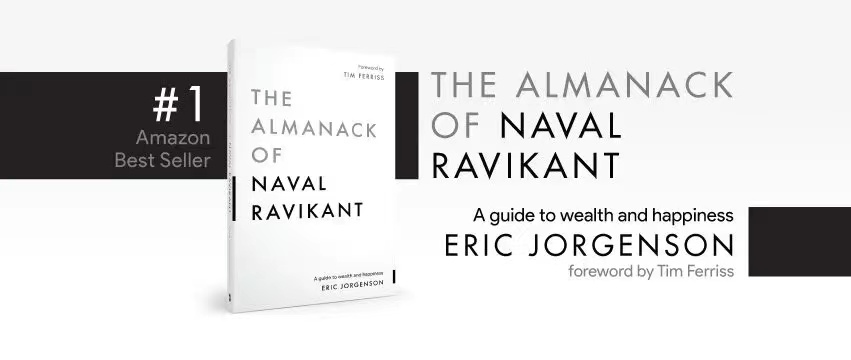

# 《个体崛起：打造过硬的营销力和产品力》
>这是一本基于互联网的营销思维、产品思维的小册子。

* 知识是网状的，书籍是线性的，硬着头皮读完，是任何初学者必备的技能。

2018年5月31日硅谷投资人纳瓦尔（Naval Ravikant）突然一口气发了40条推特（Twitter）语录，其内容就是关于如何不靠运气而致富（How to Get Rich(without getting lucky)）。相关内容掀起一番讨论热潮，且被大量网友不断转载，被称为“推文风暴”。（文末有推特语录截屏）。

>**从白手起家到财务自由，纳瓦尔把这套对「赚钱」的理解总结为一个话题：如何不靠运气而致富？而答案也被他总结很简单的一句话：把自己产品化。**

后续埃里克·乔根森结合纳瓦尔的推文、博文、播客、访谈等内容整理成了一本书，叫做《The Almanack of Naval Ravikant:A Guide to Wealth and Happiness）》，你可以在他的网站`https://www.navalmanack.com/` 找到这本书籍。纳瓦尔不仅对财富有独特的理解，对如何幸福更有一套。其中文版，叫做《纳瓦尔宝典》，2022年5月10日中信出版社出版，可以在微信读书App上免费阅读。

强烈推荐的一本书，更是需要践行到骨子里的一本书。

（只要给我一根足够长的杠杆，一处可以立足的地方，我就能撬起地球。——阿基米德）

在书中，纳瓦尔总结了人类有史以来的三次财富杠杆。杠杆分为三类：

- 劳动力杠杆：指雇佣人来为你办事，属于比较原始且效率低的杠杆；
- 资本杠杆：用钱来作为原始资本，但需要先完成原始积累；
- 边际成本几乎为零的产品：如代码、书籍、电影、音乐等纯粹信息类的产品。

边际是一个经济学很重要的概念，边际即额外。额外的收入，叫边际收益；额外的成本，叫边际成本。

如果你原本工作8小时,现在额外再工作1小时,那么这1小时额外工作带来的收入就是边际收入。

基于互联网上的创作（书籍、文章、音乐、博客、代码、短视频）都是新杠杆的一种。因为，互联网的内容和服务可以轻易复制。一次创作完成,额外提供给别人，成本几乎为零，可以通过复制来无限次提供,信息复制（额外）的成本几乎可以忽略。

比如，《选择改变命运》这本书，哪怕有一天我牺牲了，如果我的文章有人想要阅读，我不用额外付出成本。睡觉不谈，死亡了还存在“流量”。

资本和劳动力杠杆都是是需要征得许可才能使用的杠杆。每个人都在追逐资本，但总得有人给你才行；每个人都想要领导其它人，但总得有人愿意跟着你才行。

而第三种杠杆完全不必挣的别人的同意。互联网出现的时间并不长，尤其在中国，因此很多人没有意识到它是我们这个时代最伟大的一种应用。

纳瓦尔还说:它们是新贵人群背后的杠杆，你可以通过自己创建的软件和媒体，在睡觉时仍然为你干活。

在有的人眼里，微信公众号，抖音等互联网产品是消费的地方。而在有些人眼里就是生产、投资的地方。

将来的某一天，这两种人可能就会产生“物种隔离”。

## 01. 为什么说:互联网对普通人很友好？

截止2023年，中国互联网网民规模超过10.79亿人，几乎全中国人都在互联网上聚齐。其次，预计2035年，中国将成为第一大消费市场。预计2035年，中国人均GDP有望达到2.6万美元左右，达到中等发达国家水平。

人饿着就只想吃饭，吃饱了，就会有各种个性化的想法和欲望需要满足，这是商机。且互联网支付、产品交付的场景等不断成熟，如此，面对互联网，错过的成本比试错的成本大的多。

未来中国，中国有庞大的人口规模、将近4-5亿的中产阶级家庭、且城市化进一步加强。依靠个体提供有价值的产品和服务，完全可以过上美好的生活。

正如微信公众号的Slogan——“再小的个体，也有品牌”

凯文·凯利讲:“如果你能够从你每个真正的粉丝那里每年赚取完整的100美元，那么你只需要1000个粉丝就可以每年赚取10万美元。对大部分人来说，这足以让他们生活下去了。”

那么互联网有什么对普通人友好的特点呢。

- 几乎零成本，有一部连接网络的手机或者电脑，你就可以开始属于的创作。

说到创业，你是否会想到租一个办公室、是否想到招聘几个人、是否想到需要一些初始资本。而在互联网上，这些都是免费的，互联网就是一个零初始资本的创业训练场。

基于互联网创作的最大的成本是时间成本。（互联网消费者最大的成本就是注意力成本 —— 你是“付费了”。）

对于普通人，时间是最好且唯一的生产资料。

这就是一种低成本创业。其次，这是一种个人商业模式的再升级啊。你应该尝试。

- 长尾效应:互联网使“小众”也可以成为“大众”。

在传统的行业，产品的供给收到物理空间等限制，存在二八原则。由于货架等原因，最终会淘汰剩下80%产品和服务，只能留下足够大众的产品和服务。

过去开一个超市，你的用户基数也只是方圆几公里的人。而在互联网上带货，配合物流行业，全国，乃至全世界都可以是你的用户。

把哪些在线下规模很小的事情，搬到线上，再小众的产品，也会拥有足够多的用户为此付费。小众也可以很“大”。

互联网的奇妙在于，你再奇特，你的产品再小众，也会找到支持你的人。你在领域的知识再平庸，也有不断开始入门的人。你总能在互联网找到属于你的拥趸。

- 边际成本几乎为零。与传统的行业不同（达到规模最优然后边际效益持续下降），而在互联网上信心复制成本几乎为零。

在传统行业，如饭店，第一碗面和第二碗面的成本几乎一样，同样的做面时间、同样的原材料。而在互联网，第一篇文章所花费的成本，被摊薄到几乎为零。

完成了一篇文章或音乐创业、图画、短视频等，第二次交付，无需额外任何的成本，复制成本几乎为零。

- 多赢，它是一个正和游戏。我分享自己认为对你有用信息，对此，你不会损失什么，更有可能得到你想要的信息，（信息也是一种商品），对于我就会有互联网流量。在互联网上，真正地为别人提供价值，你就能获得流量。

没有哪一种技术，对普通人，如此友好过。

同样的工具，在不同人手里，似乎显得是完全不同的工具。

互联网也是如此。

## 02. 互联网使创作发表的门槛降低到几乎为零。
>纳瓦尔：互联网极大拓展了一个人职业生涯的可能性。绝大多数人对此毫无认知。

在中国古代，读书识字是少数人特权，对于女性更是如此。能够放弃耕作，读书识字，参加科举考试，都是少有的富农的权利。

大家都听过曾国藩六次科举失败，第七次考中秀才的励志故事。但你有没有想过，曾国藩的家庭背景。 曾国藩的先祖曾一山,是明末清初的状元。曾国藩的高祖父曾天锡是个秀才,做过知县。曾国藩的祖父曾文序曾任翰林。曾国藩的父亲曾文燦是个进士出身,官至户部主事。

在那时候，对于普通人，根本不给你“励志”的机会。

再后来，教育开始普及，但出版，仍然是困难重重。

为什么是四大天王，因为电视窗口最多只能容下四个人。而如今，iPhone引领的移动互联网时代，“群星璀璨”。

 20世纪90年代,互联网在中国刚刚起步,主要应用于学术科研领域。一般公众很难接触互联网；21世纪初,网络开始商业化,门户网站涌现。个人通过建站程序可以开办自己的网站,文字、图片创作逐渐普及；2003年左右,博客兴起,人人可以轻松建立自己的在线博客。文字创作大众化；2005年左右,图片、视频分享网站兴起,创作者可以无需自己建网站就可以上传和分享作品。

 2010年后,微博、公众号出现,只需要个人账户后就可以进行各类创作并迅速传播（出版）。

2015年后,抖音快手等短视频软件出现，进一步降低了创作门槛。你只要对着镜头讲话就行，而且创作内容包容且多样化。

 近年来,AI辅助创作,又又又进一步降低了门槛。
 
未来，随着5G技术的普及，“宽带”问题得以解决，直播这个东西终于可以很容易且有效地实现了。
 
 互联网技术进步和创新不断打破创作壁垒,每一个人，无关性别、无关男女老少，都可以参与到创作当中。
 
 如若你是一名程序员大佬，你不用去学校，你也可以有属于自己的学生，“工资”还不封顶。其次，我认为平台很重要，而你完全可以在“字节”、“腾讯”等平台上工作，多好。
 
过去你想在线下给 10,000 人授课，那你得开多少场？到哪儿找能容纳一千人、两千人、甚至三千人的场地？其次，那场地的成本得多少？就这么一个简单的因素，就已经使得整件事彻底不可能了……

而互联网让这一切变成现实。

在互联网时代，对于普通人是极度友好的。用户只要通过手机就可以轻松产出并传播创作。这是古人，不敢想象的。

这是一个全民生产内容的时代，从未有过一个时代能有如此多的普通老百姓随意发出自己的声音，而且这些声音随时有可能被上亿的人听到……

## 所有商业的本质都是供需关系。

世间面对供需大致有两种模式。
>* 有供给，找需求。
>* 有需求，构建供给。

>* 第一个我称之为：销售、营销 —— 传递价值。
>* 第二个我称之为：产品 —— 创造价值。

>**「纳瓦尔说：Learn to sell. Learn to build. If you can do both, you will be unstoppable.学会如何销售，学会如何创建。如果你同时能做到这两件事，你的成功将无可阻挡。」**

产品和营销——放在经济学就是生产和交易。**所有的财富都是生产和交易两个动作完成的。**

## 03. 一切创作的前提都是有关选择。

选择的影响是具有滞后效应的，你刚参加工作、和对象领证、养成一些好习惯（小选择），结果并不是立马看到的。而是随着时间的推移，结果才慢慢出现且越来越明显、越来越体现选择的重要性的。

举个例子，很多“大V”变现困难，尤其是穿短裙、穿黑丝的“大V”小姐姐变现极度困难。为什么，因为他们一开始就选择错了，她们本来想吸引有消费能力的独立女性，没想到吸引的是喜欢躺在床上刷小姐姐且没有消费能力的男人。

一开始的选择就注定了后面的结果。

告诉你一个公式，让你拥有在一开始就能看到结果的本领。就像孙悟空的火眼金睛拥有识别商业中的“妖魔鬼怪”。

-  **你的收入=（客单价-成本）× 用户数（流量×转化率） × 复购率**

好的生意必然是:客单价高，用户量大、刚需、可复购。只有一个符合要求，建议你不做。

不管你是构建一个产品，还是销售一个产品，一开始你就要思考。目标客户规模是否足够大，复购频次是否高、是否优质客户(消费观和消费能力)。

思考，这个品类的商品交易量大吗？有多大？这种交易会持续（复购）吗？交易量会随着时间的推移不断增长吗？……

很多人不喜欢做校园生意，因为那些年轻人没钱啊，并不是一个优质的客户。更多的人喜欢做女性的生意。

商品品类若是按成交额排名的话，目前大概是这样的：1.母婴  2.食品  3.美妆  4.服装   5.珠宝  ......

用那个公式套一下。如此，绝对有道理。

创新、差异化并不是无中生有，而是见多足够多、想的足够多、读的足够多，自然而然产生的结果。多去看别人怎么做的，为什么这么做，用公式分析一下，判断是否为好生意。看的多了，自己也有新创意了。这和阅读写作关系一样，读的多了，就想写点什么了。

最后，结合自己的兴趣、能力和商业价值分析，选择一个最优质的选项。

自媒体人也需要选择。以你的用户是谁？他们在哪里？去选择你的平台，内容形式、内容传播等。

销售也需要选择。最好的销售，并不是你有什么卖什么，而是人们需要什么，就卖什么。什么刚需、高频，你就卖什么。

把自己卖出去也是，不是我有什么，我就卖什么。而是市场需要什么，我就学什么。我是一块砖，哪里需要我，我就哪里搬。在选择行业的时候，你的考量应该是：你在这个行业待的时间越久，你的用户就应该越多，而不是越少。

在杠杆时代，杠杆能够成倍地放大你的判断力（所产生的效能）。

最后，我把李笑来的这句话，原封不动抄在这里。
> 最佳的销售标的是什么呢？它必须是人们的刚需，且又需要持续沟通才能完成。所以你观察一下就知道了，销售群体中，以个体赚钱能力排序的话，最赚钱的通常是房产代理、汽车销售、课程销售、保险销售。为什么呢？首先它们都是人们生活的刚需，最为关键的是，反复沟通都是这类产品销售过程中的刚需。

同样，构建一个产品。最优的策略就是:客单价高，用户量大、刚需、可复购。

知识就是一个很好的生意。

# 销售、营销

##04.  职场上的每一个人，第一身份是“销售员”，其次才是别的。

每一个职场人都是销售员，只是各销售员销售的物品各不同罢了。有的是抽象的物品，比如想法、能力、方法、专业知识，技能，有的具体一点，如理财产品、保险品、汽车、水果等。

举个最简单的例子，找个好点，薪水高点的工作。本质上就是，把自己卖了个好价钱。个人也是一个产品，需要销售出去。

最高级的销售员，他们的职位或岗位并不是销售员。比如金牌律师，他们是在销售自己的法律知识知识等个人能力，但岗位并不是销售。

我们讲的销售思维和产品思维，和你工作的岗位无关，而是一种商业思维，更好地打造自己的竞争力。

它是一种思考的方法。

销售是降低交易成本（沟通），促成交易（说服）的人。

销售是一种促成交易的行为。

> 交易中，成本最高的就是信任成本。

富兰克林说过，时间是金钱，信用是金钱。货币的本质是对信用的度量。

麦肯锡有一个信任公式，它能够把信任这个品格养成得到具体方法论。

*  信任=专业度×亲近程度×靠谱/自私程度。

专业度（对你要卖东西的了解），亲近程度（同理心和理解别人的能力），自己的靠谱（执行力，对承诺的态度），自私程度（自己利益是否大于别人、创造共赢的局面。）

你推销的产品或服务越贵，信任这一品质就越重要。如若你没有相当深厚的专业知识，你就不能卖出价值数亿美元的商业地产、客单价高的产品、复购次数高的产品。

我们经常保持坦诚、诚实。不诚实的好处是具体的、显得易见的，但不诚实的、不坦诚的坏处是不明显的，看不见的。进而很多错误地选择了不诚实、不坦诚。

见人说人话、见鬼说鬼话，只会增加交易成本。

任何一个重视长期业绩的销售都是应该坦诚并不断提高自己的被信任程度。把第一次交易当成下一次交易的开始，某长期主义。有所为，有所不为。

生活中，提到销售和营销，第一反应是骗人的技巧，实则不然。就好像有些人认为的，只有做坏事，才能赚钱一样。这可能是一种误区，会产生种种不必要担心和动作变形。

诚实是一个策略，是一种选择。
 
那么，并不在销售岗位上的我们，如何通过互联网找到用户？

通过互联网边际成本几乎为零的内容，向互联网传递价值，吸引潜在的用户。

分享对用户有用、和用户有关的信息，就是打免费的广告。

切记，不需要满足所有人的愿望，就算是人民币，有些还是觉得肮脏。只渡有缘人。

最好的销售就是把客户当做朋友。像对待朋友一样推荐产品（如果你不会像朋友推荐，那你就不要卖给客户）、像和朋友一样沟通说话、像朋友一样支持你。如果你不会像朋友推荐某样产品，那你就不要卖给客户。

欺骗，是一种短期主义行为。构建信任，等于藏富于民。只要某一时刻，提供合适的价值，把财富拿回到自己手中就可。

##05.  构建影响力:影响力是最坚挺的货币。

对于有关营销和说服力的构建，罗伯特·西奥迪尼的著作是必读的，尤其是《影响力》。

在我们大脑的潜意识区域，存在一些奇妙的机制，这些方法，不用别人教我们，我们天生就会，你只要通过适当的不让人讨厌的方式触发就可以影响他人。

畅销书作家丹尼尔·平克称赞道：“任何关于说服和影响力的写作都是站在西奥迪尼肩膀上的”。此话一点都夸张。

刀，可以成为菜刀，为别人提供价值；也可以成为杀人的武器，损人损己。工具在不同人手里，价值可以完全不同。

先后总结出说服他人的6大原则，即互惠、喜好、社会认同、权威、稀缺、承诺与一致等，在此列举几个。

1. 权威感：我们对医生言听从计，是一种权威的影响你不用真的是一名医生，穿一个白大褂，你就拥有了权威感。再比如有些洗发水放在药品店，同样起到了权威感的作用。白大褂都是一种权威的载体，机构认证、证书、权威人士的评论也是一种。

2. 互惠心理：如果别人给你一样礼品，你一定会心理想着回馈他们。你可以提供一些免费的服务唤醒互惠心理。

3. 稀缺感：越是“资源”有限，越是想要获得的心理，最后十件，最后十分钟，这样会让客户加快决策时间。（数量少、机会少、只有今天）其次，人们不喜欢自己被和别人同等对待，喜欢被特殊对待，特殊关照，有一些特殊的礼物、特殊的称呼。

4.  群体认同、社会认同：这个群体可以是工作群体、专业群体、行业群体、朋友圈、一个爱好群体。每个群体都有各自的行为规范、群体成员会不约而同地认可和执行。比如说唱都喜欢把衣服穿的大。比如打篮球，其运动装备，很相似的。

5. 社会认同、从众效应：当我们不知道如何做决策的时候，我们倾向于从身边的人那里寻找线索。人多就是正确的心理。稀缺性和社会认同是事情的一体两面。稀缺代表着需求量大，需求大说明大家认同。

6. 对比效益:引发欲望最好的方法就对比给别人看。我吃了这个减肥餐，体态是这样的，而以前是这样。人的行为马上被勾住了。

想要完全掌握说服术，不仅要对，罗伯特·西奥迪尼的著作主题阅读，更要实践并反馈迭代。

适当放在销售语言和行为中，会让你的行为事半功倍。

这些影响力原则不能一直是直拳，要打组合拳。比如权威+互惠等。

时间是最好的组合拳。

你不断地学习领域知识（权威感），然后通过互联网不断为外界提供价值（互惠），让大家看到自己的进步（对比效应），拥有一批拥趸（社会认同），最后为老铁服务（稀缺）。

这些说服术可以使用在任何领域、任何人身上，包括自己的个人成长方面。

互联网是具备记忆的。不要把别人当傻子，价值配上影响力别人才会真正愿意被说服。你用技巧，没有真价值，一旦发现，用户会远离你。

销售没有特定的行为，你的一举一动都是销售，都是建立信任的过程。

##06.  给产品找个“好”用户。
> 你的专属“印钞机”：找到潜在用户，然后精通你的用户。

由卡尔·门格尔等人创立的奥地利经济学派，他们提出了另一种的对价值和价格的理论即主观价值论。

他们的核心观点是认为经济商品的价值不是由客观因素决定的,而是由个体的主观价值判断决定的。认为产品和服务本身并没有经济的价值，而是由于个人对它们的需求才有价值存在。

不同人，需求的不同、需求强烈的不同，其主观价值也不同，最后愿意支付的价格也不同。对同样一件产品和服务的价值评判，就是哈姆雷特式，莎士比亚说，“一千个人眼里有一千个哈姆雷特”。

想起《白说》里白岩松讲的一个故事:上世纪八九十年代，电视机还很值钱，冯老师家不但有电视机，还有很多字画和文物。突然有一天，有人告诉冯老师：“您家四门大开，好像被人偷了。”冯老师说：“惨了，我的字画！我的文物啊！”可是等冯老师赶回家中，惊讶地发现，小偷把电视机和录像机都搬走了，字画和文物一样也没动。

冯老师对赶到的警察说：“给你一千元钱，抓到小偷的时候替我谢谢他。”因为小偷拿走的那些东西都没字画和文物值钱。

同样一件产品和服务。在有的人眼里的就是宝贝，在有的人眼里就是“垃圾”。在一些场景里就是宝贝，在另一些场景里就是“垃圾”。

比如，情人节时候的玫瑰和平常的玫瑰有点不一样。根据场景的不同，其价值也不同。

找到产品的受众人群（有强烈需求），以及出现在合理的场景销售往往会无往不利。

你觉得好和用户觉得好，可能会是两码事情。找到潜在用户，然后精通你的用户。你必须精通你的用户。

你对人（更准确地说是用户）的了解程度，一定程度上决定你的结果的优秀程度。

首先是吸引潜在用户，即你的用户是谁？

你有一样供给（产品或服务），初始有一定的用户是谁的概念。但往往，你的用户会和你所想存在偏差，此时，需要我们不断细究这个问题。比如，如果你的产品是奶粉，你可能会想到你的用户会是小孩，实则不然，孩子的父母、在具体一点就是母亲，在具体一点就是20-35之间的妇女才是你的核心用户。

其次是精通你的用户即他们在哪里？他们有什么特性？你能解决什么问题？

往往需要了解用户的年龄、地域、价值观、习惯、行为模式、他们是什么行业？在那几座城市？他们有什么样的思考习惯？什么样的消费观念（一个菜市场大妈可能会省吃俭用买一个金手镯）和消费习惯。对方有什么烦恼、痛苦，最害怕的点都有什么？

不断地打磨用户画像。直到一句话形容他们为止。

知道自己的用户是谁并有一定程度的了解用户，那么，利用新媒体吸引潜在用户等不再是黑屋里抓瞎。

打磨用户画像，不仅需要收集数据、调研更高一些基本的了解“人”的能力。

* 倾听能力。
放下自己的各种视角、偏见和各种想法。以开放的心态，以一个空杯的心态去倾听用户的反馈。

听从美国顶级推销大师弗兰克·贝特格的建议，让别人先说。想要说服和赢得别人的信任，我们必须清楚他们的想法和感受，要做到这一点只能通过倾听和提问，而不是滔滔不绝的说教。

这是获得共鸣、说服、信任的基础能力。
一定不能让他们产生抵触的第一反应和情绪。不要咄咄逼人、倾听和观察需求。

不要认为用户是傻子，如果那么做，你会成为最傻的那一个。

本杰明·富兰克林在《穷理查年鉴》中说过的话：“如果你想要说服别人，要诉诸利益，而非诉诸理性。”

* 具备同理心 、换位思考。
* 数据分析能力。

这两个能力并不是可以用一两句说清楚的。

首先你需要把你自己当做一个小鼠，不断地观察自己、从自己的需求、欲望、习惯、动机等开始作为参照点去试着理解别人。其次，也要积极观察别人，当做地铁看到一个人，猜想，他会喜欢什么价位的产品？喜欢什么类型的知识内容？喜欢什么样的人交流？他的职业是什么？收入大概在？他可能都有什么习惯？可能有什么样的消费习惯等。当看到一个产品，猜想，它的用户是谁？满足了什么需求？什么场景？并试图构建用户画像。

不断进行思维演练，让自己成为一个“老兵”。

记住，用户买的不是产品，而是更好的“我”。

“我”想变得更好。如何你能帮助他们实现目标，你就获得了价格和他们的成本。

每个人都是想着自己。这个产品是否对我有用、是否能让我变得更加开心、是否让我节省时间。没有人关心你怎么样。

卖的不是产品，那么卖的是什么？钻石卖的是材质吗？玫瑰卖的不是花朵吧？烛光晚餐一定不是光光为了吃饭。买的是新奇的体验和服务。

《魔鬼经济学》中有一句话:李施德林卖的不是漱口水，而是清新的口气。

对人的了解，才是一切的根本。

那么，下一步，就是去找你的用户？

查理芒格对钓鱼者有两条建议:一，在有鱼的地方钓鱼。二，记住第一条。

你的用户在哪里，你就去哪里吸引用户、成交产品。

宏观上，互联网把所有人都连接在一起。但微观上，人还是跳脱不开“人性”，还是遵循着人以群分，物以类聚的法则。

程序员的圈子，大概率也是程序员。一个有阅读习惯人的朋友，大概率也是具备阅读习惯。

付费社群就是一个天然的好东西。在那里，更容易找到有付费习惯的人。社群是什么？就是一群人，不同年龄，不同性别，不同地域，不同文化背景的人，在一起，因为一些共同的特征，也可以简化为共同需求的一群人。

我喜欢在论坛或者社群内潜伏，看看人们都有哪些困扰，在他们经常会遇到的问题中，哪些问题出现的频次比较高，哪些问题是核心问题，哪些问题尚未被解决，哪些问题是高频、刚需、用户量大且持续的。找到这些问题，尝试着给出我的“解决方案”。

出现在他们的场景里、痛点里，然后给点暗示，把问题给解决了。

在那里，锻炼你的换位思考、倾听，学习价值交付，别人是如何构建影响力等。

最后，优秀的产品，它自己有“嘴巴”。产品和营销是互为因果的，产品好了，营销也有钱了。最高级的营销为价值观营销，苹果就是高级的代表，与众不同，稀缺。

# 产品

##07.  产品是问题解决方法的载体。

说到机会，我们脑袋就会空空，因为机会这个概念就是一个“哈姆雷特”概念，一个人眼中有一千个定义。人人都说要抓住机会，但也就说说，完全不会抓住。不是因为机会没有，但是对机会的定义不清晰，因此，不能指导我们生活。语音精度决定认知精度。

而我对机会的定义很简单:问题就是机会。

问题就是机会，如果你能解决问题，那么这个就是你的机会。遇到问题的人越多、越强，机会越大，相应的回报越大。

社会的问题就是企业的机会；企业的问题就是员工的问题。用户的问题就是“你”的机会。

构建一个产品的第一步在于你想为这个社会、用户们解决什么问题，而不在于你会什么，有哪方面的能力。当然，你要自己的能力和社会的（问题）需求紧密结合，但，不顾社会需求是否结合，那只能是自娱自乐，最后就会不了了之。

问题就是机会，如果你能解决问题或者更好地解决问题，这就是你的机会。

2003年，阿里巴巴一名员工因为参加广交会，感染了非典性肺炎。阿里巴巴被新闻机构点名批评。所以都只能坐在家里办公，而且还要每天12小时，接受卫生人员来消毒。大家都出不了门，这反而给马云找到了机会。淘宝网应运而生。

同一年，刘强东的京东也因为同样的原因，转战互联网。那一年，被称为电商元年。

用卫哲的话说：没有遇到’非典’，可能阿里巴巴就没了，‘非典’给阿里巴巴做了最大的推广，当时是每个人被迫都必须要用互联网的。

马云的格局更高，他说：“非典时期，谁都不应该想到，这是一个机会，而应该想到，大家碰到什么麻烦，我们能够怎么帮助到大家。”

人家不愧是“马爸爸”。语言精度决定认知精度，最后决定行动精度。

面对危机、面对机会、面对问题，不要讲:他能给我什么商机，而是想，我怎么帮助别人解决问题。这种话语的微妙变化，会大大提高你抓住机会的概率。

你发现了某种问题，你应该想，我如何帮助他们，更好地帮助他们。我越来越发现，好人更容易赚到钱，只是你不能是“老好人”。

一篇文章也是一个产品。产品是问题解决方法的载体。你的文章，解决了别人某种问题，你就能获得你想要的。

写作应该以帮助别人别人为初心写出来，那么，你更容易获得用户。真心地帮助别人，别人是透过互联网看的见的。

我平时喜欢喝柠檬水的人，但出门是没法随身带刀子的，我怎么喝到柠檬水啊？

我喜欢喝茶的人，可出差的时候带着一大罐茶总不合适，怎么办啊？

吸烟有害健康，我知道，但我就是戒不掉而且我想要健康一点，怎么办？

看到问题，你可能想到了这些产品:柠檬片、小袋茶、电子烟。

这些都是问题，每个产品的背后，都是一推问题。

弱者会抱怨遇到的问题，强者会解决问题，更强的人，也就是变革者会一并解决掉别人的问题。

先找到问题（需求），再提供供给。往往不会做“无用功”。

在如下一些“地方”，往往会发现有价值的问题。
* 别人抱怨、牢骚的地方。不要加入抱怨大军，去倾听，然后成为那个变革者。
* 别人害怕的地方。
* 别人不确定、犹豫的地方。
* 加入一些有付费门槛的社群，这里都是具有共同问题的人。

如果没有做产品的经验，不妨从自己的问题开始。从自己的需求和问题开始解决。

如果你自己有拖延症，写一篇如何拒绝拖延的文章、建立一个行动的社群、又或者开发某个App提醒等等都是一种产品。(产品不一定是实物，一个文章、一本书、一个APP都是一种产品，只要解决了问题，就是产品。)

再进阶的是，换个地方、换个人群、换个方式、换个形式，行不行？

你能发现别人遇到的问题，能够帮助别人解决这个问题。那就是你的价值。至于你获得的价格，取决于问题的重要程度以及可替代性。

从这个角度看，有三个能力是你应该掌握的：
1. 发现问题，并把问题转化为需求的能力。
2. 解决问题，将解决方案转化成产品的能力。
3. 将价值传递出去的能力。

## 08. 写作和短视频双管齐下。

写作和短视频是一种自我表达。你能写一手好字，那又如何，大家不知道啊。你是会一口流利的英语，那又如何，“我”不知道啊。

但自我表达，不是自嗨。如果你想获得价格，不要自嗨。如若不是，请随意。

写作和短视频是一种自我产品化。你只有解决了别人的问题，你才能获得价格。用户会说:“读再多的书，和我有什么关系。”

别人不关心你是否早上五点起来读书，也不想知道你踩过多少坑。他们只关系，你能不能帮他们解决问题，就是如此。

只有把自己产品化，才能获得溢价。成年人应该为结果负责，过程只是过程，不要自我感动。

产品就是一种落地的解决方法，为结果。

把写作当成一个创业项目去做。锻炼你发现问题，解决问题的能力。创业就是要解决问题，当你能够解决一类人的问题，更好、更快地解决问题，你就能获得价格。

你一个个文章，就是你的产品。

公开表达，不仅可以让你输出倒逼输入，还可以让你学会思考、表达。从而获得影响力、价值度、甚至财富等。

分享还是一种特别好的学习方法，它叫费曼学习法。当你学完了、看完了一本书，就用“小白”听的懂得方法写出来、说出来，然后分享给别人。

一边是打怪(赚钱)，一边是升级(自我提升)。自己学习来提升自己，然后分享出去，获得流量和影响力。

它就是多赢。

好的内容创作者应该像啄木鸟通过雕出一只又一只树上的虫子，既给自己找到食吃，又维护了森林的健康。

其次，写作还是思考。

写作是输出倒逼输入。如果你总是不去吃东西，你也“倒”不出什么东西来。

不要把初中、高中、大学写作的态度拿到自媒体写作上。你要的不是文字，而是输出对别人有价值的东西。文理不通都没关系，关键是对别人有用。如果你的东西真有用，就算有错别字也会耐心看完的。

提供有价值知识，尤其是实用的知识，从而就可以获得流量，这种获客方式成本极低。

最简单的方法就是如若觉得会对别人有用，那就分享。时刻想着如何帮助别人，不求回报地帮助别人。

每次输出，你想赚到钱的时候，都反思一下。这东西真的对他有用吗？是对他有用，还是对我自己有用？多长时间内会对别人有用？

利他就是极致的利己。当你能为别人提供价值的时候，别人就会为你提供价格。

你还可以对自己要求更高一些。思考，用在哪儿？怎么用？是对他一直有用，还是一次就完了。

## 09. 如何运营
> 从长远推演短期；从目标推演手段。

货币的本质是对信用的度量。你长远的目标是让别人相信你。

从商业角度讲，你长远目的就是变现。

运营逻辑不是做免费劳动，而是围绕变现为展开的活动。

只有你获利了，别人得到就价值了，多赢，这项事业才能长久下去。

所有的商业都是流量-变现的路径。

最好的运营思路是以目标推演手段。
>**以终为始**。

变现和流量没有必然的联系，流量是流量，变现是变现，它们俩常常并不是一回事儿。

带有强大流量的东西，往往是情绪化的事情。如此这些事情，会反向塑造你的认知，从而影响行动。过度热爱流量，你可能会失去自我，成为流量的“奴隶”。

如果你有平时的观察，你会发现绝大多数“很火的内容”，或者“很红的账号”，事实上不见得是有商业价值的！

流量固然重要，但有商业价值的流量更重要。

最好的流量你必须慢慢积攒，积攒“有效的流量”。

以终为始作为自己的思考武器，你会开始反思自己的行动和运营手段。

你要认真思考，哪些流量要，哪些流量不要；哪些变现不能要，哪些是可以要。

思考清晰后，运营无非就是，不断出现在用户出现的地方，然后解决他们的问题，不断暗示他们，我可以，我的产品可以。

让用户从“和我有什么关系”变成“和我有关”。

从变现角度讲，建立强信任、强联系，把用户当做朋友、经营好用户关系，把更多的普通用户升级为自己的拥趸才是好的运营。

因为交易中，信任成本是最大的成本。

运营的关键在于自我，能否持续提供真正价值。是你的观点、思想、作品、方案，正面影响了多少人、帮助了多少人、促进了多少人。 

哪一天，用户是因为你，购买了服务和产品，这就是真正的财富。哪一天，看到某一个场景和问题，第一反应是你，这就是财富。

> ### 个人IP

构建个人IP目的还是**变现**，还是在卖人。你得活的挺好，别人才会认账。

卖产品=卖“人”。

你生活入不敷出，你说:阅读改变生活，那么，大概率你只会引来键盘侠。

首先你得牛，其次说你牛的人得牛，那么，IP这件事情大概率成了。

个人IP运营是不断地和用户成为朋友，构建信任的过程。

如若不能和你产生强联系，那不是个人IP。那只是一个平台IP，只是暂时“借”给你罢了。

个人IP需要的是粘度。没有粘度，没了这个平台，你的个人IP也就没有价值了。

像对待朋友一样对待用户。

樊登在《低风险创业》中所讲：“客户的真正价值，在于他能为你带来新的客户，让你的生意源源不断。”

个人IP变现的不仅仅是产品，还有人格；用户购买的也不仅仅是产品，更是一种价值观认同。

在做你自己这件事上，没有人比你更擅长。——  纳瓦尔。

个人IP，首先是个人，然后是一个IP告诉大家。

## 纳瓦尔推特风暴截图。

