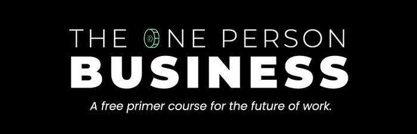
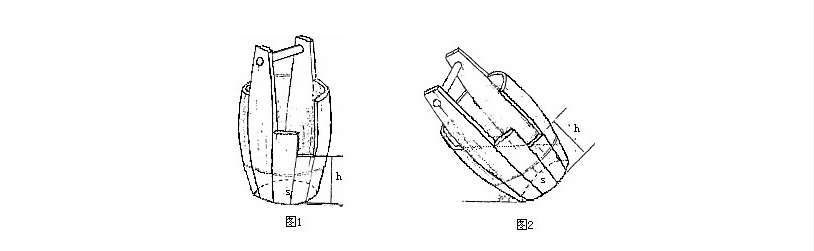
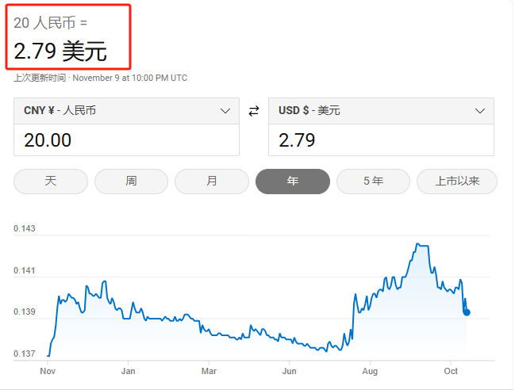
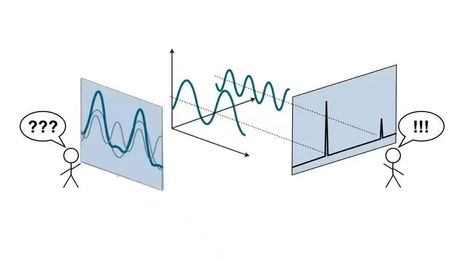
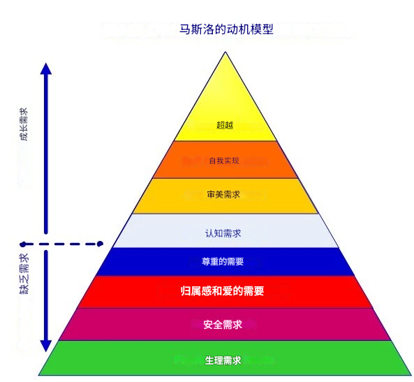
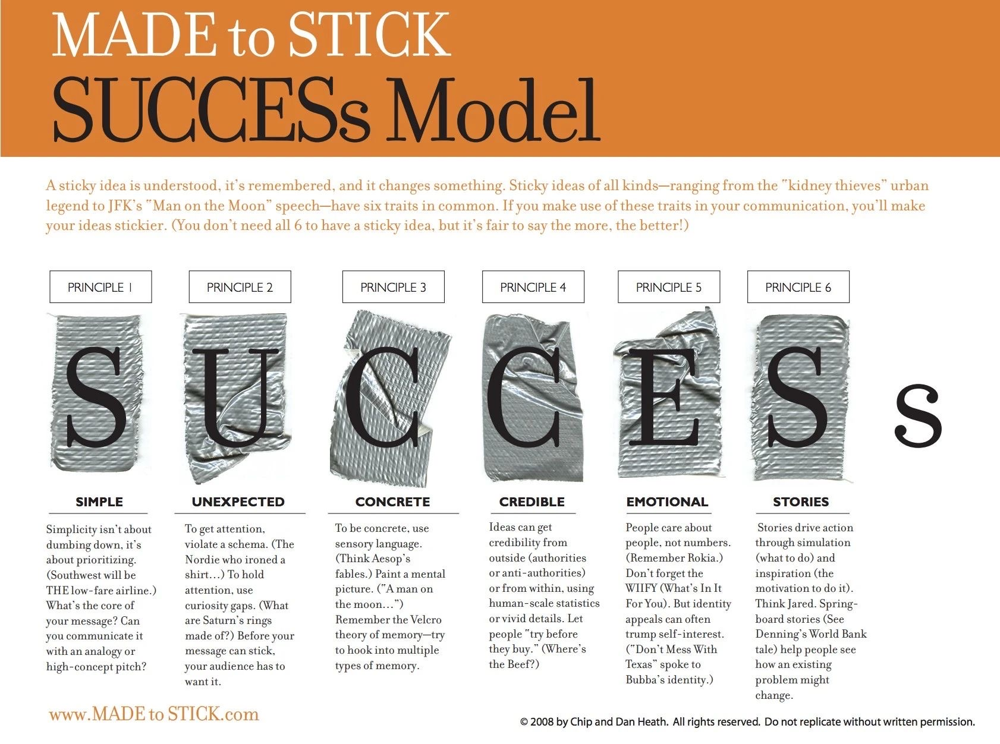
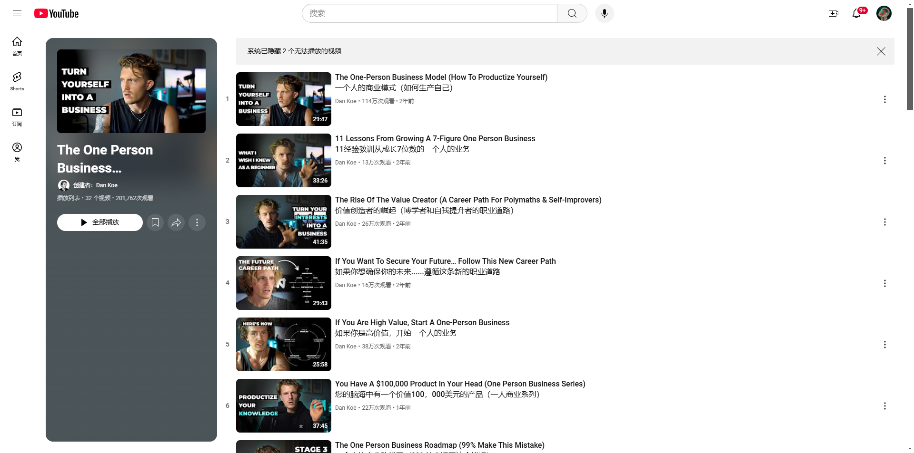

# 《Dan koe：一个人的商业模式》

> https://theone-personbusiness.com/#download

> **我就是这么做的，未来会沿着这条路走下去——古思。**

我曾教导过两万余名创作者。他们普遍对个人品牌、内容创作、产品构建方面缺乏足够的自信、清晰的思考、执行力。这正是我创建此免费课程的理由。在我看来，任何领域的基础知识都应该供人们免费学习。（基础知识是获得所有结果的原因）。而创作者收费的内容则是。但个人独特的系统与策略往往就是你对内容付费的理由。如果您有以下问题，这就是为你创作的：

* 你不知道学习哪些技能能够将内容创作转化为可持续的收入来源。
* 大家都在谈论“创作者经济”中的机遇，却又不确定该从何处开始。
* 由于你一直以来都是被安排工作（从未需要自己去寻找个人事业），所以对营销、销售以及说服的基础知识一无所知。
* 你不了解销售哪种类型的产品或服务能够带来最多的收入。

那么，这个“一个公司”入门课程就是为您量身定制的。在这里，您将学到：

* 数字经济 —— 对全新数字经济形成坚实的理解，并掌握如何加以利用。
* 创作者思维—— 摆脱通过打工赚钱的依赖，自己以个人的形式创造财富。
* 技能与好奇心 —— 懂得以独特的方式展现自身兴趣。
* 常青市场 —— 定位自己的内容和产品，以获取最大程度的参与度和销售。
* 产品与服务 —— 在您起步阶段，了解销售哪些事物能够（相对）快速获得收入。
* 分销网络 —— 学会如何更多地出现在人们面前来建立受众粉丝并找到客户。
* 意识与注意力 —— 学会吸引别人的注意力，无论谁在阅读您的内容。
* 最伟大的技能 —— 学习道德层面的说服与影响之法，以便不必欺骗、作弊或诈骗您的受众。
* 成功的关键 —— 通过公开构建倒逼最佳的学习方式。

【在我分享一些国外人的故事、国外的方法时候，有很多读者就会反馈，这是国外、中国没有这样的环境。比如，总之他们就会找到各种理由来证明是因为国内外差异，证明我的结论不适用。当然，你也可以这样认为，但你得到什么好处了没有。

以下的内容会提到国外的社交媒体软件。以及国外的人名，大家要保持开放的态度去学习，其实人都差不多的。其次呢，你可以把tiwwer想象成微博、邮件想象成加微信、发朋友圈。然后社交媒体想象成公众号、视频号、抖音、小红书等。不要限制自己。】

## #000

#### 快速预览文章所有的内容。

“一人公司”迷你版课程是以自由职业、咨询、数字产品销售、品牌、社区建设和受众增长方面5年多的迭代的结果浓缩成了如此一个简单的系统。它被一次又一次地被证明能够取得成果。

我已经使用这一“一人公司”系统在每一个领域（自由职业、咨询、数字产品销售、社区会员和品牌建造）都创造了 6 位数的收入。

我所做的没有什么特别之处，也没有任何是其他人无法实现的。

然而，我也曾和您有同样的问题，遇到同样的问题。在生意的低谷时期，我的脑海里充满许多疑问，缺乏清晰的思考。所以我知道是怎么回事——而且直到今天我仍然在挣扎——但**对于做自己喜欢的事情并赚足够多的钱过上充实的生活，我已经掌握了大多数人都在寻找的答案。**

我的目标是在当你感到迷茫、想要提高销售额、想要更快地发展或者想要利用您的创造力在这个世界传播内容时，为您提供您所需要的所有资源（您可以随时回来查看）。

**哪些人将从这个迷你课程中受益？**

尽管我认为每个人都应该学习“如何在数字经济中前行”，但这个课程是为少数特定的人群准备的，我喜欢称他们为**价值创造者**。换言之，即那些致力于通过消费、整合、开发、创造以及销售价值来提升他人生活品质的人。

具体而言，这个课程是为哪些人准备的呢？那些渴望：

* 拓展个人与专业技能组合的人；
* 学习如何以道德的方式进行说服、影响他人以及销售的人；
* 为他人的生活或业务做出积极贡献的人；
* 提高自身对热衷主题的认知程度和知识水平的人；
* **在明确自己的目标与人生使命的同时，借助互联网的力量赚取足够资金以支撑这项事业的人；**
* 通过价值创造建立公开履历，让现代机遇主动找到自己的人；
* 通过了解人性与心理学来学习创作具有影响力内容的人；
* 以自由职业者、顾问、在线教育工作者或知识工作者的身份建立单人业务的人。

**谁不适合这个课程？**

* 那些无法看到个人成长与积极影响之“价值何在”的人；
* 那些有意或无意地通过负面内容（如某些表情包、色情内容等）试图伤害他人的人；
* 那些对金钱、销售以及个人向世界输出内容的影响持有扭曲观点的人；
* 在业务方面，那些决意追求高度聚焦的自由职业、代理工作等细分领域的人。

关于最后一点，这个课程是为那些期望谈论自身兴趣与好奇心，同时销售能够改变生活的产品的人而准备的（并非那些只专注于谈论与所销售物品相关细分主题的人 ——这没有错，只是说明谁将从这个课程中获得最佳效果）。

**您将学到哪些内容呢？**

数字经济具有诸多动态变化的部分。本课程充分反映了这一特点，并据此进行精心构建。

在《一个公司》课程中，您将学到：

* 作为价值创造者从而取得成功的基础知识。
* 在充满不确定性与不可预测性的工作中获得成功所需采用的“非传统思维模式”。
* 厘清你的技能、兴趣与专业知识之间的关系（以及它们如何共同打造一个不可替代的品牌）。
* 拆解关于价值传达、定价相关的技能、专业术语、方法。
* 掌握利用您的时间和创作获取可持续收入来源的真正（且唯一）途径。
* 领悟因 “原创” 且具有影响力的思想、想法和工作而被高度重视人的关键要素。
* 了解你现在即可采取的可行步骤，从而开启在社交媒体上的成长之路、与高层人士建立联系并完成您的第一笔销售。

祝您学习之旅愉快！

> 你也可以在我的个人网站【】上阅读。但可能访问会慢或者访问不了，如果你有魔法，访问会快很多。如果需要连接"魔法"帮助，请联系我微信（gusang211800)，为你免费提供帮助。

## #001

#### 数字型经济

在过去的十年间，我们的工作模式发生了翻天覆地的变化。很多的机遇涌现于我，远程工作变得日益普遍，技术的进步也开始以创造性工作逐渐取代劳动密集型工作。

如今的机会比以往任何时候都要多，但只对那些愿意摒弃过往对“工作”认知的人开放。

你想开始转变，但在这一转变过程中，或许已经形成了一些这样的传统观念，比如：你需要启动资金；你需要丰富的经验；你需要大量的追随者；你需要一个实体产品或服务的场所；你需要规避竞争和市场饱和；你必须对利润率、运营成本和供应链感到焦虑。然而，**这些观念都与事实大相径庭**。

如果您对数字经济有更多的接触和了解，您可能还会认为：你必须长得非常出众才能吸引受众；你需要有深刻的洞察力、智慧，并且能产生像乔丹·彼得森那样高水平的想法；你必须是一个熟练的作家、演讲者、视频制作人，还得拥有所有那些只有富人才能买得起的昂贵设备。**但实际上，这些也都并非事实。**

其实，这一切真的就如您想象的那么简单，可我们也必须明白，实际做起来可能会有多难。

在接下来的部分和模块中，我将协助您摒弃这些**限制性**观念，同时为您提供简单的系统，帮助您在这个新经济中茁壮成长。

要知道，你是自己最大的敌人。如果您没有验证过某个常见的说法或建议，您就不应该将其作为坚定的信念或假设来接纳。敞开心扉，去测试一下，自己去探究它的真伪。保持开放并去验证。

#### 真实的网络世界

本课程聚焦于一切的数字层面。

尽管实体产品颇为出色 —— 并且百分之百能够通过你的品牌进行销售 —— 但是，将数字产品与服务组合作为你的产品基础，它几乎是必须的选择。

为何如此呢？

* 其创建成本几近于零。
* 利润率可高达 90% 以上（倘若你是一个完成，这还是较为保守的计算）。
* 复制它们无需任何成本。一旦你知晓这些产品有市场，你所要做的仅仅是增加流量。
* 对于诸如自由职业或咨询服务这类事情 —— 随着你影响力的逐步建立，你能够减少在客户工作上所花费的时间。
* 【作者几乎把做自媒体和自由职业者描述成一个成本几乎为零的事情。确实，成本很低。但，如果从经济学角度认真思考，有时间成本和机会成本。推荐你阅读我的一篇文章：自由职业也需要付出时间成本、自由职业的机会成本可能是稳定地在公司赚钱的机会】

这使你能够完全掌控自己的收入。想要获得更多？那就投入时间或金钱去构建免费的流量来源。就如同一个赚钱的开关按钮。

但是，你该如何让人们看到这些产品呢？幸运的是，你无需投资实体店面。实际上，你根本无需进行任何投资。世界上的程序员们已经厌倦了构建网站和登录页面，这使得任何人都能够掌握这项技能。

那么产品托管平台、沟通电话以及 “店面设置” 又当如何呢？同样是免费的。无代码工具让这一切成为可能。“无代码工具” 仅仅是一种较为花哨的说法，指的是为你完成工作的软件罢了。就像是一个全天候运行且不花费你一分钱的小推销员（直到你发展得足够迅速，需要进行投资之时）。

他们可能是：

* Gumroad 可用于托管电子书、课程以及会员资格。
* Calendly 可用于创建通话日历和预约链接。
* Carrd 可用于构建快速登录页面，以便更好地销售你的产品。
* Revue 或 Convertkit 可用于建立电子邮件列表。
* Website builders网站构建器可用于建立个人网站。
* 社交媒体平台可用于建立受众群体（像 Facebook 广告这样的流量来源，但如果你知道如何运用该平台，它也是免费的）。

它们都是免费的，而这仅仅是其中的一部分。它们中的大多数只有在你发展到应当赚取足够多的钱，足以证明其成本合理的时候才会对你进行收取费用。

但是，丹，那经验方面又该如何呢？我难道不是必须在某个特定领域非常熟练或者成为专家吗？嗯，的确如此，但有办法解决这个问题。**实际上，以初学者的身份开始反而更有优势。建立受众群体的一个重要部分，是教育你的受众，使他们达到你所处的水平。这是他们所渴望的。他们希望借助你提供的方法，达到和你一样水平的人，成为更有价值的人。**

**还有谁比领先于你一到两步的人，更适合请教学习呢？领先于你十步的人不会给你正确的建议，他们处于不同的领域。但是领先于你一步的人确切地知道你应该如何应对所面临的任何障碍。**

【这一点我很认真。用户购买的不是产品，而是更好的自己。如果大家都去听最好的老师课程、最专业的教程。那很多的企业和自由职业者就没有存在的必要了。学习课程直接到网上学习清华、北大、斯坦福的公开课程就好了。大家为什么愿意听我讲自媒体，因为大V学不了啊，距离大远了。】

作为初学者有一些策略和技巧能够帮助你快速成长。

* 向人们教授你喜欢研究和学习的一个主题。【这是我个人非常推荐的方法，教就是最好的学，把学习的结果以“文章、短视频、书籍”的形式发表出来。其实呢，仔细想，这一篇电子小册子就是如此。我要学习、然后阅读中顺便翻译和校对了一遍，润色了一遍，变成了自媒体“引流”工具。其次，我之前还分享过一篇文章，真的应该好好去阅读，尤其是**成长公式：（阅读+思考+践行+总结+分享）* 每天**部分，我现在的自媒体就是这么做的。《https://mp.weixin.qq.com/s/PxL3WxmYhTj6CH1Hyyzp2A》】（如果你在阅读PDF版本，键盘按住`Ctrl`键，用鼠标点击链接就可以跳转。）
* 假设你收听了一个关于营销的播客，据此再创作高质量的内容（教导人们相关知识）。【关于这一点，如果你想真正想要践行，去阅读一本书籍《小而美》，其作者就是Gumroad的创始人。其大意是说，在一个特定主题的社群中发表特定主题的文章，不断学习、不断分享，让自己成为此社群的“专家”从而构建影响力。】
* 评论或艾特你从中学习的播客主，以及为何要这样做呢？

引用你的来源能够使你的论点更具可信度（更具权威性）。

播客主可能会喜欢、评论或转发 —— 这意味着你可能从他们庞大的受众群体中获得关注者。

播客主会记住你，特别是如果内容出色，这意味着你未来可能与他们合作。

我曾与那些我从小就收听其节目长大的 YouTube 博主和播客主合作过。当你明白网上的每个人都和你一样是普通人时，真的会感到不可思议。他们只是通过不断坚持，才让自己看起来像某种名人。

当我们谈到 “公开学习” 时，我们将对这种零经验策略有更多的了解。从零到无限、你可以从零开始、你可以扩展到无限。不要让任何告诉你不能的想法存在于你的脑海中。

更好的是，如果你有这样的想法，在网上写出来，以便更深入地理解它。【写，就是最好的思考。想要理解这句话，写吧！】

#### 在信息时代里

在信息时代，许多人存在一个极大的限制性信念，即他们觉得信息本身毫无价值。但实际上，我们人类所做的一切皆是在处理信息，事实就是如此。我们在生活中处理从自身经历中获取的信息，这些信息要么让生活变得更加美好、要么变得更糟。

* 当你进行社交活动时，你在与他人交换信息。
* 当你漫步在路上，你在与周围环境交换信息。
* 当你独自一人时，你在与自己交换信息。

所有这些都能够（并且也应该）转化为有价值的**内容**。信息就是一切，它是所有交流与联系的基础，和网络世界中没什么不同。尽管，信息过载的问题也确实存在。

当我们探讨 APAG 的说服力写作框架时，你将学会如何制作令人难以忘怀的信息，从而改善他人直接的阅读体验。人类体验部分由信息所决定。还有什么比制作能够改善人类体验基础的信息更值得你花费时间呢？

【多数人的写作能力并不是去补充诗词歌赋开始，而是从学习说服开始。可以从最基本的说服力框架、销售促销框架开始。同时，推荐一本书《影响力》】

有意地、自觉地关注你所接触到的所有信息，并批判性地思考这些信息如何在日常生活中得以应用。仅凭这一点，就可以建立起一个完整的品牌。【常说的文案就是这样的一个工作，通过对信息的处理来增加点击率和转化率。我很赞同，如果你阅读了《影响力》，你会知道作者在讲什么？】

#### 从创办公司转变到创办社区

人们正在对 “系统” 逐渐失去信任。

* 正规教育费用过高。
* 人们渴望人际联系与亲密关系。
* 每个人都对各个行业的集中化感到厌倦。【社群中有不同领域、不同地域、不同性别、不同专业、不同阶层、不同年龄的人。】

这一点并不难察觉。如果你在社交媒体和其他类似账号上关注我，你应该对此非常清楚。**通过观看 20 小时与设计相关的 YouTube 视频，你能够学到比拥有一个四年设计学位更多的实用信息。这适用于任何学科，不仅仅是设计或是你所接触过的行业。**一个约由三人组成的小型 “精品” 品牌每年能够赚取数百万美元。一个清楚自己在做什么的个人品牌，每周工作 4 小时就能每月赚取 2 万美元。

正如你将会了解到的，你的个人品牌使你与众不同。现在想一想，你真的想要拥有大量员工和一家价值数十亿美元的公司吗？还是你更想做自己喜欢的事情，并最终每年赚取一百万美元（或者赚取你过上理想生活所需的金钱）。对我来说，这是一个显而易见的选择。

我的工作是教育、提供乐趣并激励我的追随者。然而，我并非在创造追随者，而是在创造新的进化者，他们可以与我一同进步。

这是你将会学到的一件事 —— 个人是会不断进化的。【成长型思维，这是每一个必须必备的，人是可以改变的，大脑是具有可塑性的。你必须1000%地相信自己。《https://mp.weixin.qq.com/s/Q1mhJ18ImQZnVoBephvHJg》这是“种一个梦”必读文章。】

我过去所提供的信息、产品和服务会随着时间的推移而演变，当我离开时，就为其他人让出空间。

承担责任。**将你的注意力集中在帮助自己和你的社区上。**不要在意那些与你的信息不合拍的人。

**全神贯注于那些你能够产生最大影响的人**，鼓励他们传播信息，并开始在世界上留下属于你的印记。【把全部的精力投入于愿意相信你的人，其他追随者会自然到来的。就像谈恋爱，人家爱你的时候，不要想着别人。认真爱你现有的用户，这些就是你的“花朵”，当你把花朵种好了，蝴蝶会自己飞过来的。】

## #002

#### 创作者/生产者/创造者思维

无论你参与本课程的目的是投身创业、谋求更好的工作、构建高层人脉，亦或是仅仅为了寻求乐趣…… **您都是一名创作者。**【这一点我很再强调一遍，世界上有两种人：消费者和生产者。只有少数人拥有生产者思维并且能够生产，而你应该成为少数人。】

【种子，你把它吃了就是消费，当你把种子种在地里就是在生产和“投资”。和种子相似的资源很多——时间、金钱、注意力、精力。你可以用于消费，也可以用于生产，而我更希望你能用于生产。这就是需要有创作者思维，建议阅读《https://mp.weixin.qq.com/s/WVbRBJDq8vXLmgYkQPUF6g》】

在此过程中，可能会产生诸多潜在问题。**在社会中，我们习惯于被指示做什么、何时做以及如何做。**然而，在创作之路上，个人责任、自我管理、自我反思以及将想法付诸实践的能力不可或缺。个人成长与业务成长相辅相成。

* 你是自己的老板。
* 你是自己的项目经理。
* 你是自己的内容营销人员。
* 你是自己的销售团队。
* 你就是一切。

不知该如何行动？创造属于自己的解决方案是您的责任。【打工是单一技能，创业是复合技能。打工是斜着的木桶，最长的板子决定你能装多少水；创业是正放的木桶，最短的板子决定能够装多少水。】

####  积极拥抱不确定性

这一切皆充满不确定性。【我们要确实拥抱不确定性，只有不确定性才是属于普通人的机会。任何一个确定性的机会都不会是我们的，有大把有资源、有能力的人会去做，没有你的位置。正因为不确定性，他们才不愿意进入，这就是机会，很简单的供需关系。其次，拥抱不确定性并不意味着“鲁莽”进入，而是根据自己目前的概率来计算成本，以最小的成本进行测试（MVP），然后不断学习和改进，不断依靠确定性。）

您时常会感到迷茫、失败，失败很多次。但还有什么比这更令人期待呢？您有幸拥有开拓未知领域、做出新发现的机会。【它是一种希望、一个机会，让你有机会做到别人用你没有资源做到的成就。如果你放弃了它，你还有更好的方式吗！难道在其他事情上，你有更少的失败和更大的确定性吗！如果答案是“yes”，那就做其他事情吧！）

真正的内容创作和单人创业在学校中并不教授，也不应教授。这是一个崭新的领域，没有正式的大学课程，也不可能有。大学教授并非内容创作者，且这个此领域日新月异。我们所拥有的，只是网络探索者将经验打包放入课程中的内容。

然而，要想做出改变生活的发现，唯一的途径就是 —— 在未知中迷失，秉持探索者的心态，开辟属于自己的成功之路。在此情形下，您可以采取以下最佳行动：

* 以头脑风暴的方式在日记中写下自己正在纠结的事情。
* 将所写内容转化为实际内容（告诉自己该如何行动）。
* 借助这个过程发现问题。

**切勿将事情闷在心里。**写作能够填补您思想中的空白。通过在网上记录自己的生活、思维过程和经历，您不仅能更好地了解自己，还能吸引到生活中有着类似经历的其他人。【写下来，这是“需求”，这是钞票打印机。如何开通公众号？如何写标题？如何写作？这些都是好问题，好需求。每一个问题都值得记下来，包括别人想你询问的问题。】

【还有，写作能够更加了解自己。如果你的受众刚好是和自己一样的人，那么，你会更加懂自己的用户，如此你的手中就是握着“王炸”组合。】

【当你把自己的纠结和问题写下来，就是发现了一群人的需求，然后去学习找到解决方案，然后以文章、短视频、直播的形式分享出来，就是吸引遇到相同问题的人，此时，你已掌握答案，如果你足够用心和专业，他们会让你付费，以便成为“和你一样的人”。你并不需要很专业，只要领先于目标读者一两步就可以，记得吗！这是你的优势。】

【建议再读一遍此文章：**成长公式：（阅读+思考+践行+总结+分享）* 每天**部分，我现在的自媒体就是这么做的。《https://mp.weixin.qq.com/s/PxL3WxmYhTj6CH1Hyyzp2A  。】

我所能给予你的只有这些，而我无法告知你...：

* 无法告知你产品的确切定价。
* 无法告知你写出怎样的确切文字能够收获 100 万粉丝。
* 无法告知你确切的 “利基” 是什么。
* 无法告知你登录页面、电子邮件和**销售漏斗**应包含的每一个细节。

我只能为您提供指导、基于原则的、系统的一个可供我们迭代的起点。

我对自己的个人简介进行过 —— 毫不夸张地说 —— 至少 100 次的修改。我开发了十多种不同的产品和服务，且一个比一个出色。我曾有过仅获得 2 个赞还掉粉的内容，也有过获得 438,968 个赞并带来 120,000 多个粉丝的内容。**只有当您持续努力 6 个多月，并以开放的心态从失败中学习，这一切才有可能实现。**

习惯这种状态，放下对完美的追求，相信这个过程；采用十年的心态（期望你在余生中大概率会从事此项事业）；你永远不会确切地知道自己在做什么——只管去创作。【分别对应“成长型思维”、长期主义。自媒体真应该是做一辈子的事情，他会给你带来很多的好处，至于哪些好处，在以上说清楚了，如果你没有这么做，你也不会感受到。还有，自媒体好处往往是你想不到的，你以为结果是A，但可能会给你结果B。】

在本课程的剩余部分，希望你对听到的每一种策略或方法（本课程之外的）都保持谨慎态度。别再听从那些告诉你，你的内容、品牌或产品 “应该” 是什么样子的人。

相信我的方法和我所教授的原则，并利用它们创造属于自己的做事方式。这才是您在这场游戏中真正迈向成功的方法。

正如拉尔夫・沃尔多・爱默生所说：“至于方法，可能有上百万种，但原则很少。掌握原则的人能够成功地选择自己的方法。试图用方法而忽略原则的人，肯定会遇到麻烦。”

> *As to methods there may be a million and then some, but principles are few. The man who grasps principles can successfully select his own methods. The man who tries methods, ignoring principles, is sure to have trouble.* ***— Ralph Waldo Emerson***

【有道无术，术尚可求；有术无道，止于术 】

#### 停止进入红海市场，转而寻找属于自己的“小而美”赛道。

让我们进行一个小小的思维练习：

> 你关注了多少人呢？大概在 100 至 500 人之间，或多或少。
>
> 那么，那些人又关注了多少人呢？数量大概也差不多。创作者自己又关注了多少人呢？同样，数量相近。

这便开始勾勒出创作者经济的画面 —— 一个自给自足的乌托邦。我们都依据自己独特的兴趣去关注他人。仅凭这一点，就应该向你证明，**个人品牌**并不存在市场饱和的情况。**人们可能有相似的兴趣，但是兴趣的组合呢？却完全不同。**

【构建竞争优势有两种方式，要么成为行业第一，要么创造一个行业成为独一。显然，多数人适合第二种方式，通过跨界和重组，让自己成为第一。你是小学英语老师中最会做自媒体的、你是小学英语老师中最会做自媒体且最会教别人做自媒体的。】

如果你能够凭借真正的好奇心，在一个能够赚钱的领域发展自己的专长，并专注于制作高质量的内容、产品和服务，那么你就将获得成功。这既是最难的部分，也是最容易的部分。我们必须战胜自己，战胜我们的思想。在整个课程中，我们将依靠**心理学**原则来创建一个无人能与之竞争的品牌。【行为心理学书籍，是想要做好自媒体人必须看一看书籍分类。】

这并非一蹴而就之事，也不是靠一篇内容或一个产品就能实现的 —— 这是一场**终身**的**迭代**游戏。当你发现自己目光短浅、感到压力重重以及对自己的进展感到焦虑时，不妨退后一步审视。**不要将你的内容视为发布后就消失的东西。一、二、三甚至四年积累的内容，才会使你变得无可替代。**

【这是一个做内容的大概思路：写一个内容的时候，问问自己——这一些内容的“保质期”是多久？其期限越长越好。】

在 YouTube 和播客上允许长篇内容的存在，这对**搜索引擎优化**有好处，但这并非主要的好处。一旦你测试、验证了自己喜欢谈论的想法，你就可以轻松地在其他平台上发展。你已经知道哪些主题表现良好。【根据自己的赛道和平台，选择最重要的优化的目标——有些是搜索、有些是点击率、有些是信任问题。】

因为我在 Twitter 上发展了一年，所以现在我有一个热门帖子的数据库，我可以对其进行修改并发布到任何平台上。这只有通过对内容和想法进行迭代才有可能实现。

【如果你有如何做素材？如何保持高产？如何全媒体布局？的问题，把以上两句话再读一遍。每一天写微博和朋友圈，短视频变成一个短视频脚本，多个相同主题的内容合集就是一个长篇文章或长视频分享。】

优先考虑清晰。清晰、向心且有序的意识是你最好的朋友（无论是在生活中还是在业务中）。过度思考、精神熵和混乱则是你最大的敌人。养成停下来、写下所有想法并进行整理的习惯。将你的心理过程转化为有形的事物。

【写下来，它就是思考，对，如果你还持续创作，这些困难和不解都是极好的素材，这一些能够让自己的用户得到极好的共鸣。共鸣啊！】

#### 机会从未如此之大——这并非噱头

我这样说并非作为某种营销噱头。我坚信每个人都可以拥有一个 “业务”。换句话说，我坚信个人可以发展自己的**技能组合**，获得足够多的粉丝以获得他们期望的收入，并在创作者层级中上升到他们想要达到的高度。

短视频内容正在蓬勃发展。TikTok 上的创作者增长速度比以往任何时候都快，仿佛是从不知名的地方突然涌现出来。Instagram 更加注重短视频，并试图模仿 TikTok。

人们可以更快地**消费**短视频、推文、TikTok 视频、Instagram 短视频以及其他内容。这意味着他们可以接触到更多的创作者，也意味着他们可以关注和记住更多的创作者。【我很喜欢这里的用词——消费——消费内容。内容也是一种商品，用产品和用户思维是一个很不错的方式。其次，短视频就是一个消费品，这是一个对我极为有用的概念。】

但，这也意味着会有很多糟糕的内容，因此，如果你对内容和产品创作有更深入的理解，你就会脱颖而出，比其他创作者多赚 10 倍。

例如，Instagram 最近推出了 “短视频奖金” 来激励新创作者（因为对他们有需求）。我尝试了一下，一周后，我的短视频有 20 万次观看，他们付给我 120 美元。

【对了，有没有思考过赚赚美金（dollar）。可以看看如下截图的人民币对美元的汇率。】

【有很多读者想要学习人工智能、学习英语、搜索优质资源，以及想要使用Google搜索，但缺少一个“魔法”。在这里我推荐自己正在使用的魔法：https://qingyun.world/#/register?code=FIYIdEPf   、**“价格”：一个月12元、一个季度30元**。有时候应该到外面的世界看看，“有可能是见识不够呢！”——信息差、见识也是组成认知差的部分——。】                                               

**【梯子这件事情，就是一个单向门，连接梯子也是需要梯子，（门只能从里面打开）如果需要进一步帮助，可以加我微信获得帮助（==gusang211800==），并进行留言——（免费)  耐心等我哦。】**

这是大多数创作者会感到满意的结果 —— 依靠平台给予他们报酬。然而，因为我有自己的内容和产品生态系统，在同一周，我从社交媒体的免费流量中赚了 13625 美元。【多数人没有可能变现的产品或服务，如果你是如此，从平台给予的变现方式开始，过度到自我品牌和自我产品构建上。】

新1% 的创作者不会是一直走红的那些人，而是那些将此付诸实践的人，请加入那 1%队列，付出实践。

如果有 50% 的创作者和 50% 的消费者（从另一个角度讲：创作者也是消费者），就不会有市场饱和。但是，实际上只有 1% 是创作者。如果历史重演，这个数字将远远低于 50%。

机会就是如此之大。只有当你开始行动后，你才会意识到这一点。那些重视坚持的人将会获得胜利。

【就好像，很多人不读书的；读书的人当中，持续读书的人很少；持续读书的人当中，读好书的人很少；读好书的人当中，为获得理解而读书人很少；为获得理解而读书人当中，能够写作的很少；能够写作的人当中，持续写作的人很少......最终和你竞争的人很少。其实自媒体也是一样的，多数人卡在不同的岔路口放弃了，坚持下来，最终和你竞争的人真的不多。】

## #003

#### 技能、专长&好奇心

您的品牌、内容以及产品的成效，取决于以下三个要素的**融合**：

* 你的技能。
* 你的专长领域。
* 好奇心。

您的技能水平，决定着所提供价值的品质。好奇心赋予您对特定主题的**独特视角**，而专长则使您能够将所获关注转化为实际收益。【并不是越专业越好，我们可以跨界降维竞争。有独特的理念和方法论很重要。】

在《两小时作家》(https://2hourwriter.com/)中，我们把你的技能与兴趣转化为可供写作的内容，以此建立受众群体。在《精神变现》(https://mentalmonetization.com/)里，我们又将其转化为产品，以便您以最佳方式将创意工作变现。

此刻，我希望在你的脑海中播下一些意识的种子。在您学习本课程的进程中，强烈建议您着手阅读某些技能的基础知识、原则以及基本原理。您无需立刻掌握所有这些内容，仅仅对其有所了解，**就能为您的大脑做好进行模式识别的准备**。【会给你一个知识的磁铁，每当出现需要的知识，意识就要警觉起来。】

在社交媒体上构建个人品牌，为您提供了一个演练所有这些技能的场所，这一点至关重要。与其无休止地学习却不知如何应用技能，不如通过内容、免费产品以及品牌，立即开始运用所学知识。

【从一个免费的产品、服务开始练习自己的说服力、销售力、产品力，然后不断学习营销、产品、运营等相关知识。如此会更加快速地成长。其次，真的做到了，你会自动发现需求、自动掌握商业模式并开始完成“闭环”。如果你没有尝试用自己赚钱钱，那就从免费开始、积累受众。】

#### 决定你成功的技能！

打造一个成熟的个人品牌或创作者业务，需要学习在网络上取得成功所需的所有技能，但不要被这一要求吓到。在一开始，您并不需要掌握所有技能，只要掌握少数重要的技能，其他的技能可以在认为合适的时候进行学习和实施。

**其中的美妙之处在于：只要你着手去做，就会拥有一个充满希望、意义、自主的项目可以去努力、改进和迭代。**追求内在的目标层次结构，乃是幸福的关键。这是从大脑的生存机制中获取良好多巴胺效益的方式，就如同投身于一个自己极为关切的业余项目，而非一个让你感到厌烦的客户项目。

正如米哈里・契克森米哈赖所说：“一个能够控制意识的人的标志是，能够随意集中注意力，忽略干扰，集中精力直到达到目标，而不超时。能够做到这一点的人通常会享受日常生活的正常过程。”

*The mark of a person who is in control of consciousness is the ability to focus attention at will, to be oblivious to distractions, to concentrate for as long as it takes to achieve a goal, and not longer. And the person who can do this usually enjoys the normal course of everyday life. — Mihaly Csikszentmihalyi*

以下是能够提升在线影响力和收入的技能：

* 文案写作（具备**说服力**的写作）。
* 电子邮件营销（用于**建立信任**与**促进销售**）。
* 销售（用于完成交易并**妥善构建人际关系网络**）。
* 网页设计（用于登录页面设计和个人网站搭建）。
* 社交媒体增长（用于**引流**和**建立受众群体**）。
* 平面设计（用于**视觉效果**和**品牌资产**）。
* 营销与广告（用于**促使人们采取行动**）。

【注：如果你不知道学什么然后去分享，这是一个清单。其次，很重要的一点，请不要对括号的内容进行视而不见。括号的内容才是重点，而不是前面的技能具体的名字。文案的目的是说服、电子邮件的目的是构建信任和促销、销售的目的是构建受众关系网络......其实，某一个技能的掌握不重要。重要的是掌握括号内的“能力”。】

【不要把手段当成目的。具体的文案写作技能、邮件等都是手段，如果掌握了背后的能力，这一些能力都是可迁移的。放在中国内，你要学会发朋友圈构建信任和好友聊天来构建人际关系网络，原理是一样的。不要掉入具体的技能中，不断问自己，最终的目的是什么？什么方法最有效？】

您可以通过学习底层原理，启动一个现实世界中的项目（比如个人品牌），并随着时间的推移和经验的积累来磨练这些技能。【我也对这一些技能什么都不懂，但，我就是运用了这样的方式成长起来的。在我的公众号“种一个梦”有一个合集“商业思维-新媒体”就是这样的方式完成的。这样的方式公开学习并写作能够吸引粉丝，还能真正让自己成长起来。】

一旦您掌握了这些技能（如果你有意走这条路），便可以从事自由职业或提供咨询服务。您练习得越多，为自己取得的成果越多，就越能理解这些技能与特定业务相互作用的微妙之处。如果你日后打算从事自由职业或咨询服务，这便是开发出自己独特系统并提高价格的途径。

所有这些技能都依赖于一组元技能：

* 吸引并保持注意力。
* 讲故事与说服他人。
* 心理学与人类行为。
* 自我意识与观察。
* 哲学与灵性。

【总结的太棒了，最终的目的就是掌握以上的能力。这就是最底层的东西。】

换句话说，你需要了解人类如何理解和解释他们所看到的事物。

你需要了解不同的观点和视角，以便能够专业地处理各种问题。《https://mp.weixin.qq.com/s/97K4iGHoSN7oknw_JN5aHQ》

你需要构建内容信息（贯穿整个品牌构建、内容和销售漏斗）来引导读者迈向自己预期的结果。

如果你创造的产品或服务是自认为会帮助他人的东西，而实际上并没有能帮助他人的东西，那么这一切都将无法奏效。【这是伪需求】

掌握特定的知识，如此，你不必亲力亲为地完成所有这些事情，可以进行外包。但是，“弄清楚”特定知识的方法是你真正获得特定知识的方式。这是做出新发现并帮助他人有效导航途径的途径。

【这几句有点拗口，但真的很有用——这是一种迭代递归思维。如果你学习好，并一定能够教会别人学习并取得好成绩，但如果会“学习学习”那么一定能够教会别人。发明的方法和发明发明的方法是不一样的，人类自从掌握“科学方法”后知识进入复利增长时代。】

【你没有拖延症，不一定能够教会让别人“拒绝拖延”，原理是一样的。一个是应用层，一个是原理层，你一定有很多习惯或事情，正在做，但不一定知道为什么。如果你想教别人，那就要探究最底层的原理，如此，服务效果才能好，从底层真正解决。】

#### 如何最大程度地激发自己的好奇心

一直以来，我观察到这样一个关键“卡点”，就是**人们常常不清楚如何在谈论自己热爱的事物时，还能保持权威性。**

实际上，这并不复杂。**在开始中，你不要将自己的内容或品牌视为每天都一成不变的想象，它会随着时间、随着你的成长而演变。**你所创作的内容也不会在发布后就被遗忘。你可以不断完善自己的想法，再次发布，以此建立起一个能够充分展现权威、兴趣和个性的资源库。

有些内容会在人们的脑海中留下深刻印象且效果极佳，而有些则不尽然，事实就是如此。【不要抱有线性增长的思维，而是复利、单点爆发增长的思维。自媒体上发布的每一个内容不一定会都会受到欢迎。】

你可以通过敏锐观察并善用自己的好奇心，为人们所面临的问题带去全新的视角，以“独特且正确”、“基于自己兴趣、专长、特有知识组合”的方式解决用户遇到的问题 —— 只有当你尝试去找到一种将它们关联起来的方法时，这种交织才会显现。

【找到一个值得解决的需求（用户以为刚需、用户量足够大、维护成本低），然后自己以基于兴趣、专长、特有知识组合解决此需求。需求-产品/服务。】

以下是将好奇心融入品牌的通用方法：

* 列出 2 至 3 个你的兴趣点（也就是自己乐于谈论的事情）。【我还喜欢读书、写作。】

* 列出 2 至 3 个最终可变现的选项。【例如读书带货、读书共读会、写作训练营。】

* 兼顾宏观与微观 —— 写下更广泛的兴趣和技能。【宏观与微观结合：自由职业——自媒体——公众号】

  列出与前面所写的 2 至 3 个相关的细分兴趣和技能。（自媒体中的公众号写作）如此一来，便可以开始创建一个可供探索的内容创意和好奇心网络。

* 留意符合其中条件的书籍、内容、播客和生活经历。【这就是输入源，我在自己的推出的“一块钱搜索课程”中讲了具体的方法。】

* 做好笔记，并围绕其创建某种形式的内容。【读完书，写一个读后感文章、结合自己的业务输出一篇方法论。】

这是我们将在学士层级实施的系统简化版本，以确保整个过程无缝衔接。

如此，你正在打造个人品牌。细分品牌有其存在的价值，这是为那些想要利用互联网做自己喜欢的事情（并追求一生的事业）的人所准备的。

将自己局限在一个框架内是非常困难的 —— 甚至可以说是不可能的。你完全可以尝试不同的事情，并在任何自己期望的时候调整方向。在一开始，你可以这样的方式开始，但记住，你是一个随着时间不断进化的人。

在数字现实中。你就能通过实践来彻底打破限制性信念，这一切都将成为现实。

#### 从解决自身问题并出售独特解决方案开始

倘若你尚无明确的可变现的产品，或者没有一门可变现的技能，那么还可以选择另一条路径。

==这条路径是一体化的 “单人” 商业模式方法。可以凭借解决自身问题的能力，记录整个过程，总结自己的方法论，**进而创建出一个能够卖给过去的自己的产品。**==【这是一个极为有效的方法论，我已证明。当你构建完一个产品，问自己，过去的你自己会买吗？】

这涵盖了以下方面：

* 个人成长；
* 社交媒体增长；
* 权威建立；
* 市场调研；
* 营销；
* 产品创建。

全部融为一体，打组合拳。

**如果你能够吸引到与自己过去有相似问题的人（需求），请对他们进行分享，并为他们提供一个能够节省 2-3 年学习的产品或服务（解决方案），那么他们就会向您付费。**

例如：我（丹）在成年后的整个阶段都对健康满怀热忱。我拥有 10 年的经验，尝试过各种饮食、训练计划以及其他一切方法。

我具备非常独特的视角，并且有成果可以作为证明。即使我谈论的是商业和自我提升，我也能够在一两个月内卖出价值六位数的健康产品。（当然，这是在假设我拥有受众群体以及广泛的营销知识的前提下）。

我的意思是，**我的受众喜欢真实的我**。在永恒的市场中，每个人都面临着迫切的生理问题，如果我能够在这些市场中正确定位，我可以针对任何我所想的领域创建一个产品。

我的个人品牌使我与众不同。**人们会购买我的健康产品而非他人的，仅仅是因为我让他们意识到自己的问题，并通过我的内容明白他们如何克服这些问题。**

【过去的我，不知道如何学习、不知道如何写作、不知道如何搜索，于是，不断分享和总结，未来就能够做出属于自己的产品。并帮助与过去和我相似的人，并得到价格。】

最佳的产品应以积极的方式解决一个**直接影响个人体验的问题**。【这就是前面我所提到的“人们以为的刚需”。在写作过程中，最影响直接体验的没流量的问题。解决人的最痛的痛点，让你的解决方案立竿见影。】

通过解决自己的问题，你会自然而然地做到这一点（并且是以独特的方式）。

这使得在永恒的市场中针对一个问题，并将其定位到新手市场变得毫无缝隙。如果您在体验层面上理解了《单人业务》的其余部分，那么几乎可以确保销售成功。

这使得能够无缝衔接地定位于永恒的、初学者市场中的问题。如果掌握并了解“一人生意”的其余部分，那么几乎可以保证完成销售。【对于很多问题，就是永恒的，比如如何赚钱、如何学习、如何健康、如何幸福都是永恒存在的问题。其次，当你开始初学者时候，你的市场可以定位于初学者。当你进化后，总结的方法论和产品，可以定位于进阶者。】

## #004

#### 永恒/常青赛道

**永恒市场与常青市场，代表着那些古往今来就存在且具有广泛需求的领域。**

在这里，我将为你揭示一条成功之路，它或许会让你经历一些自我认知上的痛苦，但最终将为你去除许多烦恼。【古往今来，有一些问题一直就存在，因此，不怕进入晚了，现在就恰好。】

首先，我们必须承认一个现实：人都是自私的。【这是自由市场的奇妙地方，每一个自私的人，却做着对别人有好处的事情。同时，也推荐一本书《自私的基因》

**没人会在乎你的技能、兴趣、产品、你能构建什么或者能提供什么帮助。他们只关心这些技能、兴趣和帮助能为他们（读者用户）做什么、为他们带来什么好处。**具体而言，就是你将如何直接他们的人生体验和生活质量。【交易的中心是别人、陌生的别人，而不是“我”。】

要正确把握成功的关键，你需要了解所有**紧迫**、**本质**和**常青**的问题存在于何处。

#### 永恒市场：古今中外都存在的问题。

健康、财富、社会关系，这三个就是永恒市场。

从更宏观的角度来看，主要的永恒市场是幸福——提高人的生活质量。请将这些概念深深地印在你的脑海里，不要再把焦点仅仅局限于自己的技能和兴趣上，而是要思考自己技能和兴趣如何解决永恒市场中的问题。

你的技能或兴趣可以从以下几个方面入手去解决问题（永恒市场）：

* 帮助人们赚更多的钱；
* 帮助人们腾出更多的时间；
* 帮助人们增加生活的乐趣；
* 结束人们无意识的痛苦；
* 提升他们的自尊；

【用户到底为什么而付费？——用户购买的不是产品，而是问题的解决方案；用户购买的不是产品，而是更好的自己。】

领导者是那些帮助他人实现自我的人。正如拉尔夫・沃尔多・爱默生所说：“至于方法可能有上百万种，但原则很少。” 在这种情况下，解决与基本人类需求相关的问题并帮助他们实现自我就是原则。**你在健康、财富和关系这些垂直领域中解决问题的方法，就是你获胜的方式。**

我见过太多的创作者和单人创业者的失败，因为他们无法将这一理念付诸实践并内化。

人们并不在乎方法本身（人们更在乎得到的结果）。如果有人想在财富垂直领域增加收入，他们可以选择从事自由职业、联盟营销、咨询、参加在线调查、软件开发来找到工作、为优步或来福车汽车当司机等方式，我可以列举出无数种方法。

当有人想增加收入时，只要你能为此提供一个有说服力的论点，他们就会采用你的方法。当下一个章节当我们谈论“影响力和说服力”时，我们会更深入地探讨这个问题。

**我鼓励你列出尽可能多的可以用于解决健康、财富和社会关系三个垂直领域中问题的数百万种方法，而你的唯一任务就是提出一个有说服力的论点，说明为什么你的方法对那个人是最好的。**

【相同的一个目的，会有无数的手段可以去完成。但，针对于某个人特殊的背景，可能仅有几个适合此人。比如：投资和抢银行都是一种增加收入的方式，但，强银行对于很多人是不愿意的，增加收入的更底层目的是为了更好地生活。其次，投资也是赚钱方法，但对没有知识背景的人，可能不适用。】

改进源于“有意识”，人们无法改进他们没有意识到的东西。

**你的工作是传播意识的种子，并将人们引入能帮助他们改善生活那个方面的工具。**

【分享和永恒市场相关的内容，永远也不晚。】

#### 马斯洛需求层次理论

你的内容应该以一种针对马斯洛需求层次理论中特定的痛苦或好处的方式定位，**痛苦和好处是说服力和引发行为改变的基础。**

您的内容应精准定位在**马斯洛需求层次理论中特定的痛点或益处方面上**。痛点与益处二者均不可轻视。痛点可能会带来困扰，而益处则能够产生积极影响，如果你能解决它们，用户就会为此付费。

务必谨记，**痛点至关重要**，益处同样不可小觑。

在未充分考虑这些痛点和益处的情况下，切勿撰写任何内容、创造产品或推销服务，哪怕一篇内容也不行。

这一要求不仅适用于内容创作，还涵盖你品牌的每一个曝光点，包括但不限于以下几个方面：

* 你的社交媒体资料；
* **你免费的潜在客户吸引工具；**【你有准备这样的引流工具吗？】
* 你的电子邮件选择加入文案；
* 你的电子邮件本身；
* 您的着陆页和销售页；
* 你的整个网站；
* 你产品中的**教学内容**；
* 你的内容、回复以及您在网上发布的任何事物。

**这是说服他人并引发行为改变的基础**。行为改变，是你让他人改善生活的方式，反过来，他们会将他们的成功归功于你，实现双赢。【你最终的目的就是让别人行动起来，让他们自己改变自己的人生。】

【我很内容以上的内容，所谓的文案能力，就是了解用户的最本质的需求、痛点、痒点、爽点，然后以文案的形式传达自己有解决方案，而不是所谓的文学修养。本质是了解用户、了解自己用户——马斯洛需求层次理论中特定的痛点或益处方面。】

请记住：

在你能将这些知识教给比你落后一步的人之前，你必须自己经历过这些事情。如果你想在商业（和世界）中取得成功，你必须追求持续的个人发展，尤其是在你的兴趣和专业领域。把这一认知当作一颗种子，种在你的脑海里。

保持思考。重新思考你已经构建的内容或产品（或者读者接触过的其他人的内容或产品）。

重新思考，自己和用户处于什么样的“人生发展”阶段？意识到了什么？你应该如何把自己的分享定位于用户人生的什么阶段？

#### 新手市场与“新手思维”

创作者、单人创业者和其他在线企业主常犯的一个错误就是拒绝采用**新手的心态、空杯心态**。（注：注意我是如何以一种**痛苦**的方式引入这个话题的——因为这会让你感兴趣并让你继续阅读。参考以上的内容教学。）

他们下意识地认为自己 “太聪明”，然后认为自己不适合发布新手级别的内容，然而，90% 以上的从业者都是新手。尤其是在短视频，如推特、抖音、脸书、Instagram 和领英这样的顶部流量大平台上。

正因如此，这些是最容易发展的平台。**如果你能以一种简化的方式教以前的你（那个新手）如何达到你现在的位置，你就赢了。**【总有人和你过去的自己一样，与过去的你一样遇到着一样的问题，焦虑、行动力差、想要完成某个事情等等，而互联网把你可以接触类似这样的人群的机会放大了几万倍。或许，这也可以称得上永恒问题。】

【就算在财富、健康的需求上，不同的人需求也不一样、以及随着社会的进步，人们对同样的需求也存在着不同解决方法。这就是机会。】

这比听起来要难，但简而言之，这就是成功的关键。这就是为什么新手把产品卖得很好的原因。只需看看像 Udemy 或 Skillshare 这样的课程网站就能证明这一点。

【这个问题自己也曾经遇到过，自己总想着不够专业，但其实不知道对于很多人来说，自己已经很专业了。举个例子，你已经是研究生了，但总是觉得自己不够博学想要博士毕业后再当老师，可，市面上很多人可能才高中毕业、才可能上学或者初中毕业。你已经够专业了，不要再把全部时间用于输入，需要输入平衡，开始帮助“曾经的自己“——和曾经的自己的新手。】

**说实在的，去查看一下自己觉得能够教授的领域里“针对初学者的产品”，然后以较为低廉的价格购买其中的一门课程，倘若你能够从该产品中获取灵感，那么，为自己的品牌打造一个类似的产品，然后可以提高价格，并将其出售给你所建立起来的忠实受众群体。**【借鉴加入自己的独特视角，创造一个全新的产品。】

（记住：当你**从独特的视角**向你的“唯一受众”销售时，并不存在饱和现象。人们从你这里购买是因为你，而不是他们甚至都不知道的某个大型集中平台。）

这就是为什么新手内容会走红【知识诅咒，记住，传播不能靠专业的信息。】所有这一切的问题在于从人群中 “脱颖而出”，而这就是无可挑剔的个人品牌、新颖的视角和基于教育的内容生态系统发挥作用的地方。

所有这一切问题的关键在于 “从人群中脱颖而出”，而这正是无可挑剔的个人品牌、新颖的观点以及**以教育为基础的内容生态系统**大显身手之处。

当你在学习课程的过程中，这些因素相互结合，你将在那些对营销一无所知的创作者群体中胜出（换言之，他们属于初学者，如此一来，你便可以立即超越 90% 以上的竞争对手）。

以下是一个通用、万无一失的赚取稳定收入的流程：

1. 从你独特的视角发布新手和中级水平的内容（基于研究和经验）；
2. 教学人们，并通过更长篇幅的电子邮件、文章和引流赠品更深入地将他们提升到马斯洛需求层次（这是你可以展示自己有多聪明并建立更深入联系而不必担心算法的地方）；【这里就是微信】
3. 出售新手级别的产品，从免费索取者中筛选出购买者；
4. 再次教育他们，直到他们适合你的其他产品或服务（在某种意义上创建你自己的客户）；
5. 向购买你产品的人推销另一个产品、会员资格或自由职业 / 咨询服务。

按照这个顺序构建一切并非最优方案，但这需要你通过尝试来发现。

如果有疑问、有难点，从新手级别开始。因为你可能已经有足够的知识经验了。不要低估自己。如果你正在学习本课程（并且学习完成），我相信你已经在生活的某些方面有所改善，至少在个人业务中有一定的水平。【相对于刚入门的人，你只是中等水平，也够了。】

思考这样的时候或瞬间 —— 你当时知道现在所知道的类似的东西吗？现在看似 “基本” 的建议会帮助以前的自己吗？如果会，那么它也会帮助别人。

退后一步看，你会发现更多的机会。

## #005

#### 产品&服务

【如果你能构建、如果你能销售，那么你将势不可挡——纳瓦尔。】

如果您是纯粹的新手，那么现在我希望你摒弃这样一种观念：切勿将任何平台作为自己的收入根基。比如 YouTube 的广告收益、Twitter 的 “超级关注” 以及 Instagram 的短视频等。Patreon 或其他类似平台还算可以，**但如果您能够提供产品或服务，那么在您的业务和个人生活中将会收获最佳成果。**

创建属于自己的产品或服务，是你完全掌控收入多寡的唯一途径。【如果你想真正从自媒体赚到钱，你必须有自己的产品和服务。】

也就是说，以简洁、有力且易于理解的方式，将脑海中的信息进行打包出售。【大脑中有用的信息作为商品进行销售。】

这将倒逼你自己实现个人成长、倒逼你拓展技能组合、倒逼你突破个人发展的层级，尽管这会带来巨大的不适感，但是，这正是“成名”的契机。

#### 产品与服务的三种类型

产品或服务，主要有三种类型：

1. 为你构建；
2. 与你一起完成；
3. 你自己完成。

我个人倾向于专注于数字产品（有时也可以是服务，具体取决于个人情况）。原因如下：

1. 数字产品最易于获取，创建成本几乎为零，且一旦建成便可无限销售。
2. 它们允许你在经验的阶梯上逐步攀升。**唯一阻碍你收取 100 美元以上咨询费的因素是你的观念**（除非你是绝对的新手）。
3. 数字产品能让你快速获得成果并建立权威感。你可以将这些成果应用于所创建的其他任何事物中。【第一件事情作为第二件事情的背书。】
4. 你可以随时对其进行更改和完善，以赚取更多的钱财。
5. 如果它们真的是优质的产品或服务，你可以将产品扩展至实体产品、软件形式的服务或任何想要创建的其他产品——周边产品。

每个人都能够并且应该从数字产品或服务的组合开始。这将能够在自己的领域树立权威，迅速为自己创造全职收入，并为业务开拓新的机遇。

一切尽在掌控中。

现在就启动一个项目吧，立刻行动！

把它写下来。

你越早这样做，就能越早发现无意识的盲点，并创建出更好的产品或服务。这些并非实体产品，你可以随时对其进行更改和完善。

【构建数字产品和服务，不能有完美思维。而是构建MVP模型，然后根据用户反馈快速迭代和改善。如果你在家里（不接触客户完成产品，你始终与客户有断层。】

#### 产品进化与演变

在你刚开始的起步阶段，创建一个成熟的、完美的数字产品往往意义并不大。同时，这也取决于个人目标以及业务所涉及的内容。

在大多数情况下，从零开始的构建，以下是较为明智的发展步骤：

**步骤 1）**创建引流赠品

引流赠品是快速树立权威的一种方式。引流赠品是人们通过电子邮件交换而获得的免费产品。【添加朋友、关注就可以获得的产品。】

这样的方式将为你取得以下的机会：

1. 有机会向别人展示自己的专业知识。
2. 有机会建立更深入的联系。
3. 不受社交媒体算法影响，获得更好的宣发效果。
4. 通过在电子邮件、文章和短帖中提供内容信息开始树立权威专业性。
5. **让人们意识到他们的问题**，并对他们进行教育，直至问题得到解决。
6. 有机会更多地谈论自己的兴趣爱好，因为引流赠品吸引的往往是那些在你所擅长的领域中需要帮助的人。
7. 为第二步（建立服务业务）奠定基础并勾勒出你的第一个最小可行性产品的框架。【MVP】

现在不必对此过度思考，从而忽视行动的重要性。任何人都可以围绕自己想要成为专家的领域中的一个问题，创建一个两到三页的引流赠品。几乎不需要任何经验。【如果你有关注我的公众号，每一篇文章下都会看到我的“引流赠品”，从某种意义来讲，这也是我的某一种引流赠品。】

**步骤 2）**开展服务业务

利用自己所选择的技能或专长从事自由职业或咨询工作（我更倾向于咨询），这并不像听起来那么令人生畏。

一开始，你可以免费为人们提供帮助，所以不必承受收费带来的结果的压力。通过私信、或电话，免费帮助人们解决问题，这将会给你带来更深入的联系、潜在的收费工作可能性，并且会揭示自己所不知道的事情，这样就可以了解并改进自己的技能专业性，等自己开始专业了，然后可以开始收费。

【免费为别人提供付费，在一方面可以更加了解用户的需求以及起到宣传的效果，另一方便，在这一段时间，你可以打磨自己的产品。当你真正开始大规模销售的时候，确保产品已经非常的接近完美，满足用户的需求。】

这可以非常简单，比如提供一组四次、每次一小时的电话咨询服务，收费 500 美元，来帮助在你所专长领域中的某一个人。对于自由职业来说，这可以是一个简单的登录页面、电子邮件、内容写作或其他任何事物，收费约为 500 美元。

随着你的不断探索，会不断地发现：

1. 什么能够产生结果。
2. 自己需要学习哪些技能来改进现有的产品。
3. 人们真正试图解决是什么问题——真正的需求是什么？（只有通过与潜在的受众交谈并沉浸在他们所在的在线环境中，才可能发现这些问题）。

然后，你可以开始创建自己独特的系统，承诺更好的结果，并相应地提高价格。

完成以上的步骤，并不需要大量的关注者。你所需要的只是被感知的权威（品牌和内容）以及像正常人一样发送内容信息的能力 —— 我们将在 “非迫切需求式网络” 中进行进一步的讨论。

**步骤 3）**将你的系统转化为产品。

【注意，在上一个步骤为提供服务或咨询，而在这一步骤，则为“产品”。产品相对于服务，更加具备适用性、复制性，因此不受自己服务时间的影响，能够快速扩大自己的收入结果。】

**一旦通过免费服务的方式在潜在受众身上证明了结果，并且拥有经过测试的可复制的流程 / 系统，就可以将其转化为产品。**

为什么要在走完成服务业务路线之后再这样做呢？因为（希望）在此过程中你已经建立了受众，并且从一开始就拥有客户评价，如此，它肯定会畅销，并为您腾出时间：买家会再次购买 —— 这意味着此时大多数客户将来自已经购买过产品的人（所以不必再花费时间给人们发私信服务了）。

当然，这一切都是不可预测的。这并不是一条一成不变的道路。如果自己觉得有必要创建一个并非 “最优” 的随机产品或服务，那就去创建吧。最坏的情况会是什么呢？卖不出去！这是否同时意味着当你拥有更大、更广泛的受众时，自己并不能对其进行改进并重新推出呢？

在这个游戏中，没有什么是永恒不变的。你的产品、服务、内容以及其他一切都在自己的完全掌控中，这应该是一种解放，而不是破坏。

退后一步，（从简单、免费、小范围开始），然后专注于坚持。

从事一件的理由是快速赚钱，那么它会搞砸了业务。如果是这种情况，那就找份工作吧。

**步骤 4）**用互补产品扩展现有的产品

在这一点上，你可以做任何想做的事情。此时，我们正在建立个人品牌。

**在永恒的市场中，每个人都有相同的问题。每个问题都有一个对你来说独特的解决方法（你将如何解决它）。**

1. 如果你想转向并尝试全新的事物，你可以这样做。
2. 如果你想把产品或服务变成软件，你可以这样做。
3. 如果你想承接与专长相关的公开演讲、活动，你可以这样做。
4. 如果你想为了获得经常性收入而建立会员产品或社区，你可以这样做。

在这之后，一切皆有可能。

> **如果你愿意接受我的一条建议，就建议你，从现在开始帮助人们。**

给你想见的人发私信、了解他们、询问他们在做什么？

看看自己的技能是否能帮助其他一些人，主动、免费地为他们提供帮助并给予一些建议。至少，你会得到一个尊重自己的人。至多，你可能会从这里获得结果、或潜在的工作或推荐。

#### 一个例子，向你展示“可能性”。

让我们从一个对于新手来说小而容易实现的目标开始：每年 50,000 美元（最低限度，我会说 200,000 美元，但当人们事先没有意识到或**与金钱关系不好**时，很难让他们相信）。【你对钱的态度是什么？你对有钱人的态度是什么？你对有钱人做的事情的态度是什么？】

现在，只有在以下情况下，这一目标才有可能完成：

* 每天执行那一些能够撬动杠杆的事情。
* 不断从错误中学习并迭代前进。
* **每天自我推销。**
* 通过构建现实世界中的真实项目来学习“如何学习”。

有三种选择可以让你一年达到 50,000 美元的目标：

1. 每月获得 4 个客户，每个客户 1000 美元。 

   这可以是一个基于单一技能的自由职业服务，或者是一组四次电话咨询服务。

   假设在开始的三个月这样做，获得结果，并提高价格 —— 那么在下一次，每月只需要获得 2 个客户，每个客户 2000 美元。当你的关注者较少时，可以通过适当的私信方法获得客户。如果做得正确，正确做到这一点可能需要 5 到 10 个私信。

   也可以写一个有针对性的帖子，通过私信或付费分享获得关注，并以这种方式获得客户。随着受众建立的完善，你可以不再花那么多时间发送私信。随着提高的价格，你可以为你的服务收取 2500 至 5000 美元，仅从为客户工作中就赚取六位数。

2. 每年以 99 美元的价格销售 43 个数字产品，达到 50,000 美元。 

   同样，在许多不同的价格点和很多方法可以做到同样的效果。但一旦建立了自己的销售的受众和内容生态系统，这是完全有可能的。当我有 500 到 3000 个关注者时，仅从数字产品我就赚了大约 3500 美元，因为我知道如何利用他人的受众（在下一个关于分销网络的模块中会介绍）。

3. 两者都做、两者结合。 

   如果你只坚持销售一种类型的产品，而不是两者结合，那就是在自找麻烦。大多数高价客户都会购买你的数字产品。

   数字产品也是 “创造自己的客户” 的一种方式，因为你在教育他们直到成为客户。【让他们意识到问题。】

   现在你可以专注于销售数字产品，因为让他们与你签约的流程，你将拥有一个可以随意扩展的多元化收入来源。

## #006

#### 构建自己的分销网络

如何在网上赚钱？其实在网上赚钱与生活中的其他各类交易并无二致（社交领域、金融领域等）。

请牢记：任何类型的交易都必须对所有涉及方有益，这里所说的相关方不仅仅是买方和卖方，还包括提供者、员工以及其他所有相关人员，所有人，这是一种对自己的道德规范。【只有双赢、多赢的事情才可能持续发展。】

要在网上赚钱，你需要两样东西：

一、产品【供】

产品可以是一种产品或者服务。【在这里就这样翻译了，但，产品和服务是不同的。如果要真正财富自由，就要借助系统和产品。而不是服务，服务本质是卖时间来赚钱。】

**讲重点，产品代表着你向客户承诺当他们购买和使用时所能获得的特定预期结果。**你所销售的是一种能够帮助解决他们痛苦的期望收益。要知道，人类是情感动物而非逻辑动物，**我们始终在寻找各种或大或小的方法来改变我们的生活质量**。

【用户购买的不是产品，而是问题的解决方案，而是更好的自己。当你购买《财富自由之路》的书籍，并不是买书籍本身，而是购买“财富自由”的预期结果。因为，这就是销售方法，你要宣传痛点、情感，然后销售自己的解决方案，并告知自己能够让他们获得期望的结果。】

二、感兴趣的流量【需】

流量即人群。【这是很多人会忽略的，流量背后是人群，当你流量不能变现、流量不能持续的时候，应该研究的是人群，而不是社交媒体算法。】

当你建立起受众群体并推广产品时，你就是在向他们推送流量，吸引他们的关注，这是实现销售的唯一途径。

你的产品并不会神奇地、自动地出现在人们眼前，你必须有意识地思考将产品放置在何处，人们对它的看法如何，**并且重点关注产品对他们的生活有何影响。**【再重复一次，人们购买的不是产品，而是更好的自己。更好的生活、更好的身体、更好的头脑.....】

这一道理同样适用于约会。如果你在约会方面表现不佳，通常存在以下两个问题之一：

1. 你的 “产品” 很糟糕（对他们来说，你没有足够的**感知价值**）。
2. 你的 “流量” 很糟糕（你没有将自己置于潜在约会对象所在的环境中）。

当我们探讨意识问题时，会对此进行更深入的分析。【所谓的营销就是让价值感知化。价值和价值感是不一样的、好吃和好吃感是不一样的、科技和科技感是不一样的。】

但如果流量不感兴趣怎么办呢？这时你的工作就是教育他们，直到让他们产生对问题的意识——意识到问题需要迫切地解决。

比如，如果你正在销售高级服务，但你的内容吸引的却是初学者。那么你是否有免费或付费的资源（或内容）来帮助他们提升到能够购买你的高级服务的水平呢？

这就是 “销售漏斗” 的本质所在。

你要将人们从“一无所知”引领到“了解”状态，从初学者提升到与你相同的水平。

#### 你的专属分销网络

我明白 Facebook、Google 以及其他付费广告是有一定帮助的，但是当你能够建立一个分销网络（并且拥有可以随时推送的流量时），为何还要依赖那些付费广告呢？

举个例子：仅在 Twitter 上，我每月就能获得 500 万至 1000 万的曝光量。如果算上其他平台，这个数字接近三倍。（使用付费广告达到这样的曝光量通常需要花费 35000 至 70000 美元。）

如果每天能让 10 个人购买一个 27 美元的产品，一年下来你就能赚到六位数。这意味着每天需要让 500 万至 1000 万人中的 400 人点击你的页面。即使转化率低至 2.5%，你也能赚到六位数。

而且这还只是一个 27 美元的产品…… 想象一下，如果你提高价格、加大推广力度，并提供其他产品来延长**客户的终身价值**，那将会带来怎样的收益呢？让你的大脑稍微认真思考一下这个想法，它能向你展示如果你认真对待此事将会有怎样的可能性。

那么，你该如何建立一个潜在的流量来源网络，以便几乎可以按需将流量引导至你的产品？

一、你的受众

这一点不言而喻。你要创建能够吸引目标用户关注的内容，如果你这么做了，专注于用户的意识提升和教育，那么等于你创造了“感兴趣的流量”。

先在一个平台上占据主导地位，然后利用经过验证的内容、社交证明在其他平台上快速增长（并将你的受众引导另一些平台上）。

【你的用户就是你的销售队伍。】

二、你的电子邮件列表【相当于微信、私域】

你可能会因为一个愚蠢的错误而被平台封禁、限流、或禁止宣传，但是你无法被拿走电子邮件的 CSV 文件，因为它们是属于你个人的。如果被 “封禁”（这种情况不太可能发生），你只需将它们转移到另一个电子邮件提供商即可。

如果你对电子邮件营销及其销售能力存在限制性的观念，现在就从你的脑海中消除它们。不管是什么样的观念，它们都是错误的。**不要假设、假想你没有经历过的事情。**

三、你的社交媒体矩阵网络

我拥有大约 35 万个关注者。在我的发展历程中，我结识了一些朋友，他们也积累了大量的关注者。他们是我的朋友，并且总是很乐意帮助和支持我，就像我也很乐意支持他们一样，因此我们深知合作远比竞争好得多。**而且拥有付费习惯的用户会再次付费。**

如果我们每个人每月都能获得 500 万至 1000 万的曝光量，而我们中的一个人为我们的产品做推广…… 那就相当于我的 5 到 10 多个朋友将我们所有的流量发送到一个产品上。

这充分强调了学习如何在网上建立社群、进行社交以及交朋友的重要性（就如同在现实生活中一样）。

四、社区

如果你有能力启动一个免费或付费的社区，这将是另一个可以推广的流量来源。你的社群创建的地方可以考虑像 Discord、Circle、Telegram 这样的平台，或者其他远离算法、能够建立权威的地方。【比如国内比较喜欢用企业微信、微信、知识星球等平台——没有算法推荐。】

**以上所有这些共同构成了你的个人分销网络。**随着这个网络的不断增长，你将获得影响力、你将腾出时间并专注于发挥更大的影响力。

这也引出了社会资本的概念。我已经用转发来交换 Instagram 的分享、LinkedIn 的评论、金钱以及其他任何东西。这还有可能带来品牌合作、公开演讲机会、工作机会以及人们在日常生活中传播你的信息。【陌生人的分享和支持带来的所有好处。】

【自媒体的所有好处，只有做到的人才能体验，很多好处和体验，如果你没有做，你不可能完全想明白的。】

当你拥有影响力、分销渠道和社会资本时，金钱并非唯一的价值衡量标准。

关注影响力、关注杠杆，而非金钱

**==你拥有什么是别人所渴望的呢？==是先前的经验？一个受众群体？还是必要的技能？暂时忘掉金钱，发展你的价值，并练习将其提供给他人，且不期望任何回报。**

#### 当你还没有分销渠道时候该如何赚钱？

我刚刚让你忘掉金钱，这一点值得更加深入理解。当你没有受众或其他分销渠道时，你必须依靠自己拓展、推荐和联系。这意味着你必须养成发私信、发社交媒体信息并结识那一些你可以为其提供价值的人，并对此养成习惯。【也就是说，你要提供有价值的信息，然后帮助别人，并建立更深的联系。这在《影响力》中叫作“互惠原则”】

你可能不相信，高价产品往往比低价产品更容易销售。原因如下：

1. 你并不需要一个庞大的受众群体。
2. 你可以使你的产品非常具体。【小而美】
3. 你可以通过让用户对问题的意识提升和销售过程与人们进行交谈。
4. 你可以在电话中与他们一起浏览 “销售页面”。

如果你创建一个**最小可行**的咨询产品（比如一组 4 次电话咨询，价格为 500 至 1000 美元），你可以立即开始赚钱。这就是为什么我建议从服务业务开始，赚一些钱，获得成果，并将该系统打包成一个产品。

【用MVP产品去测试产品很关键，如果不想为此亏钱，就得这么做。其次，如果你想要更加清楚地了解这样的业务路径，建议阅读《小而美》这本书。】

而且，你不一定要一直去寻找潜在客户。可以联系以下这些人：

1. 关注者比你少的人。
2. 关注者与你相似的人。
3. 关注者比你多的人。
4. 你非常想合作的人（那些你对其业务充满热情的人，这种热情会在你的拓展信息中显示出来）。

想有一个好的开始吗？那就对一个没有走红的内容给予赞美。选择一个对他们有意义、有共鸣并且会引起兴趣的内容提供于他们。

人们喜欢因为他们的工作而受到赞扬，尤其是那些没有多少人注意到的工作。然后，询问他们在做什么以及正在从事的工作，如果他们提到你可以帮忙的事情，就主动提供帮助。【这是一种发现需求和提取线索的方法。】

从小事做起、从小处着手。养成每天给 5 个人发消息的习惯。可以是任何人。这样做的目标是让自己习惯于结识新朋友。当你看到一条你非常喜欢的内容帖子时，给那个人发消息，告诉他们什么引起了你的共鸣，并开始对话。

## #007

#### 意识&注意力

**请记住：人类本质上是情感动物，而非逻辑动物。**

我们始终在寻求化解自身意识到的痛苦，觉察无意识的痛苦，并施行某一种解决方案，让自己的生活质量得到提升。【需求就是这里的痛苦，解决方案就是你的产品。】

在你的创作之旅中，有一个概念能为你免去诸多痛苦：意识层次（转化之路）。

1. 未察觉状态：尚未意识到问题的存在。
2. 问题察觉阶段：意识到有问题，但不确定其成因或解决之道。
3. 解决方案察觉层面：意识到存在解决方案，但并不知道你有提供解决方案（无论是免费资源还是付费资源）。
4. 产品察觉状态：知晓你的免费或付费解决方案，但要么尚未付诸实践，要么在购买时犹豫不决。
5. 高度察觉阶段：了解你的解决方案并准备采取行动 —— 只需要一点“助推”。（通过劝说和施加影响）。【推荐一本书《助推？】

你的漏斗顶部内容（社交媒体平台）应针对上述所有层次，尤其以 1 - 3 层次为重点。【让人意识到问题的存在、让人明白自己问题的成因并告知拥有解决方案。】

你的漏斗底部内容（电子邮件、引流赠品和产品）同样应针对上述所有层次，优先考虑 3 - 5 层次。【通过进一步教育，让人明白，你的解决方案可以为他们带来更好的生活。】

#### 注意力就是新型财富：如何吸引注意力？

> 任何有价值交易的首要步骤都是吸引注意力。【确实是如此。】 

一些交易示例包括：

* 用免费内容换取参与度和分享。
* 用免费产品换取他们的电子邮箱地址。
* 用更深入、更具价值的内容换取点击量。
* 从私信交流发展为电话沟通。
* 从电话交流推进至达成销售。

你的品牌、内容以及产品的几乎每个动作都涉及某种形式的**交易**。【我很喜欢这句话，让我们多用交易的思维是理解人的行为，就会更加理性和平和。你提供好的内容，作为交换，用户给你注意力和时间，以及点赞作为成交。】

你创建这种交易的底层能力取决于**吸引**、**维持**以及**转化注意力**。

经过验证的吸引注意力的方法有：

* 明确指出你想要与谁交流（例如某人的职业）。【当你喊出我是教人英语的，那么对学习英语有需求的人，就会停下脚步给予你注意力。】
* 诉说某人正在经历的**痛点**。【如果真的很清楚自己的目标用户，那么，自媒体其实应该很容易。】
* 开启好奇心缺口（通过提问或暗示制造出一个有缺失部分的谜题）。
* 运用统计数据、数字以及其他**模式中断**，将读者从无意识的滚动状态中拉出来。

【在Google中搜索这个词语pattern interrupts（模式中断）就能找到很多吸引注意力的方法。对了，对“pattern interrupts”打上双引号搜索，才会得到更加有质量的内容。这是一个搜索方法，学习更多的搜索技巧，找到我。】

这就是为何内容创作者总是强调要抓住一篇文章的 “钩子” 或标题。如果有人不读 “钩子” 或标题，并且基于他们的意识水平觉得没有深入阅读的必要 —— 那么他们就不会阅读你的其余内容（或完成你的课程）。

吸引注意力还有更多的技巧和窍门，但这些取决于你试图用什么形式来吸引注意力。

* 短内容（如推文和帖子）没有太多深入展开的空间 —— 所以我们在写作时需要有策略。
* 中等内容（如 LinkedIn 帖子、线程）可以快速设置一个恰当的 “钩子”、主体和结论 —— 由于其结构特点，让读者保持参与 “更容易”。
* 长内容（如电子邮件和文章）允许有大量创意、讲故事和本身就具备价值 —— 我们需要理解这一点。【讲故事的能力】

我的问题为——你是否真正地清楚当自己品牌、内容曝光出去时候，自己到底在与谁交流？【内容要有对象感，你要和自己的目标用户对话，而不是所有人。】

你的社交媒体简介、置顶推文、重点帖子、引流赠品选择加入页面、电子邮件列表加入页面、登录页面、播客、视频、文章、特定的推文、购买后的电子邮件，以及当有人给你发私信或你给别人发私信时，自己是否真的清楚你到底和谁在交流？

**你的读者处于旅程的哪个阶段？当你吸引他们的注意力时，你将带他们踏上怎样的旅程？**你要如何打造针对他们所处位置的特定信息。

对自己的用户做出更多的研究吧。

“说服力”是一个被广泛探讨的主题。你可以找到众多关于有说服力的沟通、吸引注意力以及大脑如何解读所读内容的不同资源。【推荐《影响力》《先发影响力》《思考，快与慢》《行为设计学·系列》《福格行为模型》】

探索你的好奇心并记录下你所学的内容。【学习他们，然后分享出去，你就能获得用户，不信就试一试。】

#### 注意力就是新型财富：持续保持注意力的基础技巧

在保持注意力方面，你必须理解讲故事和说服的原则（它们本质上是一回事）—— 我们将在下一个关于沟通的模块中进行讨论。

当你在网上创作时，把你所知道的关于传统沟通/传统写作的一切都抛到脑后。这不是高中英语课（语文课）。**如果你像英语（语文）老师期望的那样写作 —— 你会陷入困境。我保证，这并不好玩。**

【我完全同意，同意的不能再同意。传统的写作和沟通讲究的是自我表达，但，在商业性的写作中，更加强调说服。如此，写作需要的有对象感，其次，写作的中心是别人，是陌生的别人，而不是你。至少你足够了解用户，那么你就能获得好的结果，而无所引经据典、旁征博引。】

互联网创作/写作是为了建立联系。这与你在现实生活中的做法类似，但需要更具策略性。有影响力的沟通，特别是写作（因为我们将从写作开始）的第一步是确保**可读性**、**易读性**。

你是否注意过一些 Twitter 账号、文章和销售页面是如何排版的？创作者们注重引导读者的注意力。

在我们深入探讨之前，这里有一些可以快速实施的保持注意力的技巧：

* 隔开你的句子（每 1 - 3 个句子后按 “回车键”）。在博客文章中，这个间隔可以更长。
* 关注你的内容呈现效果 —— 它是否引导读者向下阅读？它的写作方式背后是否有**节奏和意图**？
* 尽量让句子简短而有力 —— 删减那些偏离信息的冗余词汇。
* 如果无法做到简短，可使用破折号 “—” 和括号，这样他们的注意力就不会疲劳，让人们一直保持猜测（你可以在我的写作中看到我是如何做的）。
* 使用项目符号、列表和**其他暗示接下来还有内容的方法**。【有些符合是自带保持注意力的方法，比如数字的列表，1、2、3，当你看到一，就会明白还有二。】

人类总是试图拼凑出这个谜题。他们总是想知道在一个故事（你在内容中提到的情况）中的**某个特定点**之前和之后**发生了什么变化**。【故事的节奏变化也是一种模式中断】

**当你阅读别人优质内容时，请牢记这一些原则：思考这些创作者是如何引导你的注意力走向一个互利的交易的？**【带着一个“作者是如何吸引注意力”的阅读目标进行阅读。】

请立即开始练习。你开始练习得越早，就越能意识到自己的注意力是如何被控制的。【这是很有趣的，当你发现自己如何失去注意力的控制，那么大概率，你能获取别人的注意力。】

刻意思考这一点。【只要在一个点上刻意思考、刻意阅读，一定会得到适当的答案。】

但不要对此过度思考，舍本逐末、更重要的留意你的内容针对的是哪些人？他们正在经历什么？在那个时间框架内你经历了什么？你是如何克服它的？你如何以一种能产生全面影响的方式传递那个信息？

【精通用户就是自己手中的“王炸”。】

## #008

#### 最强大的技能：说服力

在这个领域中，您所能学到的每一项有助于成功的技能，都会因卓越的说服力而得到显著放大。【说服力是放大器，说服力无处不在。】

* 说服力是区分账号能否实现增长的关键所在。那些能够增长的账号往往具备强大的说服力，而缺乏说服力的账号则难以实现增长。
* 说服力是区分账号能否盈利的重要因素。具有说服力的账号更有可能实现赚钱的目标，而缺乏说服力的账号则可能在盈利方面遭遇许多困难。
* 说服力还决定了账号的价值能否被听到。有说服力的账号能够让其价值得到广泛传播，而缺乏说服力的账号则可能被忽视。

在你的社交、财务、职业以及个人生活等各个方面，**所有（合乎道德的）交易的决定性因素都取决于您的说服能力。**

简而言之，说服就是让某人相信某事的过程。可以将其看作是创建一个论点，使别人采纳您的观点，并看到以你提供的方式处理事物所带来的好处。（我们可以使用我的 APAG 有说服力的写作框架将其系统化。）

【在Google上搜索“APAG framework”进行主题搜索，然后对其进行主题阅读和刻意研究，你能在写作中反复使用。而不会只是“我知道”。对了，搜索时候记得加上“双引号”。】

再次强调，我们回到痛苦和价值（好处）这两个方面。

* 从某个角度看，事物的缺点是什么？与之相关的日常痛苦又有哪些？
* 从新的角度看事物的优点是什么？与之相关的日常好处又是什么？
* 实现这一转变的过程是怎样的？您能否使其足够简单以便立即采取行动？

如果你在创作时始终牢记这三个问题，那么你的内容参与度、销售额、权威度和价值感知就将会大幅提升。在这个论点上表现得越具体、自信和可信，效果就会越好。

【举个例子。写作的好处是什么？写作的坏处是什么？并且让他们意识到，其次，这些好处和坏处的论据好具体、可信、自信地讲出。】

（你可以通过从不同的来源（观点）获取信息来使论点可信 —— 这些信息不一定需要经过科学证明。可以通过阅读自己喜欢内容和真正地实践、写作关于该主题来实现这一目标。）

【作为一个创作者，首先，你必须习惯地去看广告和宣传，这是很好的学习别人是怎么做的机会。其次，你必须去看自己“不认同、不喜欢”的内容，以便获得更具备说服力的信息，以更全面地方式去印证自己的观点。达到说服力最大化的效果。】

#### 如何构建具备极强说服力的论点：影响力六要素

我们说服的目标可以归结为以下三件事：

1. 引发积极的行为改变 —— 通过让人们经历不同的“意识层次”，并说服他们解决自己的问题，只有被采纳的建议才是有效的。这适用于内容、产品和服务。行为改变是让人们记住是你改变了他们生活、解决了某个问题。
2. 获得转化 —— 促成销售、安排约会、获得参与、分享内容等等。这里必须有价值的交换，即一个交易。【想要分享出现爆炸性的效果，分享者和信息接收方双方乃至多方都要从其中获得价值，可以是不同的价值。】
3. 实现互利 —— 操纵和说服的区别在于价值。我们的目标是提供比我们自己获得价格更多的价值。【价值远超过价格的信息。】

在这里，提供六个构建有说服力的论点的模块/模板：

* 1、互惠原则。

我们的社会进化使得**我们觉得有必要回报他人的恩情**，即使只是对某人的工作表示称赞（以换取比如转发之类的回报）。

当你无偿提供价值时，其他人会觉得有必要回报一下，这可以表现为免费提供指南、促销时的赠品、给某人发送自己学到的策略，或者只是祝某人周一快乐。【当你为别人提供价值或好处，别人就会记在心中，想着一定要报答。比如我免费为读者解答问题时候，经常会收到他们的打赏——尤其是晚上。（别人觉得这么晚了还为你服务）】

简而言之，提供价值，好事就会降临到您身上。这也可以用于谈判中的价格锚定 —— 先高开价格，然后再降低价格：当你为他们巧妙地降低价格时，他们会觉得有必要回应这个人情。

* 2、承诺 / 一致性原则 。

人类觉得有义务履行自己的承诺，做到言出必行。

**当他们说要做某事时，他们会开始为自己为什么要做这件事找理由。**【如果没有理由，人类就不会行动，因此，想要促使别人行动，就要提供充分的理由。而不只是如何做（how），也要讲清楚（why)】

这里的 “承诺” 可以像点赞一个帖子、点击一个链接、填写一个表格等那么简单。

在创作者业务中，可以通过让人们轻松参与并、采取最低阻力的行动来实现承诺按钮的点击。做出一个承诺后，他们会觉得有必要继续履行这个承诺，从而导致做出越来越大的承诺（就像一个漏斗一样）。

以下是一个从低承诺到高承诺的示例序列：

* 阅读 Twitter 线程的钩子。
* 点击推文以阅读整个线程。
* 因为已经开始阅读所以读完整个线程。【沉默成本】
* 根据底部的行动呼吁，转发线程。
* 点击登录页面下载引流赠品。
* 通读引流赠品。
* 点击呼吁购买产品的按钮。
* 使用产品。
* 点击呼吁填写资格问卷的按钮（对于服务）。
* 打电话了解更多关于你的服务。
* 支付成为你的客户。

从中你能看到当你把人们带入承诺漏斗和内容生态系统（我们将构建的）时，是如何从低承诺到高承诺的吗？**始终牢记这一点，它适用于一切**，甚至在我的 Instagram 短视频中也是如此。

我从一个简短有力的句子开始，一旦他们读完，似乎就做出了一个小承诺。然后当他们滚动页面时，我引入越来越深入的主题，最终导致行动呼吁，下载我的东西并将他们带入我的漏斗更深处。

* 3、社会证明原则。

人们对自己的日常行为往往缺乏自信，因此，我们会寻求确认我们的信念、选择、行动的理由或信息。正因为如此，我们会参考他人的信念、选择和行动，以确定某事是否可信。【尤其在自己不懂的领域，人们会更加遵循这样的原理。这就是从众的底层心理，通过别人证明自己的选择、行动。】

**社会证明 —— 比如客户评价、成果和口碑营销，是武器库中最强大的说服工具**。越真实和非计划的社会证明，效果越好。一个带有一些文字和大量社会证明的销售页面总是比一个带有大量文字和少量社会证明的销售页面表现更好。【有人说的行，说你行的人真的行。】

社会证明的其他例子：

* 一个帖子的参与度 —— 当我将带有参与度的推文截图发布到 Instagram 上时，我会获得更多的参与度，因为其他人已经喜欢并验证了这个想法。如果我转发一个有 100 个赞的帖子，它会比我转发一个有 2 个赞的帖子表现更好。【别人验证了这是一个好帖子，这和淘宝上购买高销量的产品是一个道理。】
* 你拥有的关注者数量 —— 一开始，你的增长会较慢，仅仅因为你没有积累够太多的社会证明。【同样的业务，我们更容易相信大V，而不是只有几个关注者的博主。财富也是如此。】
* 一个人拥有的客户数量 —— 我在《两小时作家》中有 13,000 多名学生。如果它没有效果，就不会发展到这么大规模。
* 一个想法被谈论的频率 —— 如果每个人都开始谈论籽油不好，很多人会跟风，而自己不做任何研究。

【发现没有，社会证明会带给你“复利”。你的内容拥有更多的转发点赞，就会获得更多的点赞转发。你拥有的关注者、客户越多，就会获得更多的关注者和客户。你要有意识地创造”社会证明”。】

**社会证明有很多变体。**开始寻找自己的社会证明，然后在钩子、帖子和促销中使用它的创新方法（比如统计数据）。【头衔、认证、地理位置，甚至眼镜都可以成为“社会证明”。认真思考、刻意思考，认真阅读《影响力》。】

* 4、喜欢/喜爱原则。

人，更有可能愿意信任或被自己喜欢的人给说服。

这展示一个恰当执行的个人品牌的力量。通过个人品牌，你可以**引导**人们对你的看法。如果你和和你有相似兴趣的特定人群交流，他们更有可能会喜欢你。仅此一点就会让人们从你这里购买，而不是从销售类似产品的大品牌那里购买。【人们会喜欢和自己有相似兴趣、榜样、品味、**梦想**....的人。】

**关于喜欢原则的最后一个提示：我们往往喜欢那些喜欢我们的人。**【这是很多人不能理解的，很多个人业务者对自己的用户其实并不感兴趣，他们只是对赚钱感兴趣。如果你不对自己的用户感兴趣，别人是能够感受到的。这也是为什么与用户要热情沟通的原因，表现出你对他们的感兴趣与喜欢。】

在社交场合中经常能看到这一点。仅仅通过对另一个人感兴趣，并喜欢自己所看到的。另一个人也会开始喜欢你作为回报。

5、权威原则

我们往往更容易、更快地信任权威人物。权威由以下因素决定：

* 专业水平。
* 在特定领域的成就。
* 知名的标签、符号或成就（比如诺贝尔奖、《纽约时报》畅销书，或者像警察制服之类的东西）。
* **社会证明的数量。**
* 名人或微名人的地位。
* **自信地说话并明智地使用绝对的表述。**【凌磨两可的语言，会给用户“自己所说的内容自己都不相信的”的感觉。】

所有这些都可以通过一些**策略、自我发展和创造力**融入我们的品牌、内容和产品中。【有些权威你可以通过策略创造，而有些必须通过成长来完成。】

* 6、稀缺性 

换句话说，就是害怕错过（FOMO）。【Fear of missing out，简称：FOMO】

当比特币飙升时，人们出于情绪购买更多；当比特币暴跌时，人们出于情绪卖出更多。最好的交易员和投资者知道这不是应该买卖的时候，但我们还是会这样做。

稀缺性是衡量某物价值的一个指标 —— 简单的供求关系。但这很容易被滥用，所以要谨慎使用稀缺性，并尽力做到合乎道德。

稀缺性可以融入你的内容或产品中。例如，像这样的群组课程销售很好的一个原因是有注册的**截止日期**。最后一天总是能够做出更多的销售。

对于特殊的产品发布、有限的可用数量、促销优惠的截止日期等也是如此。

**所有这些内容来自罗伯特・西奥迪尼的《影响力》一书。**所有这六个模块都解决了人们大脑中的固定行为模式。本质上，通过包含更多这些模块来形成一个有说服力的论点，可以让人们从你的品牌、内容和产品中得到他们想要的变得更加顺畅。

【影响力六要素不只是用在自媒体上，只要有说服力的地方，就会应用到影响力六要素。比如当我们求职面试的时候，会穿的更加得体和专业，也是处于“权威、社会证明”原则。如果你在要把影响力应用在自媒体上，推荐看一本书《超级转化率》作者陈勇。】

每当写作或讲话时，为了获得积极有益的结果，努力构建一个有说服力的论点。一开始这可能会让你的大脑感到痛苦，但给它时间和练习，它会成为您的第二天性。【专家往往能够将知识转化成第二天性。】

【分享一段纳瓦尔博客中提到的一篇文章：

考虑为每个文章中添加说服技巧的句子：承诺、喜欢、权威、稀缺、社会认同和互惠。这是Victor Ghitescu的一个笑话示例：Consider adding a sentence for each of the CLASSR persuasion techniques: commitment, liking, authority, scarcity, social proof and reciprocity. Here’s a joke example by Victor Ghitescu:

"通过阅读西奥迪尼的《影响力》来了解更多关于CLASSR的信息。读它是因为你喜欢能让你变得更聪明的书。为了我，读它吧，我是这方面的专家。世界上最优秀的销售人员都读过它。在全世界都知道这本书之前读它吧。你以后会感谢我的。"“Learn more about CLASSR by reading Influence by Cialdini. Do it because you like （喜欢）books that make you smarter.（承诺和一致性） Do it for me, I’m an expert on this.（权威性） The world’s best salespeople have all read it.（统一性+社会认同） Do it before the whole world finds out about it（稀缺性）. You can thank me later.（互惠原理）”】

>  **【对了，他们不能单独使用，必须出“组合拳”。才能1+1>11。就和上面分享的一样，组合使用，也会组合出现。】**

【如果你想了解这些思维模型在现实生活中的应用，那就去赌场看看吧。赌场会同时运用这些模型，最终赢走你的钱：它们会送出大量免费物品（互惠），让你先用现金购买筹码（承诺），根据你的兴趣（喜好）为你量身定制体验，向你展示其他人赢得了大奖（社会认同），不断给出让你“唯恐错过”（稀缺）的优惠，荷官甚至会向你提供次优建议（权威）。请注意，庄家总能赢是有原因的！】

【请你把“用户旅程图”完整地画出来，然后在每一个漏斗点试图加入“影响力要素”】

还有一个“黏住模型”。

#### 超级转化率

有很多说服、讲故事和销售的框架（在这三件事在结构上是相同的）。

所有这些的目的都是让人们在漏斗的任何部分采取行动 —— 或者转化 ——（再次，在这里记住意识层次）。

我将这些框架中的模式提炼成一个简单且易于理解的过程，这样可以在品牌、内容和产品的每个曝光点使用。如果你愿意，可以将这些视为另外六个实用的说服构建模块。

然后将它们组合起来，用于有影响力的短内容或长内容。这些页可以单独用于短内容，或者按顺序逐步用于长内容。

* 1、大问题 

几乎每个故事、销售页面，甚至推文都有一个明确陈述或通过描述背景来暗示其中的问题。大问题可能会分支为人们所经历的较小问题。通过描绘一个人面临的问题，让人们意识到问题的存在并寻求解决方案。

这通常出现在长内容的介绍或 “引导” 部分。

* 2、搅动和深入挖掘 

在销售电话中，你的工作就像医生一样。通过望闻问切来深入挖掘原因，并了解这个问题实际上造成了什么痛苦。在内容中，你不必提问，但需要引导人们更深入地意识到大问题如何影响他们的生活体验（进一步提高他们的意识）。

* 3、相关性 

像社会证明一样，人们希望他们的信念、选择和行动得到确认。看看心理学中的 “确认偏差”。

如果你能用个人或客户的故事与人们正在经历的问题相关联，然后向他们展示改变是可能的 —— 而且他们的处境并没有错。【如果你的用户都有着失眠的困扰，那么，你应该讲一下自己是怎么失眠的、做了什么动作、最后是怎么解决的。然后告诉他们，向我学习，你也可以。】

* 4、好处 

你想直观地看到如何形成一个类似故事的结构吗？人类喜欢**转变**（只需看看 YouTube 上的身材转变）。【转变、变化是故事的本质。】

转变是鼓舞人心的 —— 但它们不一定是字面上的转变。通过展示克服某些问题的好处来暗示转变的想法本身就是一种转变。如果读者的意识水平足够高，那他们会根据你给他们的逐步解决方案采取行动。

当谈论一个产品时，通常的选择是展示该产品的 “特点” 而不是这些特点带给用户的好处。两者都是必要的，但好处才是销售的关键。【这是销售和导购的区别，导购只是简单地讲解特点，而销售会根据用户的特点来进一步讲述这些特点带给用户的价值。比如，导购说XXX面料，穿起来很舒服。而销售说，这是XXX面料，这个面料不容易褶皱、也很透气，如果夏天出去，也很清爽。洗很多次，版形也很好。】

好处是他们的生活在直接和特殊层面受到的积极的影响。好处的稀缺性是关键。

特点：1 千兆字节的存储空间。

好处/价值：再也不用担心没有空间存储您新生儿子的记忆。（特点给人带来的价值。）

后者针对的是会以特定方式使用 1 千兆字节存储空间的特定类型的人。你能猜出这种类型的人是什么吗？以及我们是如何描述他们将应该如何使用该功能的画面吗？（您不必明确。通常情况下，含蓄一点更好，**以便让读者用他们的想象力填补空白，如此来获得结论**。）

**学会这种文案的最佳方式就是留意那些做得好的内容广告和登录页面。**【模仿是学习的最快的方法。作为一个想要提高营销手法的人，不应该拒绝“看广告”，不要要看，还要研究和记录。】

* 5、完美的解决方案

当我们以痛苦、搅动、相关性和好处来构建论点时，我们已然将用户或受众的意识提升至 “已认知到解决方案存在” 的层级。

此时，便是绝佳的展示契机 —— 向他们呈现我们的解决方案，而这一方案对他们而言近乎完美。关键在于，此解决方案应依据我们所构建的论点的支撑下为最完美的。

你的工作是根据所谈及的问题和交流对象来定位最好的解决方案。你的再一任务是引发多巴胺的增加，带来 “啊哈！” 的瞬间。实现突破，让人们产生 “这或许最终能够解决我的问题” 的想法。

随后，你要尽可能多地提供价值以兑现这一承诺。【兑现自己向用户做出的承诺的内容。】需牢记，这个论点（完美的解决方案）在你的整个品牌中会以不同方式构建。这也正是创造力发挥效用和乐趣的地方。

* 6、下一步的清晰性 “如何做”

指南之所以总是表现出色，原因仅有一个 —— 它能给予人们渴望（且常常缺失）的东西 —— 清晰性。【不确定性，也就是模糊非清晰，会大大降低人们的行动欲望。】

在帖子末尾，最佳的行动呼吁应给出**逐步的**、**低摩擦的方法**，引导读者采取下一步行动（或做出下一个承诺）。【关于行动呼吁认真阅读《福格模型》】

你会看到如下情况：

* 在 Twitter 线程中 ——“转到这里链接的第一条推文，按下转发按钮，回来，然后阅读下一条推文。”
* 在行动呼吁中 ——“立即购买”、“下载免费指南”。
* 在行动指南中 —— 给出实现期望目标的清晰、可操作的步骤。

你要做到越具体越好。人们通常需要关于下一步该做什么的逐步指导（step-by-step一个步骤之后另一个步骤）。

尽情投入到影响力的游戏当中，直至你变得极为出色，能够巧妙地运用自身技巧并 “跳出框框”。

训练你的大脑去思考在任何特定情况下**可能出现的问题和好处**。如此一来，你便能将主题、生活经历以及随机想法转化为引人瞩目的内容。

## #009

#### 成功的关键

你可以通过自主解决问题来收获新、独特的解决方案。

无论在整个课程中我向你传递何种信息，你都务必培养 “弄清楚” 这一关键技能。因为那便是你创造价值的途径，若我能将此传授于你，自然也能教给他人。**你的任务是接纳我在此阐述的一切，通过亲身经历去理解它，并塑造一种专属于你的行事方式。**

#### 模仿、实践、进化——学习路径

当你能够将日常的想法、经历、信息以及各种刺激与业务项目进行关联时，生活将会变得更具意义。换言之，当你将所学付诸实践时，你会获得多巴胺等化学物质带来的回报。

个人品牌犹如一个庞大的项目，它能让你对所学的一切进行检验、理解和实践。

在整个课程进程中，我们将聚焦于任何特定技能的原则与基础。而你的职责是通过将这些信息应用于你的品牌来立即付诸行动。

* 你可通过创建网站和登录页面来学习网页设计。
* 通过练习说服力写作来掌握具备说服力的写作技巧。
* 通过在内容和产品中讲述故事来学会讲故事。

觉知引发更多觉知。

**除非你已应用并理解了当下所知，否则你无法察觉自己需要学习什么** —— 否则这些知识只会停留在脑海中，引发那些你未曾察觉的随机问题。

* 在网上研究基础知识、基本原理和原则（利用谷歌、YouTube、书籍以及书籍摘要应用程序如 Blinkist 、shortform等来研究）。
* （如有必要）研究在你当前经验水平下完成工作的最佳工具（软件、产品等），并观看关于该工具基础应用的知识视频。【我对写作者推荐了——typora，并我会对此推出一个详细的教程。】
* 寻觅 3 至 5 位导师，从中汲取灵感（无论是设计风格、品牌调性、写作风格、他们提出的问题、他们强调的好处等等，任何方面均可）。
* 通过研究你的导师，整合你所发现的一切，勾勒出一个真实世界的项目 —— 这个项目可以是用于练习的 “虚拟” 项目，也可以直接融入你的品牌。
* 开启项目，明确你正在进行的步骤，并通过谷歌或 YouTube 研究如何推进。【我在搜索课程中对此进行了深入的讲解，如何通过谷歌搜索、维基百科、YouTube等工具快速学习。】
* 完成项目的首次迭代，发布它，观察是否获得期望的结果，并随着你对技能的深入了解不断改进它 —— 这是一个终身的过程。

以创建漂亮的个人头像或表头图像为例：

* 在 YouTube 上研究平面设计或头像摄影的原则或基础 —— 记录下你能够以最少的努力发挥最大效果的要点。
* 研究创建个人头像或表头图像的工具（如 Photoshop 或 Canva），并观看有关如何为个人设计头像或表头的操作视频。
* 在社交媒体上找到 3 至 5 个你欣赏的人，尤其关注他们的个人头像或表头图像。
* 通过模仿，尝试在自己的个人品牌头像和头图中重现他们图像的精华部分。
* 观看视频或搜索资源，克服遇到的障碍（在基本层面上，每个人都会遇到这些障碍，但你总是可以在网上找到资源，或许可能需要一番挖掘）。

> 空白区域：这里将会是我的搜索课程。

这便是快速学习任何事物的过程。【找到遇到的障碍、找到工具、学习使用工具、学习基本的知识、快速模仿、继续学习。】

可视化最终结果【思考致富】，勾勒项目轮廓，再研究解决问题的方法，来对项目进行首次的迭代。

创造动力。唯有通过实践，你才能创造动力和灵感。

养成开启那些你现在还不知如何完成项目的习惯，并摸索出完成的方法。拥抱挑战，因为最具影响力的教训往往源于此。

【我很同意，灵感来源于实践和行动。空想是想不出来的。我经常表达，写作中的灵感往往是写出来的。】【养成开启那些你现在还不知如何完成项目的习惯，并摸索出完成的方法——这是一整个人生的竞争力，既自学能力。】

#### 记录你的生活——所有

当你公开应用所学时，你便是在记录人生的各个阶段。（既公开学习式构建）

将您的创作成果推向现实世界，您的下一个创作便可在前一个创作的基础上构建。（或从之前的创作进行迭代）。

把你的想法产生过程、内容策划与合成、生活经验以及由此衍生的创作，都应该视作一种记录。

* 当你理解一个想法时，你便是在记录自己的思维与意识。

* 在内容中记录自己的失败与成功，以及解决问题的方法。
* 你在记录系统，以便利用你的产品在生活的某些领域取得成果。
* 在整个过程中助力规范他人的意识、引导和影响他人的意识 —— 尤其是咨询方面。
* 你在为自己 “幕后” 记录并创建系统，以产出更好的工作成果并赚取更多财富。

所有这些将在两三年内产生将比你想象的更大的价值。

人们会铭记您向他们介绍的想法，以及这些想法是如何改变他们的生活的（大多数人往往在多年后才会明确地告知你这一点）。

人们会从你的产品中收获巨大成果，并对你的工作予以称赞。

你的产品、内容、品牌和生活将在每一次迭代中不断完善。

这些都是这一领域令人惊叹的 —— 通常也是不易察觉的 —— 好处。

这就是你，但只是规模更加宏大罢了。

请与编码者所创造的宇宙相连接吧。

## #010

#### 行动步骤

我已将你所需要了解的全部内容毫无保留地传授给你。

倘若你愿意，凭借这些信息，完全可以在生活中铸就非凡的辉煌成就。

####  80/20 法则及品牌、用户构建、内容构成

你的品牌和内容由以下几个要素组成：

1. 对未来的愿景 —— 这是你的品牌使命，即你要引领追随者走向何方？

2. 两、三个自己喜爱阅读并乐于谈论的主题 —— 你可以获取与之相关的信息来保持灵感的获取，并在简介中提及这些主题，以此表明内容的谈论范畴。

   当你将这些广泛主题进一步细分为子类别，并针对该类别中的特定问题进行深入探讨时，它们便成为细分主题。

3. 专长 —— 你拥有哪些技能（或者正在学习的技能）？这些技能如何助力实现对未来的愿景？又如何解决他人的痛点并帮助受众达成那个愿景？

   再次牢记意识层次、说服力、永恒市场和常青市场。那么，你应该如何制定与所有这些相关的品牌信息和内容呢？

您可以从此处开启一个项目。【是的，你可以一边学习以上知识的具体应用、然后分享出来，组建自己的社群、免费/付费服务，打磨自己的系统 从而成为产品。】

养成从你渴望成为的人那里获取灵感的习惯。他们的简介是如何写的？他们针对的哪个意识层次？他们的内容呈现出何种模样？为何能够吸引人们积极参与其中？

在研究自己想要模仿的账户时，要对自己保持高度的觉察。

在初始阶段，自己尚无追随者，仅仅依靠内容，你的账户难以实现增长。因此，你需要深入剖析这个平台，了解是什么促使人们的账号得以快速增长。

以下是在建立受众方面应该推动的杠杆：

1. 与大账户互动 —— 每天回复 10 至 20 次拥有大量追随者的账户，分享与他们发布的主题相关的个人经历。**切勿**通过改写他们的话进行回复。

   请记住 —— 针对特定意识水平的痛点、益处和转变进行回复，这将使人们关注到你。【解决痛苦、赋予价值。】

2. 与自己期望合作的人建立联系 —— 每天发送 3 至 5 条私信，赞扬想合作人的最近一篇帖子。几天后，给他们发送受此人启发而创作的内容。通过私信告知他们：是你激发了自己的创作灵感（很多时候他们会参与互动，从而增加其曝光量）。

3. 写作初级教育内容 —— 此时我们需要在增长与权威之间取得平衡。针对一个非常初级（且意识水平较低）的问题，教导人们如何克服它。在这种情况下，列表式的帖子（要点步骤）效果最佳。然后将每个要点转化为单独的帖子。【如果你面向的是初级用户，非常建议有写”一步一步“步骤的习惯。】

4. 通过策划获取流量 —— 撰写一个线程或帖子，并在其中提及大账户（他们可能会参与互动）。如果你撰写一个关于健身的线程，并讨论一个大账户在谈论的话题，建议人们关注那个账户。

5. 让自己沉浸在利于成长的环境中 —— 在接下来的 30 天里，关注自己渴望成为的人，并在他们的帖子下评论。观看 YouTube 视频，只让自己接触自己想要创作的内容。收听关于你想谈论主题的有声读物和播客。每月阅读一本该主题的书。仅仅这一项举措就会让你的脑海中充满关于如何成长和写作的想法。【当你输入的足够多了，然后稍微带着研究的视角，就会有无数的写作灵感向你飞来。】

   这些只是众多策略中的一部分。

我向你提出的问题是 —— 你该如何让更多的人关注自己的简介？期望关注你的人他们在哪里“活动”？又让如何在那个空间让自己声名远扬？

在这里，持续性和重复是至关重要。

#### 最高杠杆玩法

建立最高杠杆作用的做法在于建立受众，而其中绝对最为重要的是建立联系。

让我为你描绘一幅画面：我结识乔伊（Joey Justice ）的时候，我们各自都大约有 500 个追随者。如今，我们的追随者数量远远超越了那个数字。我们共同创建了群组，制作了能够改变人们生活的播客，还多次亲自见面。（我和达科塔・罗伯逊（Dakota Robertson）一起生活了 6 个月。他为咨询向我支付 8000 美元后，我们就相识了。）

我们将之前私信过的人聚集到一个名为 “梦之队” 的群聊中。我们相互帮助、分享策略，通电话、转发彼此的帖子，并利用我们的专长互相协助以换取推荐。

在那个组群里几乎每个人都是我的好朋友。我们都拥有 5 万到 20 万的受众。我打赌你认识他们所有人。我们大约在 2 年前都还从零开始，那时我们都是 “无名小卒”。甚至在 6 个月后，我们为自己创造了如此巨大的杠杆作用，以至于我们深知我们再也不必在一生中工作一天了。我们通过互联网创造了自由。

本课程的内容涵盖了我们为达到现在的位置所做的一切，毫无保留。我们给彼此的推荐增加了价值感知，并帮助我们实现了更多的销售（因为他们是知名的名字！仅我当时为之工作的推荐就轻松为我自己赚取了超过 6 位数的收入。

与其他人通电话并帮助他们，并且不期望从他们身上获得任何回报，是你在这个领域能做的投资回报率最高的事情。

* 给任何吸引你的人发送私信；

* 赞扬他们的工作；

* 询问他们的目标是什么、以及他们正在做什么；
* 把它当作一次正常的对话，就像在派对上遇到某人或给好朋友发短信一样 —— 不要呆板或急切，保持冷静；

* 分享你学到的策略，并询问他们是否愿意互相帮助成长；

* 与有深刻见解的账户进行互动；

* 通过发表想法让自己声名远扬；

* 让每个人都知道你的工作，以便他们能传播你的名字；【给自己的工作起一个家人一听就明白的标签以及做好简介。】

* 为你遇到的每个人提供自己所能提供的任何价值；

如果你能做到这些，就会马到成功，我向你保证。（如果 —— 并且只有如果 —— 你已经锁定了一个单人业务的所有其他领域。**人们不会关注看起来像消费者的账户或那些不提供价值的账户。**）【在互联网上，在现实世界中，98%的人群都是内容消费者，而不是内容生产者。】

是时候开始对待自己的工作 —— 和自己本身——认真地、较真地。

#### 如果您还没有...

1. 创建一个Twitter & Newsletter平台

如果你已经有一个Twitter帐户和一个电子邮件营销软件忽略这一部分。 （我们所有内容都将源于的长形式帖子，如此建立一个更深层次的连接）

如果没有：创建一个Twitter帐户或使用当前的帐户——不要从头开始，你所需要所有的初始追随者（社会证明）你是可以得到的。 理清你的个人资料图片、简介和你正在关注的人。

创建一个Beehiiv或Substack帐户，并浏览所有的设置——不用担心订户数量或任何事情。 只需设置它，并确保已准备好创建第一个长格式的文章。

【如果觉得和自己无关，反正就是要分享，为什么不与全世界的人分享呢！我通常会翻译一些优质文章，同理，你也可以把自己的内容翻译成英文，然后发布在国外的社交媒体，或许，你可以赚到美金。如果你想要赚美金，你应该把以上的操作真正践行一边。】

为什么选择Beehiiv或Substack平台？ 它允许将联系人链接到自己以前创建的“每日文章”，并将“每日文章”保存为博客文章。 这对于我们将在2 Hour Writer（https://2hourwriter.com/）中构建的内容生态系统至关重要。

ConvertKit是另一个值得的选择，如果你想写电子邮件序列，但如果你是一个绝对的初学者，Beehiiv很有效。 ConvertKit现在提供了一个创建者配置文件，以便可以链接到个人博客的时事通讯。

确保所有的通迅软件工作正常运行且有效。

接下来，你可以将你的电子邮件转移到另一个平台上，为自己建立一个个人网站，并将以前的时事通讯上传到博客上（如果你想看的话，这就是我在我的个人网站上所做的）。【dankoe的个人网站：https://thedankoe.com/】

如果你在一个不同的社交媒体平台上，仍然，开始一个推特账户， 这是一个很容易实现的目标。 你不需要视觉效果， 你只需要写。 你可以把你已经写好的任何简短的内容转移到它上面。

我把自己的内容交叉发布到其他平台上， 这是快速和有效的。【这是一个保持高产的极好方法，把较片段的内容发在推特、微博内容，中等内容以朋友圈形式记录，而长篇体系内容以公众号文章、博客形式发布。】

学习如何写280个字符的Twitter帖子是我写作成功的主要原因。 如果你从LinkedIn或其他平台开始，你会被给予太多的空间来写作。 

但在Twitter上，你需要训练自己的思维，使之简洁而有影响力。

2. 写你的第一条推文

同时牢记我们在一人业务中所谈论的一切。

注意其他人的发帖方式、开始思考它为什么做得好、 把它作为你自己帖子创作的灵感、关注问题和好处——  养成每天至少发一次帖子的习惯。

如果你必须熬夜到凌晨2点才能想一个帖子，那就去做吧。我做过很多次了。 如果我没有为第二天准备好一篇文章（也没有写好），我把自己暂定为一个失败者。 我不能失去任何驱动力。

3. 联系一位自己想联系的人

这更多的是克服人们“远远领先于你”的恐惧。【克服自己不敢与特别厉害人交流的恐惧感，让自己祛魅。】

记住，喜欢原则。

如果你能称赞某人的工作，对他们感兴趣，并提供自己所能提供的价值（即使这只是你遇到的与他们正在做的工作有关的资源）——他们会喜欢你。

从小处着手。

#### 更多分享

> 你可以在这里，获得他的个人系列视频：https://www.youtube.com/playlist?list=PLB4ePXk6nBaeG3fD13NaRMsRsEc2iCsV4

