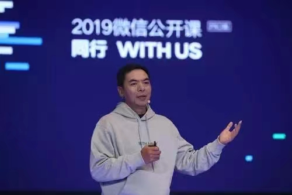

### 2021微信公开课

张小龙：现场朋友们，大家晚上好，刚刚站在这里看到很多认识的朋友，虽然戴了口罩，还能认出来一些，这种形式特别好，特别感谢大家今天晚上在这里参加我们的微信之夜，跟我们一起度过这个夜晚。
 
确实没有想到，2021年我们公开课会用这样的形式来进行。我记得好几年前有次公开课提到，你们这么多人来到现场是不是很浪费时间，我们真正要传递信息应该可以在线上做了，为什么非要线下跑这么远？
 
没想到因为疫情原因，真的变成了我们不得不进行的一个以线上为主的活动。在我自己看来，我还是觉得，我不去想那么多直播的观众了，很小范围做这样一次产品方面的研讨。这一年变化特别快，有疫情很多人觉得过得特别艰苦，同时也发生了非常多的事情，都是意料不到的。
 
微信2020年也做了特别多的事情，在2020年这个时候我们还想不到，**2021年这次公开课是以视频号直播为主来进行。**因为疫情原因，我们自己年会都已经变成线上。
 
我相信有很多人特别关注我们公开课，因为2021年刚好是微信十年，时间过得特别快，十年以前当时想法特别简单，我自己也不怎么用QQ，也需要有个沟通工具。如果还有很多人跟我一样需要，其实当年的目的就是写个东西，给我自己发邮件用吧，出发点特别简单，就开始这样做了。

>（如果你不知道如何发现需求，那么，先从满足自己的需求开始。）
 
其实当时绝对没有想到，十年后的微信会是这个样子，当我们过了十年回头来看的时候，我自己觉得特别幸运，一个是我觉得我已经是被上帝选中的那个人，光靠个人努力做不到这一点，所以感慨还是挺多。我们看一组数据，到今天每天都有10.9亿用户打开微信，3.3亿用户进行了视频通话；有7.8亿用户进入朋友圈，1.2亿用户发表朋友圈，其中照片6.7亿张，视频内容大家猜猜有多少条？
 
短视频1亿条，每天3.6亿用户读公众号文章，4亿用户使用小程序，这样一个量级，还有很多，包括像微信支付、企业微信、微信读书、搜索，不一一列举数据了，就像微信支付可能就像你以前的钱包一样，已经变成了生活日常用品，我自己也觉得**微信是一个生活方式。**
 
当时觉得挺虚的，只是为了给自己一些想象的空间，但是没有想到的是，十年之后真的变成了某一种意义上的生活方式。**公开课这个场合我要特别感谢一下，微信作为一个内容创作平台，也感谢平台里的每位创作者，包括公众号、小程序、视频号的这些创作者，如果没有他们的创作，我们的生态可能不会这么有活力。**
 
2021年公开课我分成几个主题，很多人会对视频号这一年进展比较感兴趣，想说一下我们第一个主题是关于视频号的一些故事。
 

#### 关于视频号。
 
可能大概在2017年的时候，当时我跟公众平台团队聊到，我们现在公众号只适合写长文章，写长文章的人是少数，大部分人写不了长文章，我们应该在朋友圈下面多一个东西，当时想做“非朋友圈” —— 发一些短文、照片、视频，和朋友圈是对称的。

>（平台的丰富，最终要依靠创作者生产内容。降低使用门槛还不够，还需要降低创作门槛。如此，生态才能丰富，才能有“生命”。)
 
有次我和Pony（马化腾）吃饭时候聊到这个点，他非常认同，后来不了了之，可能因为这是个太大的工程，整个帐号体系都不一样，虽然时间推移产生了很多变化，我们当时想非朋友圈是一个文字、照片为主，**大家慢慢发现视频化表达变得越来越普及，变成很多普通人的一种习惯。**
 
我们看几组数据可以看得出来，在微信里面最近五年，每天发视频的数量上升了33倍，朋友圈里面视频发表数量上升了10倍，所以当我们在考虑这种短内容的时候，以文字还是视频化内容来做，**视频化的表达可能是下一个十年内容领域的一个主体**。
 
虽然我们不清楚到底是文字还是视频才代表了人类文明的进步，但是如果从个人表达或者消费程度角度来说，时代正在往视频化表达的方向去发展，所以2019年我们组建了一个特别小的团队，一、二十个人，我们开始开发“视频号”这样一个产品，当时你可以理解，给它的定位是个视频化的微博。
 
大家可以看到视频号长得特别像微博，很多人说视频号是我们公司战略重点，其实并不是这样子。我们公司短视频战略重点还是在微视，我们确实也没有问公司要什么资源，甚至没有开个会立个项说我们这是重大项目，并不是这样子，我们自己找一波人就开始做了。
 
在座很多人特别理解，这是微信团队自己的一种风格，**做个新东西最好是个小团队悄悄做，而不是大张旗鼓变成大项目，我们给自己目标，我们要做一定要做成它，所以这种压力是来自内在的，而不是任务式。**

>（好的产品，来自热爱，而不是任务。如果以任务的心态来完成，就会变形，变硬）。
 
当时发布以后，很多媒体都不太看好，我们自己就说，其实我们早就总结出来了，**微信做的东西如果一开始外面都不看好，就说明这个东西还有戏，如果都很看好可能会很麻烦。**所以，它的起源很简单，说回到视频号到底是个什么东西？

>（马云说：如果人人都看好，那么，伟大的机会一定轮不到你。大家都看好，大家都来竞争，赢得比赛就会无限艰难。如果很多人不看好，而你看好，且坚持做，就会少了很多竞争对手，只要足够坚持就可以胜出。)
 
**给个简单的定义，是人人都可以创作的短内容平台，它是一个公开领域的内容平台**。我们遇到第一个问题，关于它的ID问题，身份的问题，我不知道大家想过没有，微信很大的价值在于它的身份或者说它的ID价值，有了这个身份，我们可以做很多事情，比如说微信支付，因为我们来做支付那是最方便的，所有支付都是和身份相关联，你们现在拿一个身份证直接去取钱是一样的，ID是基于社交和通信领域，是私密的并不是公开领域的。
 
然而你用微信身份在视频号后面评论一个文章，别的人没法与你联系和互动，他访问不到你，因为那是一个私密的ID。

我们做视频号首先要放进一个新的身份，它其实会有挑战，这个其实是微信里面一直非常缺失的一块，因为我们有一个公开身份，以前是公众号的ID，这个ID不代表每个普通人都可以有的一个ID，所以从这个角度来说，我在内部有次分享也说到，**视频号的意义，视频还是其次，更重要意义是有个号在这里**—— 通过这个号每个人都有了一个可以公开发声的身份，将来他发声的内容可能是视频，也有可能是直播的一些东西，账号的意义在这里会更大一些。

>（基于微信ID的一切衍生品——朋友圈等，都是熟人社会，只有加了朋友、成为强关系才能沟通和连接；而公众号和视频号是陌生人社会，主要产生弱关系，陌生人之间也可以随意沟通和连接。）

这是为什么大家可以看到我们直播进行得特别快，不管怎么样做都会发现，我们没法突破这个身份，所以我们做了直播，也只是种私密领域的直播，一直到拥有视频号这个ID之后，直播变成一种公开领域的事情。
 
我还记得当时我们在刚开始做这个ID时候，内部还有个方案，每个人进到视频号必须创一个新的ID，这样才能用来评论内容，单一ID互动，就不会产生后来我们遇到两个ID的冲突问题，后来我们幸好没有选择这条路径，这样社交就走不通了。社交是以微信身份这样的ID进行的，大家看到微信十年积累的产品，包括视频号到现在都是选择，迭代带来的结果。
 
刚才说到ID还有个特别重要的作用，不是针对个人，而是针对机构。这里面有很多人很有资历，大家知道PC时代最大的一个ID，机构ID是所谓的官方网站，每一个公司机构都会建立自己的网站注册一个域名，域名是它最重要的ID。
 
但是在移动互联网时代，建立网站已经没有意义了，如果大家看一下微信的平台性发展线索，可以看到微信始终在想着，我们怎么样去帮助这些机构建立官网，我们最早做公众号的时候，公众号就是每个机构的官网了，做小程序时候我们又说小程序是你的官网，可以把服务放在里面。我们做视频号的时候，我们又说视频号才是你真正的官网，这也是合理的，因为官网也是需要进化的。（官网是服务的载体吗？）
 
这个角度大家去理解视频号，它会承担一个机构很多服务性内容，而且它并不局限于这些内容，大家可以想象将来视频号下面可以挂很多东西，这个机构小程序，公众号，甚至你的一些会员服务，优惠券等等。
 
因为从一个机构ID的角度来说，确实视频号反而是最适合的一种载体，我们在内部希望，将来在机场或者哪里看到每个广告牌下面，都有个公众号的二维码，公众号已经变成一个机构ID了，我们做小程序的时候，希望每个广告牌下面都有广告主小程序的二维码，现在我们反而是希望我们在每一个广告下面，最后连接到的是它视频号的二维码。
 
所以，我们在第一个版本里面只是搭建了这样一个简单的ID体系，它跟公众号特别像，但是**比公众号门槛低很多，确实普通用户几秒钟时间就能创建一个自己视频号的ID**。内容表现上也特别简单，里面混合了关注、朋友匿名点赞内容、系统推荐内容在里面，放出来以后因为是灰度，开始放的量不大，有一帮的用户都还是我们公司的同事，后来逐渐放出来一些量，也非常差，吸引不到特别好的创作者进来，我们在里面做推荐，这一个信息内容推荐质量也就非常一般，所以我们要改进推荐算法，后来组建了推荐算法的团队，每个团队十几个工程师，我们希望通过这三个团队的不同方法，去找到推荐的最优方式。

> （我很喜欢马云的类比：平台就是第二次世界大战中出现的一种新型武器——航空母舰。航母本身就是一个平台，它不能打仗，只有它上面的舰载机才能打仗，航母的作用就是给舰载机提供弹药、燃油，让舰载机迅速起飞、降落。但航母是需要护卫舰保护的。我们本身不能打仗，所以有人跟我们打仗，我们很吃亏。那打败对手的是谁？是我们平台上的企业打败了其他企业。）

> （对于一个内容平台，它自己就是航空母舰，它不能真正去打仗，只能赋能。各个内容平台的最终的战斗是创作者之间的战斗，谁能吸引优秀创作者进行创作好的内容，哪一个平台就会在战斗中胜出。）
 
外界有些误解，我们在技术这里不是特别强，其实我们在算法领域沉淀还是很深的，我们有搜一搜这个团队，几百个搜索功能在里面，我们自己有团队做语音识别、机器翻译，应该都是国内的第一流水准，就像很多人说微信里面的语音识别是不是用第三方服务，我也不知道为什么会有这种疑问，都是我们自己内部团队研发出来的，目前语音识别，在微信里面翻译语音条数每天有5亿条以上。
 
我们还是当时用了一个举措，进入到视频号的小团队组成一个很闭环的小团队运作，推荐团队工作得很辛苦很努力，但是我们头几个月滚动效果很差，原因这是一个死循环，你的内容不好那就没有浏览量，没有浏览量就继续没有好的内容，所以推荐也没法推出更好的内容出来。
 
一直到（2020年5月份）特别大的改版，让我们重新看到希望，我们发现当时有一点为什么走不通。我们得出一个结论，当时在不太全面的内容里面，基于机器推荐走不下去了，比如说我们自己更愿意看哪些内容是朋友赞过的内容，还是机器推荐出来，可以很明显感受得到，朋友赞出来的内容当时还是匿名形式，我们后台可以知道是哪个朋友，和推荐出来对比看，其实朋友点赞的会更好看一点。
 
当时我们差点放弃了，不继续做算法推荐，确实就像**我们平常所看的一些书或者别的一些东西，大部分人是因为周围有人推荐，所以你才会去看，不是跑到网上一个书店自己去找书回来看。所以，这也是视频号最早通过社交推荐来做的一个理由。**
 
我们经常每两天变更一个版本，一直到我们发布两个星期之后，发布了一个基于朋友点赞的版本，发布以后看到数据上扬得非常好，用户留存非常高。所以2020年6月的时候，其实当时的用户量到了一个量级了，刚刚我们公关不允许我说这个数量，但这个也不重要。
 
我之所以说这一点，是因为对一个内容形态的产品而言，**一定量级的用户和活跃度才意味着你走过了生死线**，就是它的流量循环已经起来了，否则的话，你就一直要为它的生存去找到方法才行，所以特别有意思，这是典型的微信方式的产品方法。就是通过我们找到事情的撬动点，用产品规则的方法让整个事情流转起来。

> （找到一批“种子用户”能够测试你的产品MVP模型，能够看到测试的数据和用户真实的反馈。如果没有小范围内进行PMF（市场匹配测试），那么，你就是在闭门造车，就会带来需求模型的偏差甚至错误。）
 
最终，当我们有了这个用户基数以后，后面我们要做的就是布局一些相关的能力，包括直播。如果我们没有走过这个生死线，可能做越多功能都是白搭。所以，在这里社交推荐发挥了非常重要作用，当时的机器推荐占比特别少，视频的浏览量特别少，留存也特别低。但是并不是说机器推荐没有作用，**机器推荐可能只是说，当你的内容比较丰富的时候，它才能比较好发挥出作用。**
 
> 这里插个小故事，在2020年6月，我们这个新版还在开发的时候，我就在黑板上写了一个猜测，我说在未来我们的视频号里面视频消耗流量，它的比例应该是什么样？我就说，**我们现在视频号里面有三个tab——关注、朋友点赞和机器推荐，我说这里面内容消费比例应该是1：2：10的关系 —— 平均一个人看10个关注的视频，20个朋友赞的视频和100个机器推荐的视频**，为什么会是这样一个比例？
 
> 虽然我们那时机器推荐这一块还特别低，只是这样思考：我们把所有的内容分成两种，一种是你需要花脑力去理解的知识性内容，简单来说就是学习；另外一种是你不需要花脑力，可以很舒服去消费它，在你思维舒适区里面，简单来说这种内容是娱乐内容，大体上就这种内容。
 
> 朋友点赞的内容，其实是朋友强迫你，一定要去接收一些新的信息，或者学习的东西，未必是你特别感兴趣的，它属于学习类型。机器推荐的东西更多让你浏览很舒服，很放松，不需要动脑，偏向于娱乐内容。还有关注里面应该就是这两种内容都会有，我们就猜测为什么说这样一个比例？

> 因为你关注的东西它大概是什么东西，对你来说没有新意，未必有更新的东西在里面，它对你没有吸引力，所以它的比例是1。朋友赞的东西看的很累，你不得不看，你不想错过热点，所以是，比关注大2倍。机器推荐符合**人比较懒这样一个原则**，大部分人会去消费比较舒适感的内容，所以它是10，这样一个猜测。
 
> 但是我们现在的数据并不是这样一个比例，我们现在是朋友赞的观看总量是机器推荐2倍还多，说明我们推测是错的吗？并不是这样，我们换一个角度来看，这是总量，我叫我们团队跑了一个数据，关注的用户他们所产生的数据来看。因为有关注在我们里面还是比例挺少，带来的活跃用户，关注用户在这三个部分里面所消费的内容总量是多少，数据一看其实有点吃惊，因为活跃用户在里面产生的人均消耗的VV（Video View的缩写，指视频播放数）刚好是1：2：9这样一个关系，并不是说预测特别准确，而是说**我们做东西的一个习惯，如果这样做，我们应该先推理出来这样一个结果，去验证这个数据，验证时候发现验证这个想法或者这个方向是对的**。所以，我们现在看总量推荐是整个朋友点赞的1/2，其实它是一个不太正常的，我估计为例这个比例还会变得越来越大，1：2：10，因为我们现在内容分布不够，我们机器推荐出来触达没有那么大。
 
说得有点太产品了，我觉得在座很多人都会对这些具体新的产品形态挺感兴趣。微信尝试过各式各样的产品形态，其实在很多别的产品里面未必有这个机会去尝试。**可能机器推荐带来的内容消费量会越来越大，很多人会想起我以前说过这个事，这是两回事情，确实我们不会关注用户时长，我们不会以用户时长作为一个导向去考量一个目标，或者作为一个KPI，我们更关注帮用户完成什么任务。**

> （我们需要一个以平台的视角来思考创作方向。当你能够为平台创造价值，帮助平台完成平台需要的内容，你就能得到流量的倾斜。）

如果在推荐这里他消耗了很小时间，说明我们这里很多内容值得他去看，但是这个目标并不是我们为了消耗他更多时长，所以时长最终会是一结果而已。

> 刚刚说到最关键的一个转化点，微信里社交推荐使得我们视频号能够立足下来，并且在下一步推动机器推荐的方法，可以让内容被更多人所接触到。
 
在此过程中会有很多问题，也挺有意思。举个例子，我们在中间遇到一个问题，究竟什么是视频这回事情，我们每天都在说视频化，到底什么是视频？
 
说到视频，大家会想到一个视频文件就是一段视频，就像在朋友圈里面你要上传一个本地文件，视频文件，我们确实鼓励你这样上传，这样原创率会高一点。我想跟大家说的是，视频文件这种东西以后可能会消失，我不知道大家有没有想过这个问题。
 
大家以前用Windows，当你转到MAC系统以后就会遇到这样的问题，Windows管理器去哪里了？你用苹果手机也会说文件管理器去哪里了，为什么没有文件这回事情了，这些是不应该单独存在的东西，文件都应该归属于某一个APP去解释它才有意义，否则都是一些原始数据没有意义。
 
对视频也是这样子，我们现在所说视频大部分是指视频文件，发到朋友圈里的等等，但是原始数据它只是一个文件，没有办法关联到其他一些东西，它没有办法标注谁是创作者，没有办法直接看到观众的评论，没法知道哪些人看过了，我们群里转很多视频确实只是在转一些文件而已。

> （在视频号中转发一个视频，并不是转发一个文件，而是一条视频以及附带的所有的信息，其中包括：原创作者的ID、评论区、浏览信息、以及全部的视频数据：点赞、关注、收藏、转发。）（视频号中的视频分享≠视频文件分享）
 
> 对视频号来说，视频应该是结构化的数据，结构化数据才能有所有刚才说这些东西，并且它就是应该存在云端，这样可以很容易就分享出去。我们在微信里面每次分享一个视频，还要传一个文件过去，又占流量，这样方式是不对的，它应该被淘汰掉。
 
这也会让我们反思，我们还在朋友圈鼓励用户上传视频，应该更新掉了，你的视频应该是结构化数据再上传到朋友圈，我们把视频号内容分享到朋友圈就遇到一个问题，它应该分享到朋友圈里面的是视频式样，一点就可以播放，还是应该是一个链接这样的式样？
 
这里关键的一个问题在于，是个网站，是个网页，还是它是一个视频文件，或者说是一个视频，我的答案是，**我们云端化的结构化的视频才是视频，本地视频文件是一些裸数据，应该被淘汰掉，视频就是应该过渡到云端化的一种视频格式。**
 
大家现在在朋友圈里面看到很多人转的视频号的视频，和在朋友圈里面看起来其实没有什么区别，在这个地方的视频化，你可以理解为是结构化视频内容的载体，所以微信将来里面流通的视频内容应该越来越多会是视频号的视频这样一种形式存在，而不是视频文件的一种方式。
 
**大家可以想象得到，这样的事情在以前公众号体系已经发生过一次了，公众号是文章的载体，因为文章存在的价值是被分享出去有人看到，如果没有公众号这样一个载体，我们只能传一些文件出去，其实是很费劲。**

> 如果大家理解了公众号对文章的价值，大家都可以理解视频号对视频的价值，我觉得这两个是非常类似的。
 
视频号更多的意义在于，它是一个视频内容的载体，可能很多人对载体这个词理解不是特别深，载体还有什么含义？

> **载体是承载这个内容，就说明我们不是做这个内容，我们也不会去生产内容，不会去买内容，我们并不关注具体的内容到底是什么，载体的意思是我们只做内容的承载和传递，做这些事情。**

所以，如果大家不是特别理解的话，再回忆一下公众号。
 
视频号里面还有长视频的问题，人为区分出来的，我们最早定义它是1分钟的时候，有点类似于偏短内容，因为这样很容易去刷完它，自然很多人会说我就是有超过1分钟的视频，当时我们就面对一个问题，我们怎么样去融入这些比1分钟更长的视频内容。
 
我们最早会有一个做法，我们把长视频定义为专门一种数据类型，和短视频不一样，看长视频专门到长视频那里去看，我们不应该做这样一种区分，他们消费的场景不太一样，我在刷信息流的时候希望刷短视频，别的地方我可能希望看长视频，应该是同一个东西。
 
但我们把这个问题的答案，归结为不存在长短视频区分，只存在短视频是指1分钟以内，如果是**长视频就定义为头1分钟（短视频）是整个视频封面。**因此你头1分钟也可以拿出来分享，拿到流里面去刷，别人如果看完你的封面1分钟，觉得很好看就会继续看下去，如果不好看代表你这个封面没有吸引力。
 
到后面我们就把视频号里面可以挂长视频这个能力入口取消掉，没有长视频专门去区分它。长视频还有一个含义就是，我们知道数据内容把它沉淀下来，它都变得非常有意义，有价值，我们希望从现在就开始沉淀这样一些视频化的内容，以至于微信就像一个视频图书馆一样，它随着时间推移可以沉淀越来越多的视频内容，这些视频内容是一种巨大的知识库，**我们希望有一天这个知识库通过搜索推荐的方式可以被挖掘，长视频是对未来数据的积累。**

> 人工智能如果没有大量的数据去支撑，那么，它就是一头猪。
 
刚刚说了这么多，好像跟每个个人没有什么关系。在座发视频比较活跃一点，更多的人不那么日常去发视频号，我们的目标确实是：**人人都能够很容易通过视频化的方式去公开表达内容。**
 
我们也知道让一个普通人去发表内容是非常困难的事情，虽然说我们现在还没有做到让很多普通人去发表内容，我们做了一个小举措，这个小举措比我们预想的结果好很多，把视频号放在名片里面，结果好很多的是，比我们预料更多的一些用户把自己的视频号内容关联过去了，这个数据我想说，公关又不让我说，所以我又不能说了。
 
这是一个特别好的趋势，说明很多人其实愿意通过视频号的方式来表达自己，有时候大家觉得微信做东西特别保守，但是并不是保守，确实很多东西是不对或者不应该做的。
 
举个例子，我们可以把视频号内容挂在名片上面，我们以前为什么不做这样一个类似展示自己的内容呢？其实我们内部讨论过很多次，说我们要不要在名片底下，很多人朋友圈设置了三天可见，越来越多了，可能有两亿以上了。我们打开朋友圈看不到东西，为什么不给他们提供照片精选展示的功能，我们不愿意做这个功能，一旦我们做了，你把历史上最好的照片放在那里，就不去修改它了，这个数据不是活的，对看的人来说就会觉得还是死的数据，没有什么意思。
 
这次我们愿意这样做，如果你关联到视频号的内容，它就是活的，因为你会不停更新你的视频号内容，而不是我选历史上最好的照片做精美装饰永远不变了。所以**对视频号来说，虽然我们还没有做到，但是我们目标还是希望它变成普通人都在用的一个产品，并不希望它仅仅是一些大V、网红在这里表现的地方。**
 
很多人也会关注到视频号正在变得全屏化，大家可以看到我们在关注和推荐里面已经变成全屏了，好友的赞这里也会做灰度的实验，我稍微说得专业一点点，是一个什么概念？其实是关于信息列表的展现形式这样一个概念。

> 这是一个我学习的方法：如果我是张小龙（微信产品经理），我会怎么做？我会怎么思考？得出什么结论、论据是什么？
 
信息列表就是有很多项内容，你怎么样把它展现出来。常见我们看到会有一些所谓的瀑布流、信息流，还有全屏这样的东西，它们的区别就是一屏里面放多少条内容是合适的，到全屏底下就是一页里面只放一条内容了。在这个过程里面，经历了各式各样的探索，非要总结出一个规律，就是**一屏里面内容条数是跟一页里面用户感兴趣的命中率呈反比，如果这10条里面你感兴趣的越多，这一页里面可以放越少条数**；如果每个内容你都是感兴趣的，就把它全屏化了，内容条数和命中率呈反比，10个里面选一个你要有选，我们要放10个让你去选，是这个意思。
 
拿朋友圈举个例子，对于朋友圈来说，如果我们现在把它改成每条是全屏，朋友圈就死掉了，因为朋友圈命中率你感兴趣的比率不是特别高，你天天刷朋友圈会很快，并不会每条都会很认真看，一屏里面放大量的多条内容，因为它的命中率不够高，可能随着你好友更多，命中率还会变低，大家会说为什么我们不提高朋友圈的命中率。
 
提高的方法，我们就要去分析内容，把你感兴趣的内容放在前面，大家看朋友圈内容不是看内容好不好，而是看我跟这个朋友熟不熟来选择，你关注不关注这个朋友，跟他熟不熟，目前机器系统是做不到的，所以朋友圈不会比较显著提高每一条内容的尺寸，哪怕你朋友圈发个视频希望全屏我们也不会这样去做。
 
关注也是这样子，你关注的东西越多，命中率就越低了，因为并不是所有人都会感兴趣，当时我们公众号改版时抱怨的人特别多，背后原因当我们原来把文件夹式入口变成了摘要展开方式时候，一屏里面条数就变少了，如果相同的命中率底下，把条数变少了，意味着你要提高命中率，如果没有做到这一点我们把每条变大了一些，其实就会有问题了。
 
所以当时我们看到一个数据很有意思，在公众号改版里面关注量少的人，整个阅读量上升了，因为它的命中率还是很高的，他关注的特别少，关注多的阅读量下滑了，因为他选择的成本更大了。所以，后来我们在订阅号顶部加了新标号，我要看的东西我在就找到了，抵掉了需要每一条所占面积变大才能提高命中率，说得有点拗口大家不用太去理解它。
 
对于视频号，我们上半年的内容丰富度很不够，命中率很高，一屏里面显示多条内容，不只是一条，这样用户可以有一个选择余地，或者可以刷，不喜欢的跳过去。那个时候如果我们上全屏，下半年我们内容开始丰富了，这个时候命中率提高了，我们可以去做一些全屏的尝试，并且确实单个全屏显示肯定会比半屏显示好很多。

比较有意思的一个数据，我们对比数据会看到我们把关注灰度到全屏之后，就发现关注这里人均浏览时长就下降了，**关注的时候很多人还是要去挑自己感兴趣的内容，而不是一个一个内容看过去**，可以推导出来我们关注里面命中率还不够高，全屏带来了比较轻微的选择困难，最近公众号里面我们也做用户关注的内容排序，也是提高命中率。
 
全屏之后我们关注这个流里面，**也会做机器推荐介入的内容排序，因为这样才有可能做到你关注的内容特别多，你选择困难命中率低的时候机器帮你最重要的先推给你看了。**
 
所以，全屏是很大风险的一个事情，如果你的命中率比较低去做全屏并不是一个好事情，我们下一步也会对推荐这个流的内容，大家可以去想一下，按刚才说的命中率理论，它会带来用户更喜欢还是不喜欢？

#### 微信直播相关
 
下面我说直播领域的事情，我们观察整个互联网的变迁史，发现互联网历史上内容形态一直在演变。

> 1G\2G\3G\4G\5G
> 文字、语音、视频、直播
 
最早的时候，你在网上写东西需要去学习TML这样一种格式语言，后来有了博客，又有了微博短内容的形态，现在更多人选择图片和视频，**直播也在朝着普通人更能够生产和消费的角度去走。**简单体现就是内容越来越碎片化了，所以我也会想还有什么样内容形态是比短视频这样的内容能够被更多人所接受，普通人也能够去生产内容，更愿意去消费。
 
这里思考包括我们自己做了直播之后，我个人觉得直播是有这个机会。它在这个内容形态演变里面反而进入到了一个更容易被大众所接受的地步，虽然直播已经发展了很多年，所以大家可能对直播认知还是在一个秀场或者带货的领域，这是从内容形态的方式来思考个人表达的内容形态方面。
 
可能大家会觉得直播很困难，因为你没有亲自去直播过，我不知道在座有多少人亲自露脸直播过，直播过举一下手，只有大概1/5的人，没有尝试过你真的体会不到那种感觉，我没法用语言来表达，我自己直播过，但我是私域的直播，和我同事的直播，好几千观众在里面，我对它有直观的感受，直播特别轻松。
 
举个例子，如果让我拍一段短视频给所有同事看，我会觉得压力特别大，我要准备思路，准备文稿，准备内容，但是直播面对几千人，我没有做任何准备，一分钟的准备都没有，只是把直播镜头手机架在这里开始直播了，大家就会提问，我就按照这个提问来回答问题。
 
> 在这里我体会到一点，我们说短视频是有创作门槛的，但是直播并不需要你去做基本的内容，所以我现在在这里不算是直播，我还是准备内容，如果一个真实的直播其实应该很轻松才对，你打开直播可能不管有多少观众，你说几句话，这跟你在微博上写一句话没有本质区别，都是一种非常轻松的表达。
 
所以，**未来直播有可能变成一种很多人都在用的个人的表达方式**，有的时候我们经常想，我们的微信名片太死板了，就一个头像一个名字，朋友圈也看不到了，啥也看不到了，让它活跃起来的办法，我点开一个人的名片，这个名片是活的，这个人戴了一个眼镜，可以直播他看到的，你只要进入他的名片就可以看到他的直播，看到他眼睛所看到的东西，这可能是直播一种形态，每个人都是别人的眼睛，每个人都可以通过别人的眼睛来看到他所看到的，这里直播变成了一个很终极化的东西。
 
我们直播有了视频号这个ID之后，发现它很顺利，前不久有一个流星雨直播，很快有超过100万人看了，超出了我们的预料，我们对这个活动没有做任何的推广，完全是用户自发滚动形成的，也是通过社交推荐起作用，有人自发把它转发到群里和朋友圈，我们可以想象，虽然我们很少人在看，但是看直播的人可能会挺多的，这是微信里面社交推荐特别巨大的一个能量所在。
 
我们在视频号和直播入口里面，还是会接入，直播多了以后除了你的朋友告诉你可以看某一个直播，我们也希望系统告诉你哪一个直播值得你花时间看，对我们会有更大的考验。直播入口我们现在还没有，我们下一个版本可能就会有直播入口了，我们把它调一下位置，直播和附近的人。
 
直播里面也会有电商的能力，包括直播可以挂到第三方小程序里面去，之前很多人也说是不是只能挂我们自己的小程序，当然不会这样子，只是我们前期实验做的东西，对小程序这个平台开放性是第一位的，我们自己做小程序跟第三方PK是不对的，我们并不会做这样的事情。
 
直播的关联性，可能大家已经习惯春节在群里面抢红包，拜年，但是这是真的一种线上拜年方式，我们传统拜年是真的面对面走家串户，这个场景更像直播这个模式，我们在希望2021年的春节会有一些人通过直播方式来拜年，那就特别好，关于视频号和直播就说到这里。

今天下午市场部同事提醒我说，可能很多用户会特别关心创作者，平台会给他们什么样流量或者扶持，但是也并不是说平台不来支持这个事情，平台会从另外一个角度来支持这个事情。

> 提到我们更加希望做一个内容的载体，并且让视频号成为个人和机构的官方网站，你首先要有自己官网平台才能够帮你，所以跟你之前在网页里面做一个官网不一样，你做一个官网只能去买搜索引擎的搜索，才能有人访问，微信里面集合了很多其他产品可能没法尝试的东西，比如说对于信息我们可能会有搜索，有推荐，有系统推荐和社交传递这样一些方式。
 
所以不用太担心内容在这里没有人会看，刚开始我们也会去邀请一些明星进来视频号，明星说没有签约费我们就不想来，我们说那不来就不来，因为我们并不是想要去买一些内容进来，而是**他应该在这里自己创作内容吸引粉丝，当他有了粉丝当然会有回报，他应该自己去努力做到这一点，而不是我们出面来购买内容这样一个方式，我们将来也不会这样去做，倒不是为了省钱，如果我们不花钱去买内容创作者还愿意进来，才说明我们真的建立起一个可以运转起来的生态，因此在微信历史上我们一直不太强调也是这个原因，如果我们在系统和规则方面的效率做得好，反而会比运营效率高很多。**
 
像我们现在看到微信支付覆盖面非常大，我们微信支付人数并不算多，支付这样一个需要跟线下充分接触的行业里面，我们可能一两个人负责整个行业，公众号Slogan被它打破了，现在放到视频号上也是很适用的。

#### 微信的实验进行时ing
 
做产品是异想天开的过程，你先有一个想法，去验证它99%都不靠谱，如果最终有一两个做下来能够靠谱，就会非常有乐趣。如果拍下一个人的头像会怎么样，拍一拍，有人跟你聊天，你扔一个炸弹把他的屏幕炸碎了，看起来真的碎了，会怎么样？听一首歌的时候你能看到跟你一起听歌的还有谁，还有画面，你在某一种状态里面，你失眠了发现还有一些人也在失眠，甚至你跟他们一起数羊，这也是很有意思。
 
能不能给这些用户一个画布，每个人上来画一个点，没有人告诉他们画什么，如果有一千万，一亿人来画这个点，这些点最后能不能变成一幅画？你们觉得能吗？变成什么画？没人敢说，人脸，我觉得没有人知道吧？肯定没有人知道，这样的东西它是很有意思，这样一些想法如果我们真的把它做成产品，它就是我们通常称为的创造，创造一些东西。
 
这里我分享一下后面的几个实验性的功能，可能它出来以后未必很成熟，但是任何东西第一步，特别是社交化产品功能，你很难预料到它在用户里会发生什么作用，必须有很多用户一起参与，一起互动，才能够知道它会产生什么样结果，所以我们也会去观察它最后的效果。
 
如果顺利可能这些新的功能，大家在后面几天我们就会发布新的版本就可以体验到了。但是，跟视频号比起来这些都是小功能，很好玩的小功能，其中一个是表情，表情其实是我们在表达方式里面一个最基本的元素。我们一直在寻找所有领域的事情最基本元素，我们做的东西不至于太多，但是又非做不可的东西，拍一拍有很多人不太喜欢，你们不喜欢被别人拍，还有很多人拍错了很尴尬，仍然有1.2亿人他们设置了拍一拍的尾巴，**是一种表达方式的基本元素，跟所有别的方式都不同，模拟人在现实里面身体行为动作，而不是通过发一个信息。**
 
有一次我在内部开玩笑，**未来人们生活会越来越线上化**，人们会怀念很古老的人和人之间的互动方式，所以表情是我们表达的基本元素，微信表情已经很多年没有做大升级了，用户给我们贡献了非常多的自定义表情，使得它能够一直有最新的表情在里面运转，表情数量统计数据量太大就没有意义了，**我们观察了一些比较小数据量，能反映出一些趋势，比如说人们表达出来地情绪越来越强烈了，裂开这个表情非常受欢迎**，以前没有这么多比较强烈东西，我刚才说如果扔一个炸弹出来屏幕都裂开了，或者动画效果，我们怎么样把这样一个东西归类到表情的基本元素，使得它是一种通用的产品功能，好在我们最终还是找到了方法来做这一点，我先不剧透，大家过几天可以用到了，我们新版本里面包含了这样一些表情的能力。

> 未来人们的生活越来越线上化，如果假设是成立的，那么，都会衍生出哪些需求呢？体验线下生活，满足缺憾感 —— 拍一拍、状态。
 
关于*状态*，我们打开任何一个人微信名片，名片里面几乎没有什么东西了，但事实上可能未来名片它就应该是活的，应该包含你当前的状态，比如说你现在坐在这里，这个才是你的状态，如果没有很多隐私，你并不介意被很多朋友看到，坐在一起开会的人说我们状态都一样，我们在这里开会也希望互相看到，这是我们引入“状态”这个东西希望来做到的一个事情。
 
视频动态表达一个人的状态，但是视频化表达在这个地方表达挺困难，每天只有100多万人发视频动态，我们也会把它升级一下，走到视频另外一面，每个人发文字很困难，你发一段让很多人看的文字很困难，如果自己随便说一句话并不困难，所以“状态”应该是随便说一句话这样，我们走到视频另外一面，通过你随便说一句话，随便写几个字来表达自己的状态。
 
所以，我们也希望看到一个场景，未来如果你在某一个状态里面，你一定也会希望看到还有谁跟你在同一个状态里面，你也希望看到他们，比如在一起打游戏，一起旅游的人，甚至是同一种心情的人都可以被“状态”涵盖进去，有时候我在内部经常说社交的本质是找到同类，状态也是帮我们找到同类的一种方法。
 
> 社交的本质是找到同类，状态也是帮我们找到同类的一种方法。

确实不太知道这个结果会怎么样，并且它还很不完善，所以我觉得我们后面要经历两三个版本才能让它变得更完善一些。即使这样子我们还是把它在新版本里面灰度出来，这样大家有机会先去尝试一下。
 
刚才又说到关于个人状态这样新的尝试，还有一个新的尝试，一位观众跟我聊过怎么样*看见一首歌*这样一个话题，歌不是用来听，而是应该用来看的，自从有了移动互联网以后，我感觉很多人听歌变得少，只有开车时候才会听歌，因为任何其他时候你会宁愿去看视频了。
 
微信其实是一个包含的信息种类特别多的东西，我一直不太满意是在微信里面听歌体验不太好，比如我特别不理解为什么所有播放器都是一个电唱机在那里转，我中学的时候有一个电唱机，我还去买唱片，我想大部分用户不会经历过那个时代，他们不认识的一个物品，一个唱盘在那里转。

> 音乐视觉化。
 
我们听歌时候我们应该做什么？很多人会选择我们听歌时候不应该看到什么，而是应该听就好了，但我就希望听歌时候能看到一点东西，**听歌时候你是会有想象力的**，我们开车时候喜欢听歌是因为眼睛看到很多东西，想象力比平时更活跃了，听同一首歌有很多人，另外一个人在另外一个场景，很多类似的人，听歌人眼前画面都连起来的话，总有一些人，从这个点上出发，我们把听歌体验做了视觉化的展现，基数还没有到那一步，我们眼球里面都有一个摄像头实时传到云端，到了那一步也是很可怕的，未来迟早会到那一步，目前我们通过别的产品才能做到这一步，有些热心用户会能够变成一个制作得很精美的类似于MV的东西分享给更多的人看到，这是听歌的体验。
 
我们还做了比较小的几个改动，浮窗其实我挺不喜欢的，它特别像一个狗皮膏药，占了你的屏幕一个位置，很多朋友看文章看不完，一边处理消息一边看，不是很好的解决方案，新版本你不用去占屏幕，可以非常快速切回你想要看的文章里面去。

还有一个跟浮窗类似，比如我们遇到另外的问题，直播时候我们有时候会遇到不知道从哪里点进去这个直播，我回头退出来了找这个直播就找不到了，关闭它了以后，同样情况你看一篇长的文章，我们也做了一个小的优化，在以前我们可以把微信拉下来，里面有最近用过的小程序，最近看过的文章-没有看完，看过的直播-没有结束的，看过的视频-没有看完的，这里你可以很快找回它们。

预告一下，还有一个新的东西，每个人平常都用得着的东西，关于*输入法*，原来并没有想法做一个输入法，我们平时收到特别多的投诉，“微信你是不是暴露我们的聊天记录了”，只有业界一些人才能知道这个是怎么回事，普通用户完全不明白，可能在座人都知道我们确实不会看你们聊天记录，即使这一点我相信你们也有点不相信。
 
但我们公司人确实知道这一点，如果要看会被开除，并且我们这里不保存聊天记录，而且即使最近3天聊天记录，因为它必须要在云端保存下来，如果我们要去分析这些聊天记录，可以给公司带来非常大广告收入，但是其实我们也没有去分析它，所以微信对用户隐私我们是非常在意。
 
为什么你还是会在微信里面说过什么，等会就收到广告呢。有很多地方，并不是只有微信在处理你的信息，这个出发点我们技术同事就聊到说我们为什么不自己做一个输入法，我想好啊，我们有这样的技术团队，正好是做机器翻译的，他们本来在AI领域有非常好的积累，前不久他们还获得了翻译比赛的冠军，他们也想验证一下自己的技术水准，关键我们做这个输入法如果你信得过微信隐私保护，应该也信得过微信输入法隐私性和安全性，大家说我们就做吧，不久也会灰度这样一个东西。
 
而且我觉得输入法，语音识别投入这么多，也是希望它是信息输入第一个入口，未来这一块发展越来越智能，我们想不到的新的输入方法会产生出来，我听说苹果在做眼镜，我们戴一个苹果眼镜，这眼镜苹果帮我们设计了，砸两下表示下滑，两下表示点赞，这也是很有可能的，新的输入方法，我们前期做一些投入还是会挺好的。
 
2021年讲这些新的能力差不多了，有点不像微信了，我觉得这也是个巨大的误解，我个人观念里面我觉得做事情就是应该很快的，《孙子兵法》里面有一句话叫“其疾如风，其徐如林”，快的时候要像风一样，后面我们有时快时慢了，慢并不是我们想要的结果，我们视频号组建了一、两百人的团队，三个算法团队，小规模底下能够比很多大团队跑得更快一些。产品这里我们开发大家应该理解，视频号这个速度才是微信正常该有的速度，我们下一年如果还是做得这么快，大家不要觉得有什么，是正常的一个状态。
 
**总结：**说到这里已经接近尾声了，我们确实走过了十年，微信十年每个人都有各自的体会，甚至很多人可能从人们的日常生活习惯，社会变迁等角度去考虑它，我不会考虑那么深，我从产品的角度来考虑，做了一些什么，我们做的事情可能很多，**如果非要我把它归结为非常简单一两个词来表示的话，我想用两个词来表达它，一个是“连接”，一个是“简单”，这就是微信最核心的东西**。

连接是很美的，我们世界是万事万物连接起来的，做产品做连接我们做最底层的设施，我们做好连接，基于这个连接产生出非常丰富的结果出来，很多社交产品也做连接，连到人就没有往下，微信范畴更大一些，公众号、小程序都是连接，我们这几年逐步往这个方面做，微信支付是货币的连接，视频号也会变成很多基础设施，做连接我们的重心不是做内容，而是做底层的连接，这也是为什么我们以前提去中心化。

连接和中心化会有一点点的小排斥。
 
“简单”，我用这样一个词里代替了“美观，实用，合理，优雅”这一堆的词，归结到最后就是简单，大家可能不一定认同，我自己是认可的，简单是很美的，一个物品往往都是最简单最美，工程里面我们实现一个目标可能有一千种方法，只有最简单这种方法可能是最好的，正是因为有一千种方法存在，你要从一千种方法里面找到最好的方法，是最困难也是最难的一点。

有些人知道我以前在“饭否”上写过“一个产品要加多少功能才能成为一个垃圾产品”，如果当时我知道我们后来做微信绝对不写这句话，既然已经写了也要对得起这句话，现在我要说“一个产品要加多少功能才能还不是一个垃圾产品”，现在微信虽然比十年以前多了很多功能，但是这些功能都是用最简单的方法做到了，并且在用户看到的地方去做到，用的时候才会看到它，**现在的微信和十年前一眼看上去没有什么变化**，10亿人用它的时候，简单的东西才最好用，简单的目标是一个最高的目标，特别难做到，用户不一定会在意你做的东西是否简单，很多粗制滥造的产品也会有很多人用，我们还会去追求这种简单，因为还是有一部分人知道产品简单背后的美感，他会认同这一点，这个也是挺重要的。
 
微信虽然说已经是非常大体量的产品，并且经历了十年时间，我还是希望它一直保持自己的风格，一直像一个小而美的产品一样，其实当初目标也是小而美，它有自己的灵魂，有自己的审美，自己的创意，自己的光亮，不仅仅是一个数字目标的奴隶，这样的话保持自己风格，我自己和我们的团队工作就因此而更有意义一些，这是我对微信十年最后进行的总结。
 
谢谢在场各位，也谢谢在看直播的朋友，希望我这里讲话没有浪费大家的时间，谢谢。

#### 2020年微信公开课：
公开课的朋友们，大家好。

又到了一年一度的微信公开课。很抱歉这次没有来到现场，在这里跟大家打个招呼。

其实我是故意不来现场的。记得第一次公开课，我提到说，参加各种会议可能是很浪费时间的。

我还说过，用产品说话，才是我们应该做的。大家也看到，微信从来没有开过发布会。我认为，新版本的启动页，就是微信的发布会，它直接覆盖几亿用户。

但同事们说服我说，公开课不是发布会，而是面向开发者的会议。确实，外界可能也会对微信有好奇甚至误解，所以公开课确实是一个微信对外阐述自己想法、理念的一个很好的机会。

但去年，我就想，微信团队现在这么大了，我们面临的问题，从早期的“怎么做”，到现在的“做什么”。早期我们聚焦于每一项功能，思考怎么做才是最完美的。

现在是思考，什么才是我们应该去尝试的，以及如何组织起来做。**对团队来说，早期是考验我们的产品能力，现在更考验的是我们的组织能力。**

我希望我们团队，在每一个领域都有杰出的深入的思考者。所以去年，我就在想，我不一定每年都来公开课讲。今年，我更乐意把时间让给我的同事们，让他们来给大家带来我们团队的思考。

当然，我个人也有一些小的思考点，可以在这里分享给大家。

#### 信息互联的影响

可能从来没有一个时代，每天有数亿人花这么多时间，花在手机里面浏览各种信息。而微信，可能是人们花时间最多的应用。

所以我也经常会思考，微信作为一个基础的信息传递的工具或者说平台，我们一个不经意的动作，可能会引起信息洪流的流向的变化。

我们知道，基因编辑是一种非自然的选择。因为人类强行的改变了自然进化的进展。类似的，**技术的进步同样改变了自然的选择。**

人们看到屏幕上的视觉信息，超过了现实中眼睛看到的信息。人们看到的是远方的图像，听到的是远方的声音。

**从前一个人的世界，他的大小，是由他的脚的行走半径来决定的，现在一个人的世界的大小，是由他所获得的信息的宽广度来决定的**。信息的宽广度和质量，一直是微信要解决的问题。

但人类对于信息的广泛连接带来的影响的思考，是落后于网络的发展速度的。网络的发展，尤其是最近几年移动互联网的发展，使得人人都随时在线，并且面临海量的信息。

这在历史上，甚至十年前，都是难以想象的。人们真的能驾驭这种信息互联吗？还是说，技术在引导甚至控制人们的生活方式？

可以从几个维度来看一看这种影响，包括隐私，信息获取的被动，社会关系的扩大和复杂，信息传播的快速，信息选择的困难、信息的多样性，搜索的困难。

#### 一. 隐私的出让。

从历史来看，科技越发达，个人隐私会越少。人们在获取便利性的同时，其实也在不知不觉地一点一点把自己的隐私范围缩小。

比如**精准广告和用户隐私其实是有矛盾的**。

作为平台，因为我们有大量的数据，什么该用，什么不该用，其实是我们一直思考的问题。我们在这里也倡导同行一起重视这个问题。

#### 二. 信息获取的被动。

> 你所看见的，或者说，你所阅读的，决定你是什么样的人，会有什么样的想法。

互联网让信息唾手可得。可是，从信息的海洋中获取什么样的信息是个很有挑战的问题。

> 事实上，很多人并不愿意主动去获取信息，而是更倾向于被动获取。

**记得好几年前，我说过一句话，“推送改变世界，因为用户更懒了”。**

包括微信，也是基于推送的。你收到的每一条消息，都被你把优先级排得比你要真正要获取的信息的优先级要更高一些。

> 那么，推送什么信息，决定了用户会看什么信息，决定了他在一个什么样的世界里。这是一个我们要经常思考的问题，也是我们在努力的方向。

所以，我很少说分发这个词，我觉得推荐可能更尊重一些。

三. 社会关系的扩大和复杂。

人是社会关系的总和。

而如今，社会关系越来越多地体现在微信好友，群，朋友圈的互动里面。比如，中学、大学同学，因群而活跃起来。

过去，学术上有个词，叫邓巴数，是说一个人最多有150个好友。但在微信里，显然它被打破了。人们对于好友的维系能力，和移动互联网之前的年代相比，突然增大了很多。

之前我们限定一个人最多5000个好友，现在有将近一百万人已经接近5000好友。虽然不是真正意义上的好友，但也促使我们要扩大好友数目了。

我记得附近的人上线时，我自己其实都有隐隐的不安，因为从前我们和附近的人的界限将被打破，我不知道它是好是坏。

这种思考，其实会一直贯穿在微信的进化里面。就像我们扩大5000好友这个限定非常容易，但是对于它带来的影响，说实话诚惶诚恐，我们会反复思考。

#### 四. 信息传播的快速。

一方面，是信息比之前更快速地传播，可能一个瞬间，一个事件就可以迅速在很多个群里面，迅速的几何级数的传播。

> 另一方面，有一句话叫“谣言传千里”，耸人听闻的内容，可能能获得更大的传播机会。

> 这是人性使然。

我们可能很难用技术手段作为一个判定内容的质量的标准，但作为信息传递的平台，我们也有很多办法，譬如说用更多的参与者和强大的机制，来帮助平台作出仲裁，就像我们对待原创和抄袭的做法很类似。

>（好的内容，其传播力并不一定好，反而会不好。）

#### 五. 信息选择的困难

看似我们面对海量信息可以自由选择哪一些看、哪一些不看，但事实上，我们不可能有时间去一一筛选，导致我们看到的总是局部。

包括公众号，看似可以随便关注，但是你的选择其实是有限空间的。

我们在看一看里实验了社交推荐，看起来效果还不错。它是一种通过好友之间的互相推荐来扩大人的选择范围。

#### 六. 信息的多样性

虽然头部大号会有最大的浏览量，但是在一个人人皆可创作的年代，我们希望长尾的小号都有自己的生存空间。

这也是之前公众号一个忽略了的部分。等一下会再讲一下。

#### 七. 搜索的困难

与web互联网相比，移动互联网的各个app更加割裂，信息难以打通、搜索。

我们做小程序，就有一个梦想，希望搜索能进入到每一个小程序的内部，这样海量的小程序可以支撑起各种**长尾**的搜索需求。

当然，小程序仍然是我们一直要改进的领域，只有小程序足够繁荣，才能支撑起搜索的内容的丰富度。

#### 关于“信息的多样性”的延伸

这里讲了我们对于信息普及、对于生活的影响，其中提到信息的多样性。这里也要说一下。

在微信的起步阶段，我就说过，我们基于手机来做app，不基于pc来做。pc端只是辅助。如果不是这样的话，我们没有办法将我们的产品普及到每一个人都能用。

回过头来看，我们当年有两个小小失误，一个是，公众平台。很长时间都只有pc web版，这限制了内容创作者的范围。

另一个是，也是更重要的，公众平台的原始想法是取代短信成为一种基于连接品牌和订户的群发工具，并且有效地避免垃圾短信。

群发的内容并不是重点，应该是各种各样的形式的内容都应该是可以的，如文字，图片，视频等。

但我们一不小心把它做成了文章作为内容的载体，使得其他的短内容的形式没有呈现出来，那使得我们在短内容方面有一定的缺失。

> 视频号也是对图片、视频的载体的弥补。

这也是为什么之前我说，公众号本身并不是为媒体准备的这样一个原因。

**我们很重视人人都可创造的内容**。

>（平台需要内容，就要拼命降低创作门槛）。

**朋友圈之所以默认是发照片视频的，是因为当时我有一个认知，对于十亿人来说，让每个人发文字是不容易的，但是，发照片是每个人都可以做到的。**

所以，相对公众号而言，我们缺少了一个人人可以创作的载体。因为不能要求每个人都能天天写文章。

所以，就像之前在公开课所说的一样，微信的短内容一直是我们要发力的方向，顺利的话可能近期也会和大家见面。

毕竟，表达是每个人天然的需求。所以这里，也是作为一个对新版本的小预告吧。

春节即将到来，我们在红包上，也有一些新的创造，可能也会吸引你来发挥你的创造力，这里也预告一下。

今天我的分享就到这里。虽然这次我没有参与现场的演讲，但是我相信我的同事们同样会给你带来精彩的报告。

再次感谢大家。

### 2019年微信公开课

#### 2019年微信公开课。

大家好，我是张小龙。

为什么这么寒冷的天气还坐满了人呢？我在后台的时候有朋友跟我说今天晚上特别冷，要多穿一点，我确实没有带这么多衣服，如果大家都很冷的话，我也愿意跟大家一起冷。

我刚刚在下面看了一下，这些吐嘈特别好，因为每天都在听到这样的声音，都已经习惯了。

在中国来说，每天都有五亿人说我们做的不好，每天还有一亿人想叫我怎么样做产品，我觉得这是非常正常的一个事情。

> （张艺谋在一次采访中说：我从来不愿意听别人说了就修正自己，因为很多很多的评论是很即兴的，不是那么客观的。这里面还有每个人心态的问题，他这文章写出来，他的心态是什么？很复杂的。）

> （如果看了某一个文章，遭了，这儿有问题 这么想，你还怎么创作。）

> （独立思考很重要！）

但我来这里不是教大家怎么做产品的，公关同学问我的时候要不要参加，我说没有确定好，还要想一想。

后来给他们提了一个条件，如果要来的话，能不能把我的时间放到晚一点的时间。因为我更希望以一个特别好的状态来跟大家做这样一个交流。

后来我用一个理由说服了我自己，今天我要过来参加一下，因为如果延续好几年来参加，突然中断了，有一点把行为艺术突然中断了一样的感觉。有的时候觉得更多像行为艺术，因为很难在一个很短时间里表达清楚特别多的想法，并且让别人能够知道，就像以往，我记得每次表达一个观念，我第二年回来再解释一下它，我说用完就走，背后有一句话，明年我还会回来的。这是一个很长的周期。

大家知道我不擅长演讲，演讲是一个技术活，是很专业的一个事情，我挺尊重专业的，所以在演讲方面我是很业余的。我只能理解为，我希望参加这样一个会议，我更多希望利用这个机会跟大家有一个面对面的交流。

#### 微信八年。

今年这样一个时间点，很特别。如果是去年，七年大家会说七年之痒，我只能总结怎么样痒的，今年是八年，并且在今年8月份的时候，微信日登录量超越十亿，这是特别大的一个里程碑。

这是国内互联网历史上第一款APP有10亿的DAU这样一个数量级。

我们没有公布过，在我们自己看来，这只是哪一天达到的问题。但是对于做互联网产品的人来说，应该还是一个很值得庆祝的事情。

最近我们发布了7.0版本，又有五亿人在吐嘈，又有一亿人教我怎么做产品。并且有八亿人看不懂那一句话，因为**看见所以存在**，是什么意思。在座有人看懂了吗？谢谢这么多知音，有10%的人勇敢举手了。

这句话可以从很多层面理解，我在朋友圈里发了一段话，但是不仅仅只是从这一个维度，可以从很多的维度。

在这里不做一个解释，留一个神秘特别好，我希望每个人有自己的解读，这是最好的。

>（就像空气、爱情，当你用注意力和心智看见后，你才可能后知后觉发现它的存在。就像那句话：少年时候我们不相信命运，长大后又开始相信命运。因为当你长大了，你看见了你所有选择和行为背后的暗线，它就是命运。）

所有说出来未必被人所理解，但是每个人自己的理解更好一些。就像这么多年以来微信是一个人站在地球的前面，刚发布的时候特别人多人问我，这个图案到底什么意思，为什么一个人站在地球的面前，更多的版本是一个人站在月球的前面，那个也是很有想象力。

对于这一个点，我相信每个人都有自己的理解，因为**我们没有标准答案**，所以这么多年以来，每次当你看到微信这样一个启动页面都会有一个想法，这个人到底在干什么，他为什么站在地球的前面，可能过了一年你这个想法又会变一点，再一年又会变一点。

正是因为这样子，这才是一个特别好的启动页面，因为它把想象的空间留给每个用户自己，十亿用户会有十亿不同的理解，他自己能找到打动他的那一个点。 

> （好奇心）。

所以看起来，很多的APP都在把自己的启动页面变来变去，但是微信不会变，并且我相信将来也不会变。

看起来微信有很多跟别的不一样的地方，就像有一个朋友说，有一次在朋友圈里说，微信是互联网界的异类，所谓异类就是跟其他所有产品不一样。

我看到这句话觉得很惊讶，同时也觉得挺自豪的。**自豪的是你是一个异类，表示你是与众不同的，在我看过来与众不同就是优秀的代名词**。

我比较惊讶的是，微信的与众不同并不是他想特别的办法与众不同，而是他守住一些做产品的底线就与众不同了。

> 并不是为与众不同而与众不同，而是因“有所为，有所不为”而与众不同。

但是因为更多的产品并不把自己的产品当作一个产品来看待，**也不把他的用户当做用户来看待**，微信只是做到了这样一些基本的点。

> （有些商家或者创作者，为了利益把用户当成傻子进行欺骗。如此，到头来，傻子就会变成自己。）

> （用户终有一天就会长大，开始明白。真诚，就是最好的套路。真真正正地为用户好，用户一定会看到的。）

例如说，大家每天使用微信过程中，确实看到微信有不一样的地方，就像现在春节很快就要到了，要上起一波春节运营大潮流，就会看到很多的APP，甚至连所有APP图标都要换了，红的黄的掺和在一起，像番茄炒蛋的图标，过一段时间你会发现屏幕上有很多的番茄炒蛋，但是微信这么多年来从来没有变过。

> Simple
  
很多人会问我们，微信为什么要这么坚持？这里面就发现对我和我们团队，以及用户，以及与在座所有人来说，大家对微信还是有很多很多不同的理解，或者一些误解。

在我看过来是一些常识的东西，在很多人看过来觉得是难以理解的。这一次的公开课，我把时间放到晚上，其实还有一个原因是，如果认真准备一个东西跟大家来分享，那我很有可能会超时，可能在晚上超时的空间很大。

我先跟大家预见一下，因为这一次我仔细准备了一些内容，昨天晚上把内容列出来的时候，发现可能我真的会超时，那大家如果要提早离场或者上厕所就请便。

之所以这次会议会认真准备这么多，因为在之前每一次公开课都是准备的有点仓促，随便想好一两个点就拿出来，针对一两个点讲一下。

但是我觉得到今天微信到了十亿的DAU，在它八年的时候，下一步它应该开启另外一个起点，在这样一个点上，我更愿意花一点时间从**微信的起源**，然后**微信的本质**，这些方面来更加全面的讲解一下微信背后我们到底在想什么？

什么样的产品是一个好的产品？是说它有很多的用户？是说它让人上瘾？还是什么样的？

>（什么样的产品是一个好的产品？）把问题暂悬起来，等待灵感的到来。

对我自己来说，我可能因为经历了很多，互联网像我这么老，经历这么多，这样一个老牌产品经理很少，对于一些产品的理念不认为所有人都已经知道了。

在很多年以前，当用苹果的手机，会研究苹果为什么能够设计出这么好的产品出来，我们当时看了很多的书，我当时也特别推崇乔布斯到底从哪里学习了这些。

> **然后发现**苹果产品的设计来自于博朗公司设计师的一些理念**，这一位设计师叫拉姆斯，他提到好的设计的10个原则，在这里**把10个原则**念给大家听一下，大家可以做一下对比，什么是好的产品**。

>  1.好的产品是有创意的，必须是一个创新的东西。
> 2.好的产品是**有用的**，它不是没有用的东西，要对人必须有用。
> 3.好的产品是优美的，它必须优美感很美，你会喜欢它。
> 4.好的产品非常容易使用，不难用，没有说明书一看就会。**（艺术家是会让人思考的，而一个设计师是直观的，不让人思考的）**
> 5.一个好的产品是含蓄的，并不招摇的，含蓄，大家体会什么是含蓄。
> 6.好的产品是诚实的。
我们经常说要对用户很诚实，大家更容易理解一个APP什么样是诚实的，但是不知道这个原则对于硬件产品，怎么对用户保持诚实。

> 7.一个好的产品经久不衰，不会随着时间的流逝迅速消亡。
> 8.一个好的产品不会放过任何一个细节。
> 9.一个好的产品是环保的，或者说是不浪费太多资源的。
> 10.好的产品会尽可能少的体现他的设计或者说少即是多。

我的几个问题：
> 1.产品创意从哪里？
> 2.有用的定义是什么？实用性强和美沾边吗？
> 3.美是一个客观的还是主观的，如何发大家普遍认为美的事情？
> 如何设计出含蓄？

这是当时拉姆斯对硬件产品10个设计的原则，我只是把它偷换了一下概念，把它转化为通用的或者软件产品，它什么样是一个好的产品，套过来照样实用。

只不过在目前的互联网来说，大家更关心的是流量，是变现，所以大家很久不会去想，什么样的是一个好的产品。

像大家在微信里做小程序，大家更多想象是微信能不能推一些提醒，推一些通知，怎么样让用户继续把它再拉过来。

大家会看到刚刚说的微信不会做一些节日的运营或者随着节日LOGO就有变化了，很多人会认为这是微信很克制的结果，但是事实上我解释过，微信并不克制，我们的辞典里没有克制这样一个词。

我们一直追寻好的设计的原则，好的产品的原则。

如果去把我们的LOGO变一下，觉得是破坏好的产品的设计，会觉得这是不美的，我们不会去做它，仅此而已，并不是我们做了什么创造。

我观察到特别多业界的产品经理，比如说很多人毕业公司之后被公司误导，因为公司做流量变现，所以就会围绕KPI变现，如果围绕这样一个目标，就不是做好产品，而是用一切手段获取流量而已。

> 大家很多人在微信这里会碰壁，当你的目的只是用微信获取流量，这并不是我们倡导的原则，我们更多的是要**做好的产品出来跟我们分享我们的用户**。

这一点上特别感谢我自己的经历，在20多年以前在用PC的时候，知道PC里面是什么样的好的产品，哪怕我一个人做，也要做成微软的产品一样好，它通过一系列的产品，教会我是什么样的产品。

Web时代做QQ邮箱的时候，也知道Web时代什么是好的产品。然后**我们经历了微信，我们经历很多，我们骨子里知道什么样的产品是好的，什么产品是不好的产品。**

举一个例子，有一次问一个同事，在PC时代最大的页面是哪一个页面？是谷歌的页面还是哪一个页面？

在PC时代其实浏览量最大的页面是IE浏览器404的页面，用过浏览器的人都知道。

我就问大家一个问题，既然是这个页面的流量特别大，微软为什么不在这里放一个广告，因为这样的广告目光是一个巨大的海量。

为什么微软不在这里放一个广告呢？我们的同事回答不出来了。

微信的启动页为什么老是一个人看着地球，为什么不放一个广告呢？这是同样的一个问题。为什么启动页不放广告，大家是不是觉得看广告舒服一点？我觉得有可能，因为每天看广告看习惯了，一旦没有广告看会不舒服，**人会适应的**。

大家可以想一下这个问题，微信八年了，最近有人晒朋友圈，两千九百多天了，虽然跟我差一点点，但也很接近了。

你想一下这八年里每天花在微信里的时间是多少？每天大概半个小时，一个小时、两个小时甚至更多。

再想一下陪在亲密身边的朋友，家人身边的时间有多少？花在家人身上，亲密身边的朋友身上多，还是微信身上多，微信可能多一点。

如果微信是一个人，他是你最好的朋友，因为你在他那里花最多的时间。

**如果你跟微信是最好的朋友，你跟微信见面的时候，每次脸上贴一下广告，你要撕下来才能跟他说话，就是那样一个感觉。**不希望你跟最好的朋友说话，先看他脸上的广告，然后取下来再跟他说话。

但是我们坚持好的产品的原则，并不意味着我们没有改变，大家看到7.0发布的时候，有一个比较大的调整，不说功能上，UI上大家看到，UI变白，变刺眼了，有非常多人吐嘈说不习惯。

其实每一个大的改版都会带来很多人的不适应，特别是微信10亿用户量级的产品来说。

当我们认识到这一点，任何一个改动都用五亿人站出来不满意的时候，我们就知道**不能按用户的投票决定要不要改，如果用户投票，我们什么都不能改了**。

> （群体有时候是偏向乌合的。其次，人是本性就是如此，改变就会带来不确定性。不确定性恰恰是让人害怕的。）

我们只能按照自己专业的判断，觉得我们应该往哪一个方向去做。就像微信7.0新版，我们试用很长时间，自己一直在两个版本之间不停的切换，我用了两个月之后，我发现我不愿意切回到旧的版本去了，我知道这个应该是我们用户可以接受，也许他们一下子觉得不能接受，但是我相信他们适应过来以后，也会接受的。

> （人的适应能力是很强的。放在哪里领域都是可以适用的原则。）

重要的是我们必须让我们的产品必须往前去适应这个时代，而不是害怕用户的抱怨就不去改变它了。

前面这一段部分简单讲解了一下关于什么是一个好的产品，为什么微信有这么多看起来很古怪的，在我看来太正常不过的一些产品的理念。

很多人会说，微信是因为这么大了，所以我经常说了一翻话，大家说我站着说话不要疼，因为微信这么大了，你怎么说都可以了。

但是我自己不这么认为，微信团队的人知道从第一天起就这么认为的，而不是因为有这么多用户了，才会这样去做。在这里愿意花一点时间来回忆一下我们的历史。

很多人都听过这样一个故事，当时我给pony (马化腾)写了一个邮件要开微信这个项目，这故事是真实的。

还有很多是不真实的，比如说我去了某某寺庙，而且这些不真实是没法澄清的，包括很多身边朋友问我，你真的去了吗，我怎么不知道？有的时候跟同事们回忆说，现在想起来有点后怕，我写邮件的晚上，如果跑出去玩儿，出去打坐，或者干什么去了，就忘了这个事情，就没有微信这个产品了。

也可能是另外一个团队做出另外一个微信，但是就不是这样一个东西了。 

> **我发现很多的想法看起来是突如其来的，往往是上帝安排的，我觉得大家要珍惜你的每一个突然来临的想法，很可能就是你的灵感**。

> 我不觉得是突然的灵感，可能上帝作为一个程序员编好程序，在合适的时候放一个合适的想法在你的脑袋里面。但是并不是说你在这边等着就可以了，上帝会放一个灵感在你的脑袋里面。

我记得在微信上线、做微信之前的一两年，我们团队在做另外一个事情。

当时QQ邮箱已经做到国内第一名，认为没有什么好突破了，我自己带了一个团队，用一年时间做了一个东西叫阅读空间，我不知道大家有没有用过阅读空间的？举手示意我一下有没有用过阅读空间的，这都是Web时代的老用户。

在阅读空间里面，我们尝试了特别多的新的想法，刚刚举手的人都很清楚，我们最早阅读空间里面是做阅读。

当时博客很流行，我们可以在里面订阅一些博客去看文章。然后推导出来的时候，推导这个模式特别好，我们在阅读空间里还做了一个广播，广播比现在微博还早，就是可以写自己的微博类的一段文字的地方。每天也可以在里面去看到别人推荐的文章出来。

由于阅读空间，因为他只是邮箱里面的一个子功能，当时用户量并不能做的很大，所以当KEKER出来的时候，它可能代表一个机会，在当时来说，我刚刚开使用智能手机，**在沟通上来说也不怎么用QQ，对自己来说是没有一个好的工具可以让我跟别人发信息，沟通、聊天，当时想法很简单，做一个给少数人用的，给自己交流的沟通工具。**

>（从满足自己的需求开始创建自己的产品）。

当时有一个团队做QQ邮箱手机版，就叫手中游，我们用这个团队就凑了十个人开始做微信，而且这十个人有两个是安卓开发，两个苹果开发，两个塞班开发，再加两个后台，加UI，加我自己，加一个产品的毕业生，大概这样十个人，经过两个月的时候做出第一个版本，这是微信的起源。

当时做出来以后，大家很忐忑，因为不知道这个东西会怎么样。今天在朋友圈里面，大概前十天的用户的人挺厉害的，因为当时微信用户量特别特别少。

在长达半年的时间里面，微信用户量都特别少，特别少的原因是，**对于一个新产品来说，让别人一下子接受它，并不容易**。

> 但是我们坚持了一个原则，如果一个新的产品没有获得自然的增长的曲线，我们就不应该推广它。

> （再没有验证完产品是一个好产品之前不要去大范围推广，而是要悄悄去迭代、去完善。先是验证它就是一个好产品，而自然增长的代表它就是一种好产品。好的产品推广，才能带来转化和效益。）很重要。PMF。

在前5个月里面，我们基本上没有自己推广它，**我们只是想看微信这样一个产品对用户有没有构成一个吸引力，用户愿意不愿意自发传播它，如果用户不愿意，我们怎么样推广它，也是没有意义的**。

从微信2.0开始的时候，我看到我们的曲线有了一个增长，虽然它不是很快，但是它是自然往上走的。这个时候我们就知道，这个时候可以去推它了。（加速辅助它）

当时是挺害怕的一个情况，微信在当时对运营商构成的压力是有一些的，因为类似短信上的替代关系。由于这种压力使得我们并不敢去获取手机的通讯录，去获得好友。

在当时来说，通过手机通讯录获得好友是更好的方式，因为它更直接，并且可以从里面挑选真正的好友。

我们不能这样做，我们只好从QQ好友通讯录挑选好友。我们不希望它成为第二个QQ，所以当做好友的来源，用户可以从QQ好友挑选好友过来，成为自己的微信好友。

我们庆幸做了当时看起来很重要的决定，第一没有批量导入某一个好友，比如说通讯录或者QQ好友，而是通过用户自己手工一个一个挑选。

> **第二个没有在产品还没有验证是能够产生自然增长的时候，就去推广它**。

这两个事情做对以后，虽然时间花的长一点，但是使得它真正开始起飞的时候，它是很健康的。

刚刚说的只是微信最早的起源。后面就是一系列的经历，这里不会再往下展开。

对自己来说，也特别的幸运或者觉得很庆幸，因为可以和这样一款产品一起从0到现在，看到它到了10亿日活的阶段。

在这样一个时间点，我从另外一些角度来回顾一下微信在这八年里面，到底我们出发点是什么，我们对每一个领域的思考。

这样会帮助大家去理解微信为什么是现在这样一个产品，微信未来又会怎么样演化。

我这里先讲一个话题，微信的初心是什么。这是我第一次讲「初心」这个词，因为我觉得这是一个很通俗化的词，所以我从来没有讲过「初心」这个词，我怕大家听不懂，所以先把它抛出来，用另外一个词替代它，我把它叫做一种「原动力」。

你可以理解为**初心**。

但是因为初心太泛滥了，很容易找到一个初心，我认为真正的初心不是那么容易找到的，我把它替换为“原动力”，做一件事情的原动力是什么。

我认为原动力是你内心深处很深的认知和期望，它很强大，以至于说它可以坚持很久，并且克服很多困难都要去做到它。

这样讲是跟初心是有一点区别的，就是更深层次的期望达到的理想或者目标。

其实我自己有的时候也会想，我们在无意之中这样做，大家总结出来的话，我把它总结为两点。

> 微信的原动力是什么？总结为两点。
> * 第一点在公开课里提过。第一点是微信作为一个工具来讲，微信希望自己一直是做成好的与时俱进的工具性的产品。

我对「工具」这个词提过很多次，但是可能还是不太理解。

这是我自己的一个偏执，或者对工具特别的热爱，热爱到什么地步，你可以想象一下，当我刚毕业的时候，亲自码代码亲自写完一个程序。

当我把它写完之后，特别有成就感，希望亲手从一块砖头堆，堆成一个产品，套上外壳，亲自写说明书，亲自写帮助文件，做成一个安装包，这是你自己亲手做工具的感觉，会有很强的成就感。

**做一个好的工具，是值得去痴迷的一件事情**。对于微信来说，微信的起点，从做第一个版本来说，要做一个自己用的很好的工具。它就是一个工具，工具本身就已经很有挑战，并且是很难做的一个事情，而且特别是好的工具，让我们自己很满意的工具。其实会给自己设立的目标会更高一些。

为什么大家不会想，做那么好一个工具。现在很多人不这么想了，不这么想的原因是跟我们的用户有关。

我自己很清楚，中国有十几亿的用户，我们大部分的用户已经习惯一种很糟糕，或者被强迫的一种用户体验，就像刚刚问大家，如果微信出一个开屏的广告，大家过一段时间就适应了。

大家会认为很多的东西是正常的，比如说开屏广告是正常的，系统推动营销的消息是正常的，或者有道你点一些链接也是正常的，这样的案例特别多。

如果大家回到短信的时代，大家回想一下短信，现在也有，回到短信时代，会发现短信里全是垃圾，垃圾信息比正常的信息要多。

**但是垃圾信息更多，这不是最可怕的事情，最可怕的事情是，你会认为这是正常的，而事实它是不正常的。**

假设自己知道什么是好的，什么是不好的，我们当然不会把很烂的东西放在这个产品上。

对微信来说，我们有这样一些底线，就是做好的工具，而且这个工具可以陪伴你很多年。对用户来说，这个工具像他的老朋友一样。我们并不愿意破坏这个老朋友跟你之间的关系。

> 不要把用户吃掉。远离“一锤子买卖”。

什么是与时俱进的？微信毕竟不是一个硬件产品，买过来就放在这里用十年八年。微信必须要变化，因为互联网的迭代速度特别快，哪怕是一个电器很少用十年八年，所以微信大家知道微信有一个口号，大家记得这个口号吗？**「微信是一个生活方式」**。

> （小步快跑、快速迭代。）

有个问题，为什么微信是「一个」生活方式，而不是「一种」生活方式？有没有人敢于回答一下这个问题？我不知道大家对这个有没有感觉，如果我们说微信是一种生活方式，那么意味着它是一个普通的一句话，它不会对你有任何的印象。

当我们故意变成「一个」的时候，你会记住它，而且会觉得很特别，为什么这样来说，它不是普通的一句话了，它会变成微信专有的一句话，我不是学品牌学的，我不理解里面的奥妙，只是直觉定位为「一个」，而不是「一种」，虽然在语法上来说它有问题。

> （反常，就是一个记忆点）。反常会让你停下来思考。

当我们说微信是一个生活方式的时候，微信还不是一个生活方式，它只是一个通讯的工具。

但是如果在当时，我们只是定位为微信是一个沟通工具的话，限制了微信将来想象的空间。

当时有一个念头，如果微信能够深入到每一个人的沟通里面去，它的好友都在里面，能够跟好友在里面频繁的交互，那么它应该可以深入到一个人生活里面去。我们会影响一个人怎么样跟朋友沟通，怎么样社交的，甚至怎么打发他的时间的。

从这个角度来说，我们是应该引导一种潮流，像微信做了很大胆的突破，它并不是功能的突破，而是生活方式的突破，或者是潮流的突破。

有很多这样的例子，当你扫一扫去获得信息，去支付的时候，其实它是一个生活方式，是一个支付的方式。当你通过摇一摇，摇到一个人，也是接触到一个人的方式。

我还记得当时我们发布附近的人的时候，自己内心里特别忐忑不安。因为在微信之前，并没有什么样的工具能够帮你一下子看到周边哪些人在。

有一种恐惧，这种恐惧是你不知道这个功能放出去，所有用户突然被发现，像所有人站在你面前一样，给你打一个招呼，我们不知道带来什么样的变化，这是一种恐惧，**对未知的一种恐惧**。

另外一个角度来说，微信因为生长在手机端，是伴随人的，所以可以做到PC时代做不到的事情，比如说找到附近的人，会贯穿到一个人的生活里面去。

我很庆幸当时能够说把我们的slogan定义为它是一个生活方式。更加清晰的是，这些年里面微信正在卷入每一个人的生活方式里面去，我们会看到大家会有群聊，会有朋友圈，会有红包，会有公众号，小程序等等，从这个角度来说，微信把自己的定位是一个生活方式的工具，这样是比较合适的。

**微信本质上还是一个工具**，我们怎么样解释我们做的公众号，小程序这样一系列的东西？这是我要提到的微信第二个原动力，我先不说它是什么。

>（ 同样一个工具，在不同人眼里，就好似感觉不同的工具。比如，抖音，有的人就从这里掘金，有的人只能成为消费者来杀时间。）

其实在做公众平台的时候，微信可以做更多的一些事情，公众平台出发点是什么样的？

在做完第一个版本大概一年多的时候，就想到一个问题，我们会取代短信，取代短信意味着什么？意味着我们又有了一个新的市场，当年的SP时代留下了各种厂商需要跟用户发短信这样一个机会。

如果我们只是取代短信的通讯的市场，怎么样通过信息收到服务的通知，就会变成一个空白。

我们知道短信是不可控的，像我刚刚说垃圾短信会很多，同样邮箱里也会有很多的垃圾邮件。之前所有人都认为这种服务的通知，就应该是这样发的。

但是我很清楚，那是不会带来一个有效的市场。因为一定会劣币驱逐良币，一定会让整个市场变得非常的混乱。

如果我们有一种方式能够避免这样一种垃圾信息，而只是让你需要的信息才会送达给你，那一定会让整个秩序会变得非常的好。

这样的方式是可以把用户端和服务端连通起来，通过一种基于订阅的关系。

> 智能推荐的雏形。我只要自己感兴趣的信息。
 
我记得当时公司get这一点特别的兴奋，觉得这样一个想法一定会怎么样。我不记得pony回什么了，好像是问“垃圾信息怎么办”。

垃圾信息天然没有了，没有垃圾信息，都是用户自动订阅的。

做公众平台就要思考一个问题，我们最终的导向或者出发点是什么？

如果没有这样一个出发点，那么我们可能会像大量的运营商一样，做成一个流量分发的平台，然后就很乱了。

经历这样一个时代的人很清楚，我们并不想把自己做成一个SP的核心的平台。

> 如果平台只是追求自身的利益最大化的话，我认为它可能是比较短视的，不会太长久的。如果一个平台可以造福很多人，这样可能才是最有生命力的。

> （平台要和用户价值无限趋近，那么，平台就会很有长期发展。同样，创作者也要和平台的价值无限趋近，如此，个人也有长期的发展。）

所以当时一直在想这个问题，**我们做公众平台到底帮到什么样的人解决什么样的问题**。

> （要给哪些人解决什么问题？）

前期一定是通过信息收效触达替换到因为信息不对称带来的一些弊端，这本来就是互联网的优势。之前，像传统的商业上做一个生意，开一个店，必须在人流量比较大的地方，租很好的铺面，然后利用这样一个人流量买东西。

但是利用互联网，地理变得反而不那么重要了，服务的质量才是你的优势。

**我们的目的是要帮助那些真正拥有好的服务的人去触达他潜在的用户，让他的用户更容易连接到他们，这是互联网带来的一个最大的目的**。

当时我们举了很多的案例，公众号出来会怎么样，我记得当时举的最多的例子，也是每次经常在公开课提到的，如果一个盲人只会按摩，是盲人按摩师，不会别的技能，怎么帮助他通过公众号这样一个平台，可以让他的顾客能够找到他，因为他的顾客会推荐给其他的朋友，所以他其他朋友会来关注这个号，然后到他这里来获得他非常好的服务。

这个盲人不需要依赖他一定要在某一个按摩所，或者找一个好的地段招揽顾客，而**它的服务质量就是他最大的优势**。

一直以这个例子来展开讨论，当时定下公众号的slogan是“再小的个体也有他的品牌”，因为这个公众号就是他的品牌了。

而这种品牌并不是对用户骚扰的方式推进的，而是只有对他认可的人才会去关注他。

从这样一个例子可以看到，在构造公众平台的时候，我们的原动力在哪里？我们用盲人按摩师举例，认为盲人按摩师代表这一类人创造价值，如果没有互联网这种消除信息不对称的机制，他的价值是体现不出来的。

**我们平台目的是让创造价值的人体现价值，这个就是微信作为平台来说，它的原动力所在**。

> 我们做小程序或者小游戏也是这样一个原动力，小游戏、公众号、小程序，所有平台类型的，都认为是在帮助那些真正在创造价值的人，让他们的价值能够体现出来，并且获得他们该有的回报，这是平台的目的。

今年前两个月，我看到一个朋友在我的朋友圈里发了一个二维码，他说现在的盲人按摩师居然用小程序来工作了，他发了一个二维码，原来是很多的盲人一起做了一个小程序，任何的顾客都可以通过小程序里面订阅他们的的按摩的服务。

看了这个案例特别开心，因为跟我们反复举的案例场景几乎一模一样。

现在很多人在围绕微信来做开发，包括公众号小程序，做小游戏，有的时候会遇到一些困难，觉得怎么老是跟平台的规则相冲突，如果大家能很好的理解，我们作为平台最初的出发点，就很好理解，像今天公开课里面，为什么我们对于公众号，对于小程序和小游戏会有各式各样的举措，其实所有的举措都是围绕这一个点展开的。

> （让创作者的价值真正能够提现出来。）

刚刚说的两种原动力，一是做最好得失与失拘禁的工具，甚至是生活方式的工具。二是作为平台来说，我们希望它是帮助创造者体现价值。

这点看起来也很简单，但是也并不简单，因为很多人并没有理解到这一点，特别最近一两年，我看到有很多业界的一些先生，是我听看不懂，违背我的常识的。

举一个例子，比如说这两年会把很多的应用，很多的APP目标都变成去争夺用户的停留时长，其实这是违背我的常识的。因为一个用户时间有限，就是24小时，吃饭、睡觉、工作，这还不是最主要的，最主要的是技术的使命，或者**互联网的使命是应该帮助人类提高效率，而不是让他把时间耗在你的应用里面**。

比如说作为一款沟通工具，你的目的是一定要很高效帮助用户完成他沟通的任务。（也不是沉浸在微信里）

像一个很简单的例子，大家用了这么多年的微信，微信从第一个版本开始，没有发生状态的，不会标明这条信息正在等待发送，或者已发送成功，但是所有同类软件都有这样一个状态。

为什么会这样？我们当时想清楚一点，什么是最有效的方式来发送信息？就是你输入一句话，一条信息，然后点一下发送，就不用看他了，离开手机，把手机放在兜里面就可以去做别的事了，这是最高效的发送方式。

如果还要盯着手机看，他是不是已经发送了，还是排队等待发送，还是已经发送成功了，还是送到对方收集了。这是一种效率并不高的方式，是需要你花很多时间的。

同样的是一种资讯类的工具，应该帮助用户在最短的时间里获得最有用的信息，而不是说非要给他很多没用的信息让他尽可能花多的时间在里面寻找，作为搜索引擎，第一个就是要获取他想要的结果，这是最高效的。

除非是娱乐类的内容，可以在里面多花一点时间没有关系，就像看一个连续剧，不会节约时间，会花很多时间来看。

对于连续剧来说，我作为很多的同事在看连续剧的时候，都是用两倍速来看，因为这样更节约时间。尽管拍成一百集，可能用户两倍速就看完了。早知道这样子，还不如拍50集。

因为有很多人跟我们说，你们要想办法增加用户的停留时长，我们怎么可能以这个目标来工作，这是不可能的事情。

让我联想到2000年左右，互联网刚刚起来，当时很流行的一个词叫“眼球经济”。

当时网站的目标是尽可能获取多的眼球的注意力。当时有一个有趣的现象，大家看文章会被裁成很多页，看一点翻一页，因为每一页后面都要加一个广告，这样广告量就会比较大。

而且看起来整个网站的PV量很大，而且现在还有很多公司使用。在微信里点开一个链接，自己的文章不会这么做，但是很多外部的文章看一点，就会多一个展开，你一不小心就点成了一个别的下载APP之类的东西。

这些并不是帮助用户提高他的效率，而是给他制造了一些障碍。

关于停留时长，还有一个很有意思的例子跟大家分享一下。朋友圈从刚发布到现在，每个人的好友越来越多。

好友增多，就会花多一点时间看朋友圈的内容，理论上来说，大家会觉得我的好友多了，他发的内容多了，我在朋友圈里花的时间越来越多，微信是不是应该鼓励用户发更多的朋友圈的内容，这样你的朋友也要花更多的时间看这些信息呢？但是我们的数据告诉我们，结果不是这样的。

从微信第一年发布朋友圈到现在，从统计总数来看，用户平均在朋友圈花的时间是没有变化过的，不管他是十个好友，还是一百个好友，还是一千个好友，平均每个用户在朋友圈里花半个小时每天。

我们看到这个特别惊讶，觉得人是一种很有趣的动物，会自我调节时间，并不是说这里东西太多了，多了以后多花一些时间，少了就少花一些时间，而是会控制，如果朋友圈刷不完，就快一点刷，我看的粗一点，只看很感兴趣的，如果内容太少了，可以宽裕一点慢慢看，也都是花半个小时。

用户其实并不会按照你的内容来分配他要花多少的时间，但是这是非常合理的。**如果我们非要让用户在这里停留的时长，反而意味着他的社交效率变低了。如果一旦变低了，一旦发现让他的社交效率更高的地方，就会到社交效率更高的地方去了**。

我们不会拿停留时长作为APP有没有价值的体现，这和我对互联网的认知是很背离的。

每个人一天只有24小时，互联网人的使命不应该是让所有人除了吃喝拉撒，就把时间都花在看手机上。

今年以前曾经有一个微信版本有一个启动页里面，放下手机多和朋友见见面。到现在，我们的观点没有变过。

相反用户找一个东西，找一个小程序，或者看一些文章，浏览朋友圈，是不是用尽可能短的时间完成这样一个事情，而不是一种尽可能长的时间。

我们为了提高这种效率，可以千方百计的去想办法。

> （高效到低效才是经济活动的趋势）

举一个例子，我自己经常遇到一个困惑，我给这个人发一个消息，我想不起他的名字了，这个时候近乎无解，因为一些人一下就想不到名字了。

但是如果有一种更聪明的办法，通过跟他相关的人联想到他，有这样一种联想能力，那就可以帮助你的脑袋短路的时候，能够找到你要的信息。

对这样一些能力，我反而认为是应当去做的特别重要的事情。

我记得上一次这么长时间的一个演讲还是在腾讯内部的8小时的演讲里面，预计是三个小时，后来讲着讲着变成八个小时了。今天不会有八个小时，大家可以放心。

我刚刚讲了一个小时需要停顿一下，因为自己很少一个人在这里讲话讲一个小时，平时跟大家开会都是一个对话式的，而不是一个人讲。

刚才讲了一些微信的原动力，下一个主题想围绕*小程序*说一下我们的看法是什么样的。

现在有很多公司也在做小程序这样的平台，小程序在三年以前在公开课第一次说的时候，大家不知道是什么东西，因为当时还只是叫应用号。

一直到今天，今年各大互联网公司都在推出小程序这样的平台。有很多公司参与来做是好事情，同时我们也并不担心这样一种竞争。

虽然大家做的东西叫同一个名字，叫小程序这样一个名字，可能一些代码的接口跟我们是一样的，但是我并不担任对我们构成很大的威胁。

除了每个公司的平台和团队都是不同的，他们的性格、能力各方面是不同之外，还有更重要的差别，在于做这个事情的原动力是什么，**如果只是借由小程序这样一个载体来做流量的生意，我自己一点都不看好**。

> （放在赚钱也是如此。源动力是赚钱反而赚不到钱，注意力放在别人的事情上，往往就能够赚钱）

> **如果只是让自己好，不让别人好的事情，不会太长久**。双赢。

小程序的使命刚刚提到，是让创造价值的人获得回报，我们都是围绕这个点展开的。

如果其他人来做这样一个平台，我们拥有流量，我们要分发这个流量，要把流量体现价值，用小程序作为载体体现这样一个价值，这跟自己的原动力所完全不一样的。

很多人看不懂小程序为什么去中心化。当你明白我们的原动力，就明白小程序有这样的做法。

**为什么去中心化，如果不去中心化，我们公司自己垄断头部的小游戏，小程序，就没有外面开发者什么事了**。

> （创作者需要学会从平台视角理解平台）：垄断会带来生态的破坏，而生态和生态也是竞争的。抖音VS视频号。

**看起来腾讯可以从中短期获利，因为自己垄断头部的流量，当然整个来生态也没有了**。

哪怕是腾讯投资的公司，也让他们一样遵循同样平台规则，否则只会破坏平台的公平性。

我们更看重整个平台的健康度，而不只是扶持自己的流量，或者扶持自己公司内部的产品。

前不久有一个国内第二大的游戏公司的负责人来问我说，他们也想做小程序，但是又怕他们做了以后做的太好了，我们公司做一个同款的，一推出来就把他们灭掉了。

我说你这个担心太多余了，微信里面是不会有中心专门去针对性的分发公司内部的游戏来干掉你，我们是不会这样做的。

我在这里要澄清一点，刚刚说到，哪怕对投资公司在系统里面，也会一样对待。但是确实大家对投资的公司是有所倾斜的。

我们在这一点上做的不够好，而不是说想要倾斜他们，只是我们对于这种平台的保护做的不够好，我相信我们团队在今后这一块投入更大的人力和资源，使得我们可以对所有的公司，包括我们投资的公司一视同仁。

在这里简单回顾一下小程序，从最早酝酿到现在有三年了，看起来有点慢，当时我们做的很出格的事情就是还在酝酿阶段，还没有想清楚，并且还没有做出一点原形出来，就先把这个事情发布了，这并不是微信的风格。

我们不会发布还没有做的东西。当时之所以这样做，就是想给自己团队一个压力，这个事情非做不可，我们一定要做到。如果我们不公布，我们可能会知难而退，会觉得这个事情太难做，有很多事情很多是不可行的。

我记得很清楚，有一年在公开课里说，我们要推出小程序这样一个服务的时候，在公开课的当天晚上跟我们的团队坐在一起讨论一个主题，**我们小程序会有哪几种死法会挂掉**？（方法论——反着想）

> （如果我知道我会死在哪里，我永远不会去那里）。

我记得特别清楚，当天晚上不是讨论小程序的未来，它有多难，我们会遇到哪些障碍我们会跨不过去。

我们并不是对它乐观而要做这个事情，而是觉得这个东西很难，但是我们要做到，而去公布这样一个事情。我们为什么觉得它一定是能够做到的事情。

有一次公开课我花一个小时来说，为什么小程序是未来。这里不重复说了，很简单一点，因为APP代表下载安装的服务，这个体验并不好，而网页的体验也并不好。

小程序应该是再这样一个年代里面出现，对用户来说最友好服务的界面。

为什么觉得网页的体验不好，公众号的体验，比你看网页就要好很多。我们用了一些办法，即使任何一个业余排版人的文章都有一定的版面的质量，对小程序来说，限定很多的空间是给你来用，这样再怎么做不会把它做乱七八糟，从用户侧看过来，这样的体验更好。

对小程序这样一个事情，我们的决心特别大，但是毕竟它是一个生态，不是我们发布2C的功能，我们这样做了，用户来用，就会立即验证这个事情成或者不成。

一个平台不可能一下子做到，需要我们有足够的耐心，我们确实也有耐心，我们在长达两三年的时间慢慢培育它。

我们经历过公众号的过程，如果我们不是用特别侥幸的的态度，只会使得第一波进来的，来**烂用它的流量，作为一个流量红利来用，这不是我们希望看到的**。

**作为流量红利来用的人并没有创造价值，它对我们的用户并没有好处，这个对平台是一种损伤**。

我们说这个口是逐步打开的，然后让对于他的用户，或者微信的用户来说，是**有价值**的应用小程序，能够慢慢的进来。

即使小程序到今天还不能说非常的成功，但是我认为它在逐步完善的过程里面。

最近看到特别好的案例，包括线上线下的案例都有。在线下大家会用小程序做店和顾客的连接器，在线上就有更多这样的线上的案例。因为它还不完善，所以这里面还要做的事情特别多。

我想提几个我们要做的重点，在大连我们发布小程序的时候，我提到一点，小程序在线下是要通过扫码获得的。在线上它应该是通过搜索和社交这两个渠道获得。

社交大家把它用起来了，但是对于搜索来说，这是我们做的还不够的一个地方。

我们在很早以前做过一些试点，比如说搜索一个航班号会立即出现一个小程序返回的页面，不是这个小程序，而是小程序直接返回的页面，把航班的信息直接展现出来。

但是这只是内部的试点，我们的目的其实是通过搜索能够直达小程序内部的数据，并且把它用一种用户可以理解的方式，或者说小程序的页面直接的返回给用户。

这样才是线上去使用一个小程序的方式。我们现在还没有做到这一点，但是我很开心的看到，我们团队内部在这一块投入很多的资源，并且有一些初步的成果可以出来。

这样也是小程序和APP的一个特别大的区别点，在现在APP里面，没法搜到APP内部去，没法知道它里面的数据，并且APP是孤岛，它连接不起来。

但是在小程序的体系里面，我们有能力搜集到小程序内部数据，自己在做一些demo，有一些新闻资讯的网站也用小程序来提供内容。通过搜索就可以直接搜到这个小程序里面文章的内容。

另外小程序正在完善它的评价体系，我们搜一个东西的时候，比如说家乡土特产，会出来很多的小程序，你不知道哪个可信，要有评价体系，更好的是好友买过或者留下的评价体系，否则没法对搜索结果做一个更好的排序，这也是我们团队也在做的事情。

> 视频号的视频的评价体系是什么？

第三个问题，小程序找回的问题。我们吐嘈页面上，有人在说能不能每一个小程序都能发通知，你觉得我们将来也会考虑这样做吗？一切皆有可能。

但是还是有一些事情是不能做的。并不是我们不愿意发这个通知，而是说他到底带来什么样的好处，如果单看发通知这一个事情是好的，但是当所有的小程序都在疯狂发通知的时候，可能就是不好的了。

>（通知就是一种强打扰。不要打扰用户。）

**大家也有这样的体验，自己手机APP都会收到无数APP通知，所有通知堆过来就像当年的垃圾短信一样，不会再理会任何的通知**。

如果小程序有这样一种发通知的能力，微信里面都会收到几百条各个小程序发来的通知，自己小程序的通知也会被淹没掉，没有人看它了。单纯发通知的能力并不是解决问题的办法。

我们会想一些办法，必须在用户能够愿意接受的情况下，可以接通知进去。

小程序我们提供通知的能力，用户在需要的时候，后面可以发一到三条的信息过去。这个方法还会有局限性，所以对于小程序的找回或者重复访问，虽然有下拉，有最近，有新标的小程序，这里还是有一些地方值得我们再优化。

我们往往思考这些问题并不是从B端开发小程序这一端考虑，而是从C端用户，他确实有时候找不到曾经用过，但是想用的程序，或者他遗忘了，但是那个对他又是有价值的，我们更多从这个角度逆推他。

7.0，微信有一个功能叫强提醒，这是对个人之间的提醒，比如说跟朋友设置了一个强提醒，他要喊你开会了，当他发一个消息过来，整个屏幕就会震动起来。

其实不是这样子的，我们做强提醒，更多的是覆盖到线下的场景，我希望的场景是说，我将来在一个地方排队，不需要关注他的公众号，不需要扫他的程序，只需要扫他的二维码，就会获得一个提醒，关于排队的提醒扫二维码，就授权给他，可以收到后续一条或者几条的通知，这个比公众号或者小程序还轻量，不需要关注一个号或者打开一个小程序，只是一次性的提醒扫一个码而已。

强提醒的本意是希望用在线下，在线下设置强提醒，当发生什么事情的时候，可以提醒我一下。对小程序之间的联系，还是未完成的状态，还要想办法，不会用粗暴的消息推送的方式。

后面一点是关于*小游戏*的。小游戏的团队对小游戏的进展和理念，在这里从我的角度简单说一下。

小游戏做到现在，从商业角度来说是挺不错的，获得现金收入也超过预期。

对这个结果，我个人并不是特别满意。因为它离我们的期望还有一个差距，我们期望并不是获得更多现金的回报，而是这里高质量原创的游戏还不是特别多。大部分的游戏还是互相拷来拷去，在一轮一轮的使用它的流量。

这里要回归到原点，小游戏的原动力是什么？公司并没有要求我们做小游戏的平台，也没有定义目标通过这个平台获得多少的收入，微信里面没有收入压力，因为当你的服务做好了，收入自然就会产生。

我们为什么做小游戏的平台，最终希望小游戏终点走到哪里去？我在公司内部做过一次分享，我也不知道内部的信息也会被公开化，最后变成一个段子在流行，真正的内容却没有被放出来。

内部讲述的是，**小游戏他的原动力是“关于创意的平台”**。

什么是创意的平台？我们理解起来的小游戏，和外界对于小游戏的理解是不太一致的。

外界对小游戏的理解，就是现在那些比较小型化的游戏套用一个小程序的壳，变成了小游戏。我们自己并不是这样理解小游戏的。小游戏应该是体现创意的地方，不应该是所有人都在玩儿消消除这样的游戏就是小游戏。

所谓创意，游戏是一个载体，或者小游戏是一个载体，可以承载各式各样的创意。

举一个例子，以前很多人会看中篇小说，短篇小说，现在大家不怎么看了。但是这些小说的创意并不会消失掉，很多人有这样的创意，但是他写小说体现不了这个创意了，我们想把属于小说的创意转到小游戏来实现。它只是一个载体，关于创意的载体。

小游戏已经体现，比如说像读小说一样，按照情节一步一步玩完这个游戏。除了小说还可以在很多的领域，都是关于创意的。我们经常用一个案例来讲，一个小学生能够用课外很少的时间，掌握小游戏的开发，他也可以开发小游戏，给班里同学来用。这个小游戏是自己想象出来的，他创造出来的，大人反而创造不出来，他的同学特别喜欢玩儿的，可能某种智力类型，或者好玩类型的。

**再往后一年，不希望看到只是我们的收入又上涨了多少，我希望看到的是这里面有多少游戏是关于创意的。我希望看到的是一年以后，这里面有特别多的游戏是从来没有做过游戏的人做的**。

> 没有做过游戏的，反而是很多做过游戏的，反而他们的思维很受局限性，他们会把一些APP的游戏照搬过来，没有做过的可能把他的法融入进来，变成从来没有人见过的一种游戏内容。
> （成功的诅咒——知识的诅咒）

我用这样一个维度来衡量小游戏平台的成功。我认为只有当我们的游戏充满了各式各样创意的时候，并且让这些创意得到他应该有的回报，那么我们这个平台才能真正变得很有价值，因为最终我们的用户会在这里使用最多，并且给用户带来的价值也是最大的。

要做到这样一个目标还是挺难的，但是任何一个平台应该有自己的梦想所在。如果他没有这样一种梦想的话，最终就会很快把自己当作一个流量的经营地，很快把流量耗光，这个事情也就结束了。

这是关于小游戏从平台角度对他的期望。我确实很希望将来在小游戏平台里面，看到的小游戏是让人耳目一新的，你对他的印象不再是玩儿三连消类别的东西，更多的是精神上的体验。

只有这样，才能说玩儿这样一个小游戏，才是正经事。

#### 公众号

下一个点是关于公众号的。大家都特别关心公众号的情况，很多人在做这方面的创业并且看起来好像经过几年公众号的流量红利早就没有了。

红利从来不是我们考虑的范围。特别想了解一下，在座有多少在从事公众号的工作？大家热情很大，以前说过公众平台不是为你们准备的。

公众平台是被自媒体用的最好的一个领域。虽然不是为大家准备的，但是我们真的想要很好的服务大家，最近我们做了特别大的变化，包括公众号的改版，也包括在看一看里面有一个「好看」。

简单回顾一下公众号的历史，在公众号刚发布的时候，有很多人利用这样一个流量口获得巨大的粉丝，并且在当时来说公众号有一个特别好的现象，在最好的一次公开课分享过一个数据，当时公众号阅读量有70、80%是来自朋友圈的转发，30%来自订阅号里面的。

**为什么觉得它特别好？因为它符合二八定律，有20%的人挑选信息，80%的人通过20%的挑选来去阅读文章，来获益**。

经过几年以来，一是用户接触信息的渠道更多，二是在内容质量上没有持续的特别好的内容，对用户黏性会有所降低。

自己也在盘点，公众号遇到什么问题？我们做了一次改版，发现效果并没有很大。当然很多公众号觉得自己的效果反而变得太差了，从我们的数据来看，没有变好很多，也没有变差。

自己分析，这里有一个很大的问题，并不是改版怎么改的问题。改版只是帮助用户重新梳理阅读的方式，使它更有效还是效率更低了。

我们改版的目的是让用户阅读的效率更高了，他进去找一篇文章更容易找到，浏览文章更方便了，是效率的问题。**本质的问题并不是看这个文章的效率问题，本质的问题，这些内容对他有没有吸引力**。

我们自己盘点发现，在内容吸引力方面是需要强化的地方。否则不管怎么把版面改来改去，用户也不会在这里面停留，或者也不会来看它，所以**好的内容才是根本**。

> （你能帮助平台提供好的内容吗？）

从平台角度来讲，一个好的平台应该自然的会鼓励更多的内容创造者来创造好的内容。

相比博客时代，博客时代当时的一些好的博主写的文章，量更大一些。因为我们在做邮箱的阅读空间就知道，每天都有很多的博客文章是相当好的。

当时那一批的博主，公众号里面的知名博主可能反而没有之前博主的内容好，这样的现象是我们机会所在。

> **平台的责任在于我们应该用一种机制能够使得更多的人在里面去产生更多的优质的内容，如果没有更多的优质内容产生，一定是我们平台做的不够好，我们对它的吸引力还不够大**。

我们通过打击洗稿，也是为了实现这样一个目的，否则平台内容也会变成劣币驱逐良币，也会让平台优质内容越来越少。怎么在公众平台上产生优质的内容是平台下一步的任务。

> （所有内容平台都会面临此问题：怎么在公众平台上让创作者产生优质的内容？原创保护就是一种激励措施。）

**对内容的形式也会做尝试，比如说视频化的展现**。（视频号的初步想法）在去年会看到公众号的APP，大家可能会寄于很大的希望，但是它只是帮助公众号的发布工具而已。

所以对于优质内容来说，这里平台可以做的事情还特别多。对于去年我们发布的APP来说，为什么我们会延迟那么多才发布？并且发布看起来没有起到特别大的效果，当时我们想要发布一个APP，做一种改变，让更多的人参与进来写文章。

**也就是说一个普通人他也可以在里面来写公众号的文章**。只不过我们后来没有做到这样一点，并没有通过一个APP带动起更多的人参与进来。但我觉得我们的方向仍然是，让平台能够吸引更多的人来创造文章。

另外一个点是关于社交传播，就像我刚才分享的数据，在微信的早期确实是通过**分享来阅读的人是大多数，而自己主动去看的反而是少部分，我认为那个是一个很好的比例分配**。

>（我自己去主动搜索去看，挑着看，但不要被知识诅咒了）

后面我会专门花一个比较长的篇幅来讲关于社交的传播和社交的阅读。 

#### 朋友圈和社交。
> 社交的本质是找到同类——张小龙。
> 社交传播的本质。

下面一个点是我从来没有谈过的点。

对我们微信的本源、微信最基础的东西没有聊过，所以我这里准备花一点时间聊一下关于“社交”的话题。社交的起源是什么？当然这个没有标准答案，每个人可以自己想象。

我是这样想象的。可能在远古的时候，如果人都是一个一个个体的话，他是没有社交的，当人类成为一种群居的动物的时候，**原始的社交就产生了**。

**人在一个社区里面最大的诉求是不要被排斥**，所以人必须跟别人说话。说什么好呢？其实就吹牛B来体现自己对社区是有价值的。

> （推荐张小龙推荐的一本书《自私的基因》）

为了让别人重视自己说的，必须要一点夸张的色彩。

这是我对于原始社交的想象，大家不要太当真。大家在朋友圈里面必须要发一些很夸张的旅游照片等等，其实就是延续了这个习惯，不过如此。

**担心就被排斥了，所以大家会在朋友圈挑选一些很夸张的东西放在朋友圈上面**。

很多年前我在知乎问过一个问题，“沟通的本质是什么”。这其实是没有答案的问题。但后来，我自己想到了一个答案，并不是标准答案啊，我说，**“沟通就是把自己的人设强加给对方的过程”**。什么意思呢？每个人有自己的人设，希望别人接受，你说的每一句话，有意无意的，都在希望别人接受你对自己人设的认可。

**表面上我们在讨论一个理性的问题，本质上有可能只是希望别人认可你传递出来的人设信号**。

> 随意的沟通也是有潜意识的层面意识。

当然这个只是我自己一种方便我去理解社交的一种想象，它并不一定是一种科学的研究。

发朋友圈，其实就是把自己的人设带给所有朋友，放到所有朋友的脑袋里面的过程。比如说你发的每一个内容，其实你是希望别人认为你是一个这样的人，背后都是你自己给自己设定的人设，你想推广自己的人设，是希望别人眼中的你是这样子的。

**所以你发的每一条朋友圈，都是精心挑选设计过的，一定对你自己的人设是有利的**。

朋友圈为什么鼓励发照片，而不鼓励发文字呢？文字的操作比较曲折一点。

这个问题我之前解释过。因为我觉得，对多数人来说，写一段文字，是很难的一件事情，特别是这段文字还要表现好自己的人设。但发一张照片，就要轻松很多。

所以为了帮助他表现他的人设，让他选取一个很轻松的工具那就是拍一个照片就可以了。

但是对于少数很清醒的人，会问自己我要推什么样的人设？很多年前，我每次发微博，都会问自己一个问题，“你想表现什么？”，大部分情况下，一问到自己这个问题，我就默默的删掉了准备发的文字。

当然，大部分人不是这样的，越是短处越要发一个朋友圈来来强化它。它往往是这样的一个过程。

但这样也有一些负面的作用。如果你多发几张旅游的照片，大家会认为你经常在外面旅游，如果你发一些加班的可能被认为是整天都在加班。

但事实上可能并不是这样子。这只是一个人设推广，它虽然有作用，但是也会过头，你很难表达你的真实状况。

像我们并不是每一个时刻都是开心或者不开心，但是你只要发朋友圈说我很开心，大家就认为你每天都很开心。

**我们在朋友圈看到的往往是最好的状态，然后屏蔽了所有的不好的状态**。

但是我们并没有一个工具来记录每个人最真实的状态。对，这是为什么我们做了一个新的功能，时刻视频或者说我们后来又把这个时刻视频的名字都改了，叫，视频动态，因为因为太多人把时刻视频叫成即刻视频，让我们无法接受这一点。

对于取名字来说，微信取名字的习惯一直是最通俗易懂的，就是说用户会怎么样去称呼它的，那就是它的名字，而不是我们选一个名字强加给用户。

所以微信里面有很多好的名字，比如说扫一扫，摇一摇 这样的一些特别好的名字。

但是在选这一个名字的时候，大家费了老半天劲，然后我们就在想一个问题。用户会怎么样去说这个东西，说我拍了一个什么东西，你来看一下吧。会发现很难描述。就说了视频动态。

关于朋友圈，其实我要多说几句。

很多创作者发现很多人都说要逃离朋友圈，或者说不怎么用朋友圈了。

> **但事实上这是互联网圈子大家看到的一个假象。大家往往把自己周围的人的情况，当作全世界的人都是这样子的，但是真相并不是这样子的。**

> （运营最重要的就是不要把自己的思维当成用户的思维）

我记得一个典型的案例，当时有个特别火的互联网产品叫pass，然后在互联网圈时候特别火，所有的人都用它，觉得这是最牛逼的产品。

放到市场上大家发现，哦，原来它的活跃用户就是中国的互联网的这一小撮人。而圈外的人都不用它。

所以大家现在看朋友圈可能也会这样的一种错误的认知，会觉得大家都已经你已经已经不再去用它了。

可以透露一个数据，从发布到现在，每天进去朋友圈的人数一直在增长，没有停下来的势头。到现在每天有7.5亿人进去朋友圈，平均每个人要看十几次，所以每天的总量是100亿次。

朋友圈本身就是社交，所以一个人怎么可能逃离社交，即使你发东西少了，你也会去看他，然后也去互动点赞评论。它本身也是个社交行为。

我觉得朋友圈承载了中国人的线上的社交，可能是中国最高效社交工具。它现在每天有这么多人这么多次的频繁进入。好像用户每天要通过做这个功课使得他完成了一个普通人一天的社交，他这一天可能并没有出门，并不妨碍他完成社交。

如果各位在座的产品经理，其实可以好好分析一下朋友圈为什么会这么多人在用？甚至这些年里，这一批人都已经长大了或者是环境发生了很大的变化。

我觉得很多用户的思维或者社交方式在这么多年以来并没有变化。本质上来说，就像我杜撰远古人怎么社交，其实我们人的社交是没有发生改变的，或者说社交的需求并没有发生改变。

**我们在线上的社交只是线下社交的一个映射而已**。

在线下在现实里面没有互联网的话，大家要去社交，可能去参加一个饭局，去参加一个聚会，然后可能熟人之间会打打招呼，我说的最主要是熟人的社交。但是这种线下社交效率是比较低的。因为它要跨越地理和时间才能做到。

朋友圈本质上是一个什么，朋友圈其实开创了一个新的社交的场所，其实它不止是一个时间流。我把它比方成一个广场。

你每天会花半个小时从广场走过，然后你看到广场里面你会迎面看到一堆堆的人在那里讨论不同的东西，聊不同的东西，有各自的主题，然后你经过每一个人群，这里面都是你认识的人，并且你可以停下来跟他们参与到任何一个小圈子讨论里面去，并且你会发现每一个小圈子也全部都是你认识的人。

你可以过去打一个招呼，或者参与一下。然后你转身离开到下一个，再去参与一下，或者不参与，或者只是简单的打个招呼的去点赞就走了。这样的话，当你把朋友圈给看完的时候，那时候你从广场已经逛完了。

> （好奇心和参与感、喜欢凑热闹。）

这是特别强调的一个设计，就是朋友圈只能看到共同好友。也就是说你看到的每个人或者你参与的一个讨论大家两两之间是相互认识的一个点，这样的一个点不是一对一的讨论是三个人以上的讨论。

比如说你在朋友圈看到A好友发的朋友圈，然后B好友评论了，你一定同时认识A和B，然后你评论的时候是三个人在讨论，他是符合了“三个人以上比单聊更加丰富”的一种社交体验。

半个小时你已经看到了很多朋友，看到了很多他们讨论的主题，并且也参与了很多个主题的讨论。其实你已经完成了当天线上社交的一个任务。这样高效率的一种工具，你当然会觉得很难离开他。

但是朋友圈也有它的弱点，也是大家谈论的，大家想要逃离他的一个点，**正因为它是个广场，你去点赞或者是评论意味着你在广场里面公开大声的说了一句话，意味着广场很多人都可以听到，这样带来的压力感是比较强的**。而且当你的好友越来越多，可能这一股压力也会越来越大。

实际上我自己在朋友圈刚出来的时候，每天要发十几个照片，到现在我可能几个月发一次。很多人都会感受到这种发朋友圈的压力。

所以这也是我们一直在想的一个问题。虽然朋友圈确实在社交方面很高效，但是在自我表达方面会很有压力。所以我想我们需要有一种新的方式，让用户可以比较勇敢地自我表达。

但是这里很矛盾，因为我们需要一个人表达得很清楚，如果要最没有压力，那就是自己对自己说话。但是自己对自己说话是不可能获得朋友的回馈的，也就是说它是没有社交上的回报。

他跟人说的话被越多人听到，他的社交回报越大，但是他的压力也会越大。所以也有很多人因为这样子把朋友圈设成三天可见了，他自己觉得压力小了。

有很多人问我为什么要设三天可见的东西？朋友之间不会反目？我想简单解释一下。

作为一个设置里面的开关一般来说用的人是很少的，做产品的人都知道，大部分人很懒。

但这是微信里面最多人用的一个开关，超过1亿的人把这个开关设置成三天可见。

可见三天可见是一个用户的强大需求，他希望是这样子的。

如果时光能够倒流的话，朋友圈重新做一次的话，我可能直接让相册变成是私密的。朋友圈和个人相册是可以完全分开的，是两个概念。

现在同一个照片放在相册里面可以被当做历史性的挖坟，也可以在朋友圈作为一个动态来展现出来，这只不过是当时做的时候一不小心把这两个东西混在一起了。

所以我们鼓励用户去设置三天可见，希望这样子使得他更加勇敢地去发朋友圈。

他不用认为说我发的每一个都是可以被别的朋友很久以后来翻看。如果一个人非要展现自己的历史，他应该有别的一个东西来展现自己的。比如说他精心准备的一些照片等等，而不是用朋友圈的动态作为个人的历史展示。

**朋友圈，更多希望它代表了一种他的动态**。

所以刚才说到这一点，其实也延伸出一个问题出来就是视频动态，我刚才说这么多，我相信朋友圈特别强大，我相信未来几年大家还是离不开朋友圈的，因为还没有出现一个比它更高效率的社交工具。

但是我们也看到了对于朋友圈这样一种高压力的社交工具，可能并不代表未来的趋势。未来大家都需要一种更为轻松的一种方式。既能够**勇敢地表达自己，又能够获得社交的好处，应该是这样的一个工具**。这就是我后面要提到的视频动态或者是时刻视频。

> （社交就是表达自己来达到社交的目的：做人设）
> 勇敢地表达自己，又能够获得社交的好处，应该是这样的一个工具。

其实视频动态来说，很多人说微信要大力来做视频了，我并不认同，微信怎么可能去做某一种技术领域的事情呢？

视频只是一个技术，微信要做的是通讯社交的事情，所以**视频对于微信来说只是一个载体，微信要做的是在这一块来说希望做社交**。

是要做朋友圈之外的另外一种社交的模式，解决上面说的弊端。

如果说做视频的话，视频在微信里面一直都有，并且每天朋友圈里面的视频量还挺大的，一直在增长。

所以视频动态就像前面解释的，更多的是瞄准一个怎么样能够很轻松的去表达自己，并且用轻松的方式参与到社交里面去，视频只是一个技术的载体。如果没有视频，也会考虑用照片。

我接着回到朋友圈这里，我以前提到过twitter是一个很伟大的产品，其实影响了很多产品的形态。比如微博。

我记得在腾讯公司做微博的年代，大家会想，输入框提示什么。好像是“你在想什么”。

为什么是你在想什么，而不是你在做什么？

那是因为Twitter诞生于PC时代，你用PC的时候，你在做什么？你在敲键盘。所以只能说：你在想什么？

但是微信诞生在手机时代，所以微信一直是只为**移动互联网服务**。而不是PC的App。电脑App不可能出现摇一摇。

手机端，这是一个很大的一个优势，在于说我可以记录你在做什么，你可能走在路上，你可以拍一个照，这是你正在做的事情。而不是坐在电脑前，只能记录“我在想什么”。

因为微信是一个手机APP，它是跟着你走的，它并不是一个电脑放在那里，你只能去看它。所以在电脑上不会有摇一摇，在微信里面会有摇一摇这样的东西，因为你是摇不动一个电脑的。

所以这是一个很大的优势。手机端的APP是可以记录你在做什么的，我走在路上看到什么拍了一个照片发出去了。在电脑面前是我在做什么？我在整理我的照片，把昨天的照片发到电脑里面去，所以这是有很大的本质的不同。

> 所以很早以前我说过一句话说，人是环境的一个反应器，就你遇到什么的环境，你就会做出什么样的反应出来。

**你坐在电脑前，电脑就是你的环境，或者说你看到电脑里面的信息内容就是你的环境**，所以你在电脑前输入的东西是你看了一篇文章，或者看了电脑里面别的一些内容，然后你对它做出一个反应，说我认为是什么样的。

但是你拿着手机，你走在任何地方，你的环境是真实的环境，你的反应会是对真实环境的一个反应。这个时候你的记录是真实的，**而不是想象出来的，你不是在回忆，而是你在经历**。

也就是说你同样发一个信息，如果你发到电脑里面类似于微博类的东西，你可能在回忆，你在记录或者这只是一个想法，但是你在手机里面发，你可能是实时的，是在亲身经历的一个东西。

所以**微信的视频其实是希望能够记录下来自己和真实的世界，对真实世界的反应**。

这是在电脑前做不到的。坐在电脑前，你只能把以前拍的照片整理出来再发出来。所以很多从PC时代过来的应用，迁移到手机时代，基本的逻辑就会出现问题。

**但是说到记录的话，记录真实世界，我认为这一个理想特别好，但是他很不现实。因为记录或者拍一个视频，并不是一个用户真正的需求**。

> （真正的需求和用户以为的需求。）

不信大家看一下自己手机上有多少个视频就知道了。如果没有分享的目的，你是不会去拍一个视频的，即使你拍了很多照片，其实你也不会再看了。而往往是有了微信之后，你要分享给别人你才会拍这样一个东西。所以记录或者是拍摄本身并不是一个需求。所以假设我们要做一个APP，这个APP的目的是说记录我的人生或者是记录真实的世界，这个APP是做不起来的。

> 记录并不是真正的需求。社交性的分享才是。

拍摄不管是照片还是其他，**首先是因为你会去分享而有意义而有需要**。

微信是有分享的能力的，所以微信不会做一个视频记录，每个人来记录自己的视频，然后只有自己看到。微信也不会做一个视频相册放在那个地方让别人来看到，因为那样的话，你只会一年里面挑最好看的三个视频放在那里，那是用来装饰你的，它不是一个记录。

我们要做的是，能够让一个人真正的去记录他正在经历的东西，然后让他的好友来看到。并且这个过程是不应该类似于朋友圈的，如果类似于朋友圈的话，我们就不用这个东西了。

>  （社交！社交！社交！）

当然现在的视频动态是第一个版本或者我们叫做0.1版本，大家可能还体会不到这一点，没有关系，我觉得我们就像对待小程序一样，特别有耐心去培育用户的这个习惯。

因为大部分用户是没有拍视频来记录世界的习惯。我们也没有能力去培育用户或者是改变用户的习惯，我们有的能力是通过一种社交化的设计，**使得他拍这些视频的时候能够获得他参与社交的好处或者是回报**。

我们希望这里的视频动态是朋友圈的反面，这里**提倡的是真实的，而不是美的**。所以大家如果仔细留心一下，你在拍完一个视频动态底下的按钮不叫“完成”、不叫“发表”，不叫发表，而是“就这样”。

> （产品，最终就是对美的理解、对人的理解。透过张小龙的演讲，我们会发现，真实是美的，真实是人的需求）

就这样包含了一个含义是，这个视频可能并不好看，但是就这样了，我就发了。这就是很真实的。然后我们为了让你能够勇敢发的，故意让别人看不到你的这个视频，必须要点你的头像进去再下拉一下才可以看到，来减少你发一下“就这样”视频的压力。

然后跟他说了，他就明白了。原来是这样子的，前面我发现他真的乱七八糟拍了，一点也不装饰自己，很真实拍出了很多，我看得也会觉得很爽。因为我透过他的眼睛看到了他的世界，就是这样一种感觉。

但是我不可能跟每个用户去说你要这样来拍，所以对于产品来说，最终的走向是会让一个用户在压力最大的情况底下能够很自由去拍一些东西去记录他自己或者他周围的世界。同时它有足够的动力去做这个事情。

就目前来说动力是不太足够的，所以我相信在座各位也不怎么频繁去拍，但是让大家有动力对我们来说并不是一个难的事情。比如说我们给大家发一个红包大家就会拍了，但这不是我们想做的事情。但是我们要让朋友看到你会拍了，这是可能的。

所以后续我们会在这里一点一点做版本的升级，我们会尝试不同的路径，以达到这样一个目的：就是它是朋友圈的反面。

朋友圈已经变成了一个很传统的社交的地方，就是我们每个人在里面展现自己最美好的一面来获得他人的认可。

**当然这里我希望每个人是展现自己最真实的一面也同样可以获得他人的认可**。所以在这一点我们也有足够的耐心，通过后续的版本迭代，不断去打磨它，因为这样一个拍摄记录世界，这样一个动机对用户来说并不是一个习惯，这里是需要花一些时间耐心地去慢慢推进的。

但是我们对此为什么会有耐心？就像小程序一样，小程序我们会给它两三年的时间里面让它变成一个生态，对这样一个功能当然不需要两三年的时间，我们仍然可能会花好几个月的时间不断去打磨它，去尝试。

> 因为我们确实觉得虽然用户现在没有这个习惯，将来视频的交流一定会取代照片的交流，取代照片的发送，变成更多被采用的载体。因为很简单，因为视频所包含的信息量比照片大的多。我知道这一点确实很不容易。

我举了这个例子，我前天给另外一个同事的视频点赞了，然后他就截屏发到朋友圈说小龙居然给我这样的视频点赞了，他只是拍了一个十字路口的灯光隧道，我通过他的视频看到他当时所处的环境，你就会有一种看电影的感觉。

他自己并没有意识到这一点，他可能会为了让我给他点赞拍更多更美丽的视频，说明我们的产品这一点还没有做到位。

这里面的引导我们会继续尝试去引导用户真的能够某一天很轻松自如拿起手机来就可以记录周边真实的世界。

> 我觉得一个好的产品不需要费口舌解释，我解释了这么多，说明我们做得不够好。

接下来我想讲一下阅读方面的思考。

讲阅读首先我说明一点，微信每做一个事情，就会有人说我们想要去跟谁谁PK。这个让我们觉得很奇怪。就比如我们做个视频这样的一个动态，他只是帮助用户去展现他们自己，和别的产品其实没有任何的一个关系。

然后做阅读只是说我们本身就有公众号，我们希望用户能够看到更多的文章，更多精彩的文章。

我们做的东西并不是为我们的竞品去做的，我们是为用户去做的。

阅读可能是一个很有意思的话题。

很多年以前我在饭否写过一句话，因为当年刚花了好长时间在QQ邮箱的阅读空间里面，“要做大众都能用的阅读产品。”因为阅读要大众其实挺困难的，尤其是对两亿、五亿的App来说。

> 并不是说阅读难以实现。而是人性是不愿意阅读的，或者说人是不愿意学习的。

比如之前我们在邮箱那里尝试的一个并没有获得大众化的阅读产品。只有一小撮人在那里用得很好。当时大家每天上班的第一件事情就是看一下头一天的运营数据。第二件事情就是打开阅读空间，开始看文章，看朋友推荐的那些文章。后来这些想法其实是用在朋友圈里面了。朋友圈里面从第一个版本开始就可以推荐文章进来。

也是二八原则。只有少数人去阅读并采集好的文章，然后分享给剩下的80%的人看。

**但是朋友圈本质上还是一个社交化的环境，是一个对自我人设进行强化的一个地方。而阅读只是朋友圈的一个辅助性的副产品。人们在朋友圈里面推荐文章，其实更多是推一些符合自己的观点或者人设的文章，而不是说这个文章的内容有多好。更多是通过一个文章来展示自己是属于哪一种人**。

> （俗称“嘴替”，我只是转发了一个符合自己的文章，只不过别人帮我写好的。）

但是对于朋友圈来说，我们更加希望大家分享的是生活本身。比如说拍照片，朋友圈一直以来都是默认就是个拍照按钮，而不是写文字或者发文章这样的按钮。

事实上这几年下来，朋友圈的分享的文章阅读率确实在下降。因为当一个人的好友越来越多，他的朋友圈内容越来越多，他反而会跳过那些文章，去关注一下朋友们真实生活里面的照片。他其实并不太愿意从朋友圈里面中断，花几分钟阅读一篇文章，然后再回到朋友圈。**用户其实是需要有一个固定的相对长的时间，他才会沉下心来花时间去完成一个阅读动作**。

这个时候，另外一个阅读氛围更强的入口，对用户来说是更必要的。

就像在订阅号里面，我们其实在不停地改版。但是这里面始终有一个矛盾，我们推了一个文章，这个时候他如果看到这个推送但并没有有时间去看这些文章，那么他只能继续把红点消掉，然后就退出来了。这样就给我们留下一个机会：我们应该在朋友圈之外，另外开辟一个阅读的一个圈子，一个不是为了看朋友的生活分享，而看文章的地方。这就是看一看。

对于看一看，里面有两个板块，一个是好看，一个是精选。前者是社交推荐，后者是机器推荐。

我们团队同时在做两个方向的尝试。机器推荐我们尝试了很长时间，效果不太好。我跟团队说，要么你们降低内容的底线，要么你们认命做一个小众的严肃阅读产品。并且，我不希望机器推荐是用户想看什么就给他什么。

如果这样，用户迷信保健品，我们就推保健品的文章。如果从KPI的角度，这样是最容易完成KPI的。但是如果我们推荐给用户新的知识，用户会离开的。

>  **因为惰性是人共有的特性。没有人愿意主动去学习新知识**。

人类进化而来的社交体系，其实是一个具有纠错功能的复杂体系。如果你走偏了，会有人把你拉回来。

**我一直很相信通过社交推荐来获取信息是最符合人性的**。

> （人性就是不喜欢学习）

因为在现实里面，我们其实接纳新的信息，并不是我们主动到图书馆或者到网上去找的信息。大部分情况都是听到周边的人的推荐而获得的。

我自己这些年来看的书，没有一本书是主动找的，基本都是受朋友的影响，因为有背书。我也经常给一些朋友推荐书，推荐的效果往往会比他们自己去找书要好很多倍。就像如果很多人都说一个电影好，你一般都会想去看。**这就是从众心理。因为你不去看可能就会落伍了**。

>  （信息缺失恐惧症）

所以本质上，很难说什么内容是更好的。比如电影，你可能对这一类题材不感兴趣，但是因为朋友推荐你就会去看。

推荐是一种辅助决策的方式。

所以我认为要做一个让所有人阅读的大众化阅读产品，似乎只有基于社交推荐，才有机会。但本质上其实我们并不是在做阅读，而是每一个人在帮助其他人阅读，它是一种社交性的阅读。

>  社交性阅读，并不是为学习而阅读的。而是为保持社交而阅读的。这是很不一样的。

>  （看一看的文章。它是一种社交性阅读，**并不是为学习而来**。它是为补充谈资、害怕落伍和赶热点的心态而来。）

我们的好看功能上线，跟之前看一看的机器推荐比起来，数据增长得特别快，明显看到用户对这个功能的兴趣更大。

这里也会有一些我们要去跨越的障碍。既然它是一个社交阅读，它就不可避免的会打上社交的烙印，就是你可能会推荐一些强化你的人设的东西，而不是一些单纯从内容的角度来看你认为特别好的东西。好看本身跟朋友圈也是一个区隔化。

朋友圈有篇文章，如果十个好友转了，你会看到十条信息。很重复，也没法大家一起来讨论。好看里面就可以。这里面可优化空间特别大，包括大家在好看里面看到的，它还是一个很粗糙的一个式样。

有些人会担心会不会有很多人因此而屏蔽掉很多跟自己兴趣不一样的好友等等。我并不担心这样的问题。第一是你不愿意去屏蔽人或者分组。第二，即使你不愿意看这个人的内容，跟你的兴趣不一样，你也会关注这个人在看什么，所以大部分人会留着，你不会去屏蔽他。

也许我不赞同他的观点，但是我只想知道他们在看什么。特别是对于微信这样一个产品来说，关系链变得越来越多，越来越复杂。**这是一个你观察社会各个阶层，他们都在看什么想什么的一个特别好的窗口**。

所以我并不认为这样的兴趣的差异化会带来困扰，相反，反而有丰富大家眼界的作用。

因为朋友的兴趣可能跟你完全不一样。有些东西如果不是你的朋友来推荐，你可能永远不会去接触它。因为朋友推荐了，也许你会看一下，也许会引起你的兴趣。你的朋友越多越复杂，这个面是越广泛。其实是打破信息茧房的一个方式。

所以好看也是我们下一年的发力重点。我们希望卷入几亿用户，通过社交推荐这种模式，将阅读变成一个日常的事情。

*信息流*，我记得上一次的公开课，我讲了“我不知道什么是信息流”之后，很多人又会产生一些误会。好像我每一次公开课都要来解释上一次公开课的意思？我之所以这样说当然并不代表我不知道大家说的我所说的信息流是什么东西，而是我不喜欢业界很多人把很多东西贴一个标签。

只要是一些内容往下滑就是信息流，我不喜欢这样的一个标签化。

在手机里面看东西，手机屏幕很窄，你只能往下滑是最快的，但是不能因此说这样的东西贴一个标签就是信息流。

**这样的一种认知是特别简单的一种认知**。如果笼统来说，朋友圈也是一个信息流，我之所以说它是一个信息流是因为它是一种展示方式。就像一个邮箱里面有收件箱、发件箱、已发送、垃圾箱等等，这样就是一个信息流的话，没有本质的变化，而它只是把几个文件夹里面的信息放到一个文件里面显示而已。

而我们的订阅号，我之所以说它不是一个信息流，是因为它是一种按照订阅的顺序展现的一种方式。它只是信息排列的一个展示而已。这里我并不想用一些标签来定义这是什么东西。因为标签只是一种表现形式而已。

就像我们现在做一个视频动态，我们并不是说我们做了一个视频功能，而是我们做了一种让用户去拍摄和展现自己的一种功能，这个功能是什么样的载体？所以我们并不考虑什么是信息流，而是用一个什么样合理的方式来展现信息。

关于**AI**，想来讲一点我的看法，AI在过去几年特别火。我们也特别重视AI这一项技术，就像大家现在在视频动态里面拍一个视频，你会看到有AI匹配的一些配乐，有很多人都觉得这个配乐挺智能的，因为确实跟它拍的东西能够识别出来并且是比较吻合的。

**我并不觉得这种AI识别的吻合是特别好的，所以我也跟团队说我们这里要出现随机的东西。当你拍一个东西的时候，比如你拍一条马路，你并不是非要一条关于马路的歌曲，不然就很死板了**。

>  **人是有想象力的，当你看到这个景象的时候就会想象到另外一种意象**。

微信投入了很多精力来做AI。大家以为微信里面的语音识别是第三方来做的，其实它是微信内部语音识别的团队在长达好几年的时间里面一直在做的工作，并且每天在优化它识别的准确率。所以到今天，大家会觉得这里面识别率越来越高了。

当我们投入在做语音识别的时候，其实业界对AI这一块还并没有特别大的关注。所以说，我们并不会去跟风来做一个AI，而是说，AI是要落地到我们实际的一个功能或者是场景里面去的。

所以对于AI来说，其实从技术上来说，我们是特别认同它。但是我们一直认为，好的技术是为产品服务的，AI应该默默躲在后面帮助用户来做一些事情，就像语音识别一样。

在我大学的时候，我们的人工智能的老师还跟我说，我们的有生之年看不到AI战胜人类。因为当时上一门课，叫模式识别，自己还写程序来识别图像上的物体是什么物体。觉得这是很难的事情。所以当AlphaGO战胜了人类棋手，我当时也特别震惊。

当AI被用到我们产品里面的时候，我就在思考AI给我们带来了什么？我看过一篇文章我觉得里面有一个总结特别好，在这里分享给大家。举个例子，将来医生会被AI“医生”取代掉。为什么会取代掉？

因为AI的“医生”连到云端可以知道所有的病例和所有的数据，所以他对于诊断疾病和治疗疾病这一件事情，一定会比人类的医生厉害很多。确实是这样，一个人类的医生，不管他读过多少年书或者治过多少病人，他没有办法跟云端巨大的数据对比的。

并且就像下围棋一样，阿尔法狗下围棋不会告诉你为什么这样下或者他为什么这样下，AI“医生”建议你要吃什么药，你是没有办法挑战它的，你只能遵守它，它让你吃什么药你就吃什么药品。这个时候我们对它的做的事情其实并不知道，或者说你认为它是我们的工具，相反我们可能变成一个它的工具。

如果它是坏的话，或者机器突然出了一个故障的话，某一天云端里面下一个指令，让所有AI“医生”给所有人吃某一种很致命的药，也是有可能的。

如果利用这样一种AI来做某一些工具，这种工具他可以指挥人的话，那么它超出了之前传统的工具的含义。我们会思考，传统说的工具，是人来驾驭工具。但是当AI很强大以后，AI可能是可以驾驭人的。就像AI“医生”一样。

AI“医生”决定你要吃什么药，那么别的AI“导师”会告诉你要看什么书，要做什么运动，甚至要跟谁交朋友，跟谁结婚等等。似乎不是不可能的。

>  我前不久看了一个报道很有意思，说苹果是怎么看待工具的？报道是说，乔布斯跟别人介绍什么是电脑的时候说了一番话，他说因为当时很多人不知道PC电脑是什么？他说就像自己的车一样，以前人们觉得某一种动物是跑得最快的，比如是猎豹，当我们有了自行车，自行车可以比那种动物跑得更快。这种工具扩展了人类的某一种能力，使我们通过这个工具变得更强大，PC其实就是这样一种东西，它也是一个工具，它可以使人类变得更强大一些。

>  （工具是扩展人类的某一种能力方法）

这是我们传统意义上的工具，人去驾驭工具然后让会变得更强大。但是对于AI带来的工具或者是AI工具本身，就像我们说的AI“医生”一样，它可以决定你要吃什么样的药，甚至可以让你说要做什么样的运动才会对身体更健康。

如果这个AI“医生”支持面更大一点，甚至可以告诉你要交什么样的朋友等等东西是很有可能的。这个时候你会想，这种工具超出了传统工具的范围，它变成了一种可以驾驭人的工具。

今年发生过这样一个事情，可能有一些人知道，我们都知道谷歌的AI技术特别厉害，但是他的员工联名来反对用这一项技术用到军方的项目，最终谷歌妥协了，不会把这样一个AI的技术用到军方的项目。

作为谷歌的员工来说，他也会思考这一项技术什么地方可以用，什么地方不可以用。作为驾驭人的工具来说，我们会对此保持一定的警惕。这个看起来跟我们实际工作没有关系，我只是分享关于AI未来的趋势发展，这里面有很多人在预测，我可能只是对未来对AI表示担忧的人之一。

当我在内部提这些的时候，有同事问我，我们的目标难道不是尽可能的获取用户的点击吗？我们为什么要想那么多产品之外的东西？就像谷歌的员工为什么要反对公司把这一项技术应用在军方项目一样，我认为我们做的每一件事情背后，都是有意义所在的。

所以**我们总是认为用户怎么怎么样，似乎用户是一个陌生的我们不认识的一个人群，然后我们控制他们，施加他们。但是，在微信，我们要时刻提醒我们自己就是用户，我们施加于用户身上的，最终也会施加到我们自己身上，有点像己所不欲勿施于人**。

> （流量也是会反噬的。信息也是有反作用的，你要给读者喂垃圾，你先要吃掉垃圾。）

所以到底施加到用户身上是一个什么东西？这个确实值得我们反思。

澄清一下上次在内部年会里面说的一句话。**就是关于善良的，其实我特别害怕一句话被断章取义变成一个句子去传播，这个对于我来说是不太理性的。但其实每一句话都是有一定的场景的**。

我只想强调的是我们对于用户的态度上必须是一种善良的态度，而不是一种套路的态度。所以这种善良是一种基于理性之上的善良。如果这是一种非理性上的善良，我认为它是一种愚昧的善良。

所以我认为善良本质上是一种能力。我说的这种善良并不是一种道德上的善良，也不是一种道德洁癖，只有我们对待用户有一种真正的理性的善良，才会使用户更长久的使用我们的产品。

我不想把他理解为一种道德高地，我强调的善良是理性的。而且，我们的同事，能进到公司，说明大家都已经很聪明了，大家缺的已经不是聪明了。

有很多同事说我在公开课里面很少提到微信支付，之所以很少提到，是因为不需要提到，不需要提到往往意味着这一块已经做得特别好了。

因为只有用户意识不到的是很好的服务，你都不会想到有这个东西的存在，你付款的时候自然把微信掏出去扫一下二维码，润物细无声的才是一个最好的用户产品体验。

>  （好的设计是“无需思考”。甚至都没有发现它的存在）

这里要提到了两个大家不知道的点。一个是红包，我们在今年春节期间会上线的一个能力，企业微信的用户或者是企业可以在企业微信里面申请红包封皮，就像传统里面企业会给大家一些红包封面，然后大家可以用来包红包出去送给朋友。

在微信里面我们其实一直没有这样的一种红包封面，这里如果有使用企业微信的企业可以留意一下，在企业微信里面去申请。

第二个小变化我们正在做。虽然说微信的红包特别特别成功，但是成功并不意味着没有改进的空间了。所以我们也意识到一个问题，发红包越来越变成一种赤裸裸金钱的交易，只是一个发钱而已，脱离了他情感化的一面，你发一个红包只能凭金额，你发得越大就越有心，这是不对的，这个世界怎么能用金钱来衡量，对吧？

后续我们通过在红包里面添加自己制作的表情等方式，来强化情感的分量和互动的趣味。

比如说，你可以自定义一个表情放进去，这样的话你的红包更多体现你真正的心意，而不是只能用钱来衡量。其实对于支付的话，我们一直尝了一个特别好的功能，很多人没有试过，叫亲属卡，知道亲属卡的朋友举手一下，用过亲属卡的举手一下。5%的人，还不错，大部分人应该是我们内部的同事。

建议大家去试一下，反正我给我的父母开了亲属卡，体验特别好。不仅仅是他们的体验，我的体验也特别好，当你看到他们每一笔消费的时候，你都会觉得你在尽一份孝心，所以告诉大家有这样一个东西。

但我们有很多好东西藏得实在太深了，所以有很多的用户根本就不知道有这样的一些东西存在。这是一些小的东西。

但是我们在微信里面有一些特别大的东西，就是一直我们做得不够好的，就是我们卡包的能力。我们卡包做了好几年了，一直认为卡和券是很大的品类，是日常要用到一个东西。我们一直想改变一个现状，就是你出门的时候钱包里面还要放那么多卡，当然现在银行卡不需要怎么带的。

但是一些线下的店的卡还是要带着，我们的卡包想承载这一块，但是老实说一直还没有做好，所以最近大家在这一块会跃跃欲试，想做新的改变。改变的结果是希望通过消费的行为和电子智能做一种自动的关联，变成人与线下消费连接的通道，实现更好的连接。

关于**企业微信**，企业微信如果定位为公司内部的一个沟通工具的话，我认为它的场景和意义会小很多，只有当它延伸到企业外部的时候它会产生更大的价值。

企业微信后续新的变化是基于一个新的理念——**希望让每一个企业员工都成为企业服务的窗口**。

人就是服务，而且是认证的服务。举个例子，我们可能都会加一些快递员的微信，但可能每次来新来一个快递员，你就加一个新的微信。很多朋友跟我抱怨，加太多陌生人都不敢发朋友圈了。

而且当你真的需要找快递员，要寄快递，可能这个人又已经离职了。所以这里会出现一个场景。现实中，我们更希望有个人来帮你做一些事情，而不是去打开一个APP或者小程序，因为人更有灵活性，并且服务是更到位的。

举个例子，你可以到网上订一个酒店，但如果你要改变日期或者要退订，往往通过APP就会很麻烦，你需要联系人工客服，这个时候人起的作用是最大的，人的界面也是最友好的。

这里给我们一个机会，如果一个4S店的一个员工，他用企业微信加了你，你可以认为这个人就是你的小程序。当你点进与他的对话界面，因为对方是企业微信的用户，你会看到他的对话界面下是4S店的服务菜单，你可以直接在这里使用服务。

有点像公众号底下的菜单，但是你也可以跟他直接说话，消息是能及时得到回复的。这样的话，下次你要找4S店，你可能第一选择是打开跟这个人的对话，而不是要找4S店的小程序。这里其实给企业一个机会，企业可以让所有的员工变成一个对外服务的窗口，带着你的小程序到处跑。

所以这是企业微信将来要做的一个方向，相信对企业有很大的吸引力，因为它可以让每个员工可以直接提供服务。而在这样的方式中，顾客的忠诚度是很高的。

>  人就是一种企业的背书。

>  **（社交化电商。人，就是一种背书，更直接地相信）**。

微信到了10亿用户的关口，其实我们一直不觉得用户有多少是一个特别重要的事情，或者说人口多少是一个特别重要的事情。但是很多的人总是会拿人口作为一个指标来看自己的空间。

但我并不觉得是这样子的。微信的目标从来都不是说我们的目标是要扩大用户数，如果要扩大用户数，我们过去几年早去推广，早一点把10亿人都覆盖到就好了。但并不是这样的，我们用户数的增长是自然而然增长的过程，对我们而言，我们要考虑的是对我们已有的用户提供什么服务，这个更重要的问题。

因为人口总是有限的，服务才是层出不穷的。在过去可能10年算一个时代，但我觉得自从互联网或者是移动互联网出来的时候，我有一个感觉，**三五年就是一个时代了，也就是说时代的更迭更快了，催生出来的需求也是更快了**。

> （五年就是一个时代。过了五年，时代就变了）

在这个时代下，创新才是应对未来的唯一办法。所以围绕这种快速变化，事实上我们根本用不着去顾及还有多少人口可以用，而是说我们怎么样能够应对未来更多的需求。

所以去找到并且面对未来的需求才是在微信有10亿用户这个关口所要做的事情。

就像在广州的用户，我们最近给广州的用户开通了附近的餐厅入口，是灰度的，在发现里面，可能很多人没有看到。因为去年我在公开课说了微信的一部分是要探索线下的生活，但是这一点有一点曲折，到现在只是灰度的一个现状，目前团队只是拿广州的用户做了一个试点。

但是类似这样的尝试，我觉得会越来越多。因为我们自己也发现，微信作为一个APP来说，它已经承载了很多很多的东西，并且在承载这么多情况下看起来还那么简单。但是毕竟它的承载能力也是有限的。

所以在下一个阶段，我觉得微信更多的是围绕微信通过不同的APP，尝试跟微信有某一种关联的其他一些服务形态。就像微信读书一样的，如果我们把微信读书非要放到微信里面，看起来也可以，但是它作为一个独立APP，能够独立地去进步，这样反而是更合适的。

所以关于很多人可能会问一个问题，微信下一步要做什么？我觉得今天花了特别多的时间就是围绕微信的出发点来说清楚了微信过去是怎么做的？

对于未来，我觉得其实这也是一个时间点来面对微信的未来，因为刚好是8年，并且刚好用户已经到达了10亿，这个时候我们对于团队来说我们就是在思考一个问题，就是微信要开始面对下一个8年新的挑战。

但这个新的挑战不是来自于竞争对手，而是来自于在用户层面，用户也过去了几年之后，每年用户也在变化，就像刚才我说的三五年就是一个时代，我们要面对新的用户时代新的用户产生的需求
不管怎么样面对这样的需求以微信做事风格的话，如果我们始终像过去的微信一样，**我们始终瞄准的是做最好的工具，并且让创造价值的人体现价值这样一个原动力做，我觉得我们再怎么走也不会走得太偏**。

所以有的时候我们经常有时候会回顾一下，如果我们自己看一下微信这些年改变了什么？其实我们自己也是挺有成就感的。更多的时候，很多人问我们，你们跟别人有什么不一样？我觉得有一个不一样是这样的，我们在思考问题或者是思考做什么的时候我们经常会问自己一个问题，**就是我们在做这个事情的意义是什么**？

>  （对事情构建巨大的意义）

我当然知道很多团队做这个事情他是不问这个意义的，他只问我们的KPI是什么？但是说老实话微信团队从开始成立到现在从来没有瞄准KPI去奋斗过，但是并不妨碍团队能够越做越好。因为就像小程序，如果围绕KPI去做，我们不知道怎么制定KPI，因为它没有这个东西，没有办法制订它的KPI如果围绕一个KPI，大家可能不会做这个事情。

我刚才说对于团队来说大家养成了一个习惯是我们自己做每个功能每个服务背后的意义或者说一个梦想在里面到底是什么？

>   **如果一个功能纯粹是为了一个流量来做的，而想不出它给用户带来什么样的价值，这个功能一定是有问题的，或者是它的不长远的**。

>  （也是符合善良的原则。当你能为别人提供价值时候，你自己也能够同时获得好处。）

我认为正是这样的，每一块都去想它背后一丝一毫的意义，这是支撑起我们整个团队走到今天一个很强的理由，并且帮助我们做出一个正确的选择。这是产品和功能我们背后所思考的意义。

总结一下，刚才说了微信的梦想是什么？从个人用户的角度来说，它希望成为每个人最好的朋友，虽然它是一个工具，但是它是工具型的朋友，从平台来说我们希望建立一个市场，这个市场要让**创造者体现价值的市场**。

就像一句话说的在墙和蛋之间，我们选择的是一个蛋，因为对于一个市场来说如果做大了我们要限制你，如果你刚起步，我们会扶持你，所以我们希望在这个市场反而是一个非常活跃非常竞争的市场。

所以即使面对未来，我们认为我们的威胁不是来自竞争对象，相反微信来自我们自己，我们自己组织上有没有很好的优化能力，即使有这种能力，我们能不能继续保持一种创新，并且不断突破的一种能力。

我今天讲了特别多，我其实想作为一个总结，因为在之前每次都是讲某一个业务，今天我其实更多的作为一个产品经理跟大家做一个交流，作为一个产品经理，我自己其实能够带领一个团队做出一个10亿级的产品，我当然觉得很有成就，感觉对于我来说更加幸运的是可以在这个过程里面把我自己对于世界的认知体现在产品里面，并且成为一个产品的价值观。

我觉得这是一个更加难得的一个事情。

当然内部有很多同事说我是很独裁，我就认了我就很独裁的，有很多产品是很民主的，但是有很多领导给他施加意见，最后这个产品是没有灵魂的，最后这个产品会支离破碎。

一个产品要有很强的认知，这样才能造出一个东西它的内在是一致的。

所以在这里要特别感谢一下我们团队，因为平常在工作里面以批评为主，所以今天要借这个公开场合来感谢一下我们这个团队。

并且我们也为我们团队的每个人感到骄傲，因为就像刚才我们说的，我们获得了“微信团队”这样一个名称非常骄傲，因为很少有团队以他的产品来命名，大家称呼我们为微信团队。

不管我们在职的同事以及离职的。最近微信很多人离职，特别感谢他们在这个过程当中参与病人帮助微信能够走到今天。讲到这里基本上差不多了，我也特别感谢在座的各位能够花这么多时间在这里听我一个人讲这么多东西。

在我自己看过来，这些都是一些常识，在大家看过来可能也是一些常识。

作为结尾我想到一句话，有一句话我特别喜欢，它是一句电影的台词，叫**“万物之中，希望至美”**。

有很多人知道这一句话，我经常想的是如果微信不能给用户带来哪怕多一点点希望，我们就没有办法去判断我们做的事情是到底是对的还是错的，所以它也是我们衡量的准则。我今天演讲就到这里。谢谢大家！感谢大家！

### 2023年微信公开课
> [微信公开课·2023官方链接](https://mp.weixin.qq.com/s/d_qgIs9FSlVU57jUAHsNLQ)

 
### 张小龙饭否日记。
 

### 张小龙推荐书单
在一次微信公开课上，张小龙说：
> 你所看见的，或者说，你所阅读的，
> 决定你是什么样的人，会有什么样的想法。
> 互联网让信息唾手可得。
> 可是，从信息的海洋中获取什么样的信息，
> 是个很有挑战的问题。

作为科技大神，张小龙一直对产品和用户有着自己独到的见解，这和他平时热爱阅读和思考有很大的关系。

感兴趣的伙伴可以去看看，一定能够带给你们思考和启发。
1.《失控》；作者：凯文·凯利；豆瓣评分：8.6。
这本书探讨了许多话题，包括人工智能、网络文化、生物技术、复杂性科学等。
作者认为，科技的发展正在推动社会和文化的变革，而这些变革将对人类产生深远的影响。
凯利提出了许多具有前瞻性的观点，如“去中心化”、“自组织”、“涌现”等概念，这些概念在今天仍然具有重要的影响力。
他还探讨了人工智能和生物技术等领域的发展，预测了这些技术将会对社会和文化产生的影响。
张小龙评价：
“这本书从生物学、社会学的角度描述了一种群体效应，总的来说，结论是，群体的智商低于个体智商。”

2.《乔布斯传》；作者：沃尔特·艾萨克森；豆瓣评分：9.5。
图片
这本书以苹果公司的创始人史蒂夫·乔布斯（Steve Jobs）的生平为主题，
讲述了他从童年到创办苹果、再到离开苹果后创办 NeXT 和皮克斯动画工作室，最终回到苹果并推动其成为全球最具价值公司之一的传奇经历。
在书中，作者通过对乔布斯的采访和研究，展现了他的商业头脑、创新精神、领导才能和个人生活等方面。
同时，书中也探讨了乔布斯与其他科技巨头的竞争、与苹果公司管理层的矛盾以及他对设计和用户体验的极致追求。
张小龙评价：
“此书中的老乔是一个自恋狂，色彩偏执狂，形状偏执狂，玻璃偏执狂，暴躁偏执狂，迪伦偏执狂，披头偏执狂，反媚俗偏执狂，套头衫偏执狂，封闭偏执狂。”
对，是的，就是这么一个偏执的人，改变了世界。
这本书之前专门推荐过☟☟☟
《马斯克传》作者说，他比我酷多了！他是一个令人难以置信的家伙，他制作出了绝妙的产品，你明白这种感觉吗？就好像在他身上有魔法一样

3.《自私的基因》；作者：理查德·道金斯；豆瓣评分：8.4。
图片
这本书从基因的角度探讨了进化论，提出了“自私的基因”这一概念。
在书中，道金斯认为，生物的行为和特征是由其基因决定的，而这些基因的目的是为了尽可能地自我复制和传播。
他通过对动物行为、社会行为和人类行为的分析，解释了为什么一些生物会表现出利他行为，而这些行为实际上是为了增加自身基因的传播机会。
道金斯还探讨了文化和进化的关系，认为文化也是一种进化机制，可以促进人类的生存和繁衍。
他提出了“meme”（模因）这一概念，用来描述文化元素的传播和演化。
《自私的基因》挑战了传统的进化论观点，提出了一种新的解释方式，被视为现代进化论的经典之作。
张小龙评价：
“想法如同基因，有生存价值的想法最终会取得传播的胜利。这是《自私的基因》里关于文化基因的观点。”
......
